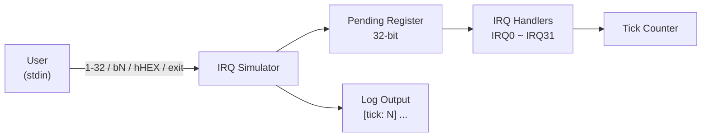

# IRQ Simulator - Requirement Specification

## 1. Overview

本项目为一个 **IRQ (Interrupt Request) 模拟器**，运行于 Host PC 环境，用于模拟嵌入式系统中的中断处理机制。用户通过命令行界面输入指令来触发 IRQ，系统按优先权顺序处理待处理的中断。

## 2. Functional Requirements

### FR-01: IRQ Trigger Mechanism
- 系统须支持 32 个 IRQ 通道 (IRQ0 ~ IRQ31)
- 每个 IRQ 以 32-bit pending register 中的一个 bit 表示
- IRQ 触发后，对应 bit 设为 1，等待处理

### FR-02: Input Modes
系统须支持以下三种输入模式：

| 模式 | 语法 | 说明 | 示例 |
|------|------|------|------|
| 预设数字模式 | `<1-32>` | 触发单一 IRQ，输入值减 1 对应 IRQ 编号 | `1` → IRQ0 |
| Bit 模式 | `b<N>` | 直接指定 IRQ 编号 (0-31) | `b5` → IRQ5 |
| Hex 模式 | `h<HEX>` | 以十六进制值直接设置 pending register | `h3` → IRQ0, IRQ1 |

### FR-03: IRQ Priority Handling
- IRQ0 具有最高优先权，IRQ31 最低
- 待处理 IRQ 按编号从小到大（优先权从高到低）依次处理
- 每个 IRQ 处理完毕后清除对应的 pending bit

### FR-04: IRQ Handler Behaviors
每个 IRQ 须有对应的模拟处理行为：

| IRQ | 模拟外设 | 行为 |
|-----|---------|------|
| IRQ0 | System Timer | 调用 tick_irq_handler，递增 tick 计数 |
| IRQ1 | UART0 RX | 数据接收 |
| IRQ2 | UART0 TX | 数据发送 |
| IRQ3 | GPIO Port A | 引脚状态变更 |
| IRQ4 | GPIO Port B | 引脚状态变更 |
| IRQ5 | SPI0 | 传输完成 |
| IRQ6 | I2C0 | 事务完成 |
| IRQ7 | ADC | 转换完成 |
| IRQ8~9 | DMA Ch0~1 | 传输完成 |
| IRQ10 | Watchdog | 定时器到期 |
| IRQ11 | RTC | 闹钟触发 |
| IRQ12 | USB | 设备事件 |
| IRQ13 | CAN0 | 消息接收 |
| IRQ14 | PWM | 周期结束 |
| IRQ15~16 | Timer1~2 | 比较匹配 / 溢出 |
| IRQ17~18 | UART1 RX/TX | 数据接收/发送 |
| IRQ19 | SPI1 | 传输完成 |
| IRQ20 | I2C1 | 事务完成 |
| IRQ21~23 | External INT0~2 | 外部中断 |
| IRQ24~25 | DMA Ch2~3 | 传输完成 |
| IRQ26 | CRC | 计算完成 |
| IRQ27 | AES | 加密完成 |
| IRQ28 | QSPI | 命令完成 |
| IRQ29 | SDIO | 卡事件 |
| IRQ30 | Ethernet | 数据包接收 |
| IRQ31 | Exception | 调用 exception_irq_handler |

### FR-05: Tick Counter
- 系统须维护一个全局 tick 计数器
- 每次主循环迭代时 tick 自动递增
- IRQ0 处理时 tick 也会递增
- 所有 log 输出须带有 `[tick: N]` 前缀

### FR-06: Program Control
- 输入 `0`：手动处理所有 pending IRQ
- 输入 `exit`：终止模拟器

## 3. Non-Functional Requirements

### NFR-01: Usability
- 提供清晰的命令提示与使用说明
- 对无效输入提供明确的错误消息

### NFR-02: Maintainability
- 代码遵循现有 coding style 与注释规范
- IRQ 处理逻辑集中于 switch-case，易于扩展

### NFR-03: Portability
- 使用标准 C11，不依赖特定平台 API
- 通过 CMake 构建系统管理编译