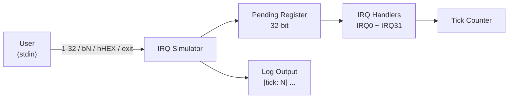

# IRQ Simulator - Requirement Specification

## 1. Overview

本项目为一个 **IRQ (Interrupt Request) 模拟器**，运行于 Host PC 环境，用于模拟嵌入式系统中的中断处理机制。用户通过命令行界面输入指令来触发 IRQ，系统按优先权顺序处理待处理的中断。

## 2. Functional Requirements

### FR-01: IRQ Trigger Mechanism
- 系统须支持 32 个 IRQ 通道 (IRQ0 ~ IRQ31)
- 每个 IRQ 以 32-bit pending register 中的一个 bit 表示
- IRQ 触发后，对应 bit 设为 1，等待处理

### FR-02: Input Modes
系统须支持以下三种输入模式：

| 模式 | 语法 | 说明 | 示例 |
|------|------|------|------|
| 预设数字模式 | `<1-32>` | 触发单一 IRQ，输入值减 1 对应 IRQ 编号 | `1` → IRQ0 |
| Bit 模式 | `b<N>` | 直接指定 IRQ 编号 (0-31) | `b5` → IRQ5 |
| Hex 模式 | `h<HEX>` | 以十六进制值直接设置 pending register | `h3` → IRQ0, IRQ1 |

### FR-03: IRQ Priority Handling
- IRQ0 具有最高优先权，IRQ31 最低
- 待处理 IRQ 按编号从小到大（优先权从高到低）依次处理
- 每个 IRQ 处理完毕后清除对应的 pending bit

### FR-04: IRQ Handler Behaviors
每个 IRQ 须有对应的模拟处理行为：

| IRQ | 模拟外设 | 行为 |
|-----|---------|------|
| IRQ0 | System Timer | 调用 tick_irq_handler，递增 tick 计数 |
| IRQ1 | UART0 RX | 数据接收 |
| IRQ2 | UART0 TX | 数据发送 |
| IRQ3 | GPIO Port A | 引脚状态变更 |
| IRQ4 | GPIO Port B | 引脚状态变更 |
| IRQ5 | SPI0 | 传输完成 |
| IRQ6 | I2C0 | 事务完成 |
| IRQ7 | ADC | 转换完成 |
| IRQ8~9 | DMA Ch0~1 | 传输完成 |
| IRQ10 | Watchdog | 定时器到期 |
| IRQ11 | RTC | 闹钟触发 |
| IRQ12 | USB | 设备事件 |
| IRQ13 | CAN0 | 消息接收 |
| IRQ14 | PWM | 周期结束 |
| IRQ15~16 | Timer1~2 | 比较匹配 / 溢出 |
| IRQ17~18 | UART1 RX/TX | 数据接收/发送 |
| IRQ19 | SPI1 | 传输完成 |
| IRQ20 | I2C1 | 事务完成 |
| IRQ21~23 | External INT0~2 | 外部中断 |
| IRQ24~25 | DMA Ch2~3 | 传输完成 |
| IRQ26 | CRC | 计算完成 |
| IRQ27 | AES | 加密完成 |
| IRQ28 | QSPI | 命令完成 |
| IRQ29 | SDIO | 卡事件 |
| IRQ30 | Ethernet | 数据包接收 |
| IRQ31 | Exception | 调用 exception_irq_handler |

### FR-05: Tick Counter
- 系统须维护一个全局 tick 计数器
- 每次主循环迭代时 tick 自动递增
- IRQ0 处理时 tick 也会递增
- 所有 log 输出须带有 `[tick: N]` 前缀

### FR-06: Program Control
- 输入 `0`：手动处理所有 pending IRQ
- 输入 `exit`：终止模拟器

## 3. Non-Functional Requirements

### NFR-01: Usability
- 提供清晰的命令提示与使用说明
- 对无效输入提供明确的错误消息

### NFR-02: Maintainability
- 代码遵循现有 coding style 与注释规范
- IRQ 处理逻辑集中于 switch-case，易于扩展

### NFR-03: Portability
- 使用标准 C11，不依赖特定平台 API
- 通过 CMake 构建系统管理编译

## 4. 软件需求列表

| ID | 章节 | 描述 |
|----|------|------|
| SR_001 | FR-01 | 系统须支持 32 个 IRQ 通道 (IRQ0 ~ IRQ31) |
| SR_002 | FR-01 | 每个 IRQ 以 32-bit pending register 中的一个 bit 表示 |
| SR_003 | FR-01 | IRQ 触发后，对应 bit 设为 1，等待处理 |
| SR_004 | FR-02 | 预设数字输入模式：`<1-32>` 触发单一 IRQ（输入值减 1 对应 IRQ 编号） |
| SR_005 | FR-02 | Bit 输入模式：`b<N>` 直接指定 IRQ 编号 (0-31) |
| SR_006 | FR-02 | Hex 输入模式：`h<HEX>` 以十六进制值直接设置 pending register |
| SR_007 | FR-03 | IRQ0 具有最高优先权，IRQ31 最低 |
| SR_008 | FR-03 | 待处理 IRQ 按编号从小到大（优先权从高到低）依次处理 |
| SR_009 | FR-03 | 每个 IRQ 处理完毕后清除对应的 pending bit |
| SR_010 | FR-04 | IRQ0 (System Timer)：调用 tick_irq_handler，递增 tick 计数 |
| SR_011 | FR-04 | IRQ1 (UART0 RX)：模拟数据接收 |
| SR_012 | FR-04 | IRQ2 (UART0 TX)：模拟数据发送 |
| SR_013 | FR-04 | IRQ3 (GPIO Port A)：模拟引脚状态变更 |
| SR_014 | FR-04 | IRQ4 (GPIO Port B)：模拟引脚状态变更 |
| SR_015 | FR-04 | IRQ5 (SPI0)：模拟传输完成 |
| SR_016 | FR-04 | IRQ6 (I2C0)：模拟事务完成 |
| SR_017 | FR-04 | IRQ7 (ADC)：模拟转换完成 |
| SR_018 | FR-04 | IRQ8~9 (DMA Ch0~1)：模拟传输完成 |
| SR_019 | FR-04 | IRQ10 (Watchdog)：模拟定时器到期 |
| SR_020 | FR-04 | IRQ11 (RTC)：模拟闹钟触发 |
| SR_021 | FR-04 | IRQ12 (USB)：模拟设备事件 |
| SR_022 | FR-04 | IRQ13 (CAN0)：模拟消息接收 |
| SR_023 | FR-04 | IRQ14 (PWM)：模拟周期结束 |
| SR_024 | FR-04 | IRQ15~16 (Timer1~2)：模拟比较匹配 / 溢出 |
| SR_025 | FR-04 | IRQ17~18 (UART1 RX/TX)：模拟数据接收/发送 |
| SR_026 | FR-04 | IRQ19 (SPI1)：模拟传输完成 |
| SR_027 | FR-04 | IRQ20 (I2C1)：模拟事务完成 |
| SR_028 | FR-04 | IRQ21~23 (External INT0~2)：模拟外部中断 |
| SR_029 | FR-04 | IRQ24~25 (DMA Ch2~3)：模拟传输完成 |
| SR_030 | FR-04 | IRQ26 (CRC)：模拟计算完成 |
| SR_031 | FR-04 | IRQ27 (AES)：模拟加密完成 |
| SR_032 | FR-04 | IRQ28 (QSPI)：模拟命令完成 |
| SR_033 | FR-04 | IRQ29 (SDIO)：模拟卡事件 |
| SR_034 | FR-04 | IRQ30 (Ethernet)：模拟数据包接收 |
| SR_035 | FR-04 | IRQ31 (Exception)：调用 exception_irq_handler |
| SR_036 | FR-05 | 系统须维护一个全局 tick 计数器 |
| SR_037 | FR-05 | 每次主循环迭代时 tick 自动递增 |
| SR_038 | FR-05 | IRQ0 处理时 tick 也会递增 |
| SR_039 | FR-05 | 所有 log 输出须带有 `[tick: N]` 前缀 |
| SR_040 | FR-06 | 输入 `0`：手动处理所有 pending IRQ |
| SR_041 | FR-06 | 输入 `exit`：终止模拟器 |
| SR_042 | NFR-01 | 提供清晰的命令提示与使用说明 |
| SR_043 | NFR-01 | 对无效输入提供明确的错误消息 |
| SR_044 | NFR-02 | 代码遵循现有 coding style 与注释规范 |
| SR_045 | NFR-02 | IRQ 处理逻辑集中于 switch-case，易于扩展 |
| SR_046 | NFR-03 | 使用标准 C11，不依赖特定平台 API |
| SR_047 | NFR-03 | 通过 CMake 构建系统管理编译 |

### 章节对照表

| 章节 | SR 范围 | 数量 | 内容 |
|------|---------|------|------|
| FR-01 | SR_001 ~ SR_003 | 3 | IRQ 触发机制 |
| FR-02 | SR_004 ~ SR_006 | 3 | 输入模式 |
| FR-03 | SR_007 ~ SR_009 | 3 | IRQ 优先权处理 |
| FR-04 | SR_010 ~ SR_035 | 26 | IRQ 处理行为 |
| FR-05 | SR_036 ~ SR_039 | 4 | Tick 计数器 |
| FR-06 | SR_040 ~ SR_041 | 2 | 程序控制 |
| NFR-01 | SR_042 ~ SR_043 | 2 | 易用性 |
| NFR-02 | SR_044 ~ SR_045 | 2 | 可维护性 |
| NFR-03 | SR_046 ~ SR_047 | 2 | 可移植性 |

> **缩写说明：**
>
> - **FR** = Functional Requirement（功能需求）
> - **NFR** = Non-Functional Requirement（非功能需求）
> - **SR** = Software Requirement（软件需求，为 FR 与 NFR 的统一条列化编号）