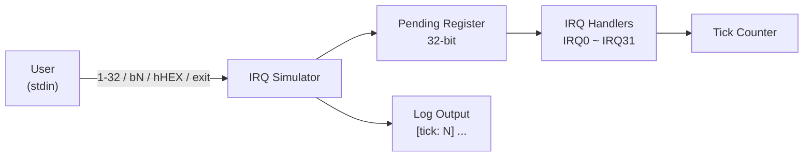

# IRQ Simulator - Requirement Specification

## 1. Overview

This project is an **IRQ (Interrupt Request) Simulator** running in a Host PC environment, designed to simulate the interrupt handling mechanism of embedded systems. Users input commands via a command-line interface to trigger IRQs, and the system processes pending interrupts in priority order.

## 2. Functional Requirements

### FR-01: IRQ Trigger Mechanism
- The system must support 32 IRQ channels (IRQ0 ~ IRQ31)
- Each IRQ is represented by a single bit in a 32-bit pending register
- When an IRQ is triggered, the corresponding bit is set to 1 and awaits processing

### FR-02: Input Modes
The system must support the following three input modes:

| Mode | Syntax | Description | Example |
|------|------|------|------|
| Default Numeric | `<1-32>` | Triggers a single IRQ; input value minus 1 maps to IRQ number | `1` → IRQ0 |
| Bit Mode | `b<N>` | Directly specifies the IRQ number (0-31) | `b5` → IRQ5 |
| Hex Mode | `h<HEX>` | Directly sets the pending register with a hexadecimal value | `h3` → IRQ0, IRQ1 |

### FR-03: IRQ Priority Handling
- IRQ0 has the highest priority, IRQ31 the lowest
- Pending IRQs are processed in ascending order by number (highest to lowest priority)
- Each IRQ's pending bit is cleared after processing

### FR-04: IRQ Handler Behaviors
Each IRQ must have a corresponding simulated handling behavior:

| IRQ | Simulated Peripheral | Behavior |
|-----|---------|------|
| IRQ0 | System Timer | Calls tick_irq_handler, increments tick count |
| IRQ1 | UART0 RX | Data reception |
| IRQ2 | UART0 TX | Data transmission |
| IRQ3 | GPIO Port A | Pin state change |
| IRQ4 | GPIO Port B | Pin state change |
| IRQ5 | SPI0 | Transfer complete |
| IRQ6 | I2C0 | Transaction complete |
| IRQ7 | ADC | Conversion complete |
| IRQ8~9 | DMA Ch0~1 | Transfer complete |
| IRQ10 | Watchdog | Timer expired |
| IRQ11 | RTC | Alarm triggered |
| IRQ12 | USB | Device event |
| IRQ13 | CAN0 | Message received |
| IRQ14 | PWM | Period elapsed |
| IRQ15~16 | Timer1~2 | Compare match / Overflow |
| IRQ17~18 | UART1 RX/TX | Data reception/transmission |
| IRQ19 | SPI1 | Transfer complete |
| IRQ20 | I2C1 | Transaction complete |
| IRQ21~23 | External INT0~2 | External interrupt |
| IRQ24~25 | DMA Ch2~3 | Transfer complete |
| IRQ26 | CRC | Calculation complete |
| IRQ27 | AES | Encryption complete |
| IRQ28 | QSPI | Command complete |
| IRQ29 | SDIO | Card event |
| IRQ30 | Ethernet | Packet received |
| IRQ31 | Exception | Calls exception_irq_handler |

### FR-05: Tick Counter
- The system must maintain a global tick counter
- The tick auto-increments on each main loop iteration
- The tick also increments when IRQ0 is processed
- All log output must include a `[tick: N]` prefix

### FR-06: Program Control
- Input `0`: Manually process all pending IRQs
- Input `exit`: Terminate the simulator

## 3. Non-Functional Requirements

### NFR-01: Usability
- Provide clear command prompts and usage instructions
- Provide explicit error messages for invalid input

### NFR-02: Maintainability
- Code follows existing coding style and comment conventions
- IRQ handling logic is centralized in a switch-case for easy extension

### NFR-03: Portability
- Uses standard C11 with no platform-specific API dependencies
- Build managed via CMake build system

## 4. Software Requirements List

| ID | Chapter | Description |
|----|---------|-------------|
| SR_001 | FR-01 | Support 32 IRQ channels (IRQ0 ~ IRQ31) |
| SR_002 | FR-01 | Each IRQ represented by a single bit in a 32-bit pending register |
| SR_003 | FR-01 | Triggered IRQ sets corresponding bit to 1 and awaits processing |
| SR_004 | FR-02 | Default Numeric input mode: `<1-32>` triggers single IRQ (value minus 1 maps to IRQ number) |
| SR_005 | FR-02 | Bit input mode: `b<N>` directly specifies IRQ number (0-31) |
| SR_006 | FR-02 | Hex input mode: `h<HEX>` directly sets pending register with hexadecimal value |
| SR_007 | FR-03 | IRQ0 has highest priority, IRQ31 lowest |
| SR_008 | FR-03 | Pending IRQs processed in ascending order by number (highest to lowest priority) |
| SR_009 | FR-03 | Each IRQ's pending bit cleared after processing |
| SR_010 | FR-04 | IRQ0 (System Timer): calls tick_irq_handler, increments tick count |
| SR_011 | FR-04 | IRQ1 (UART0 RX): simulates data reception |
| SR_012 | FR-04 | IRQ2 (UART0 TX): simulates data transmission |
| SR_013 | FR-04 | IRQ3 (GPIO Port A): simulates pin state change |
| SR_014 | FR-04 | IRQ4 (GPIO Port B): simulates pin state change |
| SR_015 | FR-04 | IRQ5 (SPI0): simulates transfer complete |
| SR_016 | FR-04 | IRQ6 (I2C0): simulates transaction complete |
| SR_017 | FR-04 | IRQ7 (ADC): simulates conversion complete |
| SR_018 | FR-04 | IRQ8~9 (DMA Ch0~1): simulates transfer complete |
| SR_019 | FR-04 | IRQ10 (Watchdog): simulates timer expired |
| SR_020 | FR-04 | IRQ11 (RTC): simulates alarm triggered |
| SR_021 | FR-04 | IRQ12 (USB): simulates device event |
| SR_022 | FR-04 | IRQ13 (CAN0): simulates message received |
| SR_023 | FR-04 | IRQ14 (PWM): simulates period elapsed |
| SR_024 | FR-04 | IRQ15~16 (Timer1~2): simulates compare match / overflow |
| SR_025 | FR-04 | IRQ17~18 (UART1 RX/TX): simulates data reception/transmission |
| SR_026 | FR-04 | IRQ19 (SPI1): simulates transfer complete |
| SR_027 | FR-04 | IRQ20 (I2C1): simulates transaction complete |
| SR_028 | FR-04 | IRQ21~23 (External INT0~2): simulates external interrupt |
| SR_029 | FR-04 | IRQ24~25 (DMA Ch2~3): simulates transfer complete |
| SR_030 | FR-04 | IRQ26 (CRC): simulates calculation complete |
| SR_031 | FR-04 | IRQ27 (AES): simulates encryption complete |
| SR_032 | FR-04 | IRQ28 (QSPI): simulates command complete |
| SR_033 | FR-04 | IRQ29 (SDIO): simulates card event |
| SR_034 | FR-04 | IRQ30 (Ethernet): simulates packet received |
| SR_035 | FR-04 | IRQ31 (Exception): calls exception_irq_handler |
| SR_036 | FR-05 | Maintain a global tick counter |
| SR_037 | FR-05 | Tick auto-increments on each main loop iteration |
| SR_038 | FR-05 | Tick increments when IRQ0 is processed |
| SR_039 | FR-05 | All log output must include `[tick: N]` prefix |
| SR_040 | FR-06 | Input `0` manually processes all pending IRQs |
| SR_041 | FR-06 | Input `exit` terminates the simulator |
| SR_042 | NFR-01 | Provide clear command prompts and usage instructions |
| SR_043 | NFR-01 | Provide explicit error messages for invalid input |
| SR_044 | NFR-02 | Code follows existing coding style and comment conventions |
| SR_045 | NFR-02 | IRQ handling logic centralized in switch-case for easy extension |
| SR_046 | NFR-03 | Uses standard C11 with no platform-specific API dependencies |
| SR_047 | NFR-03 | Build managed via CMake build system |

### Chapter Mapping

| Chapter | SR Range | Count | Content |
|---------|----------|-------|---------|
| FR-01 | SR_001 ~ SR_003 | 3 | IRQ Trigger Mechanism |
| FR-02 | SR_004 ~ SR_006 | 3 | Input Modes |
| FR-03 | SR_007 ~ SR_009 | 3 | IRQ Priority Handling |
| FR-04 | SR_010 ~ SR_035 | 26 | IRQ Handler Behaviors |
| FR-05 | SR_036 ~ SR_039 | 4 | Tick Counter |
| FR-06 | SR_040 ~ SR_041 | 2 | Program Control |
| NFR-01 | SR_042 ~ SR_043 | 2 | Usability |
| NFR-02 | SR_044 ~ SR_045 | 2 | Maintainability |
| NFR-03 | SR_046 ~ SR_047 | 2 | Portability |

> **Abbreviation Notes:**
>
> - **FR** = Functional Requirement
> - **NFR** = Non-Functional Requirement
> - **SR** = Software Requirement (unified numbering for all FR and NFR items)