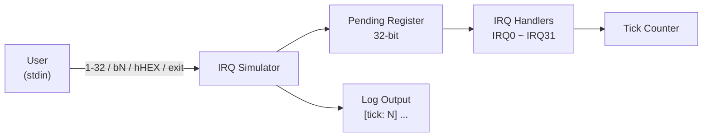

# IRQ Simulator - Requirement Specification

## 1. Overview

This project is an **IRQ (Interrupt Request) Simulator** running in a Host PC environment, designed to simulate the interrupt handling mechanism of embedded systems. Users input commands via a command-line interface to trigger IRQs, and the system processes pending interrupts in priority order.

## 2. Functional Requirements

### FR-01: IRQ Trigger Mechanism
- The system must support 32 IRQ channels (IRQ0 ~ IRQ31)
- Each IRQ is represented by a single bit in a 32-bit pending register
- When an IRQ is triggered, the corresponding bit is set to 1 and awaits processing

### FR-02: Input Modes
The system must support the following three input modes:

| Mode | Syntax | Description | Example |
|------|------|------|------|
| Default Numeric | `<1-32>` | Triggers a single IRQ; input value minus 1 maps to IRQ number | `1` → IRQ0 |
| Bit Mode | `b<N>` | Directly specifies the IRQ number (0-31) | `b5` → IRQ5 |
| Hex Mode | `h<HEX>` | Directly sets the pending register with a hexadecimal value | `h3` → IRQ0, IRQ1 |

### FR-03: IRQ Priority Handling
- IRQ0 has the highest priority, IRQ31 the lowest
- Pending IRQs are processed in ascending order by number (highest to lowest priority)
- Each IRQ's pending bit is cleared after processing

### FR-04: IRQ Handler Behaviors
Each IRQ must have a corresponding simulated handling behavior:

| IRQ | Simulated Peripheral | Behavior |
|-----|---------|------|
| IRQ0 | System Timer | Calls tick_irq_handler, increments tick count |
| IRQ1 | UART0 RX | Data reception |
| IRQ2 | UART0 TX | Data transmission |
| IRQ3 | GPIO Port A | Pin state change |
| IRQ4 | GPIO Port B | Pin state change |
| IRQ5 | SPI0 | Transfer complete |
| IRQ6 | I2C0 | Transaction complete |
| IRQ7 | ADC | Conversion complete |
| IRQ8~9 | DMA Ch0~1 | Transfer complete |
| IRQ10 | Watchdog | Timer expired |
| IRQ11 | RTC | Alarm triggered |
| IRQ12 | USB | Device event |
| IRQ13 | CAN0 | Message received |
| IRQ14 | PWM | Period elapsed |
| IRQ15~16 | Timer1~2 | Compare match / Overflow |
| IRQ17~18 | UART1 RX/TX | Data reception/transmission |
| IRQ19 | SPI1 | Transfer complete |
| IRQ20 | I2C1 | Transaction complete |
| IRQ21~23 | External INT0~2 | External interrupt |
| IRQ24~25 | DMA Ch2~3 | Transfer complete |
| IRQ26 | CRC | Calculation complete |
| IRQ27 | AES | Encryption complete |
| IRQ28 | QSPI | Command complete |
| IRQ29 | SDIO | Card event |
| IRQ30 | Ethernet | Packet received |
| IRQ31 | Exception | Calls exception_irq_handler |

### FR-05: Tick Counter
- The system must maintain a global tick counter
- The tick auto-increments on each main loop iteration
- The tick also increments when IRQ0 is processed
- All log output must include a `[tick: N]` prefix

### FR-06: Program Control
- Input `0`: Manually process all pending IRQs
- Input `exit`: Terminate the simulator

## 3. Non-Functional Requirements

### NFR-01: Usability
- Provide clear command prompts and usage instructions
- Provide explicit error messages for invalid input

### NFR-02: Maintainability
- Code follows existing coding style and comment conventions
- IRQ handling logic is centralized in a switch-case for easy extension

### NFR-03: Portability
- Uses standard C11 with no platform-specific API dependencies
- Build managed via CMake build system