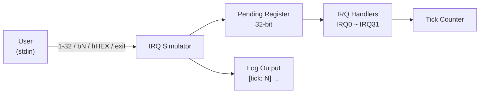

# IRQ Simulator - Requirement Specification

## 1. Overview

本專案為一個 **IRQ (Interrupt Request) 模擬器**，運行於 Host PC 環境，用於模擬嵌入式系統中的中斷處理機制。使用者透過命令列介面輸入指令來觸發 IRQ，系統依優先權順序處理待處理的中斷。

## 2. Functional Requirements

### FR-01: IRQ Trigger Mechanism
- 系統須支援 32 個 IRQ 通道 (IRQ0 ~ IRQ31)
- 每個 IRQ 以 32-bit pending register 中的一個 bit 表示
- IRQ 觸發後，對應 bit 設為 1，等待處理

### FR-02: Input Modes
系統須支援以下三種輸入模式：

| 模式 | 語法 | 說明 | 範例 |
|------|------|------|------|
| 預設數字模式 | `<1-32>` | 觸發單一 IRQ，輸入值減 1 對應 IRQ 編號 | `1` → IRQ0 |
| Bit 模式 | `b<N>` | 直接指定 IRQ 編號 (0-31) | `b5` → IRQ5 |
| Hex 模式 | `h<HEX>` | 以十六進位值直接設定 pending register | `h3` → IRQ0, IRQ1 |

### FR-03: IRQ Priority Handling
- IRQ0 具有最高優先權，IRQ31 最低
- 待處理 IRQ 依編號由小到大（優先權由高到低）依序處理
- 每個 IRQ 處理完畢後清除對應的 pending bit

### FR-04: IRQ Handler Behaviors
每個 IRQ 須有對應的模擬處理行為：

| IRQ | 模擬周邊 | 行為 |
|-----|---------|------|
| IRQ0 | System Timer | 呼叫 tick_irq_handler，遞增 tick 計數 |
| IRQ1 | UART0 RX | 資料接收 |
| IRQ2 | UART0 TX | 資料傳送 |
| IRQ3 | GPIO Port A | 腳位狀態變更 |
| IRQ4 | GPIO Port B | 腳位狀態變更 |
| IRQ5 | SPI0 | 傳輸完成 |
| IRQ6 | I2C0 | 交易完成 |
| IRQ7 | ADC | 轉換完成 |
| IRQ8~9 | DMA Ch0~1 | 傳輸完成 |
| IRQ10 | Watchdog | 計時器屆期 |
| IRQ11 | RTC | 鬧鐘觸發 |
| IRQ12 | USB | 裝置事件 |
| IRQ13 | CAN0 | 訊息接收 |
| IRQ14 | PWM | 週期結束 |
| IRQ15~16 | Timer1~2 | 比較匹配 / 溢位 |
| IRQ17~18 | UART1 RX/TX | 資料接收/傳送 |
| IRQ19 | SPI1 | 傳輸完成 |
| IRQ20 | I2C1 | 交易完成 |
| IRQ21~23 | External INT0~2 | 外部中斷 |
| IRQ24~25 | DMA Ch2~3 | 傳輸完成 |
| IRQ26 | CRC | 計算完成 |
| IRQ27 | AES | 加密完成 |
| IRQ28 | QSPI | 指令完成 |
| IRQ29 | SDIO | 卡片事件 |
| IRQ30 | Ethernet | 封包接收 |
| IRQ31 | Exception | 呼叫 exception_irq_handler |

### FR-05: Tick Counter
- 系統須維護一個全域 tick 計數器
- 每次主迴圈迭代時 tick 自動遞增
- IRQ0 處理時 tick 也會遞增
- 所有 log 輸出須帶有 `[tick: N]` 前綴

### FR-06: Program Control
- 輸入 `0`：手動處理所有 pending IRQ
- 輸入 `exit`：結束模擬器

## 3. Non-Functional Requirements

### NFR-01: Usability
- 提供清晰的命令提示與使用說明
- 對無效輸入提供明確的錯誤訊息

### NFR-02: Maintainability
- 程式碼遵循既有 coding style 與註解規範
- IRQ 處理邏輯集中於 switch-case，易於擴充

### NFR-03: Portability
- 使用標準 C11，不依賴特定平台 API
- 透過 CMake 建置系統管理編譯

## 4. 軟體需求列表

| ID | 章節 | 描述 |
|----|------|------|
| SR_001 | FR-01 | 系統須支援 32 個 IRQ 通道 (IRQ0 ~ IRQ31) |
| SR_002 | FR-01 | 每個 IRQ 以 32-bit pending register 中的一個 bit 表示 |
| SR_003 | FR-01 | IRQ 觸發後，對應 bit 設為 1，等待處理 |
| SR_004 | FR-02 | 預設數字輸入模式：`<1-32>` 觸發單一 IRQ（輸入值減 1 對應 IRQ 編號） |
| SR_005 | FR-02 | Bit 輸入模式：`b<N>` 直接指定 IRQ 編號 (0-31) |
| SR_006 | FR-02 | Hex 輸入模式：`h<HEX>` 以十六進位值直接設定 pending register |
| SR_007 | FR-03 | IRQ0 具有最高優先權，IRQ31 最低 |
| SR_008 | FR-03 | 待處理 IRQ 依編號由小到大（優先權由高到低）依序處理 |
| SR_009 | FR-03 | 每個 IRQ 處理完畢後清除對應的 pending bit |
| SR_010 | FR-04 | IRQ0 (System Timer)：呼叫 tick_irq_handler，遞增 tick 計數 |
| SR_011 | FR-04 | IRQ1 (UART0 RX)：模擬資料接收 |
| SR_012 | FR-04 | IRQ2 (UART0 TX)：模擬資料傳送 |
| SR_013 | FR-04 | IRQ3 (GPIO Port A)：模擬腳位狀態變更 |
| SR_014 | FR-04 | IRQ4 (GPIO Port B)：模擬腳位狀態變更 |
| SR_015 | FR-04 | IRQ5 (SPI0)：模擬傳輸完成 |
| SR_016 | FR-04 | IRQ6 (I2C0)：模擬交易完成 |
| SR_017 | FR-04 | IRQ7 (ADC)：模擬轉換完成 |
| SR_018 | FR-04 | IRQ8~9 (DMA Ch0~1)：模擬傳輸完成 |
| SR_019 | FR-04 | IRQ10 (Watchdog)：模擬計時器屆期 |
| SR_020 | FR-04 | IRQ11 (RTC)：模擬鬧鐘觸發 |
| SR_021 | FR-04 | IRQ12 (USB)：模擬裝置事件 |
| SR_022 | FR-04 | IRQ13 (CAN0)：模擬訊息接收 |
| SR_023 | FR-04 | IRQ14 (PWM)：模擬週期結束 |
| SR_024 | FR-04 | IRQ15~16 (Timer1~2)：模擬比較匹配 / 溢位 |
| SR_025 | FR-04 | IRQ17~18 (UART1 RX/TX)：模擬資料接收/傳送 |
| SR_026 | FR-04 | IRQ19 (SPI1)：模擬傳輸完成 |
| SR_027 | FR-04 | IRQ20 (I2C1)：模擬交易完成 |
| SR_028 | FR-04 | IRQ21~23 (External INT0~2)：模擬外部中斷 |
| SR_029 | FR-04 | IRQ24~25 (DMA Ch2~3)：模擬傳輸完成 |
| SR_030 | FR-04 | IRQ26 (CRC)：模擬計算完成 |
| SR_031 | FR-04 | IRQ27 (AES)：模擬加密完成 |
| SR_032 | FR-04 | IRQ28 (QSPI)：模擬指令完成 |
| SR_033 | FR-04 | IRQ29 (SDIO)：模擬卡片事件 |
| SR_034 | FR-04 | IRQ30 (Ethernet)：模擬封包接收 |
| SR_035 | FR-04 | IRQ31 (Exception)：呼叫 exception_irq_handler |
| SR_036 | FR-05 | 系統須維護一個全域 tick 計數器 |
| SR_037 | FR-05 | 每次主迴圈迭代時 tick 自動遞增 |
| SR_038 | FR-05 | IRQ0 處理時 tick 也會遞增 |
| SR_039 | FR-05 | 所有 log 輸出須帶有 `[tick: N]` 前綴 |
| SR_040 | FR-06 | 輸入 `0`：手動處理所有 pending IRQ |
| SR_041 | FR-06 | 輸入 `exit`：結束模擬器 |
| SR_042 | NFR-01 | 提供清晰的命令提示與使用說明 |
| SR_043 | NFR-01 | 對無效輸入提供明確的錯誤訊息 |
| SR_044 | NFR-02 | 程式碼遵循既有 coding style 與註解規範 |
| SR_045 | NFR-02 | IRQ 處理邏輯集中於 switch-case，易於擴充 |
| SR_046 | NFR-03 | 使用標準 C11，不依賴特定平台 API |
| SR_047 | NFR-03 | 透過 CMake 建置系統管理編譯 |

### 章節對照表

| 章節 | SR 範圍 | 數量 | 內容 |
|------|---------|------|------|
| FR-01 | SR_001 ~ SR_003 | 3 | IRQ 觸發機制 |
| FR-02 | SR_004 ~ SR_006 | 3 | 輸入模式 |
| FR-03 | SR_007 ~ SR_009 | 3 | IRQ 優先權處理 |
| FR-04 | SR_010 ~ SR_035 | 26 | IRQ 處理行為 |
| FR-05 | SR_036 ~ SR_039 | 4 | Tick 計數器 |
| FR-06 | SR_040 ~ SR_041 | 2 | 程式控制 |
| NFR-01 | SR_042 ~ SR_043 | 2 | 易用性 |
| NFR-02 | SR_044 ~ SR_045 | 2 | 可維護性 |
| NFR-03 | SR_046 ~ SR_047 | 2 | 可移植性 |

> **縮寫說明：**
>
> - **FR** = Functional Requirement（功能需求）
> - **NFR** = Non-Functional Requirement（非功能需求）
> - **SR** = Software Requirement（軟體需求，為 FR 與 NFR 的統一條列化編號）