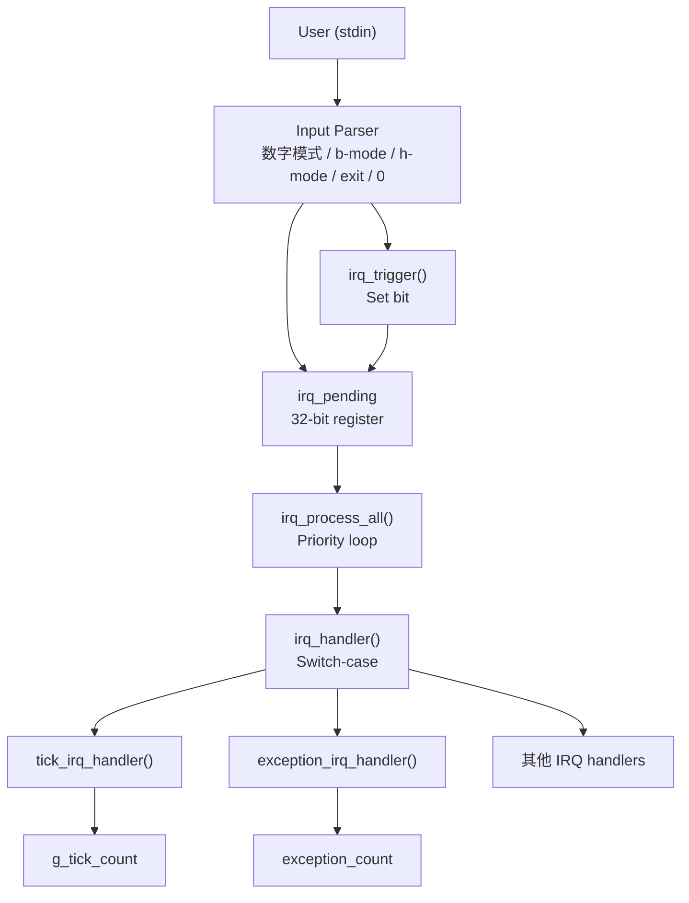
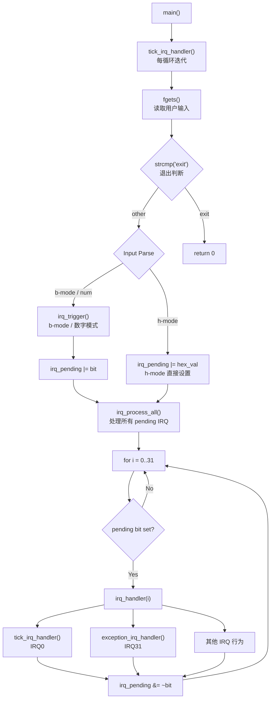
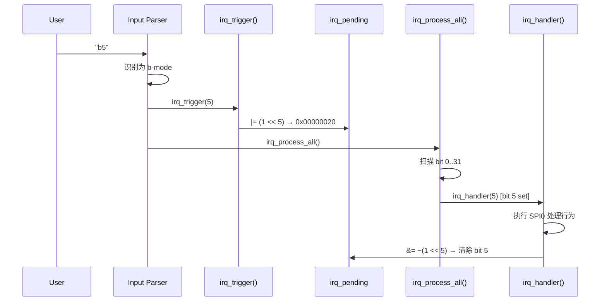
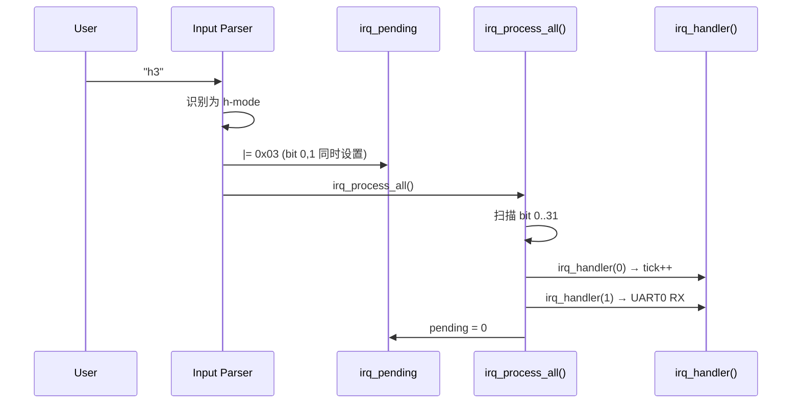
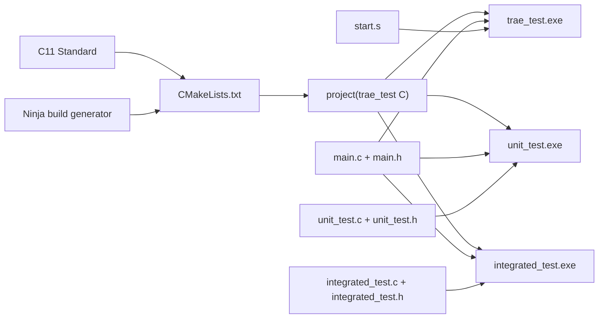
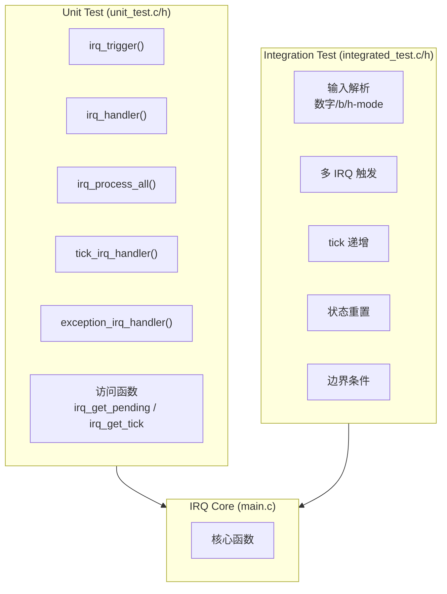

# IRQ Simulator - Software Architecture

## 1. Architecture Overview

本项目采用 **单层模块化架构 (Monolithic Modular Architecture)**，所有核心逻辑集中于 `main.c`，通过 `main.h` 对外暴露接口。



## 2. Module Decomposition

### 2.1 Core Modules

| 模块 | 文件 | 职责 |
|------|------|------|
| IRQ Core | `main.c` | IRQ 触发、处理、pending register 管理 |
| IRQ Interface | `main.h` | 函数声明、常量定义 |
| Startup | `start.s` | 汇编语言中断向量表与处理程序 |

### 2.2 Key Data Structures

```
irq_pending (uint32_t)
  Bit 0  -> IRQ0  (System Timer)
  Bit 1  -> IRQ1  (UART0 RX)
  ...
  Bit 31 -> IRQ31 (Exception)

g_tick_count (unsigned int)
  系统 tick 计数器，每次主循环迭代 +1
```

### 2.3 Function Call Graph



## 3. Data Flow

### 3.1 IRQ Trigger Flow (b-mode)



### 3.2 Hex Multi-IRQ Flow



## 4. Build System



## 5. Test Architecture

