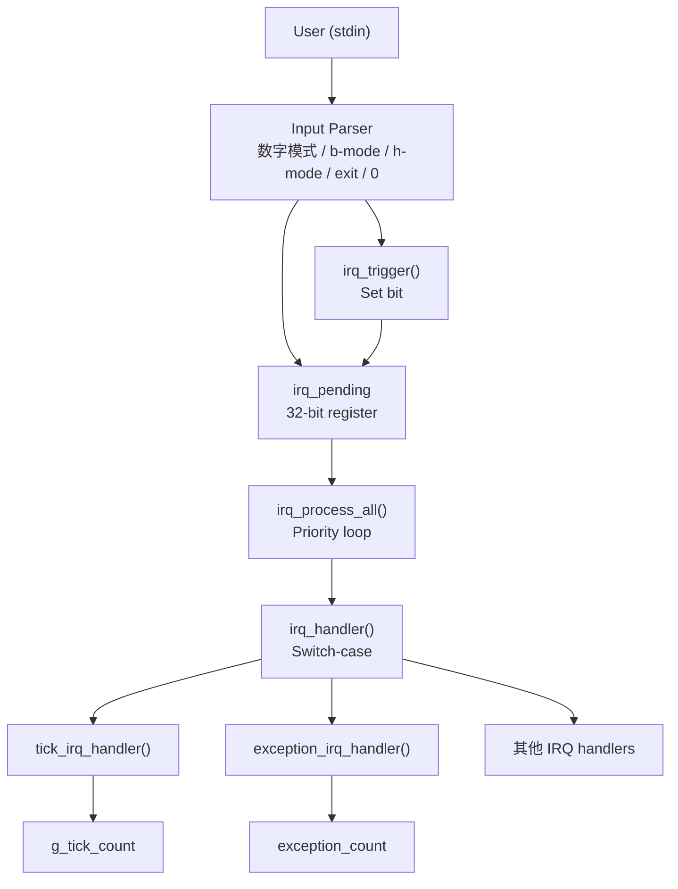
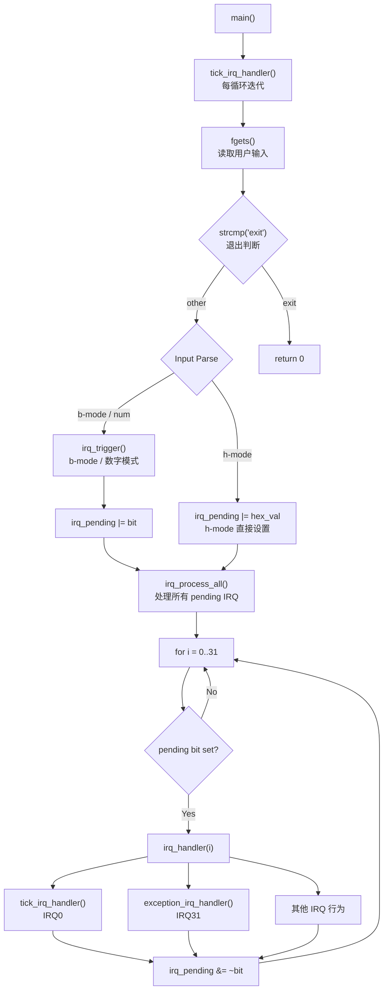
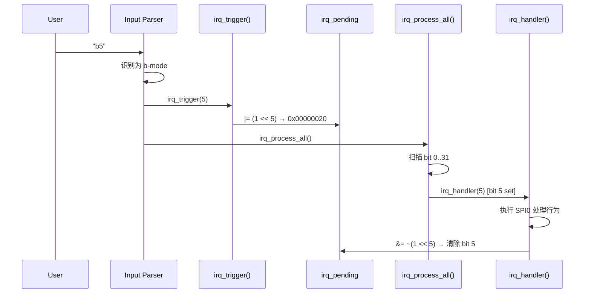
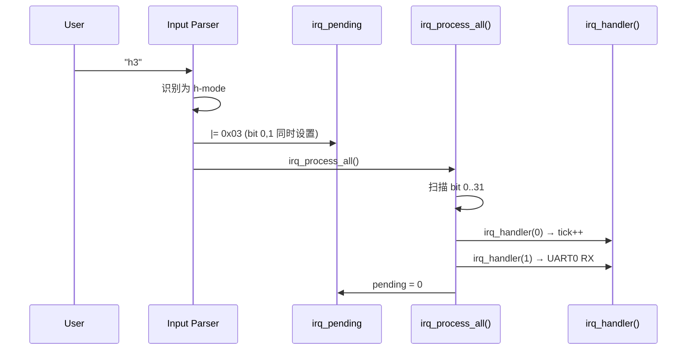
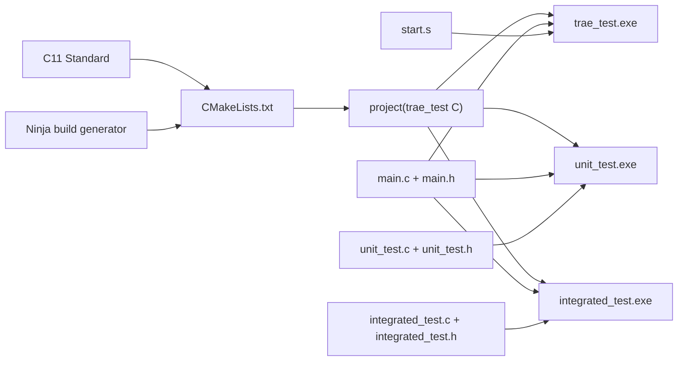
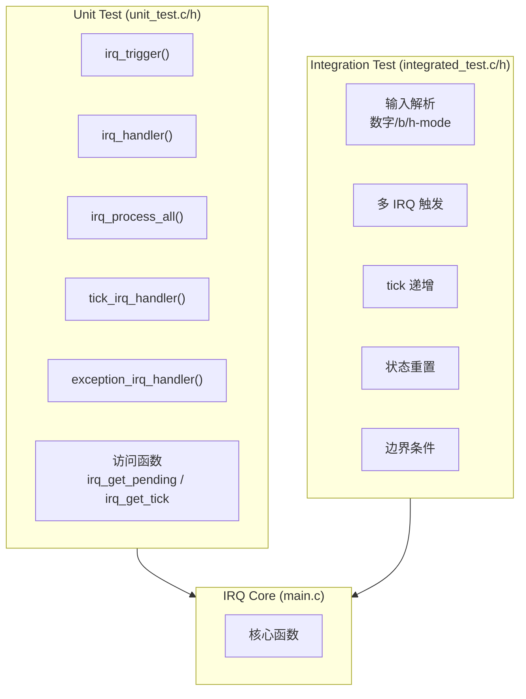

# IRQ Simulator - Software Architecture

## 1. Architecture Overview

本项目采用 **单层模块化架构 (Monolithic Modular Architecture)**，所有核心逻辑集中于 `main.c`，通过 `main.h` 对外暴露接口。



## 2. Module Decomposition

### 2.1 Core Modules

| 模块 | 文件 | 职责 |
|------|------|------|
| IRQ Core | `main.c` | IRQ 触发、处理、pending register 管理 |
| IRQ Interface | `main.h` | 函数声明、常量定义 |
| Startup | `start.s` | 汇编语言中断向量表与处理程序 |

### 2.2 Key Data Structures

```
irq_pending (uint32_t)
  Bit 0  -> IRQ0  (System Timer)
  Bit 1  -> IRQ1  (UART0 RX)
  ...
  Bit 31 -> IRQ31 (Exception)

g_tick_count (unsigned int)
  系统 tick 计数器，每次主循环迭代 +1
```

### 2.3 Function Call Graph



## 3. Data Flow

### 3.1 IRQ Trigger Flow (b-mode)



### 3.2 Hex Multi-IRQ Flow



## 4. Build System



## 5. Test Architecture



## 6. 架构需求追溯表

| ID | 章节 | 追溯 SR | 描述 |
|----|------|---------|------|
| SA_001 | 1 | SR_001<br>SR_044<br>SR_045 | 单层模块化架构：所有核心逻辑集中于 `main.c`，通过 `main.h` 对外暴露接口 |
| SA_002 | 2.1 | SR_001<br>SR_002<br>SR_003<br>SR_007<br>SR_008<br>SR_009 | IRQ Core 模块 (`main.c`)：IRQ 触发、处理、pending register 管理 |
| SA_003 | 2.1 | SR_001<br>SR_044 | IRQ Interface 模块 (`main.h`)：函数声明、常量定义 (`IRQ_COUNT=32`) |
| SA_004 | 2.1 | SR_010<br>SR_035 | Startup 模块 (`start.s`)：汇编中断向量表、tick ISR 与 exception ISR |
| SA_005 | 2.2 | SR_001<br>SR_002<br>SR_003 | `irq_pending` 数据结构：32-bit 寄存器，每个 bit 对应一个 IRQ 通道 |
| SA_006 | 2.2 | SR_036<br>SR_037<br>SR_038 | `g_tick_count` 数据结构：全局 tick 计数器，每次循环迭代及 IRQ0 处理时递增 |
| SA_007 | 2.3 | SR_037<br>SR_040<br>SR_041 | `main()` 入口点：编排主循环（tick 递增 → 读取输入 → 解析 → 处理） |
| SA_008 | 2.3 | SR_004<br>SR_005<br>SR_006<br>SR_040<br>SR_041 | 输入解析器：支持数字模式 (`1-32`)、b 模式 (`bN`)、h 模式 (`hHEX`)、`0`（处理）、`exit` |
| SA_009 | 2.3 | SR_003<br>SR_004<br>SR_005 | `irq_trigger()`：设置指定 IRQ 编号的 pending bit，含范围校验 |
| SA_010 | 2.3 | SR_003<br>SR_006 | `irq_trigger_raw()`：通过原始 hex 掩码直接设置 pending register（h 模式） |
| SA_011 | 2.3 | SR_007<br>SR_008 | `irq_process_all()`：基于优先权的循环 (IRQ0→IRQ31)，处理所有 pending IRQ |
| SA_012 | 2.3 | SR_009<br>SR_010<br>SR_045 | `irq_handler()`：switch-case 分发至 32 个 IRQ 处理行为，清除 pending bit |
| SA_013 | 2.3 | SR_010<br>SR_036<br>SR_038 | `tick_irq_handler()`：递增 `g_tick_count`，由 IRQ0 及主循环调用 |
| SA_014 | 2.3 | SR_035 | `exception_irq_handler()`：递增内部 exception_count，由 IRQ31 调用 |
| SA_015 | 3.1 | SR_005<br>SR_003<br>SR_008<br>SR_009 | b 模式 IRQ 触发流程：解析 → `irq_trigger()` → pending 设置 → `irq_process_all()` → 处理 → 清除 |
| SA_016 | 3.2 | SR_006<br>SR_003<br>SR_008<br>SR_009 | h 模式多 IRQ 流程：解析 → pending 直接设置 → `irq_process_all()` → 处理 → 清除 |
| SA_017 | 4 | SR_046<br>SR_047 | CMake 构建系统 + Ninja 生成器：跨平台编译管理 |
| SA_018 | 4 | SR_046<br>SR_047 | 三个构建目标：`trae_test`（主程序）、`unit_test`、`integrated_test`，通过 `TEST_BUILD` 宏区分 |
| SA_019 | 4 | SR_046 | C11 语言标准：不依赖特定平台 API |
| SA_020 | 5 | SR_001<br>SR_002<br>SR_003<br>SR_007<br>SR_008<br>SR_009<br>SR_010<br>SR_036<br>SR_038 | 单元测试模块 (`unit_test.c/h`)：隔离验证所有核心函数 (UT-01~UT-07) |
| SA_021 | 5 | SR_004<br>SR_005<br>SR_006<br>SR_007<br>SR_008<br>SR_036<br>SR_037<br>SR_038<br>SR_040<br>SR_041 | 集成测试模块 (`integrated_test.c/h`)：验证端到端流程 (IT-01~IT-07) |
| SA_022 | 5 | SR_036<br>SR_037<br>SR_038 | 测试访问函数：`irq_get_pending()`、`irq_get_tick()`、`irq_reset_all()` |
| SA_023 | 2.3 | SR_039 | `TICK_PRINTF` 宏：统一 log 输出格式，所有消息带 `[tick: N]` 前缀 |
| SA_024 | 2.3 | SR_009 | Pending bit 清除机制：每个 IRQ 处理后执行 `irq_pending &= ~(1 << irq_num)` |
| SA_025 | 2.3 | SR_042<br>SR_043 | 输入校验与错误处理：范围检查、无效模式提示、优雅降级 |

### 章节对照表

| 章节 | SA 范围 | 数量 | 内容 |
|------|---------|------|------|
| 1 | SA_001 | 1 | 架构总览 |
| 2.1 | SA_002 ~ SA_004 | 3 | 核心模块 |
| 2.2 | SA_005 ~ SA_006 | 2 | 关键数据结构 |
| 2.3 | SA_007 ~ SA_014, SA_023 ~ SA_025 | 11 | 函数调用图与机制 |
| 3 | SA_015 ~ SA_016 | 2 | 数据流 |
| 4 | SA_017 ~ SA_019 | 3 | 构建系统 |
| 5 | SA_020 ~ SA_022 | 3 | 测试架构 |

> **缩写说明：**
>
> - **SA** = Software Architecture（软件架构，为所有架构设计项的统一编号）
> - **SR** = Software Requirement（软件需求，追溯至 SWE.1 需求项）