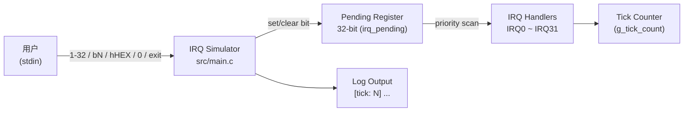
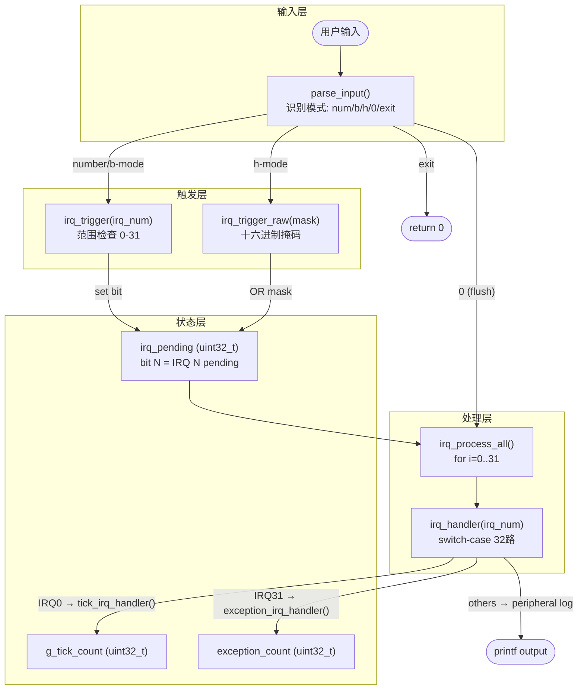
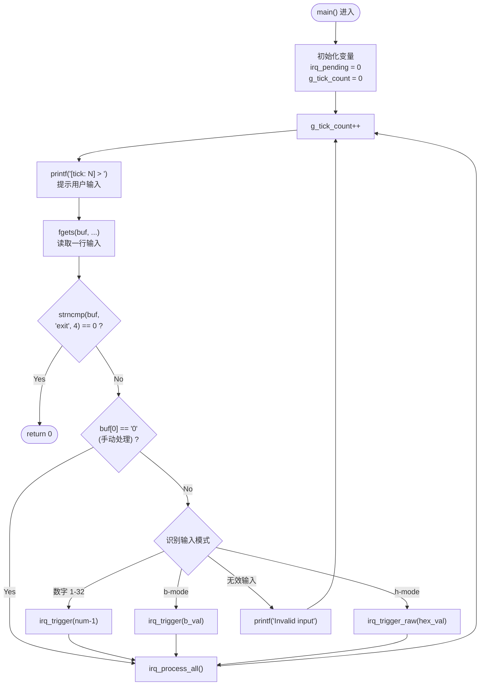
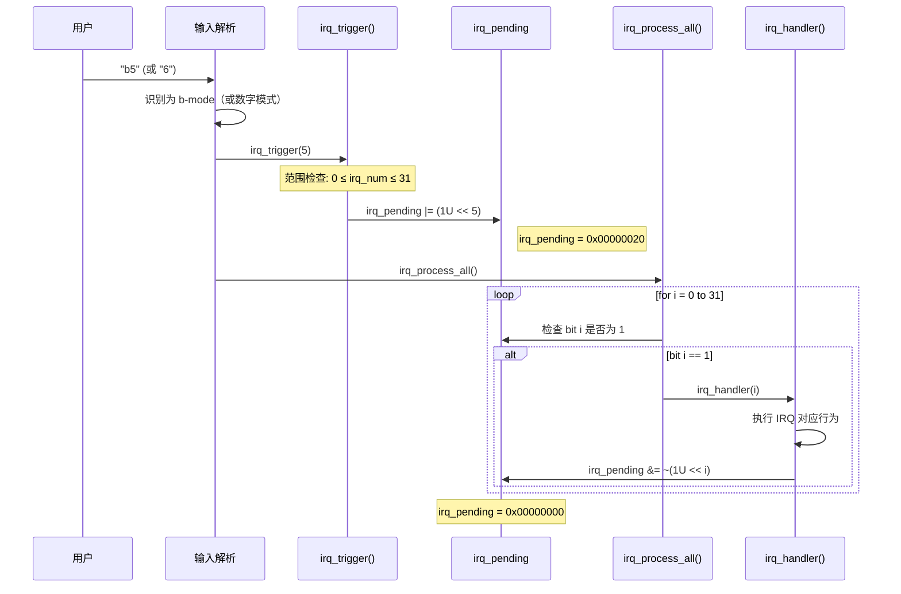
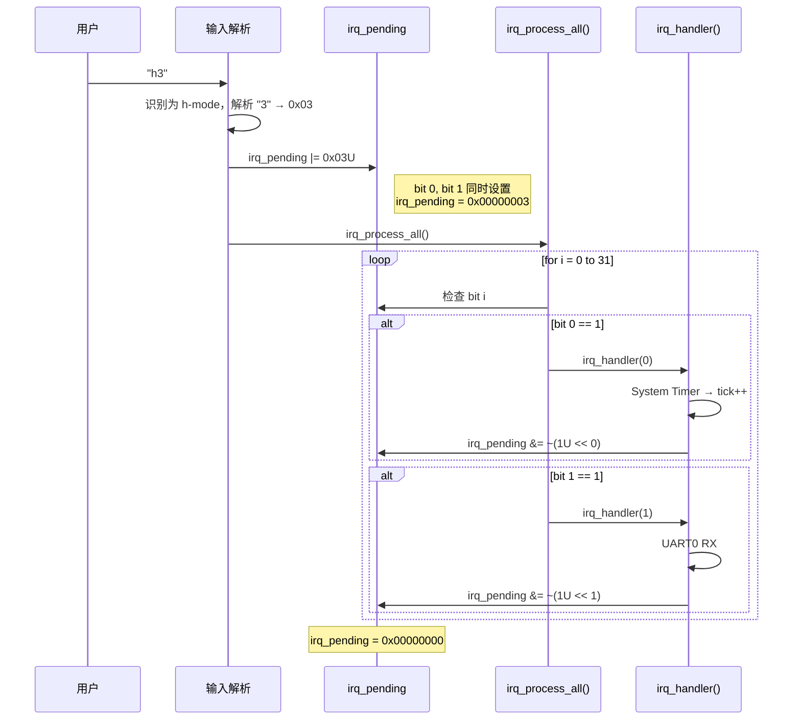
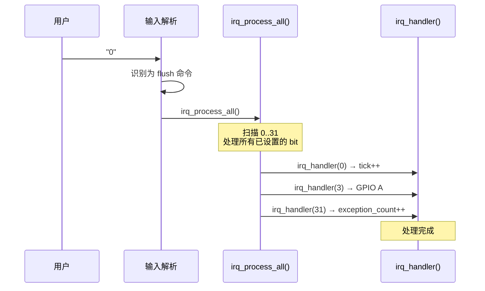
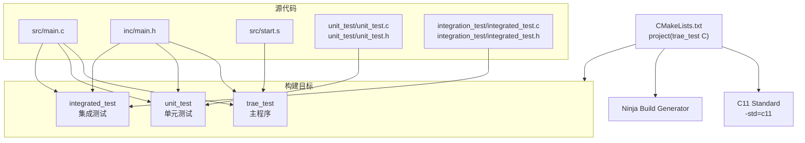
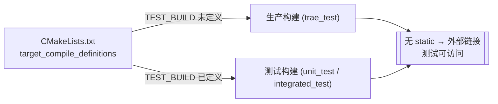
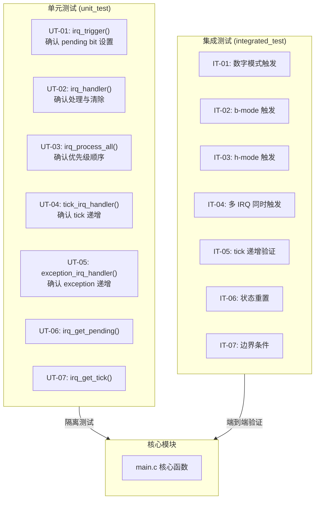

# IRQ Simulator - Software Architecture (Cline)

## 1. Architecture Overview

本项目采用**单层模块化架构 (Monolithic Modular Architecture)**，所有核心逻辑集中于 `src/main.c`，通过 `inc/main.h` 对外公开接口。系统以主循环 (main loop) 驱动，依次执行 tick 计数、用户输入解析、IRQ 触发与优先级处理。

### 1.1 系统脉络图



### 1.2 模块职责边界

| 层级 | 组件 | 职责范围 |
|------|------|----------|
| **应用层** | `src/main.c` | IRQ 触发、优先级处理、pending register 管理、主循环控制 |
| **接口层** | `inc/main.h` | 函数声明、常量定义、FW_STATIC 测试桥接机制 |
| **启动层** | `src/start.s` | 汇编语言中断向量表与异常处理程序 |

### 1.3 总体数据流



---

## 2. Decomposition View

### 2.1 核心数据结构

#### `irq_pending` (uint32_t)

32-bit pending register，每个 bit 对应一个 IRQ 通道：

```
Bit    IRQ    Peripheral
─────────────────────────────────
 0     IRQ0   System Timer
 1     IRQ1   UART0 RX
 2     IRQ2   UART0 TX
 3     IRQ3   GPIO Port A
 4     IRQ4   GPIO Port B
 5     IRQ5   SPI0
 6     IRQ6   I2C0
 7     IRQ7   ADC
 8     IRQ8   DMA Ch0
 9     IRQ9   DMA Ch1
10     IRQ10  Watchdog
11     IRQ11  RTC
12     IRQ12  USB
13     IRQ13  CAN0
14     IRQ14  PWM
15     IRQ15  Timer1
16     IRQ16  Timer2
17     IRQ17  UART1 RX
18     IRQ18  UART1 TX
19     IRQ19  SPI1
20     IRQ20  I2C1
21     IRQ21  External INT0
22     IRQ22  External INT1
23     IRQ23  External INT2
24     IRQ24  DMA Ch2
25     IRQ25  DMA Ch3
26     IRQ26  CRC
27     IRQ27  AES
28     IRQ28  QSPI
29     IRQ29  SDIO
30     IRQ30  Ethernet
31     IRQ31  Exception
```

#### `g_tick_count` (uint32_t)

全局 tick 计数器，增量时机：
- 每次主循环迭代开始时递增 **(SR_037)**
- IRQ0 (System Timer) 处理时递增 **(SR_038)**

#### `exception_count` (uint32_t)

Exception 触发次数计数器（仅 IRQ31 处理时递增）

### 2.2 公开 API

| 函数 | 声明位置 | 链接 | 说明 |
|------|----------|------|------|
| `__disable_irq()` | `inc/main.h` | external | 关闭全局中断（模拟桩，无操作） |
| `__enable_irq()` | `inc/main.h` | external | 开启全局中断（模拟桩，无操作） |
| `tick_irq_handler()` | `inc/main.h` | external | Tick ISR：递增 `g_tick_count` |
| `exception_irq_handler()` | `inc/main.h` | external | Exception ISR：递增 `exception_count` |
| `irq_trigger(uint32_t)` | `inc/main.h` | external | 设置指定 IRQ 编号的 pending bit |
| `irq_process_all(void)` | `inc/main.h` | external | 依优先级扫描并处理所有 pending IRQ |

### 2.3 测试辅助 API（仅 `TEST_BUILD` 时可见）

| 函数 | 说明 |
|------|------|
| `irq_trigger_raw(uint32_t)` | 通过原始 hex 掩码设置 pending register |
| `irq_handler(uint32_t)` | 单一 IRQ 处理函数（switch-case） |
| `irq_get_pending(void)` | 读取当前 pending 值 |
| `irq_get_tick(void)` | 读取当前 tick 值 |
| `irq_reset_all(void)` | 重置所有 IRQ 状态 |
| `exception_get_count(void)` | 读取 exception 计数值 |
| `tick_printf(const char*, ...)` | 带 tick 前缀的调试输出函数 |

---

## 3. Runtime View

### 3.1 主循环控制流程



### 3.2 IRQ 触发流程 — 数字 / b 模式



### 3.3 IRQ 触发流程 — Hex 模式



### 3.4 输入「0」手动处理所有 Pending IRQ



---

## 4. Interface View

### 4.1 内部接口

#### 4.1.1 `irq_trigger(irq_num)`

- **用途**：设置指定 IRQ 编号的 pending bit **(SR_003, SR_004, SR_005)**
- **参数**：`irq_num` — 0..31（受范围检查保护）
- **行为**：`irq_pending |= (1U << irq_num)`
- **边界检查**：若 `irq_num >= IRQ_COUNT (32)`，忽略请求

#### 4.1.2 `irq_trigger_raw(mask)`

- **用途**：通过原始 bitmask 直接设置 pending register **(SR_006)**
- **参数**：`mask` — 32-bit 掩码值
- **行为**：`irq_pending |= mask`

#### 4.1.3 `irq_process_all()`

- **用途**：依优先级顺序处理所有 pending IRQ **(SR_008)**
- **算法**：
  ```
  for i = 0 to (IRQ_COUNT - 1)
      if (irq_pending & (1U << i))
          irq_handler(i)
  ```
- **优先级规则**：IRQ0 优先级最高 (i=0)，IRQ31 最低 (i=31) **(SR_007)**

#### 4.1.4 `irq_handler(irq_num)`

- **用途**：依照 IRQ 编号分发至对应的外设模拟行为 **(SR_045)**
- **结构**：switch-case，32 个 case
- **清除机制**：执行完对应行为后清除 pending bit **(SR_009)**：
  `irq_pending &= ~(1U << irq_num)`
- **特殊处理**：
  - IRQ0 → `tick_irq_handler()` → `g_tick_count++` **(SR_010)**
  - IRQ31 → `exception_irq_handler()` → `exception_count++` **(SR_035)**
  - 其余 IRQ1~30 → `printf` 模拟行为记录 **(SR_011 ~ SR_034)**

#### 4.1.5 输入解析器 (`main()` 内建逻辑)

| 模式 | 语法 | 解析逻辑 | 调用 |
|------|------|----------|------|
| 数字模式 | `1` ~ `32` | `value - 1` → IRQ 编号 | `irq_trigger(value - 1)` |
| b 模式 | `b0` ~ `b31` | 提取 `b` 后数字 → IRQ 编号 | `irq_trigger(b_val)` |
| h 模式 | `h0` ~ `hFFFFFFFF` | 十六进制字符串 → mask | `irq_trigger_raw(hex_val)` |
| flush | `0` | 手动处理所有 pending IRQ | `irq_process_all()` |
| exit | `exit` | 终止程序 | `return 0` |

#### 4.1.6 `tick_printf(fmt, ...)`

- **用途**：所有 log 输出带 `[tick: N]` 前缀 **(SR_039)**
- **行为**：`printf("[tick: %u] ", g_tick_count)` → `vprintf(fmt, args)`

### 4.2 外部接口

| 接口 | 方向 | 说明 |
|------|------|------|
| stdin | 输入 | 用户通过键盘输入命令 |
| stdout | 输出 | 模拟器输出 log 与提示 |

---

## 5. 构建视图 (Build View)

### 5.1 构建系统架构



### 5.2 条件编译机制 — `TEST_BUILD`



### 5.3 构建目标对应需求

| 目标 | 文件 | 对应需求 |
|------|------|----------|
| `trae_test` | `src/main.c`, `inc/main.h`, `src/start.s` | SR_001~SR_047 |
| `unit_test` | `src/main.c`, `inc/main.h`, `unit_test/unit_test.c` | SR_001~SR_010, SR_036~SR_039 |
| `integrated_test` | `src/main.c`, `inc/main.h`, `integration_test/integrated_test.c` | SR_004~SR_009, SR_036~SR_041 |

---

## 6. 测试视图 (Test View)

### 6.1 测试层级架构



### 6.2 测试用例对应需求

| 测试 ID | 测试类型 | 测试目标 | 验证需求 |
|---------|----------|----------|----------|
| UT-01 | 单元 | `irq_trigger()` 设置正确的 pending bit | SR_001, SR_002, SR_003 |
| UT-02 | 单元 | `irq_handler()` 执行行为并清除 bit | SR_009, SR_045 |
| UT-03 | 单元 | `irq_process_all()` 依优先级顺序处理 | SR_007, SR_008 |
| UT-04 | 单元 | `tick_irq_handler()` 递增计数器 | SR_010, SR_036, SR_038 |
| UT-05 | 单元 | `exception_irq_handler()` 递增计数器 | SR_035 |
| UT-06 | 单元 | 测试访问函数 `irq_get_pending()` | — |
| UT-07 | 单元 | 测试访问函数 `irq_get_tick()` | SR_036 |
| IT-01 | 集成 | 数字模式 (`<1-32>`) 触发正确 IRQ | SR_004 |
| IT-02 | 集成 | b-mode (`bN`) 触发正确 IRQ | SR_005 |
| IT-03 | 集成 | h-mode (`hHEX`) 设置 pending register | SR_006 |
| IT-04 | 集成 | 多 IRQ 依优先级顺序处理 | SR_007, SR_008 |
| IT-05 | 集成 | 主循环 tick 递增行为 | SR_037 |
| IT-06 | 集成 | `irq_reset_all()` 状态重置 | — |
| IT-07 | 集成 | 边界条件 (IRQ0、IRQ31、无效输入) | SR_042, SR_043 |

---

## 7. Architecture Requirements Traceability

### 7.1 架构项目追溯表

| ID | 章节 | 追溯 SR | 描述 |
|----|------|---------|------|
| SA_C_001 | 1 | SR_001, SR_044, SR_045 | 单层模块化架构：核心逻辑集中于 `src/main.c`，通过 `inc/main.h` 对外公开接口 |
| SA_C_002 | 2.1 | SR_001, SR_002 | `irq_pending` 32-bit 寄存器，每个 bit 对应一个 IRQ 通道 |
| SA_C_003 | 2.1 | SR_036, SR_037, SR_038 | `g_tick_count` 全局 tick 计数器 |
| SA_C_004 | 2.2 | SR_001, SR_044 | 公开 API 声明于 `inc/main.h`，`IRQ_COUNT` 定义为 32 |
| SA_C_005 | 2.3 | SR_044 | 测试辅助 API 通过 `FW_STATIC` / `TEST_BUILD` 机制仅在测试构建中可见 |
| SA_C_006 | 3.1 | SR_037, SR_040, SR_041 | `main()` 主循环：tick 递增 → 读取输入 → 解析 → 处理 IRQ |
| SA_C_007 | 3.1 | SR_039 | `tick_printf()` 确保所有 log 输出带 `[tick: N]` 前缀 |
| SA_C_008 | 3.2 | SR_003, SR_004, SR_005 | `irq_trigger()`：数字与 b-mode 设置 pending bit，含范围检查 |
| SA_C_009 | 3.3 | SR_003, SR_006 | `irq_trigger_raw()`：h-mode 通过 hex 掩码直接设置 pending register |
| SA_C_010 | 3.4 | SR_040 | 输入 `0`：触发 `irq_process_all()` 手动处理所有 pending IRQ |
| SA_C_011 | 4.1.3 | SR_007, SR_008 | `irq_process_all()`：IRQ0→IRQ31 依次扫描，高优先级先处理 |
| SA_C_012 | 4.1.4 | SR_009, SR_045 | `irq_handler()`：switch-case 分发，执行完毕后清除 pending bit |
| SA_C_013 | 4.1.4 | SR_010, SR_036, SR_038 | IRQ0 调用 `tick_irq_handler()` 递增 `g_tick_count` |
| SA_C_014 | 4.1.4 | SR_035 | IRQ31 调用 `exception_irq_handler()` 递增 `exception_count` |
| SA_C_015 | 4.1.4 | SR_011~SR_034 | IRQ1~30 各自输出对应外设的模拟行为信息 |
| SA_C_016 | 4.1.5 | SR_004, SR_005 | 输入解析器支持数字模式 (`1-32`) 与 b 模式 (`b0-b31`) |
| SA_C_017 | 4.1.5 | SR_006 | 输入解析器支持 h 模式 (`h0-hFFFFFFFF`) |
| SA_C_018 | 4.1.5 | SR_041 | 输入解析器支持 `exit` 命令 |
| SA_C_019 | 4.1.5 | SR_042, SR_043 | 无效输入显示错误信息并重新提示 |
| SA_C_020 | 5 | SR_046, SR_047 | CMake + Ninja 构建系统，C11 标准，不依赖平台特定 API |
| SA_C_021 | 5 | SR_046, SR_047 | 三个构建目标：`trae_test` (主程序)、`unit_test`、`integrated_test` |
| SA_C_022 | 6 | SR_001~SR_010 | 单元测试隔离验证所有核心函数 |
| SA_C_023 | 6 | SR_004~SR_009, SR_036~SR_041 | 集成测试验证端到端流程 |

### 7.2 需求覆盖率统计

| 需求分类 | SR 范围 | 总数 | SA_C 追溯数 | 覆盖率 |
|----------|---------|------|-------------|--------|
| FR-01 (IRQ 触发机制) | SR_001~SR_003 | 3 | 3 (SA_C_001, SA_C_002, SA_C_008) | 100% |
| FR-02 (输入模式) | SR_004~SR_006 | 3 | 3 (SA_C_008, SA_C_009, SA_C_016, SA_C_017) | 100% |
| FR-03 (优先级处理) | SR_007~SR_009 | 3 | 3 (SA_C_011, SA_C_012) | 100% |
| FR-04 (IRQ 行为) | SR_010~SR_035 | 26 | 26 (SA_C_013, SA_C_014, SA_C_015) | 100% |
| FR-05 (Tick 计数器) | SR_036~SR_039 | 4 | 4 (SA_C_003, SA_C_006, SA_C_007, SA_C_013) | 100% |
| FR-06 (程序控制) | SR_040~SR_041 | 2 | 2 (SA_C_006, SA_C_010, SA_C_018) | 100% |
| NFR-01 (易用性) | SR_042~SR_043 | 2 | 2 (SA_C_019) | 100% |
| NFR-02 (可维护性) | SR_044~SR_045 | 2 | 2 (SA_C_001, SA_C_005, SA_C_012) | 100% |
| NFR-03 (可移植性) | SR_046~SR_047 | 2 | 2 (SA_C_020, SA_C_021) | 100% |
| **总计** | SR_001~SR_047 | **47** | **47** | **100%** |

---

## 8. Architectural Decisions & Rationale

### ADR-001: Monolithic Modular Architecture

- **决策**：采用单层模块化架构而非分层架构
- **理由**：项目规模小 (单一 .c 档 + .h 档)，无需分层架构的复杂度
- **后果**：核心逻辑集中在 `main.c`，易于维护但难以独立替换子模块

### ADR-002: FW_STATIC Test Bridge Pattern

- **决策**：通过 `FW_STATIC` 宏与 `TEST_BUILD` 条件编译控制函数链接性
- **理由**：生产构建中 `static` 确保 MISRA R8.7 合规（无未使用的外部符号）；测试构建中移除 `static` 使单元测试可访问内部函数
- **后果**：测试代码可直接调用 `irq_handler()` 等内部函数进行隔离测试

### ADR-003: Bitmask Pending Register

- **决策**：使用单一 `uint32_t` 作为所有 IRQ 的 pending register
- **理由**：最多 32 个 IRQ 通道，32-bit 寄存器可完美对应；bit 操作效率高
- **替代方案**：使用数组或链表 — 实现复杂度高，不必要

### ADR-004: Main-loop Driven (No RTOS)

- **决策**：使用单纯的 `while(1)` 主循环驱动，不使用实时操作系统
- **理由**：模拟器环境无需实时性要求；简化实现与调试
- **后果**：无法模拟真正的 nested interrupt 或 preemption

### ADR-005: Switch-case Handler Dispatch

- **决策**：`irq_handler()` 使用单一 switch-case 处理 32 种 IRQ
- **理由**：需求明确要求 32 个固定行为；switch-case 可读性高且易于扩展
- **替代方案**：函数指针数组 — 更灵活但增加了间接调用的复杂度

---

> **缩写说明：**
>
> - **FR** = Functional Requirement（功能需求）
> - **NFR** = Non-Functional Requirement（非功能需求）
> - **SR** = Software Requirement（软件需求，为 FR 与 NFR 的统一编号）
> - **SA_C** = Software Architecture (Cline)（软件架构项目，本文档专属编号）
> - **ADR** = Architecture Decision Record（架构决策记录）