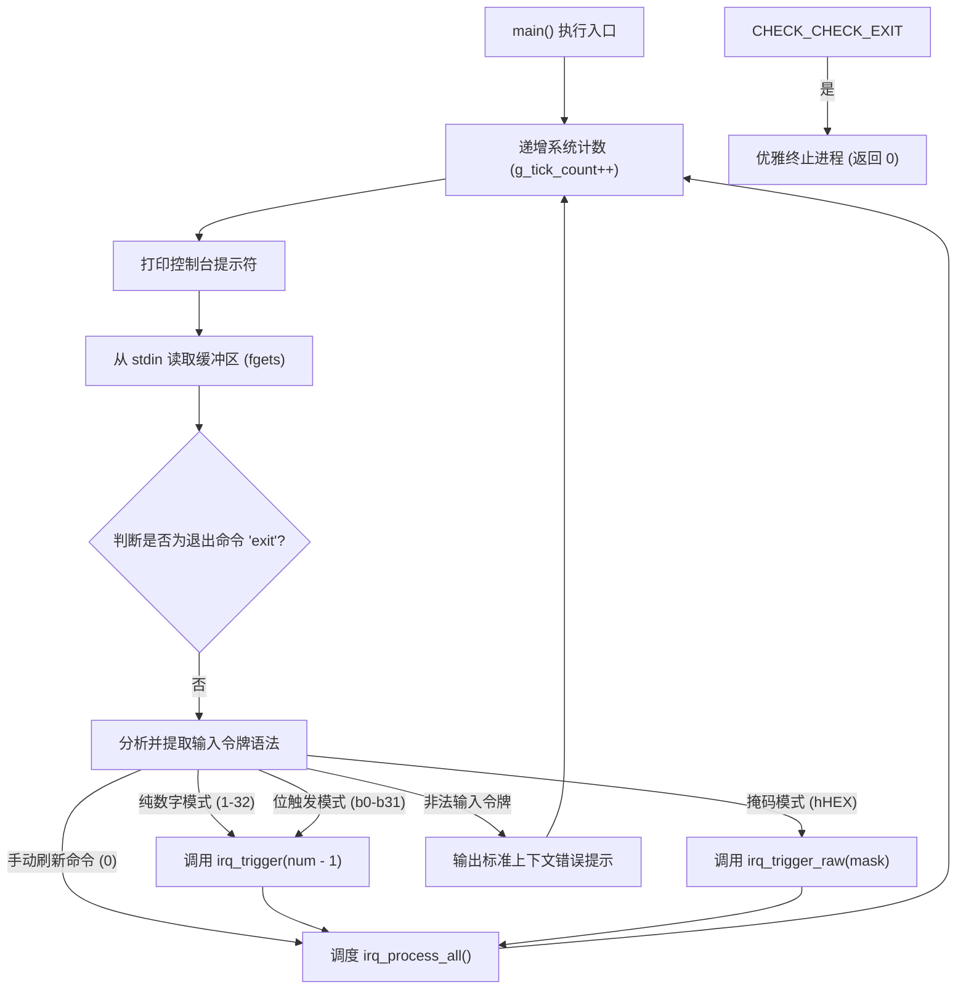

# IRQ Simulator - 软件架构设计说明书

## 1. 架构总览
本项目实现了一个基于单线程的、确定性的**单层模块化架构 (Monolithic Modular Architecture)**，用于在宿主机 (Host PC) 端模拟 32 通道可编程中断控制器。系统通过顺序执行的主循环结构，将底层寄存器状态与高层命令解析进行隔离。

### 1.1 系统上下文图


## 2. 模块职责边界划分
本系统严格划分为三个层级，以满足关注点分离与 MISRA C 合规性要求。

| 边界层级 | 组件名称 | 对应源文件 | 职责范围 |
| :--- | :--- | :--- | :--- |
| **应用层** | 核心执行引擎 | `src/main.c` | 控制确定性主循环的推进，驱动 `fgets` 缓冲读取，解析输入命令流并按优先级调度中断处理序列。 |
| **接口层** | 硬件行为抽象 | `inc/main.h` | 声明公开 API 终点，封装全局外设常量 (`IRQ_COUNT=32`)，实现 `FW_STATIC` 测试桥接宏机制。 |
| **启动层** | 系统向量表映射 | `src/start.s` | 模拟低外设的中断向量表分配及系统硬件异常入口的存根。 |

## 3. 核心数据结构与外设映射
模拟器将中断控制器硬件行为映射至明确位宽的寄存器和计数状态中。

### 3.1 `irq_pending` (32位寄存器位字段配置)
```
Bit  0  [0x00000001] -> IRQ0  : 系统定时器外设 (最高优先级)
Bit  1  [0x00000002] -> IRQ1  : UART0 接收通道中断
Bit  2  [0x00000004] -> IRQ2  : UART0 发送通道中断
Bit  3  [0x00000008] -> IRQ3  : GPIO 端口 A 中断路由
Bit  4  [0x00000010] -> IRQ4  : GPIO 端口 B 中断路由
Bit  5  [0x00000020] -> IRQ5  : SPI0 传输引擎标志
Bit  6  [0x00000040] -> IRQ6  : I2C0 传输完成标志
Bit  7  [0x00000080] -> IRQ7  : 模数转换器 (ADC) 转换完成标志
Bit  8  [0x00000100] -> IRQ8  : 直接内存访问 (DMA) 通道 0 标志
Bit  9  [0x00000200] -> IRQ9  : 直接内存访问 (DMA) 通道 1 标志
Bit 10  [0x00000400] -> IRQ10 : 看门狗定时器计数溢出标志
Bit 11  [0x00000800] -> IRQ11 : 实时时钟 (RTC) 闹钟路由
Bit 12  [0x00001000] -> IRQ12 : 通用串行总线 (USB) 模块标志
Bit 13  [0x00002000] -> IRQ13 : 控制器局域网 (CAN0) 协议引擎
Bit 14  [0x00004000] -> IRQ14 : 脉宽调制 (PWM) 周期匹配标志
Bit 15  [0x00008000] -> IRQ15 : 通用定时器 1 中断
Bit 16  [0x00010000] -> IRQ16 : 通用定时器 2 中断
Bit 17  [0x00020000] -> IRQ17 : UART1 接收通道中断
Bit 18  [0x00040000] -> IRQ18 : UART1 发送通道中断
Bit 19  [0x00080000] -> IRQ19 : SPI1 传输引擎标志
Bit 20  [0x00100000] -> IRQ20 : I2C1 传输完成标志
Bit 21  [0x00200000] -> IRQ21 : 外部硬件中断输入线 0
Bit 22  [0x00400000] -> IRQ22 : 外部硬件中断输入线 1
Bit 23  [0x00800000] -> IRQ23 : 外部硬件中断输入线 2
Bit 24  [0x01000000] -> IRQ24 : 直接内存访问 (DMA) 通道 2 标志
Bit 25  [0x02000000] -> IRQ25 : 直接内存访问 (DMA) 通道 3 标志
Bit 26  [0x04000000] -> IRQ26 : 循环冗余校验 (CRC) 计算引擎
Bit 27  [0x08000000] -> IRQ27 : 高级加密标准 (AES) 协处理器标志
Bit 28  [10000000] -> IRQ28 : Quad SPI (QSPI) 状态标志
Bit 29  [0x20000000] -> IRQ29 : SDIO 安全数字输入输出事件路由
Bit 30  [0x40000000] -> IRQ30 : 以太網 MAC 帧状态标志
Bit 31  [0x80000000] -> IRQ31 : 系统硬件异常事件外设 (最低优先级)
```

### 3.2 全局跟踪状态计数器
* `g_tick_count` (uint32_t): 全局主循环迭代计数器，同时作为 IRQ0 的触发累计器。
* `exception_count` (uint32_t): 静态错误账本，用于捕获和验证 IRQ31 系统硬件异常的触发频次。

## 4. 全局运行时调用流向图


## 5. 架构决策记录 (ADR)

### ADR-001: 单层模块化架构选型
* **上下文**: 系统规模较小，要求极低的调用栈开销，规避过度分层带来的多重间接寻址。
* **决策**: 将所有外设中断分发逻辑封装于单文件 `src/main.c` 的私有作用域内。
* **后果**: 显著提升执行速率，在不损失代码高内聚的前提下降低了多文件耦合風險。

### ADR-002: 基于 `FW_STATIC` 宏的测试桥接模式
* **上下文**: MISRA C:2012 Rule 8.7 要求非外部导出的符号必须具备内部链接性 (`static`)。然而，白盒单元测试代码需要直接访问非公开的寄存器状态。
* **决策**: 引入 `FW_STATIC` 自定义宏。在生产构建中展开为 `static`，而在测试构建中通过編譯參數 `-DTEST_BUILD` 将其展开为空。
* **后果**: 在完全满足生产构建静态封装合规性的同时，确保了 100% 的单元测试可访问性。

### ADR-003: 32位寄存器位掩码设计
* **上下文**: 需以单周期的高效位运算模拟 32 通道独立中断的状态锁存。
* **决策**: 采用单变量 `uint32_t` 锁存全局 pending 状态。
* **后果**: 与宿主机 32/64 位 CPU 架构原生对齐，实现最高效的中断状态读写。

### ADR-004: 同步单线程循环驱动
* **Context**: 为确保测试结果在流水线及不同开发环境间 100% 可复现，规避多线程调度带来的不确定性竞争。
* **决策**: 所有解析、定时、调度、清除逻辑均集中在单线程同步轮询管线内。
* **后果**: 抹除了异步时序竞争風險，保障了模拟器在汽车级韧体验证中的绝对确定性。

### ADR-005: Switch-Case 固定分发树
* **上下文**: 安全合规规范限制使用间接函数指针数组以防程序失控跑飞。
* **决策**: 采用包含 32 路显式 case 的 `switch-case` 结构替代动态函数指针。
* **后果**: 完全消除间接跳转造成的潜在函数指针越界風險，符合汽车功能安全设计准则。

---

## 6. 架构至软件需求追溯矩阵
| 架构设计项 ID | 对应章节 | 追溯的软件需求 ID (SR) |
| :--- | :--- | :--- |
| SA_001 | 1.0 架构总览 | SR_001, SR_044, SR_045 |
| SA_002 | 2.0 职责边界划分 | SR_001, SR_002, SR_003, SR_007 |
| SA_003 | 3.1 寄存器位字段配置 | SR_001, SR_002, SR_003 |
| SA_004 | 3.2 全局跟踪状态计数器 | SR_036, SR_037, SR_038, SR_035 |
| SA_005 | 4.0 全局运行时调用流向 | SR_004, SR_005, SR_006, SR_040, SR_041 |
| SA_006 | 5.0 ADR 决策记录 | SR_007, SR_008, SR_009, SR_046, SR_047 |
