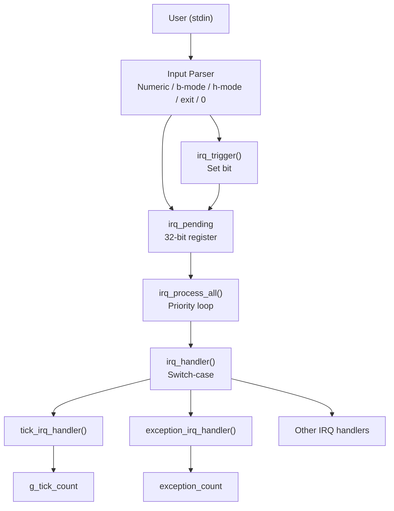
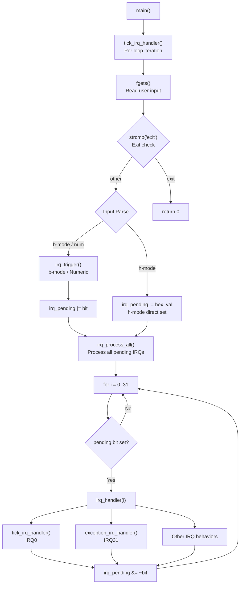
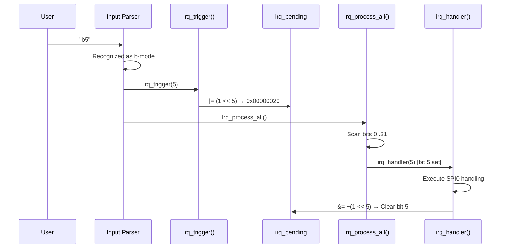
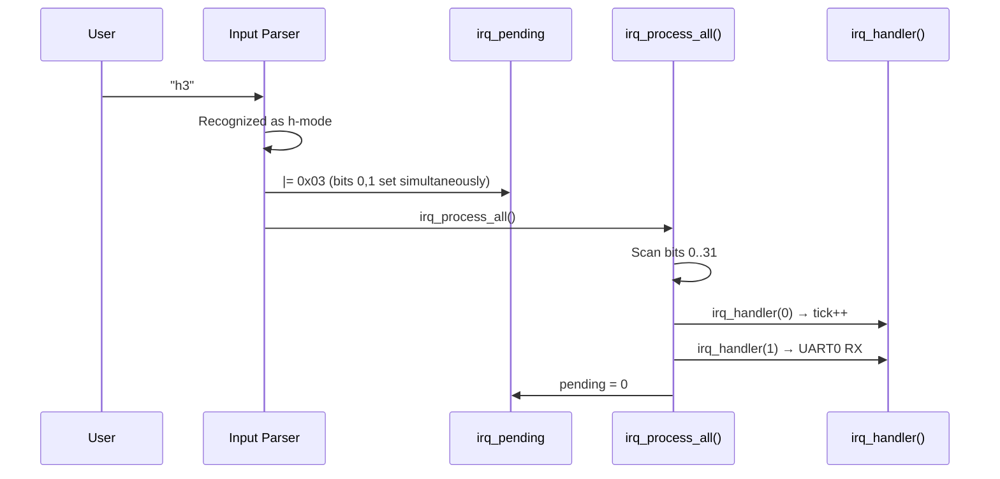
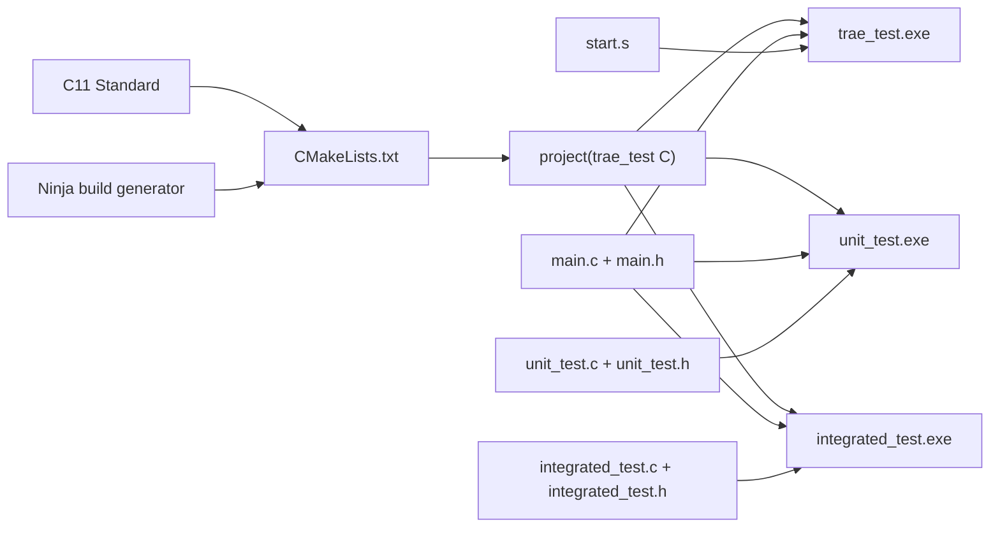
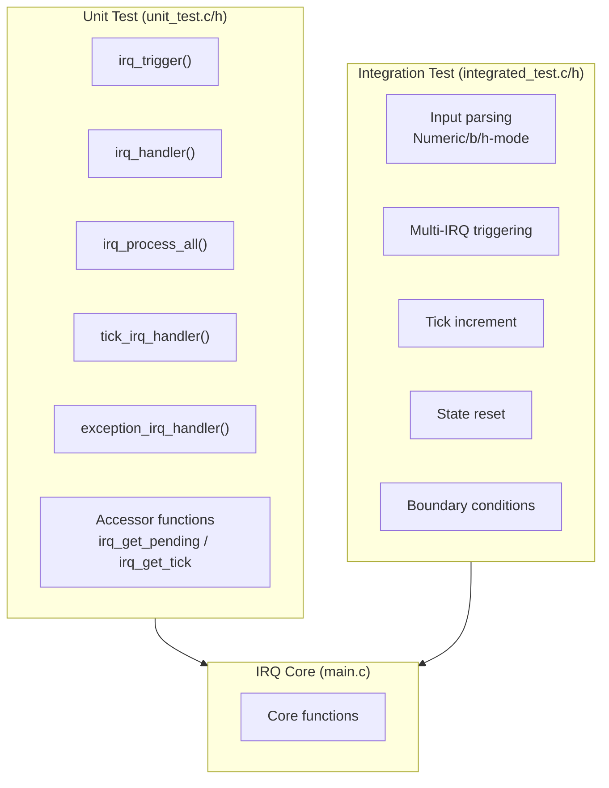

# IRQ Simulator - Software Architecture

## 1. Architecture Overview

This project adopts a **Monolithic Modular Architecture**, with all core logic centralized in `main.c` and interfaces exposed through `main.h`.



## 2. Module Decomposition

### 2.1 Core Modules

| Module | File | Responsibility |
|------|------|------|
| IRQ Core | `main.c` | IRQ triggering, handling, pending register management |
| IRQ Interface | `main.h` | Function declarations, constant definitions |
| Startup | `start.s` | Assembly interrupt vector table and handlers |

### 2.2 Key Data Structures

```
irq_pending (uint32_t)
  Bit 0  -> IRQ0  (System Timer)
  Bit 1  -> IRQ1  (UART0 RX)
  ...
  Bit 31 -> IRQ31 (Exception)

g_tick_count (unsigned int)
  System tick counter, incremented on each main loop iteration
```

### 2.3 Function Call Graph



## 3. Data Flow

### 3.1 IRQ Trigger Flow (b-mode)



### 3.2 Hex Multi-IRQ Flow



## 4. Build System



## 5. Test Architecture



## 6. Architecture Requirements Traceability

| ID | Chapter | Trace to SR | Description |
|----|---------|-------------|-------------|
| SA_001 | 1 | SR_001<br>SR_044<br>SR_045 | Monolithic Modular Architecture: all core logic centralized in `main.c`, interfaces exposed through `main.h` |
| SA_002 | 2.1 | SR_001<br>SR_002<br>SR_003<br>SR_007<br>SR_008<br>SR_009 | IRQ Core module (`main.c`): IRQ triggering, handling, pending register management |
| SA_003 | 2.1 | SR_001<br>SR_044 | IRQ Interface module (`main.h`): function declarations, constant definitions (`IRQ_COUNT=32`) |
| SA_004 | 2.1 | SR_010<br>SR_035 | Startup module (`start.s`): assembly interrupt vector table, tick ISR and exception ISR |
| SA_005 | 2.2 | SR_001<br>SR_002<br>SR_003 | `irq_pending` data structure: 32-bit register, each bit maps to one IRQ channel |
| SA_006 | 2.2 | SR_036<br>SR_037<br>SR_038 | `g_tick_count` data structure: global tick counter, incremented per loop iteration and on IRQ0 |
| SA_007 | 2.3 | SR_037<br>SR_040<br>SR_041 | `main()` entry point: orchestrates main loop with tick increment, input read, parse, and process |
| SA_008 | 2.3 | SR_004<br>SR_005<br>SR_006<br>SR_040<br>SR_041 | Input Parser: supports numeric (`1-32`), b-mode (`bN`), h-mode (`hHEX`), `0` (process), `exit` |
| SA_009 | 2.3 | SR_003<br>SR_004<br>SR_005 | `irq_trigger()`: sets pending bit for a specific IRQ number with range validation |
| SA_010 | 2.3 | SR_003<br>SR_006 | `irq_trigger_raw()`: directly sets pending register via raw hex mask (h-mode) |
| SA_011 | 2.3 | SR_007<br>SR_008 | `irq_process_all()`: priority-based loop (IRQ0→IRQ31) processing all pending IRQs |
| SA_012 | 2.3 | SR_009<br>SR_010<br>SR_045 | `irq_handler()`: switch-case dispatch to 32 individual IRQ handler behaviors, clears pending bit |
| SA_013 | 2.3 | SR_010<br>SR_036<br>SR_038 | `tick_irq_handler()`: increments `g_tick_count`, called by IRQ0 and main loop |
| SA_014 | 2.3 | SR_035 | `exception_irq_handler()`: increments internal exception_count, called by IRQ31 |
| SA_015 | 3.1 | SR_005<br>SR_003<br>SR_008<br>SR_009 | b-mode IRQ trigger flow: parse → `irq_trigger()` → pending set → `irq_process_all()` → handler → clear |
| SA_016 | 3.2 | SR_006<br>SR_003<br>SR_008<br>SR_009 | h-mode multi-IRQ flow: parse → pending direct set → `irq_process_all()` → handler → clear |
| SA_017 | 4 | SR_046<br>SR_047 | CMake build system with Ninja generator: cross-platform build management |
| SA_018 | 4 | SR_046<br>SR_047 | Three build targets: `trae_test` (main), `unit_test`, `integrated_test` with `TEST_BUILD` macro |
| SA_019 | 4 | SR_046 | C11 language standard: no platform-specific API dependencies |
| SA_020 | 5 | SR_001<br>SR_002<br>SR_003<br>SR_007<br>SR_008<br>SR_009<br>SR_010<br>SR_036<br>SR_038 | Unit test module (`unit_test.c/h`): verifies all core functions in isolation (UT-01~UT-07) |
| SA_021 | 5 | SR_004<br>SR_005<br>SR_006<br>SR_007<br>SR_008<br>SR_036<br>SR_037<br>SR_038<br>SR_040<br>SR_041 | Integration test module (`integrated_test.c/h`): verifies end-to-end flows (IT-01~IT-07) |
| SA_022 | 5 | SR_036<br>SR_037<br>SR_038 | Test accessor functions: `irq_get_pending()`, `irq_get_tick()`, `irq_reset_all()` |
| SA_023 | 2.3 | SR_039 | `TICK_PRINTF` macro: unified log output format with `[tick: N]` prefix for all messages |
| SA_024 | 2.3 | SR_009 | Pending bit clear mechanism: `irq_pending &= ~(1 << irq_num)` after each IRQ handled |
| SA_025 | 2.3 | SR_042<br>SR_043 | Input validation and error handling: range check, invalid mode messages, graceful degradation |

### Chapter Mapping

| Chapter | SA Range | Count | Content |
|---------|----------|-------|---------|
| 1 | SA_001 | 1 | Architecture Overview |
| 2.1 | SA_002 ~ SA_004 | 3 | Core Modules |
| 2.2 | SA_005 ~ SA_006 | 2 | Key Data Structures |
| 2.3 | SA_007 ~ SA_014, SA_023 ~ SA_025 | 11 | Function Call Graph & Mechanisms |
| 3 | SA_015 ~ SA_016 | 2 | Data Flow |
| 4 | SA_017 ~ SA_019 | 3 | Build System |
| 5 | SA_020 ~ SA_022 | 3 | Test Architecture |

> **Abbreviation Notes:**
>
> - **SA** = Software Architecture (unified numbering for all architectural design items)
> - **SR** = Software Requirement (traceability back to SWE.1 requirements)