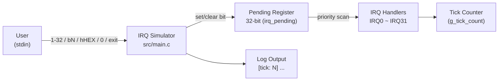
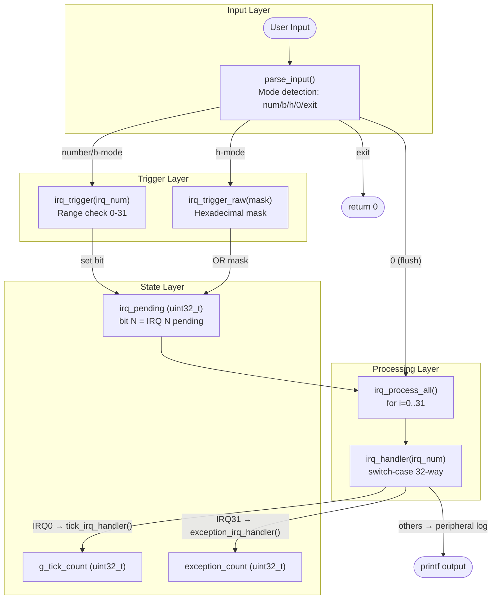
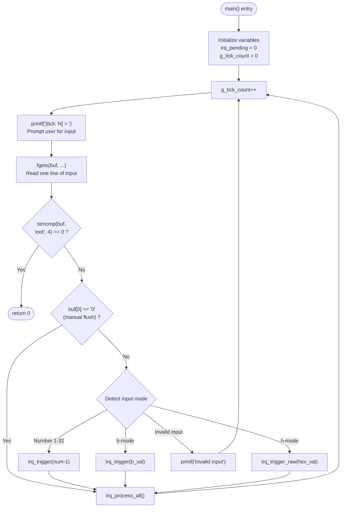
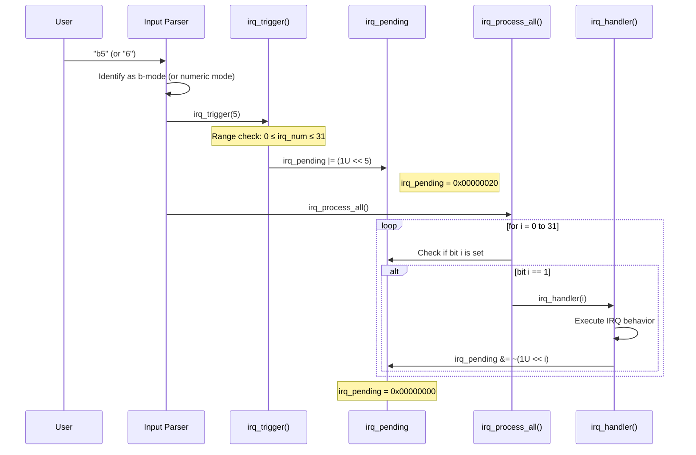
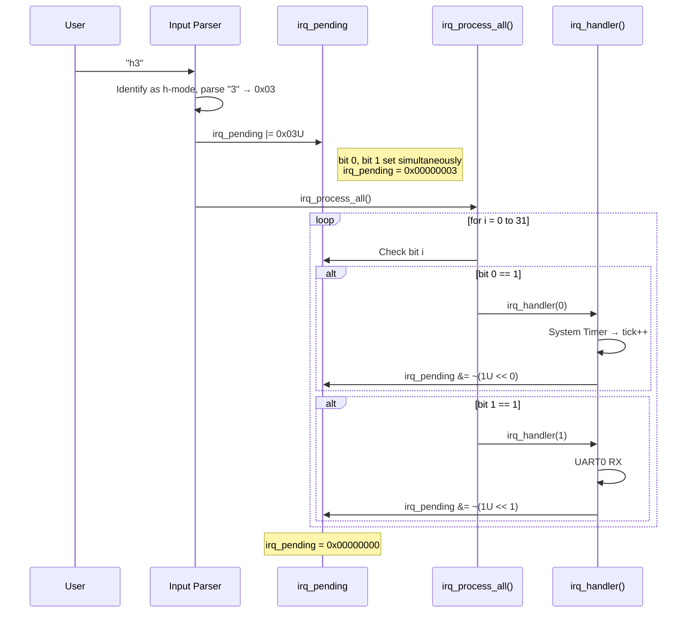
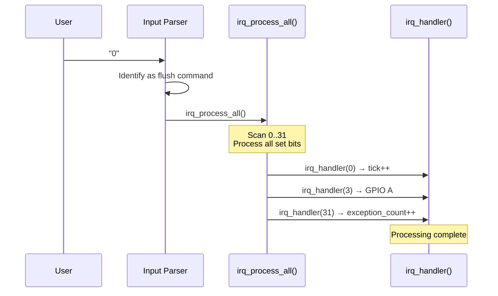
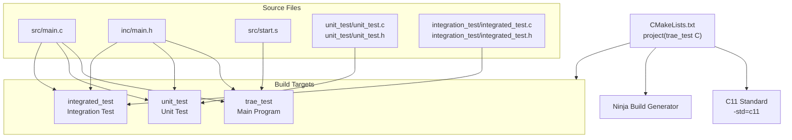
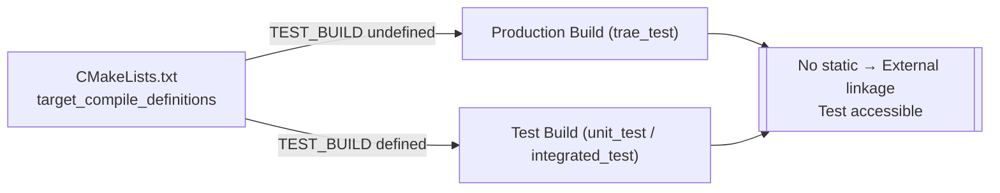
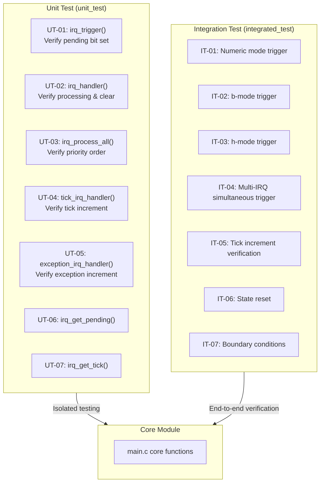

# IRQ Simulator - Software Architecture (Cline)

## 1. Architecture Overview

This project adopts a **Monolithic Modular Architecture**, with all core logic centralized in `src/main.c` and exposed via `inc/main.h`. The system is driven by a main loop that sequentially performs tick counting, user input parsing, IRQ triggering, and priority-based processing.

### 1.1 System Context Diagram



### 1.2 Module Responsibility Boundaries

| Layer | Component | Responsibility |
|-------|-----------|---------------|
| **Application** | `src/main.c` | IRQ triggering, priority handling, pending register management, main loop control |
| **Interface** | `inc/main.h` | Function declarations, constant definitions, FW_STATIC test bridge mechanism |
| **Startup** | `src/start.s` | Assembly interrupt vector table and exception handler stubs |

### 1.3 Overall Data Flow



---

## 2. Decomposition View

### 2.1 Core Data Structures

#### `irq_pending` (uint32_t)

A 32-bit pending register where each bit maps to an IRQ channel:

```
Bit    IRQ    Peripheral
─────────────────────────────────
 0     IRQ0   System Timer
 1     IRQ1   UART0 RX
 2     IRQ2   UART0 TX
 3     IRQ3   GPIO Port A
 4     IRQ4   GPIO Port B
 5     IRQ5   SPI0
 6     IRQ6   I2C0
 7     IRQ7   ADC
 8     IRQ8   DMA Ch0
 9     IRQ9   DMA Ch1
10     IRQ10  Watchdog
11     IRQ11  RTC
12     IRQ12  USB
13     IRQ13  CAN0
14     IRQ14  PWM
15     IRQ15  Timer1
16     IRQ16  Timer2
17     IRQ17  UART1 RX
18     IRQ18  UART1 TX
19     IRQ19  SPI1
20     IRQ20  I2C1
21     IRQ21  External INT0
22     IRQ22  External INT1
23     IRQ23  External INT2
24     IRQ24  DMA Ch2
25     IRQ25  DMA Ch3
26     IRQ26  CRC
27     IRQ27  AES
28     IRQ28  QSPI
29     IRQ29  SDIO
30     IRQ30  Ethernet
31     IRQ31  Exception
```

#### `g_tick_count` (uint32_t)

Global tick counter, incremented at:
- Start of each main loop iteration **(SR_037)**
- When IRQ0 (System Timer) is processed **(SR_038)**

#### `exception_count` (uint32_t)

Exception trigger counter (incremented only when IRQ31 is processed)

### 2.2 Public API

| Function | Declaration | Linkage | Description |
|----------|-------------|---------|-------------|
| `__disable_irq()` | `inc/main.h` | external | Disable global interrupts (stub, no-op) |
| `__enable_irq()` | `inc/main.h` | external | Enable global interrupts (stub, no-op) |
| `tick_irq_handler()` | `inc/main.h` | external | Tick ISR: increments `g_tick_count` |
| `exception_irq_handler()` | `inc/main.h` | external | Exception ISR: increments `exception_count` |
| `irq_trigger(uint32_t)` | `inc/main.h` | external | Set pending bit for the specified IRQ number |
| `irq_process_all(void)` | `inc/main.h` | external | Scan and process all pending IRQs in priority order |

### 2.3 Test Helper API (visible only when `TEST_BUILD` is defined)

| Function | Description |
|----------|-------------|
| `irq_trigger_raw(uint32_t)` | Set pending register via raw hex mask |
| `irq_handler(uint32_t)` | Single IRQ handler function (switch-case) |
| `irq_get_pending(void)` | Read current pending value |
| `irq_get_tick(void)` | Read current tick value |
| `irq_reset_all(void)` | Reset all IRQ state |
| `exception_get_count(void)` | Read exception counter value |
| `tick_printf(const char*, ...)` | Debug output function with tick prefix |

---

## 3. Runtime View

### 3.1 Main Loop Control Flow



### 3.2 IRQ Trigger Flow — Numeric / b-mode



### 3.3 IRQ Trigger Flow — Hex Mode



### 3.4 Input "0" — Manual Flush of All Pending IRQs



---

## 4. Interface View

### 4.1 Internal Interfaces

#### 4.1.1 `irq_trigger(irq_num)`

- **Purpose**: Set the pending bit for the specified IRQ number **(SR_003, SR_004, SR_005)**
- **Parameter**: `irq_num` — 0..31 (protected by range check)
- **Behavior**: `irq_pending |= (1U << irq_num)`
- **Boundary Check**: If `irq_num >= IRQ_COUNT (32)`, the request is silently ignored

#### 4.1.2 `irq_trigger_raw(mask)`

- **Purpose**: Directly set the pending register via a raw bitmask **(SR_006)**
- **Parameter**: `mask` — 32-bit mask value
- **Behavior**: `irq_pending |= mask`

#### 4.1.3 `irq_process_all()`

- **Purpose**: Process all pending IRQs in priority order **(SR_008)**
- **Algorithm**:
  ```
  for i = 0 to (IRQ_COUNT - 1)
      if (irq_pending & (1U << i))
          irq_handler(i)
  ```
- **Priority Rule**: IRQ0 has highest priority (i=0), IRQ31 lowest (i=31) **(SR_007)**

#### 4.1.4 `irq_handler(irq_num)`

- **Purpose**: Dispatch to the corresponding peripheral simulation behavior based on IRQ number **(SR_045)**
- **Structure**: switch-case with 32 cases
- **Clear Mechanism**: Clear the pending bit after executing the corresponding behavior **(SR_009)**:
  `irq_pending &= ~(1U << irq_num)`
- **Special Handling**:
  - IRQ0 → `tick_irq_handler()` → `g_tick_count++` **(SR_010)**
  - IRQ31 → `exception_irq_handler()` → `exception_count++` **(SR_035)**
  - Other IRQ1~30 → `printf` simulation behavior log **(SR_011 ~ SR_034)**

#### 4.1.5 Input Parser (built into `main()`)

| Mode | Syntax | Parse Logic | Call |
|------|--------|-------------|------|
| Numeric | `1` ~ `32` | `value - 1` → IRQ number | `irq_trigger(value - 1)` |
| b-mode | `b0` ~ `b31` | Extract number after `b` → IRQ number | `irq_trigger(b_val)` |
| h-mode | `h0` ~ `hFFFFFFFF` | Parse hex string → mask | `irq_trigger_raw(hex_val)` |
| flush | `0` | Manually process all pending IRQs | `irq_process_all()` |
| exit | `exit` | Terminate program | `return 0` |

#### 4.1.6 `tick_printf(fmt, ...)`

- **Purpose**: All log output includes a `[tick: N]` prefix **(SR_039)**
- **Behavior**: `printf("[tick: %u] ", g_tick_count)` → `vprintf(fmt, args)`

### 4.2 External Interfaces

| Interface | Direction | Description |
|-----------|-----------|-------------|
| stdin | Input | User enters commands via keyboard |
| stdout | Output | Simulator outputs log and prompts |

---

## 5. Build View

### 5.1 Build System Architecture



### 5.2 Conditional Compilation — `TEST_BUILD`



### 5.3 Build Target to Requirement Mapping

| Target | Files | Requirements |
|--------|-------|-------------|
| `trae_test` | `src/main.c`, `inc/main.h`, `src/start.s` | SR_001~SR_047 |
| `unit_test` | `src/main.c`, `inc/main.h`, `unit_test/unit_test.c` | SR_001~SR_010, SR_036~SR_039 |
| `integrated_test` | `src/main.c`, `inc/main.h`, `integration_test/integrated_test.c` | SR_004~SR_009, SR_036~SR_041 |

---

## 6. Test View

### 6.1 Test Level Architecture



### 6.2 Test Case to Requirement Mapping

| Test ID | Type | Test Objective | Requirements Verified |
|---------|------|---------------|----------------------|
| UT-01 | Unit | `irq_trigger()` sets correct pending bit | SR_001, SR_002, SR_003 |
| UT-02 | Unit | `irq_handler()` executes behavior and clears bit | SR_009, SR_045 |
| UT-03 | Unit | `irq_process_all()` processes in priority order | SR_007, SR_008 |
| UT-04 | Unit | `tick_irq_handler()` increments counter | SR_010, SR_036, SR_038 |
| UT-05 | Unit | `exception_irq_handler()` increments counter | SR_035 |
| UT-06 | Unit | Access function `irq_get_pending()` | — |
| UT-07 | Unit | Access function `irq_get_tick()` | SR_036 |
| IT-01 | Integration | Numeric mode (`<1-32>`) triggers correct IRQ | SR_004 |
| IT-02 | Integration | b-mode (`bN`) triggers correct IRQ | SR_005 |
| IT-03 | Integration | h-mode (`hHEX`) sets pending register | SR_006 |
| IT-04 | Integration | Multiple IRQs processed in priority order | SR_007, SR_008 |
| IT-05 | Integration | Main loop tick increment behavior | SR_037 |
| IT-06 | Integration | `irq_reset_all()` state reset | — |
| IT-07 | Integration | Boundary conditions (IRQ0, IRQ31, invalid input) | SR_042, SR_043 |

---

## 7. Architecture Requirements Traceability

### 7.1 Architecture Item Traceability Matrix

| ID | Section | Traces to SR | Description |
|----|---------|-------------|-------------|
| SA_C_001 | 1 | SR_001, SR_044, SR_045 | Monolithic modular architecture: core logic centralized in `src/main.c`, exposed via `inc/main.h` |
| SA_C_002 | 2.1 | SR_001, SR_002 | `irq_pending` 32-bit register, each bit maps to one IRQ channel |
| SA_C_003 | 2.1 | SR_036, SR_037, SR_038 | `g_tick_count` global tick counter |
| SA_C_004 | 2.2 | SR_001, SR_044 | Public API declared in `inc/main.h`, `IRQ_COUNT` defined as 32 |
| SA_C_005 | 2.3 | SR_044 | Test helper API visible only in test builds via `FW_STATIC` / `TEST_BUILD` mechanism |
| SA_C_006 | 3.1 | SR_037, SR_040, SR_041 | `main()` main loop: tick increment → read input → parse → process IRQ |
| SA_C_007 | 3.1 | SR_039 | `tick_printf()` ensures all log output with `[tick: N]` prefix |
| SA_C_008 | 3.2 | SR_003, SR_004, SR_005 | `irq_trigger()`: numeric and b-mode set pending bit with range check |
| SA_C_009 | 3.3 | SR_003, SR_006 | `irq_trigger_raw()`: h-mode sets pending register via hex mask |
| SA_C_010 | 3.4 | SR_040 | Input `0`: triggers `irq_process_all()` manual flush |
| SA_C_011 | 4.1.3 | SR_007, SR_008 | `irq_process_all()`: IRQ0→IRQ31 sequential scan, higher priority first |
| SA_C_012 | 4.1.4 | SR_009, SR_045 | `irq_handler()`: switch-case dispatch, clears pending bit after execution |
| SA_C_013 | 4.1.4 | SR_010, SR_036, SR_038 | IRQ0 calls `tick_irq_handler()` to increment `g_tick_count` |
| SA_C_014 | 4.1.4 | SR_035 | IRQ31 calls `exception_irq_handler()` to increment `exception_count` |
| SA_C_015 | 4.1.4 | SR_011~SR_034 | IRQ1~30 each outputs corresponding peripheral simulation message |
| SA_C_016 | 4.1.5 | SR_004, SR_005 | Input parser supports numeric mode (`1-32`) and b-mode (`b0-b31`) |
| SA_C_017 | 4.1.5 | SR_006 | Input parser supports h-mode (`h0-hFFFFFFFF`) |
| SA_C_018 | 4.1.5 | SR_041 | Input parser supports `exit` command |
| SA_C_019 | 4.1.5 | SR_042, SR_043 | Invalid input displays error message and re-prompts |
| SA_C_020 | 5 | SR_046, SR_047 | CMake + Ninja build system, C11 standard, no platform-specific API dependencies |
| SA_C_021 | 5 | SR_046, SR_047 | Three build targets: `trae_test` (main), `unit_test`, `integrated_test` |
| SA_C_022 | 6 | SR_001~SR_010 | Unit tests isolate and verify all core functions |
| SA_C_023 | 6 | SR_004~SR_009, SR_036~SR_041 | Integration tests verify end-to-end flows |

### 7.2 Requirements Coverage Statistics

| Requirement Category | SR Range | Total | SA_C Traces | Coverage |
|---------------------|----------|-------|-------------|----------|
| FR-01 (IRQ Trigger) | SR_001~SR_003 | 3 | 3 (SA_C_001, SA_C_002, SA_C_008) | 100% |
| FR-02 (Input Modes) | SR_004~SR_006 | 3 | 3 (SA_C_008, SA_C_009, SA_C_016, SA_C_017) | 100% |
| FR-03 (Priority) | SR_007~SR_009 | 3 | 3 (SA_C_011, SA_C_012) | 100% |
| FR-04 (IRQ Behaviors) | SR_010~SR_035 | 26 | 26 (SA_C_013, SA_C_014, SA_C_015) | 100% |
| FR-05 (Tick Counter) | SR_036~SR_039 | 4 | 4 (SA_C_003, SA_C_006, SA_C_007, SA_C_013) | 100% |
| FR-06 (Program Control) | SR_040~SR_041 | 2 | 2 (SA_C_006, SA_C_010, SA_C_018) | 100% |
| NFR-01 (Usability) | SR_042~SR_043 | 2 | 2 (SA_C_019) | 100% |
| NFR-02 (Maintainability) | SR_044~SR_045 | 2 | 2 (SA_C_001, SA_C_005, SA_C_012) | 100% |
| NFR-03 (Portability) | SR_046~SR_047 | 2 | 2 (SA_C_020, SA_C_021) | 100% |
| **Total** | SR_001~SR_047 | **47** | **47** | **100%** |

---

## 8. Architectural Decisions & Rationale

### ADR-001: Monolithic Modular Architecture

- **Decision**: Adopt a monolithic modular architecture rather than a layered architecture
- **Rationale**: The project is small (single .c file + .h file), so layered architecture complexity is unnecessary
- **Consequences**: Core logic is centralized in `main.c`, easy to maintain but difficult to independently replace sub-modules

### ADR-002: FW_STATIC Test Bridge Pattern

- **Decision**: Control function linkage via the `FW_STATIC` macro and `TEST_BUILD` conditional compilation
- **Rationale**: In production builds, `static` ensures MISRA R8.7 compliance (no unused external symbols); in test builds, removing `static` allows unit tests to access internal functions
- **Consequences**: Test code can directly call internal functions like `irq_handler()` for isolated testing

### ADR-003: Bitmask Pending Register

- **Decision**: Use a single `uint32_t` as the pending register for all IRQs
- **Rationale**: Up to 32 IRQ channels perfectly map to a 32-bit register; bit operations are efficient
- **Alternatives Considered**: Array or linked list — unnecessarily complex to implement

### ADR-004: Main-loop Driven (No RTOS)

- **Decision**: Use a simple `while(1)` main loop without a real-time operating system
- **Rationale**: The simulator environment has no real-time requirements; simplifies implementation and debugging
- **Consequences**: Cannot simulate true nested interrupts or preemption

### ADR-005: Switch-case Handler Dispatch

- **Decision**: Use a single switch-case in `irq_handler()` for all 32 IRQ types
- **Rationale**: Requirements explicitly define 32 fixed behaviors; switch-case is highly readable and easy to extend
- **Alternatives Considered**: Function pointer array — more flexible but adds indirect call complexity

---

> **Abbreviation Notes:**
>
> - **FR** = Functional Requirement
> - **NFR** = Non-Functional Requirement
> - **SR** = Software Requirement (unified numbering for all FR and NFR items)
> - **SA_C** = Software Architecture (Cline) (architecture item identifier for this document)
> - **ADR** = Architecture Decision Record