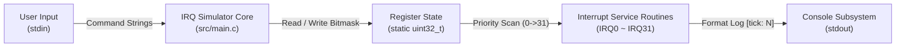
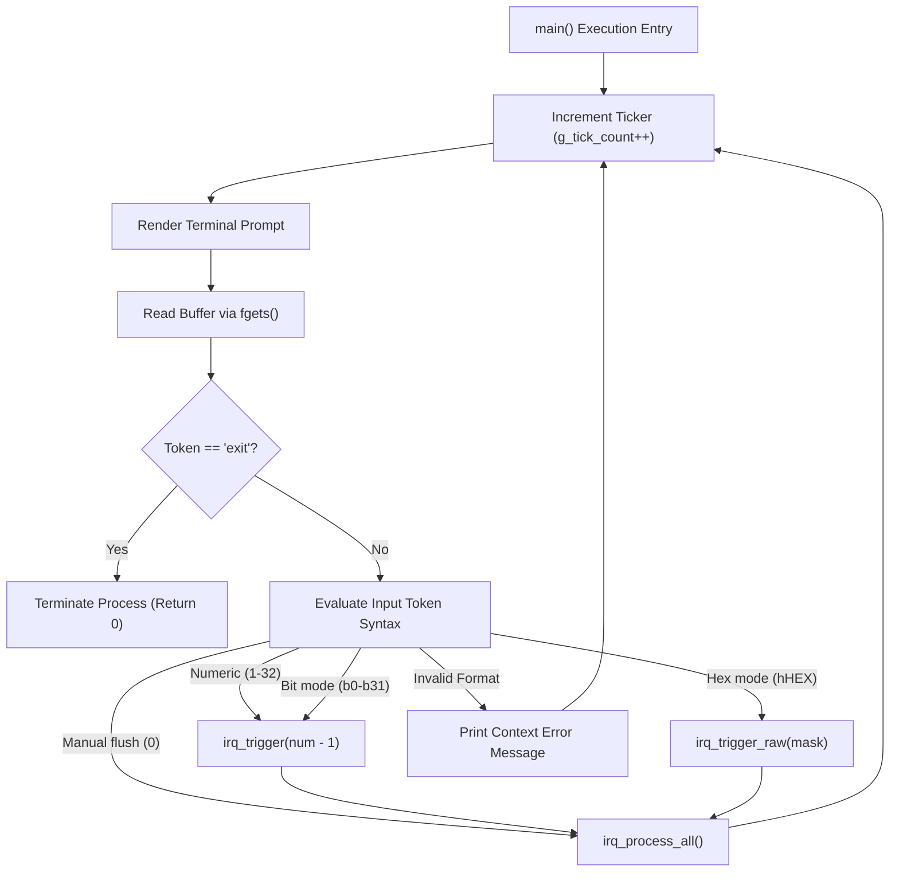

# IRQ Simulator - Software Architecture Specification

## 1. Architecture Overview
This project implements a deterministic, single-threaded **Monolithic Modular Architecture** designed to simulate a 32-channel programmable interrupt controller on a Host PC. The system context isolates hardware-dependent register behavior into an abstract simulation model driven by a sequential main loop execution structure.

### 1.1 System Context Diagram


## 2. Module Boundaries & Responsibility Layering
The software configuration is decomposed into three distinct layers to maintain separation of concerns and Misra C compliance.

| Layer | Component | Source Files | Responsibility Boundaries |
| :--- | :--- | :--- | :--- |
| **Application** | Execution Engine | `src/main.c` | Controls the deterministic main loop, drives input scanning via `fgets`, routes raw tokens, and orchestrates the priority interrupt processing sequence. |
| **Interface** | Hardware Abstraction | `inc/main.h` | Declares public execution endpoints, encapsulates peripheral configuration parameters (`IRQ_COUNT=32`), and implements the `FW_STATIC` linkage abstraction layer. |
| **Startup** | System Vector Table | `src/start.s` | Simulates assembly interrupt vector stubs and low-level exception entry handling routes. |

## 3. Key Data Structures & Peripheral Layout
The simulator maps hardware behaviors directly onto explicitly sized bit fields and global tracking state registers.

### 3.1 `irq_pending` (uint32_t Register Bit Field Configuration)
```
Bit  0  [0x00000001] -> IRQ0  : System Timer Peripheral (Highest Priority)
Bit  1  [0x00000002] -> IRQ1  : UART0 Receive Channel Interrupt
Bit  2  [0x00000004] -> IRQ2  : UART0 Transmit Channel Interrupt
Bit  3  [0x00000008] -> IRQ3  : GPIO Port A Interrupt Route
Bit  4  [0x00000010] -> IRQ4  : GPIO Port B Interrupt Route
Bit  5  [0x00000020] -> IRQ5  : SPI0 Transfer Engine Flag
Bit  6  [0x00000040] -> IRQ6  : I2C0 Transaction Done Flag
Bit  7  [0x00000080] -> IRQ7  : Analog-to-Digital Converter Conversion Flag
Bit  8  [0x00000100] -> IRQ8  : Direct Memory Access (DMA) Channel 0 Flag
Bit  9  [0x00000200] -> IRQ9  : Direct Memory Access (DMA) Channel 1 Flag
Bit 10  [0x00000400] -> IRQ10 : Watchdog Timer Counter Expiry flag
Bit 11  [0x00000800] -> IRQ11 : Real-Time Clock Alarm Routing
Bit 12  [0x00001000] -> IRQ12 : Universal Serial Bus (USB) Module Flag
Bit 13  [0x00002000] -> IRQ13 : Controller Area Network (CAN0) Frame Engine
Bit 14  [0x00004000] -> IRQ14 : Pulse-Width Modulation (PWM) Period Target Flag
Bit 15  [0x00008000] -> IRQ15 : General Purpose Timer 1 Interrupt
Bit 16  [0x00010000] -> IRQ16 : General Purpose Timer 2 Interrupt
Bit 17  [0x00020000] -> IRQ17 : UART1 Receive Channel Interrupt
Bit 18  [0x00040000] -> IRQ18 : UART1 Transmit Channel Interrupt
Bit 19  [0x00080000] -> IRQ19 : SPI1 Transfer Engine Flag
Bit 20  [0x00100000] -> IRQ20 : I2C1 Transaction Done Flag
Bit 21  [0x00200000] -> IRQ21 : External Hardware Interrupt Line 0
Bit 22  [0x00400000] -> IRQ22 : External Hardware Interrupt Line 1
Bit 23  [0x00800000] -> IRQ23 : External Hardware Interrupt Line 2
Bit 24  [0x01000000] -> IRQ24 : Direct Memory Access (DMA) Channel 2 Flag
Bit 25  [0x02000000] -> IRQ25 : Direct Memory Access (DMA) Channel 3 Flag
Bit 26  [0x04000000] -> IRQ26 : Cyclic Redundancy Check (CRC) Compute Engine
Bit 27  [0x08000000] -> IRQ27 : Advanced Encryption Standard (AES) Coprocessor Flag
Bit 28  [0x10000000] -> IRQ28 : Quad Serial Peripheral Interface (QSPI) Status
Bit 29  [0x20000000] -> IRQ29 : Secure Digital Input Output (SDIO) Event Route
Bit 30  [0x40000000] -> IRQ30 : Ethernet Media Access Controller Frame Status
Bit 31  [0x80000000] -> IRQ31 : System Hardware Exception Module (Lowest Priority)
```

### 3.2 System Tracking Counters
* `g_tick_count` (uint32_t): Main execution loop ticker and active counter for IRQ0 handler events.
* `exception_count` (uint32_t): Static error ledger monitoring structural system exception triggers via IRQ31.

## 4. Overall Execution Call Flow


## 5. Architecture Decision Records (ADR)

### ADR-001: Monolithic Modular Design Choice
* **Context**: The application requires low complexity with minimal function footprint to reduce stack footprint.
* **Decision**: Merge peripheral routing workflows directly inside `src/main.c`, maintaining local scope.
* **Consequence**: High internal execution speed, zero runtime structural coupling across multi-file architectures.

### ADR-002: Test Bridge Pattern via `FW_STATIC` Macro
* **Context**: MISRA C:2012 Rule 8.7 mandates symbols must have internal linkage (`static`) if not explicitly exported. However, white-box test modules need binary access to variables.
* **Decision**: Wrap file-scope functions in a custom macro `FW_STATIC`. Define it as `static` in production and empty in test builds (`-DTEST_BUILD`).
* **Consequence**: Enforces production encapsulation compliance while achieving 100% test accessibility.

### ADR-003: Bitmask Register Implementation
* **Context**: Efficiently simulate 32 distinct interrupt state flags with single-cycle evaluation.
* **Decision**: Utilize a single atomic `uint32_t` bitmask variable for tracking system states.
* **Consequence**: Highly optimized bitwise mutations; perfectly matches Host CPU native register architecture.

### ADR-004: Synchronous Sequential Main Loop
* **Context**: Avoid undefined multi-threaded preemption races during functional simulation on Host PC platforms.
* **Decision**: Execute all parser updates, timer flag mutations, and interrupt routing checks via a single-threaded synchronous polling pipeline.
* **Consequence**: Guarantees deterministic, reproducible execution flows across distinct target test systems.

### ADR-005: Switch-Case Dispatch Routine
* **Context**: Map 32 unique peripheral interrupt routing targets with constant execution time performance.
* **Decision**: Deploy a single, consolidated 32-way `switch-case` lookup tree instead of an array of indirect function pointers.
* **Consequence**: Mitigates risk of invalid indirect function pointer jumps, complying with automotive functional safety coding rules.

---

## 6. Traceability Matrix (To SWE.1 Requirements)
| Architecture ID | Document Section | Traced Requirements (SR) |
| :--- | :--- | :--- |
| SA_001 | 1.0 Architecture Overview | SR_001, SR_044, SR_045 |
| SA_002 | 2.0 Layer Boundaries | SR_001, SR_002, SR_003, SR_007 |
| SA_003 | 3.1 Register Bit Field | SR_001, SR_002, SR_003 |
| SA_004 | 3.2 System Tracking Counters | SR_036, SR_037, SR_038, SR_035 |
| SA_005 | 4.0 Execution Call Flow | SR_004, SR_005, SR_006, SR_040, SR_041 |
| SA_006 | 5.0 ADR Ledger | SR_007, SR_008, SR_009, SR_046, SR_047 |
