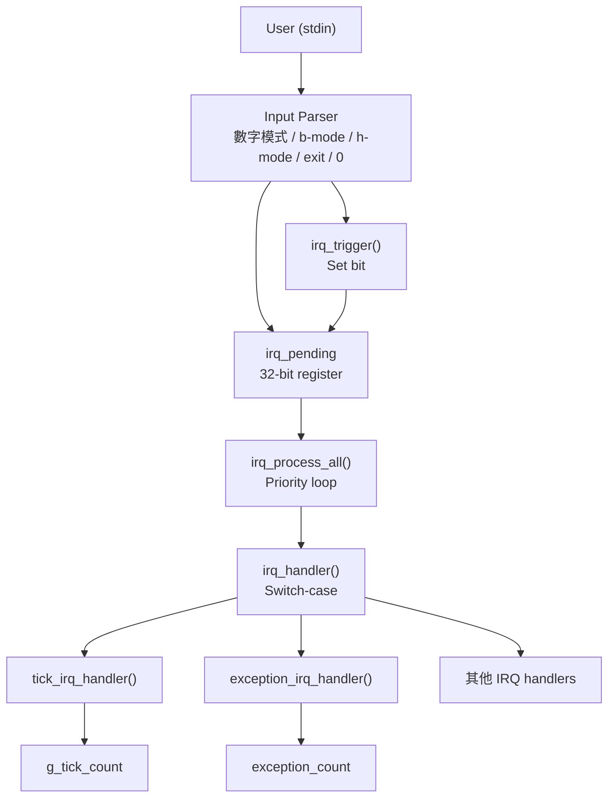
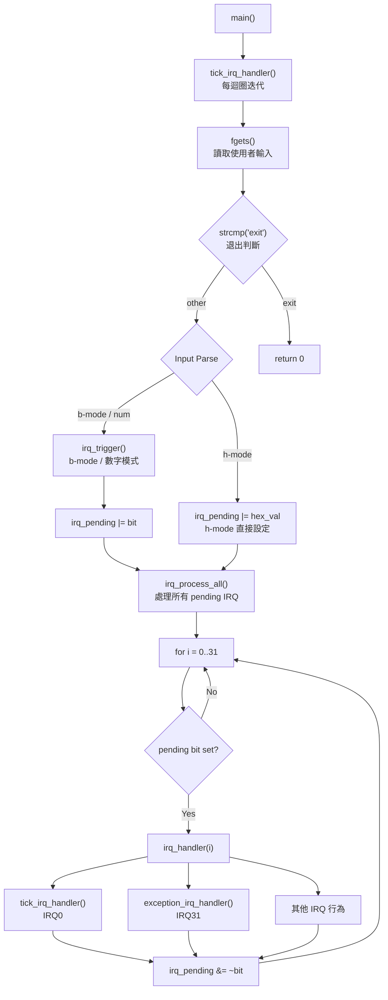
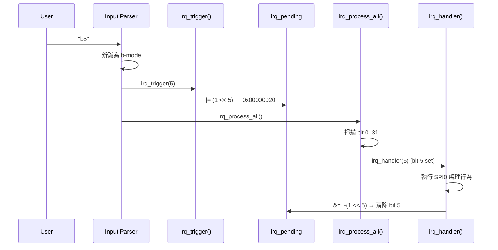
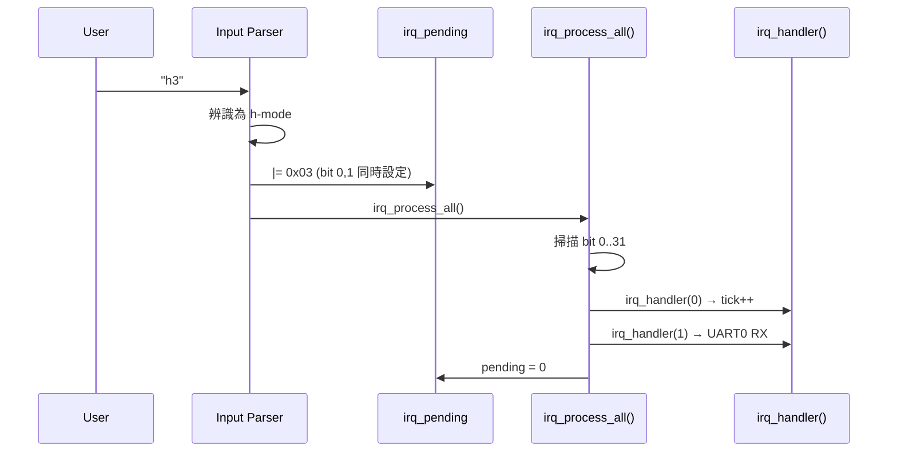
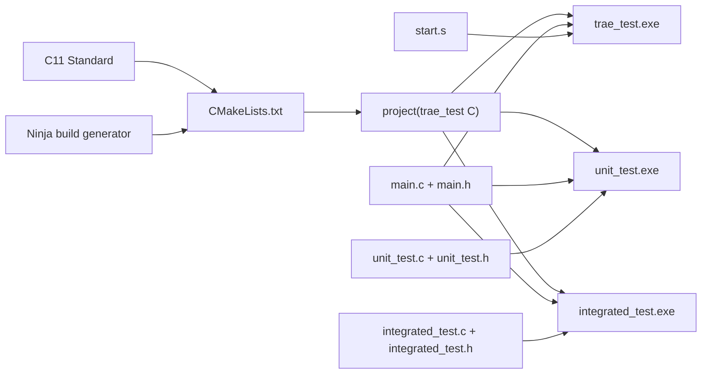
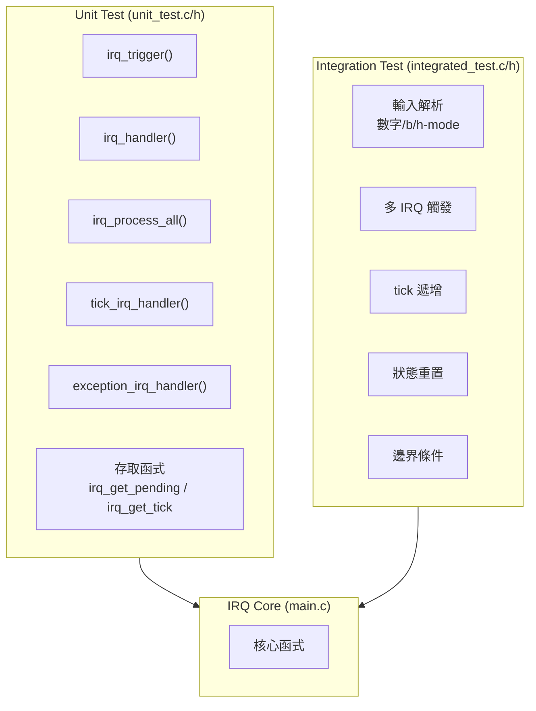

# IRQ Simulator - Software Architecture

## 1. Architecture Overview

本專案採用 **單層模組化架構 (Monolithic Modular Architecture)**，所有核心邏輯集中於 `main.c`，透過 `main.h` 對外暴露介面。



## 2. Module Decomposition

### 2.1 Core Modules

| 模組 | 檔案 | 職責 |
|------|------|------|
| IRQ Core | `main.c` | IRQ 觸發、處理、pending register 管理 |
| IRQ Interface | `main.h` | 函式宣告、常數定義 |
| Startup | `start.s` | 組合語言中斷向量表與處理常式 |

### 2.2 Key Data Structures

```
irq_pending (uint32_t)
  Bit 0  -> IRQ0  (System Timer)
  Bit 1  -> IRQ1  (UART0 RX)
  ...
  Bit 31 -> IRQ31 (Exception)

g_tick_count (unsigned int)
  系統 tick 計數器，每次主迴圈迭代 +1
```

### 2.3 Function Call Graph



## 3. Data Flow

### 3.1 IRQ Trigger Flow (b-mode)



### 3.2 Hex Multi-IRQ Flow



## 4. Build System



## 5. Test Architecture



## 6. 架構需求追溯表

| ID | 章節 | 追溯 SR | 描述 |
|----|------|---------|------|
| SA_001 | 1 | SR_001<br>SR_044<br>SR_045 | 單層模組化架構：所有核心邏輯集中於 `main.c`，透過 `main.h` 對外暴露介面 |
| SA_002 | 2.1 | SR_001<br>SR_002<br>SR_003<br>SR_007<br>SR_008<br>SR_009 | IRQ Core 模組 (`main.c`)：IRQ 觸發、處理、pending register 管理 |
| SA_003 | 2.1 | SR_001<br>SR_044 | IRQ Interface 模組 (`main.h`)：函式宣告、常數定義 (`IRQ_COUNT=32`) |
| SA_004 | 2.1 | SR_010<br>SR_035 | Startup 模組 (`start.s`)：組合語言中斷向量表、tick ISR 與 exception ISR |
| SA_005 | 2.2 | SR_001<br>SR_002<br>SR_003 | `irq_pending` 資料結構：32-bit 暫存器，每個 bit 對應一個 IRQ 通道 |
| SA_006 | 2.2 | SR_036<br>SR_037<br>SR_038 | `g_tick_count` 資料結構：全域 tick 計數器，每次迴圈迭代及 IRQ0 處理時遞增 |
| SA_007 | 2.3 | SR_037<br>SR_040<br>SR_041 | `main()` 進入點：編排主迴圈（tick 遞增 → 讀取輸入 → 解析 → 處理） |
| SA_008 | 2.3 | SR_004<br>SR_005<br>SR_006<br>SR_040<br>SR_041 | 輸入解析器：支援數字模式 (`1-32`)、b 模式 (`bN`)、h 模式 (`hHEX`)、`0`（處理）、`exit` |
| SA_009 | 2.3 | SR_003<br>SR_004<br>SR_005 | `irq_trigger()`：設定指定 IRQ 編號的 pending bit，含範圍檢驗 |
| SA_010 | 2.3 | SR_003<br>SR_006 | `irq_trigger_raw()`：透過原始 hex 遮罩直接設定 pending register（h 模式） |
| SA_011 | 2.3 | SR_007<br>SR_008 | `irq_process_all()`：基於優先權的迴圈 (IRQ0→IRQ31)，處理所有 pending IRQ |
| SA_012 | 2.3 | SR_009<br>SR_010<br>SR_045 | `irq_handler()`：switch-case 分發至 32 個 IRQ 處理行為，清除 pending bit |
| SA_013 | 2.3 | SR_010<br>SR_036<br>SR_038 | `tick_irq_handler()`：遞增 `g_tick_count`，由 IRQ0 及主迴圈呼叫 |
| SA_014 | 2.3 | SR_035 | `exception_irq_handler()`：遞增內部 exception_count，由 IRQ31 呼叫 |
| SA_015 | 3.1 | SR_005<br>SR_003<br>SR_008<br>SR_009 | b 模式 IRQ 觸發流程：解析 → `irq_trigger()` → pending 設定 → `irq_process_all()` → 處理 → 清除 |
| SA_016 | 3.2 | SR_006<br>SR_003<br>SR_008<br>SR_009 | h 模式多 IRQ 流程：解析 → pending 直接設定 → `irq_process_all()` → 處理 → 清除 |
| SA_017 | 4 | SR_046<br>SR_047 | CMake 建置系統 + Ninja 產生器：跨平台編譯管理 |
| SA_018 | 4 | SR_046<br>SR_047 | 三個建置目標：`trae_test`（主程式）、`unit_test`、`integrated_test`，透過 `TEST_BUILD` 巨集區分 |
| SA_019 | 4 | SR_046 | C11 語言標準：不依賴特定平台 API |
| SA_020 | 5 | SR_001<br>SR_002<br>SR_003<br>SR_007<br>SR_008<br>SR_009<br>SR_010<br>SR_036<br>SR_038 | 單元測試模組 (`unit_test.c/h`)：隔離驗證所有核心函式 (UT-01~UT-07) |
| SA_021 | 5 | SR_004<br>SR_005<br>SR_006<br>SR_007<br>SR_008<br>SR_036<br>SR_037<br>SR_038<br>SR_040<br>SR_041 | 整合測試模組 (`integrated_test.c/h`)：驗證端到端流程 (IT-01~IT-07) |
| SA_022 | 5 | SR_036<br>SR_037<br>SR_038 | 測試存取函式：`irq_get_pending()`、`irq_get_tick()`、`irq_reset_all()` |
| SA_023 | 2.3 | SR_039 | `TICK_PRINTF` 巨集：統一 log 輸出格式，所有訊息帶 `[tick: N]` 前綴 |
| SA_024 | 2.3 | SR_009 | Pending bit 清除機制：每個 IRQ 處理後執行 `irq_pending &= ~(1 << irq_num)` |
| SA_025 | 2.3 | SR_042<br>SR_043 | 輸入檢驗與錯誤處理：範圍檢查、無效模式提示、優雅降級 |

### 章節對照表

| 章節 | SA 範圍 | 數量 | 內容 |
|------|---------|------|------|
| 1 | SA_001 | 1 | 架構總覽 |
| 2.1 | SA_002 ~ SA_004 | 3 | 核心模組 |
| 2.2 | SA_005 ~ SA_006 | 2 | 關鍵資料結構 |
| 2.3 | SA_007 ~ SA_014, SA_023 ~ SA_025 | 11 | 函式呼叫圖與機制 |
| 3 | SA_015 ~ SA_016 | 2 | 資料流 |
| 4 | SA_017 ~ SA_019 | 3 | 建置系統 |
| 5 | SA_020 ~ SA_022 | 3 | 測試架構 |

> **縮寫說明：**
>
> - **SA** = Software Architecture（軟體架構，為所有架構設計項的統一編號）
> - **SR** = Software Requirement（軟體需求，追溯至 SWE.1 需求項）