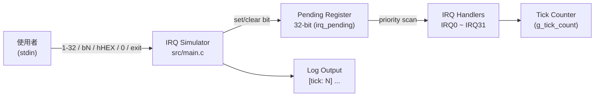
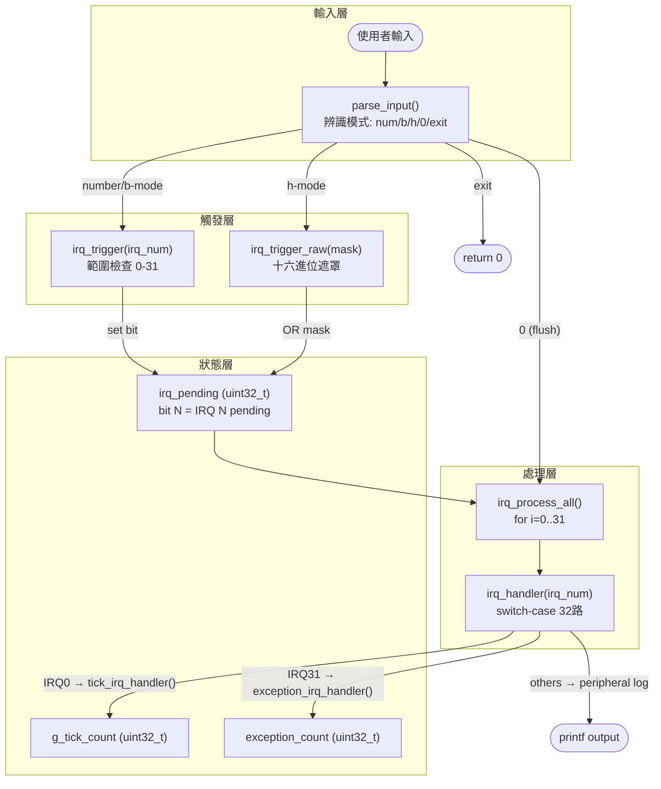
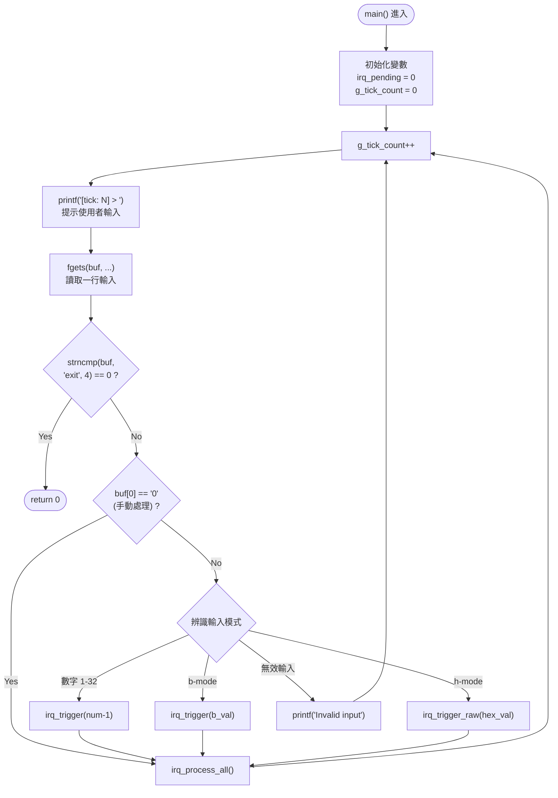
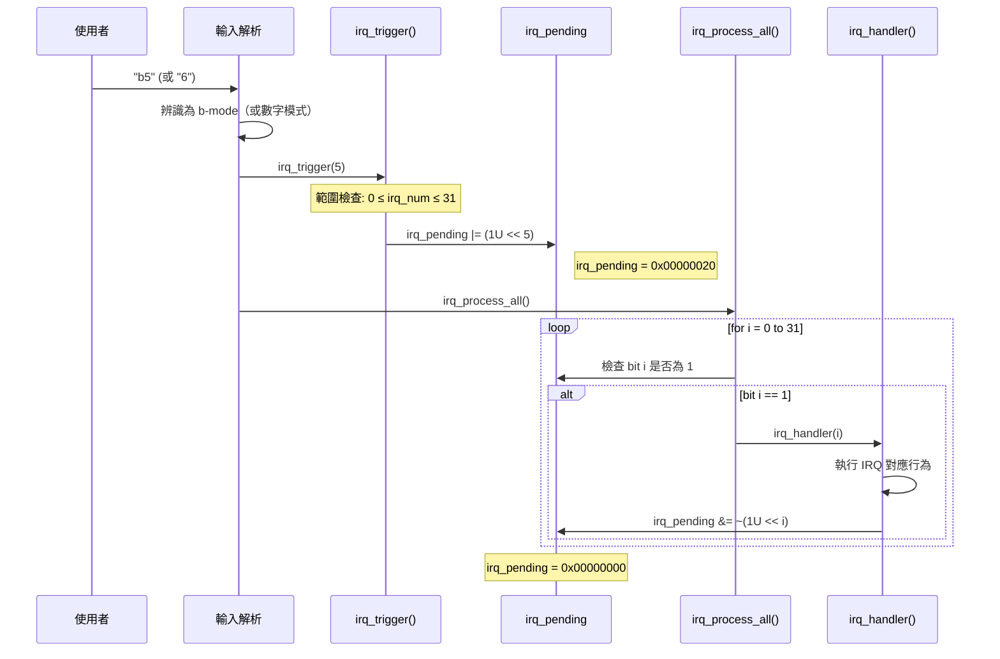
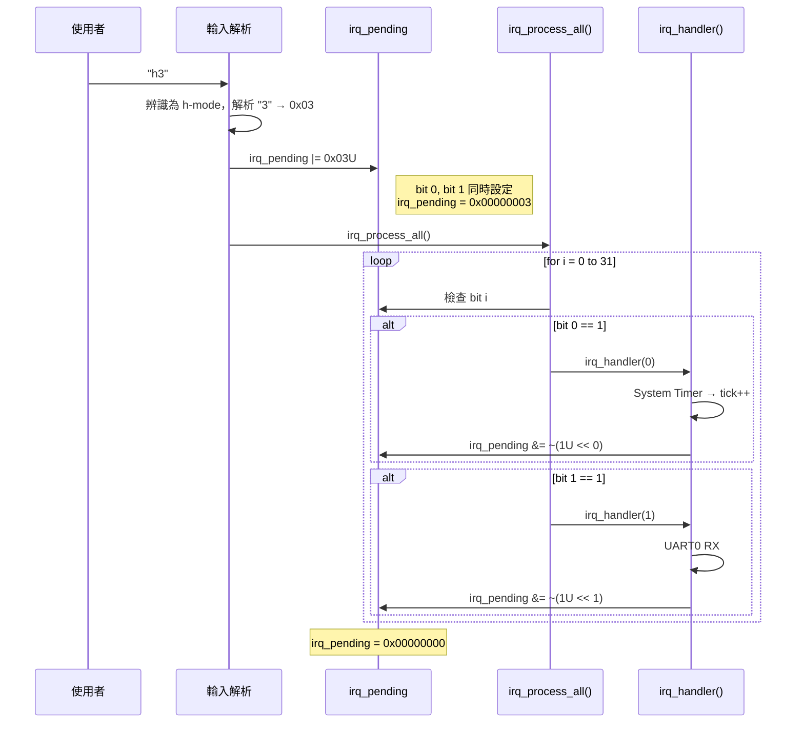
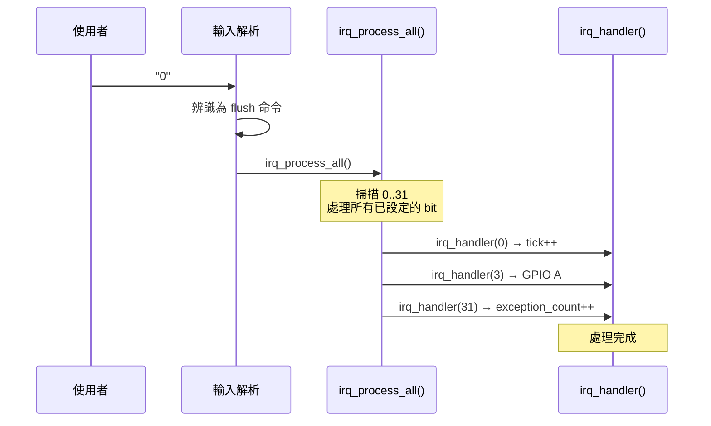
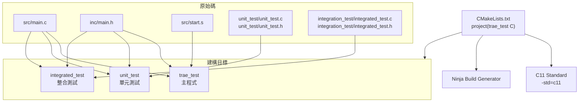
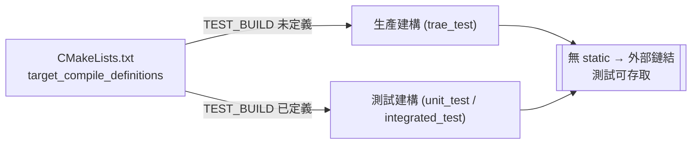
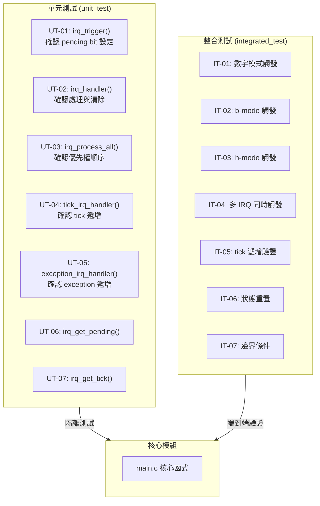

# IRQ Simulator - Software Architecture (Cline)

## 1. Architecture Overview

本專案採用**單層模組化架構 (Monolithic Modular Architecture)**，所有核心邏輯集中於 `src/main.c`，透過 `inc/main.h` 對外公開介面。系統以主迴圈 (main loop) 驅動，依序執行 tick 計數、使用者輸入解析、IRQ 觸發與優先權處理。

### 1.1 系統脈絡圖



### 1.2 模組責任邊界

| 層級 | 元件 | 責任範圍 |
|------|------|----------|
| **應用層** | `src/main.c` | IRQ 觸發、優先權處理、pending register 管理、主迴圈控制 |
| **介面層** | `inc/main.h` | 函式宣告、常數定義、FW_STATIC 測試橋接機制 |
| **啟動層** | `src/start.s` | 組合語言中斷向量表與異常處理程序 |

### 1.3 總體資料流



---

## 2. Decomposition View

### 2.1 核心資料結構

#### `irq_pending` (uint32_t)

32-bit pending register，每個 bit 對應一個 IRQ 通道：

```
Bit    IRQ    Peripheral
─────────────────────────────────
 0     IRQ0   System Timer
 1     IRQ1   UART0 RX
 2     IRQ2   UART0 TX
 3     IRQ3   GPIO Port A
 4     IRQ4   GPIO Port B
 5     IRQ5   SPI0
 6     IRQ6   I2C0
 7     IRQ7   ADC
 8     IRQ8   DMA Ch0
 9     IRQ9   DMA Ch1
10     IRQ10  Watchdog
11     IRQ11  RTC
12     IRQ12  USB
13     IRQ13  CAN0
14     IRQ14  PWM
15     IRQ15  Timer1
16     IRQ16  Timer2
17     IRQ17  UART1 RX
18     IRQ18  UART1 TX
19     IRQ19  SPI1
20     IRQ20  I2C1
21     IRQ21  External INT0
22     IRQ22  External INT1
23     IRQ23  External INT2
24     IRQ24  DMA Ch2
25     IRQ25  DMA Ch3
26     IRQ26  CRC
27     IRQ27  AES
28     IRQ28  QSPI
29     IRQ29  SDIO
30     IRQ30  Ethernet
31     IRQ31  Exception
```

#### `g_tick_count` (uint32_t)

全域 tick 計數器，增量時機：
- 每次主迴圈迭代開始時遞增 **(SR_037)**
- IRQ0 (System Timer) 處理時遞增 **(SR_038)**

#### `exception_count` (uint32_t)

Exception 觸發次數計數器（僅 IRQ31 處理時遞增）

### 2.2 公開 API

| 函式 | 宣告位置 | 鏈結 | 說明 |
|------|----------|------|------|
| `__disable_irq()` | `inc/main.h` | external | 關閉全域中斷（模擬樁，無操作） |
| `__enable_irq()` | `inc/main.h` | external | 開啟全域中斷（模擬樁，無操作） |
| `tick_irq_handler()` | `inc/main.h` | external | Tick ISR：遞增 `g_tick_count` |
| `exception_irq_handler()` | `inc/main.h` | external | Exception ISR：遞增 `exception_count` |
| `irq_trigger(uint32_t)` | `inc/main.h` | external | 設定指定 IRQ 編號的 pending bit |
| `irq_process_all(void)` | `inc/main.h` | external | 依優先權掃描並處理所有 pending IRQ |

### 2.3 測試輔助 API（僅 `TEST_BUILD` 時可見）

| 函式 | 說明 |
|------|------|
| `irq_trigger_raw(uint32_t)` | 透過原始 hex 遮罩設定 pending register |
| `irq_handler(uint32_t)` | 單一 IRQ 處理函式（switch-case） |
| `irq_get_pending(void)` | 讀取當前 pending 值 |
| `irq_get_tick(void)` | 讀取當前 tick 值 |
| `irq_reset_all(void)` | 重置所有 IRQ 狀態 |
| `exception_get_count(void)` | 讀取 exception 計數值 |
| `tick_printf(const char*, ...)` | 帶 tick 前綴的除錯輸出函式 |

---

## 3. Runtime View

### 3.1 主迴圈控制流程



### 3.2 IRQ 觸發流程 — 數字 / b 模式



### 3.3 IRQ 觸發流程 — Hex 模式



### 3.4 輸入「0」手動處理所有 Pending IRQ



---

## 4. Interface View

### 4.1 內部介面

#### 4.1.1 `irq_trigger(irq_num)`

- **用途**：設定指定 IRQ 編號的 pending bit **(SR_003, SR_004, SR_005)**
- **參數**：`irq_num` — 0..31（受範圍檢查保護）
- **行為**：`irq_pending |= (1U << irq_num)`
- **邊界檢查**：若 `irq_num >= IRQ_COUNT (32)`，忽略請求

#### 4.1.2 `irq_trigger_raw(mask)`

- **用途**：透過原始 bitmask 直接設定 pending register **(SR_006)**
- **參數**：`mask` — 32-bit 遮罩值
- **行為**：`irq_pending |= mask`

#### 4.1.3 `irq_process_all()`

- **用途**：依優先權順序處理所有 pending IRQ **(SR_008)**
- **演算法**：
  ```
  for i = 0 to (IRQ_COUNT - 1)
      if (irq_pending & (1U << i))
          irq_handler(i)
  ```
- **優先權規則**：IRQ0 優先權最高 (i=0)，IRQ31 最低 (i=31) **(SR_007)**

#### 4.1.4 `irq_handler(irq_num)`

- **用途**：依照 IRQ 編號分發至對應的外設模擬行為 **(SR_045)**
- **結構**：switch-case，32 個 case
- **清除機制**：執行完對應行為後清除 pending bit **(SR_009)**：
  `irq_pending &= ~(1U << irq_num)`
- **特殊處理**：
  - IRQ0 → `tick_irq_handler()` → `g_tick_count++` **(SR_010)**
  - IRQ31 → `exception_irq_handler()` → `exception_count++` **(SR_035)**
  - 其餘 IRQ1~30 → `printf` 模擬行為記錄 **(SR_011 ~ SR_034)**

#### 4.1.5 輸入解析器 (`main()` 內建邏輯)

| 模式 | 語法 | 解析邏輯 | 呼叫 |
|------|------|----------|------|
| 數字模式 | `1` ~ `32` | `value - 1` → IRQ 編號 | `irq_trigger(value - 1)` |
| b 模式 | `b0` ~ `b31` | 提取 `b` 後數字 → IRQ 編號 | `irq_trigger(b_val)` |
| h 模式 | `h0` ~ `hFFFFFFFF` | 十六進位字串 → mask | `irq_trigger_raw(hex_val)` |
| flush | `0` | 手動處理所有 pending IRQ | `irq_process_all()` |
| exit | `exit` | 終止程式 | `return 0` |

#### 4.1.6 `tick_printf(fmt, ...)`

- **用途**：所有 log 輸出帶 `[tick: N]` 前綴 **(SR_039)**
- **行為**：`printf("[tick: %u] ", g_tick_count)` → `vprintf(fmt, args)`

### 4.2 外部介面

| 介面 | 方向 | 說明 |
|------|------|------|
| stdin | 輸入 | 使用者透過鍵盤輸入命令 |
| stdout | 輸出 | 模擬器輸出 log 與提示 |

---

## 5. 建構視圖 (Build View)

### 5.1 建構系統架構



### 5.2 條件編譯機制 — `TEST_BUILD`



### 5.3 建構目標對應需求

| 目標 | 檔案 | 對應需求 |
|------|------|----------|
| `trae_test` | `src/main.c`, `inc/main.h`, `src/start.s` | SR_001~SR_047 |
| `unit_test` | `src/main.c`, `inc/main.h`, `unit_test/unit_test.c` | SR_001~SR_010, SR_036~SR_039 |
| `integrated_test` | `src/main.c`, `inc/main.h`, `integration_test/integrated_test.c` | SR_004~SR_009, SR_036~SR_041 |

---

## 6. 測試視圖 (Test View)

### 6.1 測試層級架構



### 6.2 測試案例對應需求

| 測試 ID | 測試類型 | 測試目標 | 驗證需求 |
|---------|----------|----------|----------|
| UT-01 | 單元 | `irq_trigger()` 設定正確的 pending bit | SR_001, SR_002, SR_003 |
| UT-02 | 單元 | `irq_handler()` 執行行為並清除 bit | SR_009, SR_045 |
| UT-03 | 單元 | `irq_process_all()` 依優先權順序處理 | SR_007, SR_008 |
| UT-04 | 單元 | `tick_irq_handler()` 遞增計數器 | SR_010, SR_036, SR_038 |
| UT-05 | 單元 | `exception_irq_handler()` 遞增計數器 | SR_035 |
| UT-06 | 單元 | 測試存取函式 `irq_get_pending()` | — |
| UT-07 | 單元 | 測試存取函式 `irq_get_tick()` | SR_036 |
| IT-01 | 整合 | 數字模式 (`<1-32>`) 觸發正確 IRQ | SR_004 |
| IT-02 | 整合 | b-mode (`bN`) 觸發正確 IRQ | SR_005 |
| IT-03 | 整合 | h-mode (`hHEX`) 設定 pending register | SR_006 |
| IT-04 | 整合 | 多 IRQ 依優先權順序處理 | SR_007, SR_008 |
| IT-05 | 整合 | 主迴圈 tick 遞增行為 | SR_037 |
| IT-06 | 整合 | `irq_reset_all()` 狀態重置 | — |
| IT-07 | 整合 | 邊界條件 (IRQ0、IRQ31、無效輸入) | SR_042, SR_043 |

---

## 7. Architecture Requirements Traceability

### 7.1 架構項目追溯表

| ID | 章節 | 追溯 SR | 描述 |
|----|------|---------|------|
| SA_C_001 | 1 | SR_001, SR_044, SR_045 | 單層模組化架構：核心邏輯集中於 `src/main.c`，透過 `inc/main.h` 對外公開介面 |
| SA_C_002 | 2.1 | SR_001, SR_002 | `irq_pending` 32-bit 暫存器，每個 bit 對應一個 IRQ 通道 |
| SA_C_003 | 2.1 | SR_036, SR_037, SR_038 | `g_tick_count` 全域 tick 計數器 |
| SA_C_004 | 2.2 | SR_001, SR_044 | 公開 API 宣告於 `inc/main.h`，`IRQ_COUNT` 定義為 32 |
| SA_C_005 | 2.3 | SR_044 | 測試輔助 API 透過 `FW_STATIC` / `TEST_BUILD` 機制僅在測試建構中可見 |
| SA_C_006 | 3.1 | SR_037, SR_040, SR_041 | `main()` 主迴圈：tick 遞增 → 讀取輸入 → 解析 → 處理 IRQ |
| SA_C_007 | 3.1 | SR_039 | `tick_printf()` 確保所有 log 輸出帶 `[tick: N]` 前綴 |
| SA_C_008 | 3.2 | SR_003, SR_004, SR_005 | `irq_trigger()`：數字與 b-mode 設定 pending bit，含範圍檢查 |
| SA_C_009 | 3.3 | SR_003, SR_006 | `irq_trigger_raw()`：h-mode 透過 hex 遮罩直接設定 pending register |
| SA_C_010 | 3.4 | SR_040 | 輸入 `0`：觸發 `irq_process_all()` 手動處理所有 pending IRQ |
| SA_C_011 | 4.1.3 | SR_007, SR_008 | `irq_process_all()`：IRQ0→IRQ31 依次掃描，高優先權先處理 |
| SA_C_012 | 4.1.4 | SR_009, SR_045 | `irq_handler()`：switch-case 分發，執行完畢後清除 pending bit |
| SA_C_013 | 4.1.4 | SR_010, SR_036, SR_038 | IRQ0 呼叫 `tick_irq_handler()` 遞增 `g_tick_count` |
| SA_C_014 | 4.1.4 | SR_035 | IRQ31 呼叫 `exception_irq_handler()` 遞增 `exception_count` |
| SA_C_015 | 4.1.4 | SR_011~SR_034 | IRQ1~30 各自輸出對應外設的模擬行為訊息 |
| SA_C_016 | 4.1.5 | SR_004, SR_005 | 輸入解析器支援數字模式 (`1-32`) 與 b 模式 (`b0-b31`) |
| SA_C_017 | 4.1.5 | SR_006 | 輸入解析器支援 h 模式 (`h0-hFFFFFFFF`) |
| SA_C_018 | 4.1.5 | SR_041 | 輸入解析器支援 `exit` 命令 |
| SA_C_019 | 4.1.5 | SR_042, SR_043 | 無效輸入顯示錯誤訊息並重新提示 |
| SA_C_020 | 5 | SR_046, SR_047 | CMake + Ninja 建構系統，C11 標準，不依賴平台特定 API |
| SA_C_021 | 5 | SR_046, SR_047 | 三個建構目標：`trae_test` (主程式)、`unit_test`、`integrated_test` |
| SA_C_022 | 6 | SR_001~SR_010 | 單元測試隔離驗證所有核心函式 |
| SA_C_023 | 6 | SR_004~SR_009, SR_036~SR_041 | 整合測試驗證端到端流程 |

### 7.2 需求涵蓋率統計

| 需求分類 | SR 範圍 | 總數 | SA_C 追溯數 | 涵蓋率 |
|----------|---------|------|-------------|--------|
| FR-01 (IRQ 觸發機制) | SR_001~SR_003 | 3 | 3 (SA_C_001, SA_C_002, SA_C_008) | 100% |
| FR-02 (輸入模式) | SR_004~SR_006 | 3 | 3 (SA_C_008, SA_C_009, SA_C_016, SA_C_017) | 100% |
| FR-03 (優先權處理) | SR_007~SR_009 | 3 | 3 (SA_C_011, SA_C_012) | 100% |
| FR-04 (IRQ 行為) | SR_010~SR_035 | 26 | 26 (SA_C_013, SA_C_014, SA_C_015) | 100% |
| FR-05 (Tick 計數器) | SR_036~SR_039 | 4 | 4 (SA_C_003, SA_C_006, SA_C_007, SA_C_013) | 100% |
| FR-06 (程式控制) | SR_040~SR_041 | 2 | 2 (SA_C_006, SA_C_010, SA_C_018) | 100% |
| NFR-01 (易用性) | SR_042~SR_043 | 2 | 2 (SA_C_019) | 100% |
| NFR-02 (可維護性) | SR_044~SR_045 | 2 | 2 (SA_C_001, SA_C_005, SA_C_012) | 100% |
| NFR-03 (可移植性) | SR_046~SR_047 | 2 | 2 (SA_C_020, SA_C_021) | 100% |
| **總計** | SR_001~SR_047 | **47** | **47** | **100%** |

---

## 8. Architectural Decisions & Rationale

### ADR-001: Monolithic Modular Architecture

- **決策**：採用單層模組化架構而非分層架構
- **理由**：專案規模小 (單一 .c 檔 + .h 檔)，無需分層架構的複雜度
- **後果**：核心邏輯集中在 `main.c`，易於維護但難以獨立替換子模組

### ADR-002: FW_STATIC Test Bridge Pattern

- **決策**：透過 `FW_STATIC` 巨集與 `TEST_BUILD` 條件編譯控制函式鏈結性
- **理由**：生產建構中 `static` 確保 MISRA R8.7 合規（無未使用的外部符號）；測試建構中移除 `static` 使單元測試可存取內部函式
- **後果**：測試程式碼可直接呼叫 `irq_handler()` 等內部函式進行隔離測試

### ADR-003: Bitmask Pending Register

- **決策**：使用單一 `uint32_t` 作為所有 IRQ 的 pending register
- **理由**：最多 32 個 IRQ 通道，32-bit 暫存器可完美對應；bit 操作效率高
- **替代方案**：使用陣列或鏈結串列 — 實作複雜度高，不必要

### ADR-004: Main-loop Driven (No RTOS)

- **決策**：使用單純的 `while(1)` 主迴圈驅動，不使用即時作業系統
- **理由**：模擬器環境無需即時性要求；簡化實作與除錯
- **後果**：無法模擬真正的 nested interrupt 或 preemption

### ADR-005: Switch-case Handler Dispatch

- **決策**：`irq_handler()` 使用單一 switch-case 處理 32 種 IRQ
- **理由**：需求明確要求 32 個固定行為；switch-case 可讀性高且易於擴充
- **替代方案**：函式指標陣列 — 更靈活但增加了間接呼叫的複雜度

---

> **縮寫說明：**
>
> - **FR** = Functional Requirement（功能需求）
> - **NFR** = Non-Functional Requirement（非功能需求）
> - **SR** = Software Requirement（軟體需求，為 FR 與 NFR 的統一編號）
> - **SA_C** = Software Architecture (Cline)（軟體架構項目，本文件專屬編號）
> - **ADR** = Architecture Decision Record（架構決策記錄）