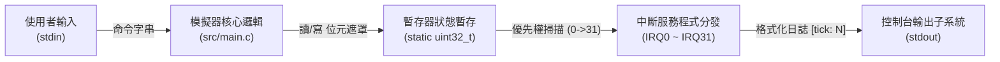
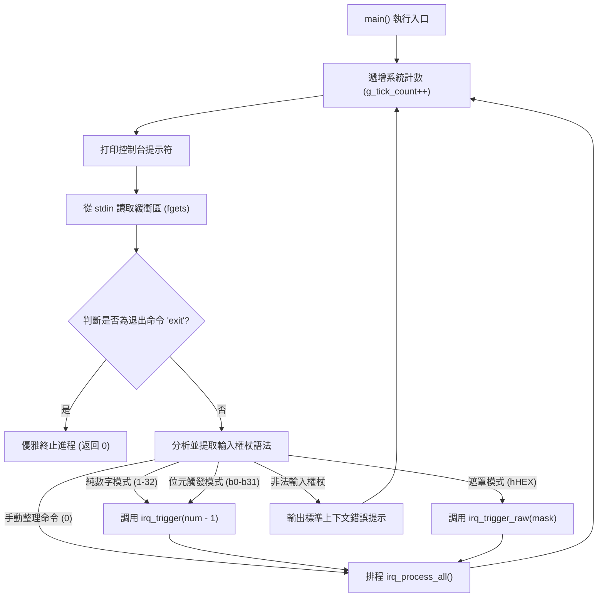

# IRQ Simulator - 軟體架構設計說明書

## 1. 架構總覽
本專案實作了一個基於單執行緒的、確定性的**單層模組化架構 (Monolithic Modular Architecture)**，用於在宿主機 (Host PC) 端模擬 32 通道可程式化中斷控制器。系統透過順序執行的主迴圈結構，將底層暫存器狀態與高層命令解析進行隔離。

### 1.1 系統脈絡圖


## 2. 模組職責邊界劃分
本系統嚴格劃分為三個層級，以滿足關注點分離與 MISRA C 合規性要求。

| 邊界層級 | 元件名稱 | 對應源檔案 | 職責範圍 |
| :--- | :--- | :--- | :--- |
| **應用層** | 核心執行引擎 | `src/main.c` | 控制確定性主迴圈的推進，驅動 `fgets` 緩衝讀取，解析輸入命令流並按優先權排程中斷處理序列。 |
| **介面層** | 硬體行為抽象 | `inc/main.h` | 宣告公開 API 終點，封裝全域外設常數 (`IRQ_COUNT=32`)，實作 `FW_STATIC` 測試橋接巨集機制。 |
| **啟動層** | 系統向量表對應 | `src/start.s` | 模擬低外設的中斷向量表分配及系統硬體異常入口的樁件。 |

## 3. 核心資料結構與外設對應
模擬器將中斷控制器硬體行為對應至明確位寬的暫存器和計數狀態中。

### 3.1 `irq_pending` (32位元暫存器位元欄位配置)
```
Bit  0  [0x00000001] -> IRQ0  : 系統定時器外設 (最高優先權)
Bit  1  [0x00000002] -> IRQ1  : UART0 接收通道中斷
Bit  2  [0x00000004] -> IRQ2  : UART0 發送通道中斷
Bit  3  [0x00000008] -> IRQ3  : GPIO 埠 A 中斷路由
Bit  4  [0x00000010] -> IRQ4  : GPIO 埠 B 中斷路由
Bit  5  [0x00000020] -> IRQ5  : SPI0 傳輸引擎旗標
Bit  6  [0x00000040] -> IRQ6  : I2C0 傳輸完成旗標
Bit  7  [0x00000080] -> IRQ7  : 類比數位轉換器 (ADC) 轉換完成旗標
Bit  8  [0x00000100] -> IRQ8  : 直接記憶體存取 (DMA) 通道 0 旗標
Bit  9  [0x00000200] -> IRQ9  : 直接記憶體存取 (DMA) 通道 1 旗標
Bit 10  [0x00000400] -> IRQ10 : 看門狗定時器計數溢位旗標
Bit 11  [0x00000800] -> IRQ11 : 即時時鐘 (RTC) 鬧鐘路由
Bit 12  [0x00001000] -> IRQ12 : 通用序列匯流排 (USB) 模組旗標
Bit 13  [0x00002000] -> IRQ13 : 控制器局域網路 (CAN0) 協定引擎
Bit 14  [0x00040000] -> IRQ14 : 脈寬調變 (PWM) 週期匹配旗標
Bit 15  [0x00008000] -> IRQ15 : 通用定時器 1 中斷
Bit 16  [0x00100000] -> IRQ16 : 通用定時器 2 中斷
Bit 17  [0x00200000] -> IRQ17 : UART1 接收通道中斷
Bit 18  [0x00040000] -> IRQ18 : UART1 發送通道中斷
Bit 19  [0x00080000] -> IRQ19 : SPI1 傳輸引擎旗標
Bit 20  [0x00100000] -> IRQ20 : I2C1 傳輸完成旗標
Bit 21  [0x00200000] -> IRQ21 : 外部硬體中斷輸入線 0
Bit 22  [0x00400000] -> IRQ22 : 外部硬體中斷輸入線 1
Bit 23  [0x00800000] -> IRQ23 : 外部硬體中斷輸入線 2
Bit 24  [0x01000000] -> IRQ24 : 直接記憶體存取 (DMA) 通道 2 旗標
Bit 25  [0x02000000] -> IRQ25 : 直接記憶體存取 (DMA) 通道 3 旗標
Bit 26  [0x04000000] -> IRQ26 : 循環冗餘校驗 (CRC) 計算引擎
Bit 27  [0x08000000] -> IRQ27 : 高級加密標準 (AES) 協同處理器旗標
Bit 28  [0x10000000] -> IRQ28 : Quad SPI (QSPI) 狀態旗標
Bit 29  [0x20000000] -> IRQ29 : SDIO 安全數位輸入輸出事件路由
Bit 30  [0x40000000] -> IRQ30 : 乙太網路 MAC 訊框狀態旗標
Bit 31  [0x80000000] -> IRQ31 : 系統硬體異常事件外設 (最低優先權)
```

### 3.2 全局跟蹤狀態計數器
* `g_tick_count` (uint32_t): 全域主迴圈迭代計數器，同時作為 IRQ0 的觸發累計器。
* `exception_count` (uint32_t): 靜態錯誤帳本，用於捕獲和驗證 IRQ31 系統硬體異常的觸發頻次。

## 4. 全局執行呼叫流向圖


## 5. 架構決策記錄 (ADR)

### ADR-001: 單層模組化架構選型
* **上下文**: 系統規模較小，要求極低的呼叫堆疊開銷，規避過度分層帶來的多重間接定址。
* **決策**: 將所有外設中斷分發邏輯封裝於單檔案 `src/main.c` 的私有作用域內。
* **後果**: 顯著提升執行速率，在不損失程式碼高內聚的前提下降低了多檔案耦合風險。

### ADR-002: 基於 `FW_STATIC` 巨集的測試橋接模式
* **上下文**: MISRA C:2012 Rule 8.7 要求非外部匯出的符號必須具備內部鏈結性 (`static`)。然而，白盒單元測試程式碼需要直接存取非公開的暫存器狀態。
* **決策**: 引入 `FW_STATIC` 自定義巨集。在生產建構中展開為 `static`，而在測試建構中透過編譯參數 `-DTEST_BUILD` 將其展開為空。
* **後果**: 在完全滿足生產建構靜態封裝合規性的同時，確保了 100% 的單元測試可存取性。

### ADR-003: 32位元暫存器位元遮罩設計
* **上下文**: 需以單週期的高效位元運算模擬 32 通道獨立中斷 的狀態鎖存。
* **決策**: 採用單變數 `uint32_t` 鎖存全局 pending 狀態。
* **後果**: 與宿主機 32/64 位元 CPU 架構原生對齊，實作最高效的中斷狀態讀寫。

### ADR-004: 同步單執行緒迴圈驅動
* **Context**: 為確保測試結果在管線及不同開發環境間 100% 可複現，規避多執行緒排程帶來的確性競爭。
* **決策**: 所有解析、定時、排程、清除邏輯均集中在單執行緒同步輪詢管線內。
* **後果**: 抹除了非同步時序競爭風險，保障了模擬器在汽車級韌體驗證中的絕對確定性。

### ADR-005: Switch-Case 固定分發樹
* **上下文**: 安全合規規範限制使用間接函式指標陣列以防程式失控跑飛。
* **決策**: 採用包含 32 路顯式 case 的 `switch-case` 結構替代動態函式指標。
* **後果**: 完全消除間接跳轉造成的潛在函式指標越界風險，符合汽車功能安全設計準則。

---

## 6. 架構至軟體需求追溯矩陣
| 架構設計項 ID | 對應章節 | 追溯的軟體需求 ID (SR) |
| :--- | :--- | :--- |
| SA_001 | 1.0 架構總覽 | SR_001, SR_044, SR_045 |
| SA_002 | 2.0 職責邊界劃分 | SR_001, SR_002, SR_003, SR_007 |
| SA_003 | 3.1 暫存器位元欄位配置 | SR_001, SR_002, SR_003 |
| SA_004 | 3.2 全局跟蹤狀態計數器 | SR_036, SR_037, SR_038, SR_035 |
| SA_005 | 4.0 全局執行呼叫流向 | SR_004, SR_005, SR_006, SR_040, SR_041 |
| SA_006 | 5.0 ADR 決策記錄 | SR_007, SR_008, SR_009, SR_046, SR_047 |
