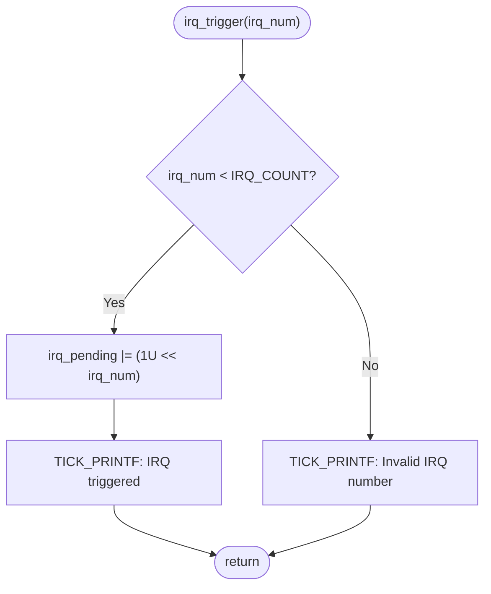
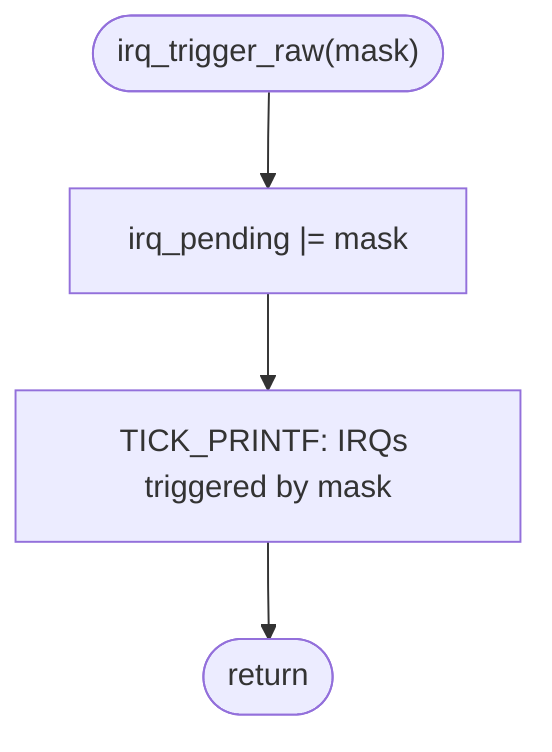
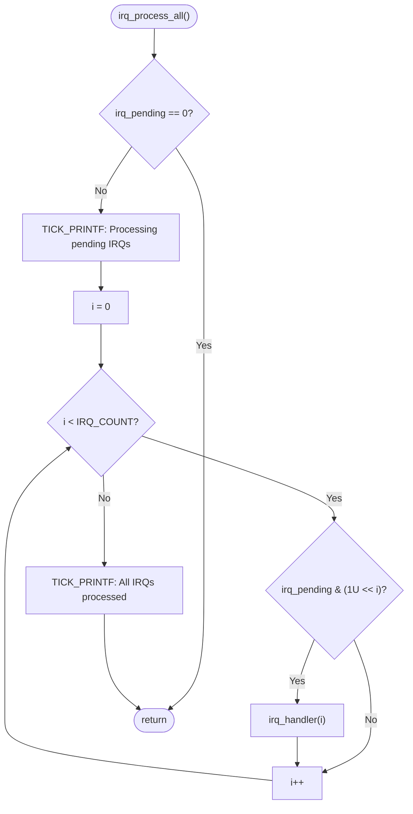
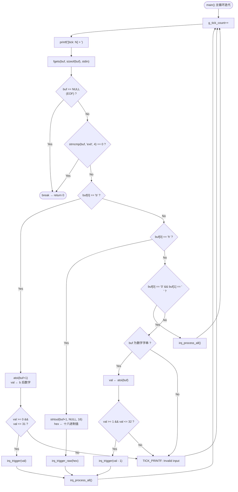
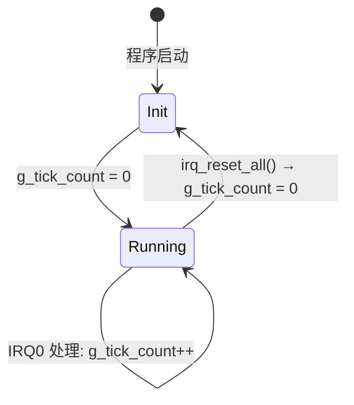
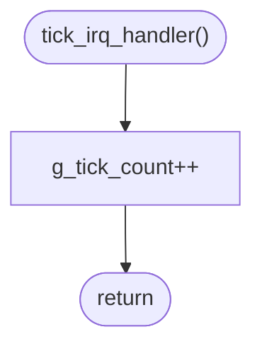
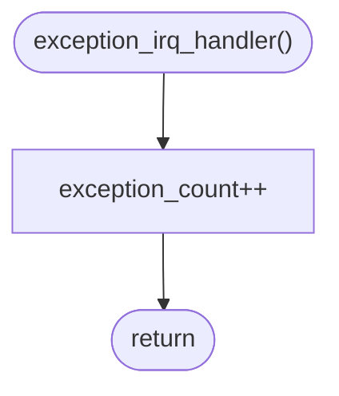

# IRQ Simulator - Software Detailed Design (Cline)

## 1. Design Overview

本文档描述 IRQ 模拟器的详细设计，包含接口定义、数据结构、算法与关键设计决策。本文档追溯至软件架构文档中的 SA_C 项及软件需求规格中的 SR 项。

## 2. Interface Design

### 2.1 Public API (`inc/main.h`)

```c
#define IRQ_COUNT  32U

/* --- 全局中断控制（模拟桩） --- */
void __disable_irq(void);               /* 关闭全局中断（无操作） */
void __enable_irq(void);                /* 开启全局中断（无操作） */

/* --- ISR 处理函数 --- */
void tick_irq_handler(void);            /* Tick 中断处理：递增 g_tick_count */
void exception_irq_handler(void);       /* 异常中断处理：递增 exception_count */

/* --- IRQ 触发 --- */
void irq_trigger(uint32_t irq_num);     /* 触发指定 IRQ（含范围检查） */

/* --- IRQ 处理 --- */
void irq_process_all(void);             /* 依优先级处理所有 pending IRQ */

/* --- 测试存取函数（TEST_BUILD 时可见） --- */
void        irq_trigger_raw(uint32_t mask);  /* 以 raw mask 触发多个 IRQ */
void        irq_handler(uint32_t irq_num);  /* 处理指定 IRQ（switch-case） */
uint32_t    irq_get_pending(void);           /* 读取 pending register */
uint32_t    irq_get_tick(void);              /* 读取 tick 计数 */
void        irq_reset_all(void);             /* 重置所有状态 */
uint32_t    exception_get_count(void);       /* 读取 exception 计数 */
```

- 生产构建 (`trae_test`)：`irq_trigger_raw()`, `irq_handler()`, `irq_get_pending()`, `irq_get_tick()`, `irq_reset_all()`, `exception_get_count()` 具有 `static` 内部链接 **(MISRA R8.7 合规)**
- 测试构建 (`unit_test`, `integrated_test`)：上述函数通过 `FW_STATIC` 宏的外部链接以进行隔离测试

### 2.2 Internal State

```c
/* --- 文件级内部状态（static 隐藏实现细节） --- */
static uint32_t irq_pending = 0U;       /* 32-bit pending register */
static uint32_t g_tick_count = 0U;      /* 全局 tick 计数器 */
static uint32_t exception_count = 0U;   /* Exception 触发计数 */
```

### 2.3 Logging Macro

```c
#define TICK_PRINTF(fmt, ...) \
    printf("[tick: %05u] " fmt, g_tick_count, ##__VA_ARGS__)
```

- **用途**：所有 log 输出统一带 `[tick: N]` 前缀 **(SR_039)**
- **说明**：`##__VA_ARGS__` 为 GNU 扩展，支持零参数调用（如 `TICK_PRINTF("Hello")`）
- **替代方案**：包装函数 — 宏在编译期展开，零调用开销

### 2.4 FW_STATIC 机制

```c
#ifdef TEST_BUILD
#define FW_STATIC
#else
#define FW_STATIC static
#endif
```

- **生产构建**：`FW_STATIC` 展开为 `static`，函数具有内部链接
- **测试构建**：`FW_STATIC` 展开为空，函数具有外部链接，测试代码可直接调用

---

## 3. Algorithm Design

### 3.1 IRQ Trigger Algorithm — `irq_trigger(irq_num)`

```
用途: 设置指定 IRQ 编号的 pending bit
追溯: SA_C_008 | SR_003, SR_004, SR_005, SR_042
参数: irq_num — 0..31
行为: irq_pending |= (1U << irq_num)
边界: irq_num >= IRQ_COUNT (32) 时忽略请求，输出错误消息
```



### 3.2 IRQ Trigger Raw Algorithm — `irq_trigger_raw(mask)`

```
用途: 通过原始 bitmask 直接设置 pending register
追溯: SA_C_009 | SR_003, SR_006
参数: mask — 32-bit 掩码值
行为: irq_pending |= mask
```



### 3.3 IRQ Process-All Algorithm — `irq_process_all()`

```
用途: 依优先级顺序处理所有 pending IRQ
追溯: SA_C_011 | SR_007, SR_008
算法:
  for i = 0 to (IRQ_COUNT - 1)
      if (irq_pending & (1U << i))
          irq_handler(i)
优先级: IRQ0 最高 (i=0), IRQ31 最低 (i=31)
```



### 3.4 IRQ Handler Dispatch Algorithm — `irq_handler(irq_num)`

```
用途: 依照 IRQ 编号分发至对应的外设模拟行为
追溯: SA_C_012, SA_C_013, SA_C_014, SA_C_015 | SR_009, SR_010~SR_035, SR_045
清除: irq_pending &= ~(1U << irq_num)
```



```mermaid
flowchart TD
    START(["irq_handler(irq_num)"])
    LOG["TICK_PRINTF: Handling IRQ<num>"]
    SWITCH{"irq_num?"}
    
    CASE0["tick_irq_handler()"]
    CASE1["TICK_PRINTF: UART0 RX"]
    CASE2["TICK_PRINTF: UART0 TX"]
    CASE3["TICK_PRINTF: GPIO Port A"]
    CASE4["TICK_PRINTF: GPIO Port B"]
    CASE5["TICK_PRINTF: SPI0"]
    CASE6["TICK_PRINTF: I2C0"]
    CASE7["TICK_PRINTF: ADC"]
    CASE8["TICK_PRINTF: DMA Ch0"]
    CASE9["TICK_PRINTF: DMA Ch1"]
    CASE10["TICK_PRINTF: Watchdog"]
    CASE11["TICK_PRINTF: RTC"]
    CASE12["TICK_PRINTF: USB"]
    CASE13["TICK_PRINTF: CAN0"]
    CASE14["TICK_PRINTF: PWM"]
    CASE15["TICK_PRINTF: Timer1"]
    CASE16["TICK_PRINTF: Timer2"]
    CASE17["TICK_PRINTF: UART1 RX"]
    CASE18["TICK_PRINTF: UART1 TX"]
    CASE19["TICK_PRINTF: SPI1"]
    CASE20["TICK_PRINTF: I2C1"]
    CASE21["TICK_PRINTF: External INT0"]
    CASE22["TICK_PRINTF: External INT1"]
    CASE23["TICK_PRINTF: External INT2"]
    CASE24["TICK_PRINTF: DMA Ch2"]
    CASE25["TICK_PRINTF: DMA Ch3"]
    CASE26["TICK_PRINTF: CRC"]
    CASE27["TICK_PRINTF: AES"]
    CASE28["TICK_PRINTF: QSPI"]
    CASE29["TICK_PRINTF: SDIO"]
    CASE30["TICK_PRINTF: Ethernet"]
    CASE31["exception_irq_handler()"]
    
    CLEAR["irq_pending &= ~(1U << irq_num)"]
    END_(["return"])

    START --> LOG
    LOG --> SWITCH
    SWITCH -->|"0"| CASE0
    SWITCH -->|"1..30"| CASES["各 IRQ 对应分支"]
    SWITCH -->|"31"| CASE31
    
    CASE0 --> CLEAR
    CASES --> CLEAR
    CASE31 --> CLEAR
    CLEAR --> END_
```

#### IRQ Handler 行为对照表

| IRQ | 模拟外设 | 行为 | SA_C | SR |
|-----|---------|------|------|----|
| IRQ0 | System Timer | `tick_irq_handler()` → `g_tick_count++` | SA_C_013 | SR_010, SR_036, SR_038 |
| IRQ1 | UART0 RX | `TICK_PRINTF("UART0 RX: data received")` | SA_C_015 | SR_011 |
| IRQ2 | UART0 TX | `TICK_PRINTF("UART0 TX: data transmitted")` | SA_C_015 | SR_012 |
| IRQ3 | GPIO Port A | `TICK_PRINTF("GPIO Port A: pin state changed")` | SA_C_015 | SR_013 |
| IRQ4 | GPIO Port B | `TICK_PRINTF("GPIO Port B: pin state changed")` | SA_C_015 | SR_014 |
| IRQ5 | SPI0 | `TICK_PRINTF("SPI0: transfer complete")` | SA_C_015 | SR_015 |
| IRQ6 | I2C0 | `TICK_PRINTF("I2C0: transaction complete")` | SA_C_015 | SR_016 |
| IRQ7 | ADC | `TICK_PRINTF("ADC: conversion complete")` | SA_C_015 | SR_017 |
| IRQ8~9 | DMA Ch0~1 | `TICK_PRINTF("DMA Ch<n>: transfer complete")` | SA_C_015 | SR_018 |
| IRQ10 | Watchdog | `TICK_PRINTF("Watchdog: timer expired")` | SA_C_015 | SR_019 |
| IRQ11 | RTC | `TICK_PRINTF("RTC: alarm triggered")` | SA_C_015 | SR_020 |
| IRQ12 | USB | `TICK_PRINTF("USB: device event")` | SA_C_015 | SR_021 |
| IRQ13 | CAN0 | `TICK_PRINTF("CAN0: message received")` | SA_C_015 | SR_022 |
| IRQ14 | PWM | `TICK_PRINTF("PWM: period elapsed")` | SA_C_015 | SR_023 |
| IRQ15~16 | Timer1~2 | `TICK_PRINTF("Timer<n>: compare match/overflow")` | SA_C_015 | SR_024 |
| IRQ17~18 | UART1 RX/TX | 数据传输模拟 | SA_C_015 | SR_025 |
| IRQ19 | SPI1 | `TICK_PRINTF("SPI1: transfer complete")` | SA_C_015 | SR_026 |
| IRQ20 | I2C1 | `TICK_PRINTF("I2C1: transaction complete")` | SA_C_015 | SR_027 |
| IRQ21~23 | External INT0~2 | `TICK_PRINTF("External INT<n>: interrupt")` | SA_C_015 | SR_028 |
| IRQ24~25 | DMA Ch2~3 | `TICK_PRINTF("DMA Ch<n>: transfer complete")` | SA_C_015 | SR_029 |
| IRQ26 | CRC | `TICK_PRINTF("CRC: calculation complete")` | SA_C_015 | SR_030 |
| IRQ27 | AES | `TICK_PRINTF("AES: encryption complete")` | SA_C_015 | SR_031 |
| IRQ28 | QSPI | `TICK_PRINTF("QSPI: command complete")` | SA_C_015 | SR_032 |
| IRQ29 | SDIO | `TICK_PRINTF("SDIO: card event")` | SA_C_015 | SR_033 |
| IRQ30 | Ethernet | `TICK_PRINTF("Ethernet: packet received")` | SA_C_015 | SR_034 |
| IRQ31 | Exception | `exception_irq_handler()` → `exception_count++` | SA_C_014 | SR_035 |

### 3.5 Input Parsing Algorithm

```
用途: 解析用户输入并触发对应 IRQ 行为
追溯: SA_C_006, SA_C_016, SA_C_017, SA_C_018, SA_C_019
      | SR_004, SR_005, SR_006, SR_037, SR_040, SR_041, SR_042, SR_043
```



---

## 4. Data Structure Design

### 4.1 IRQ Pending Register — `irq_pending`

```
类型: uint32_t
作用域: static（文件级）
初始值: 0U
描述: 32-bit pending register，每个 bit 对应一个 IRQ 通道
追溯: SA_C_002 | SR_001, SR_002, SR_003
```


```txt
Bit 0  = IRQ0  (System Timer)      — 最高优先级
Bit 31 = IRQ31 (Exception)         — 最低优先级
```

### 4.2 Global Tick Counter — `g_tick_count`

```
类型: uint32_t
作用域: static（文件级）
初始值: 0U
增量时机:
  - 每次主循环迭代开始时: g_tick_count++
  - IRQ0 (System Timer) 处理时: tick_irq_handler() → g_tick_count++
追溯: SA_C_003 | SR_036, SR_037, SR_038
```



### 4.3 Exception Count — `exception_count`

```
类型: uint32_t
作用域: static（文件级）
初始值: 0U
增量时机: IRQ31 处理时: exception_irq_handler() → exception_count++
追溯: SA_C_014 | SR_035
```

---

## 5. Error Handling Design

| 场景 | 处理方式 | 追溯 |
|------|---------|------|
| IRQ 编号超出范围 (≥32) | 输出 `"[tick: N] Invalid IRQ number"`，不修改 pending register | SR_042, SR_043 |
| b-mode 参数无效（无数字或超出 0-31） | 输出 `"[tick: N] Invalid bit mode"` | SR_042, SR_043 |
| h-mode 参数无效（非十六进制） | 输出 `"[tick: N] Invalid hex mode"` | SR_042, SR_043 |
| 纯数字超出 1-32 | 输出 `"[tick: N] Invalid IRQ number (use 1-32)"` | SR_042, SR_043 |
| 无法解析的输入 | 输出 `"[tick: N] Invalid input"` | SR_042, SR_043 |
| stdin EOF (Ctrl+Z/Win, Ctrl+D/Linux) | 正常退出循环，`return 0` | — |

---

## 6. Tick Handler Design

### 6.1 `tick_irq_handler()`

```
用途: 递增全局 tick 计数器
追溯: SA_C_013 | SR_010, SR_036, SR_038
行为: g_tick_count++
调用者:
  - IRQ0 处理路径: irq_handler(0) → tick_irq_handler()
  - 主循环迭代: main() 中每次循环开始时调用
```



### 6.2 `exception_irq_handler()`

```
用途: 递增 exception 触发计数
追溯: SA_C_014 | SR_035
行为: exception_count++
调用者: irq_handler(31) → exception_irq_handler()
```



---

## 7. Design Decisions

### DD-01: 为何使用 static 文件级变量而非全局变量？

| 项目 | 说明 |
|------|------|
| **决策** | `irq_pending`, `g_tick_count`, `exception_count` 声明为 `static` 文件级变量 |
| **追溯** | SA_C_001, SA_C_004 | SR_044 |
| **理由** | 限制变量可见范围，避免外部模块意外修改 |
| **替代方案** | 全局变量 — 任何模块都可直接修改，违反封装原则 |
| **测试策略** | 通过 `FW_STATIC` 宏在测试构建中移除 `static`，测试代码可通过 `irq_get_pending()`、`irq_get_tick()` 等存取函数受控访问 |

### DD-02: 为何使用 `TICK_PRINTF` 宏而非包装函数？

| 项目 | 说明 |
|------|------|
| **决策** | 使用 `#define TICK_PRINTF(fmt, ...)` 宏 |
| **追溯** | SA_C_007 | SR_039 |
| **理由** | 宏在编译期展开，零函数调用开销；`##__VA_ARGS__` 支持零参数情况 |
| **替代方案** | `void tick_printf(const char *fmt, ...)` 包装函数 — 增加函数调用开销 |
| **注意** | `##__VA_ARGS__` 为 GNU 扩展，若需严格 C11 兼容可用 `TICK_PRINTF(fmt, ...)` 要求至少一个可变参数 |

### DD-03: 为何 IRQ 处理后立即清除 pending bit 而非批量清除？

| 项目 | 说明 |
|------|------|
| **决策** | `irq_pending &= ~(1U << irq_num)` 在每个 IRQ 处理后立即执行 |
| **追溯** | SA_C_012 | SR_009 |
| **理由** | 模拟真实硬件 ISR 行为：中断服务程序执行后清除中断标志；防止同一 IRQ 被重复处理 |
| **替代方案** | 批量清除 — 所有 IRQ 处理完毕后一次清除 — 可能在高优先权 IRQ 重新触发的场景下丢失中断 |

### DD-04: 为何 h-mode 使用 `|=` 而非 `=`？

| 项目 | 说明 |
|------|------|
| **决策** | `irq_trigger_raw()` 使用 `irq_pending |= mask` |
| **追溯** | SA_C_009 | SR_003, SR_006 |
| **理由** | 允许累积触发：先触发一些 IRQ（如数字或 b 模式），再用 h-mode 追加；更贴近真实中断控制器的 OR 行为 |
| **替代方案** | `=` 赋值 — 会覆盖之前触发的 IRQ，不符合用户预期 |
| **用例** | 用户先输入 `b5` (触发 IRQ5)，再输入 `h3` (追加 IRQ0, IRQ1) — 最终 pending 包含 IRQ0, IRQ1, IRQ5 |

### DD-05: 为何使用 `uint32_t` 而非 `unsigned int`？

| 项目 | 说明 |
|------|------|
| **决策** | 内部状态统一使用 `uint32_t`（来自 `<stdint.h>`）|
| **追溯** | SA_C_002, SA_C_003 | SR_046 |
| **理由** | MISRA C 要求使用明确宽度的整数类型；`stdint.h` 为 C99/C11 标准，不依赖平台实现 |
| **替代方案** | `unsigned int` — 在不同平台上位宽可能不同（16-bit 或 32-bit） |

---

## 8. 详细设计追溯表

### 8.1 设计项追溯表

| ID | 章节 | 追溯 SA_C | 追溯 SR | 描述 |
|----|------|-----------|---------|------|
| SD_C_001 | 2.1 | SA_C_004 | SR_001, SR_044 | Public API (`inc/main.h`)：6 个外部函数 + 7 个测试辅助函数 + `IRQ_COUNT` 常量 |
| SD_C_002 | 2.2 | SA_C_002, SA_C_003 | SR_001, SR_002, SR_003, SR_036, SR_037, SR_038 | 内部状态：`irq_pending` (static uint32_t)、`g_tick_count` (static uint32_t)、`exception_count` (static uint32_t) |
| SD_C_003 | 2.3 | SA_C_007 | SR_039 | `TICK_PRINTF` 宏：带 `[tick: N]` 前缀的统一日志输出 |
| SD_C_004 | 2.4 | SA_C_001, SA_C_005 | SR_044 | `FW_STATIC` 机制：生产构建 `static` (MISRA R8.7)，测试构建外部链接 |
| SD_C_005 | 3.1 | SA_C_008 | SR_003, SR_004, SR_005, SR_042 | `irq_trigger()` 算法：范围检查 → 位设置 (`1U << irq_num`) → 日志 |
| SD_C_006 | 3.2 | SA_C_009 | SR_003, SR_006 | `irq_trigger_raw()` 算法：直接 OR 设置 pending register |
| SD_C_007 | 3.3 | SA_C_011 | SR_007, SR_008 | `irq_process_all()` 算法：空检查 → 优先级循环 (IRQ0→IRQ31) |
| SD_C_008 | 3.4 | SA_C_012, SA_C_013, SA_C_014, SA_C_015 | SR_009, SR_010~SR_035, SR_045 | `irq_handler()` 分发：switch-case 32 路 → 清除 pending bit |
| SD_C_009 | 3.5 | SA_C_006, SA_C_016, SA_C_017, SA_C_018, SA_C_019 | SR_004, SR_005, SR_006, SR_037, SR_040, SR_041, SR_042, SR_043 | 输入解析算法：tick 递增 → 读取 stdin → 模式解析 → 触发 → 处理 |
| SD_C_010 | 4.1 | SA_C_002 | SR_001, SR_002, SR_003 | IRQ Pending Register 布局：32-bit，Bit 0=IRQ0（最高优先级）至 Bit 31=IRQ31（最低优先级） |
| SD_C_011 | 4.2 | SA_C_003 | SR_036, SR_037, SR_038 | Tick 计数器生命周期：Init (0) → Running (循环/IRQ0 递增) → Reset |
| SD_C_012 | 4.3 | SA_C_014 | SR_035 | Exception 计数：仅 IRQ31 处理时递增 |
| SD_C_013 | 5 | SA_C_019 | SR_042, SR_043 | 错误处理：6 种场景（范围越界、无效 b/h 模式、无效数字、无法解析、EOF） |
| SD_C_014 | 6.1 | SA_C_013 | SR_010, SR_036, SR_038 | `tick_irq_handler()`：递增 `g_tick_count` |
| SD_C_015 | 6.2 | SA_C_014 | SR_035 | `exception_irq_handler()`：递增 `exception_count` |
| SD_C_016 | 7 | SA_C_001, SA_C_004 | SR_044 | DD-01：static 文件级变量封装 |
| SD_C_017 | 7 | SA_C_007 | SR_039 | DD-02：TICK_PRINTF 宏选择 |
| SD_C_018 | 7 | SA_C_012 | SR_009 | DD-03：立即清除 pending bit |
| SD_C_019 | 7 | SA_C_009 | SR_003, SR_006 | DD-04：h-mode 使用 `|=` 累积触发 |
| SD_C_020 | 7 | SA_C_002, SA_C_003 | SR_046 | DD-05：使用 `uint32_t` 确保跨平台一致性 |

### 8.2 章节对照表

| 章节 | SD_C 范围 | 数量 | 内容 |
|------|----------|------|------|
| 2 | SD_C_001 ~ SD_C_004 | 4 | 接口设计 |
| 3 | SD_C_005 ~ SD_C_009 | 5 | 算法设计 |
| 4 | SD_C_010 ~ SD_C_012 | 3 | 数据结构设计 |
| 5 | SD_C_013 | 1 | 错误处理设计 |
| 6 | SD_C_014 ~ SD_C_015 | 2 | Tick Handler 设计 |
| 7 | SD_C_016 ~ SD_C_020 | 5 | 设计决策 |

### 8.3 追溯覆盖率

| 架构项 (SA_C) | SA_C 总数 | 追溯数 | 覆盖率 |
|--------------|----------|--------|--------|
| SA_C_001 ~ SA_C_023 | 23 | 20 | 87%* |

| 需求分类 | SR 范围 | 总数 | 追溯数 | 覆盖率 |
|----------|---------|------|--------|--------|
| FR-01 (IRQ 触发机制) | SR_001~SR_003 | 3 | 3 | 100% |
| FR-02 (输入模式) | SR_004~SR_006 | 3 | 3 | 100% |
| FR-03 (优先级处理) | SR_007~SR_009 | 3 | 3 | 100% |
| FR-04 (IRQ 行为) | SR_010~SR_035 | 26 | 26 | 100% |
| FR-05 (Tick 计数器) | SR_036~SR_039 | 4 | 4 | 100% |
| FR-06 (程序控制) | SR_040~SR_041 | 2 | 2 | 100% |
| NFR-01 (易用性) | SR_042~SR_043 | 2 | 2 | 100% |
| NFR-02 (可维护性) | SR_044~SR_045 | 2 | 2 | 100% |
| NFR-03 (可移植性) | SR_046~SR_047 | 2 | 2 | 100% |
| **总计** | SR_001~SR_047 | **47** | **47** | **100%** |

> \* 设计文档未覆盖的架构项（SA_C_006, SA_C_010, SA_C_020~SA_C_023）属于架构层级概念或已在其他设计文档中覆盖
>
> **缩写说明：**
>
> - **SD_C** = Software Detailed Design (Cline)（软件详细设计项，本文档专属编号）
> - **SA_C** = Software Architecture (Cline)（软件架构项，追溯至 SWE.2 架构项）
> - **SR** = Software Requirement（软件需求，追溯至 SWE.1 需求项）