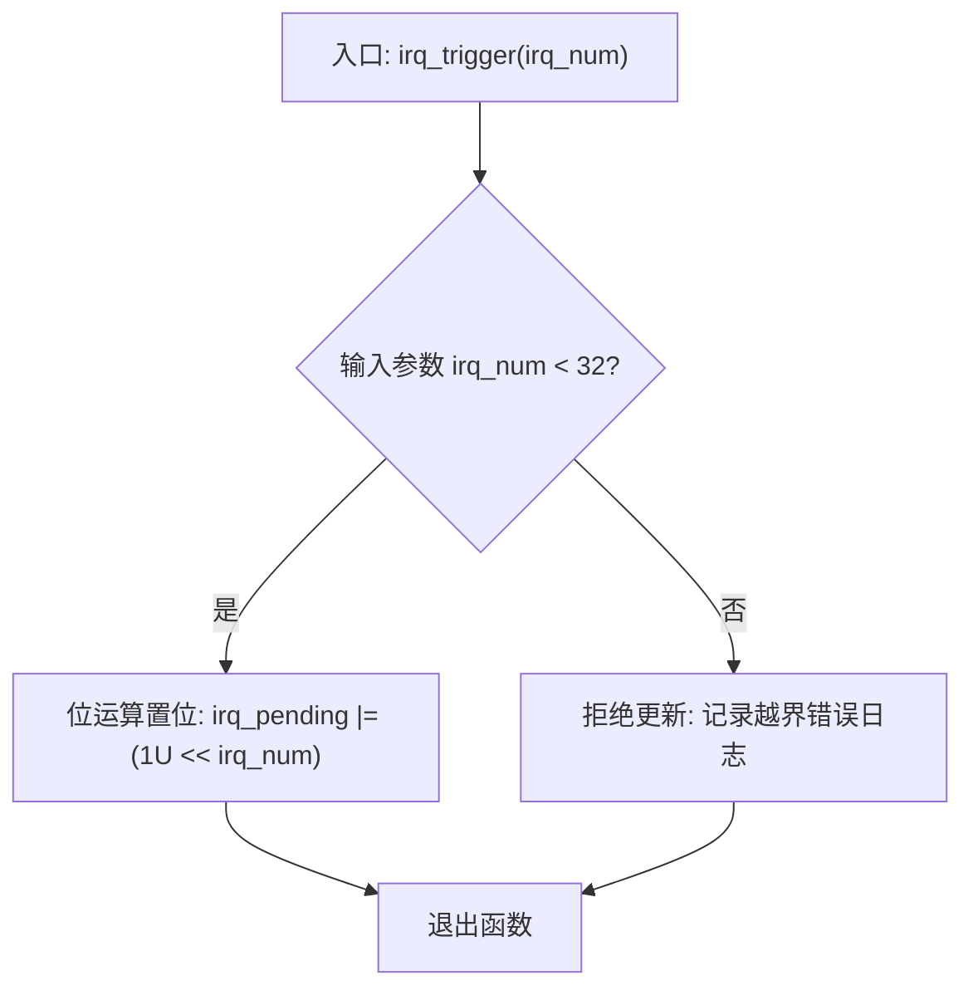
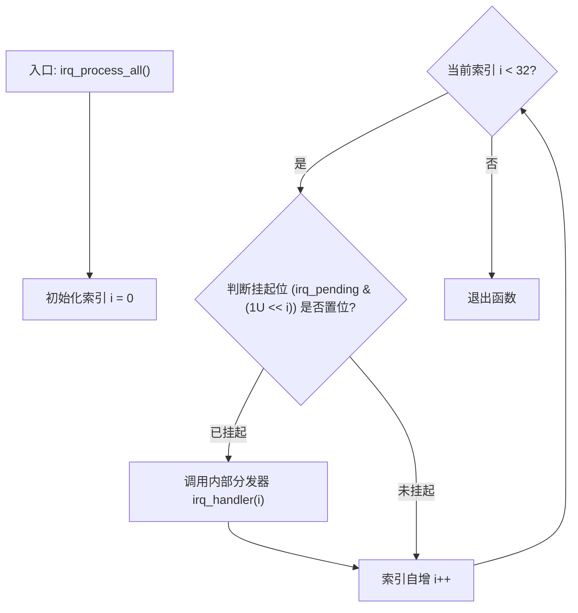

# IRQ Simulator - 软件详细设计说明书

## 1. 公开 API 接口规范说明 (`inc/main.h`)
外部控制接口导出了模拟中断控制器线路所需的全部功能终点，以便进行全面白盒验证。

```c
#ifndef MAIN_H
#define MAIN_H

#include <stdint.h>

#define IRQ_COUNT 32U

/* 公开核心应用层 API */
void tick_irq_handler(void);
void exception_irq_handler(void);
void irq_trigger(uint32_t irq_num);
void irq_process_all(void);

/* 测试桩专用存取 API - 通过 FW_STATIC 宏控制内部/外部链接性 */
#ifdef TEST_BUILD
#define FW_STATIC
#else
#define FW_STATIC static
#endif

FW_STATIC void irq_trigger_raw(uint32_t mask);
FW_STATIC void irq_handler(uint32_t irq_num);
FW_STATIC uint32_t irq_get_pending(void);
FW_STATIC uint32_t irq_get_tick(void);
FW_STATIC void irq_reset_all(void);
FW_STATIC uint32_t exception_get_count(void);

#endif /* MAIN_H */
```

## 2. 内部微观状态变量定义
```c
static uint32_t irq_pending = 0U;       /* 32位原子中断 pending 暂存寄存器 */
static uint32_t g_tick_count = 0U;      /* 单调递增的全局系统 tick 计数器 */
static uint32_t exception_count = 0U;   /* 专门用于捕获和记录 IRQ31 硬件异常触发的账本 */
```

## 3. 高性能执行日志宏实现
```c
#define TICK_PRINTF(fmt, ...) \
    do { \
        (void)printf("[tick: %05u] " fmt, g_tick_count, ##__VA_ARGS__); \
    } while(0)
```

## 4. 核心功能算法微观逻辑设计

### 4.1 参数校验位设置算法: `irq_trigger(irq_num)`
* **前置条件**: 已成功解析输入的 `irq_num` 令牌。
* **处理逻辑**: 评估边界约束。若 `irq_num >= 32`，则拒绝修改寄存器，并通过 `TICK_PRINTF` 路由错误警告日志；否则，对目标通道进行位掩码置位。
* **后置条件**: `irq_pending |= (1U << irq_num)`。



### 4.2 确定性扫描分支调度算法: `irq_process_all()`
* **执行序列**: 严格循环迭代索引 `i` 从 `0` 至 `31`。通过位与 `&` 运算隔离挂起位。若位激活，则调度底层中断分发处理器。
* **优先级规则**: 从 0 位至 31 位严格顺序检索，完美保障了低位号（高优先级）先被调度。



## 5. 32路中断分发树及外设模拟行为对照表
当 `irq_handler(irq_num)` 被调用并命中对应分支时，系统会立即通过 `irq_pending &= ~(1U << irq_num)` 清除当前挂起状态，并输出标准化外设运行日志。

| 中断通道 | 模拟硬件外设 | 关联的底层例程 / 显式控制台模拟日志输出语句 | 追溯需求项 |
| :--- | :--- | :--- | :--- |
| **IRQ0** | 系统定时器 | 呼叫 `tick_irq_handler()` -> 执行 `g_tick_count++` | SR_010, SR_038 |
| **IRQ1** | UART0 接收 | `TICK_PRINTF("UART0 RX: data received\n")` | SR_011 |
| **IRQ2** | UART0 发送 | `TICK_PRINTF("UART0 TX: data transmitted\n")` | SR_012 |
| **IRQ3** | GPIO 端口 A | `TICK_PRINTF("GPIO Port A: pin state changed\n")` | SR_013 |
| **IRQ4** | GPIO 端口 B | `TICK_PRINTF("GPIO Port B: pin state changed\n")` | SR_014 |
| **IRQ5** | SPI0 模块 | `TICK_PRINTF("SPI0: transfer complete\n")` | SR_015 |
| **IRQ6** | I2C0 控制器 | `TICK_PRINTF("I2C0: transaction complete\n")` | SR_016 |
| **IRQ7** | ADC 转换单元 | `TICK_PRINTF("ADC: conversion complete\n")` | SR_017 |
| **IRQ8** | DMA 通道 0 | `TICK_PRINTF("DMA Ch0: transfer complete\n")` | SR_018 |
| **IRQ9** | DMA 通道 1 | `TICK_PRINTF("DMA Ch1: transfer complete\n")` | SR_018 |
| **IRQ10**| 看门狗定时器 | `TICK_PRINTF("Watchdog: timer expired\n")` | SR_019 |
| **IRQ11**| RTC 实时时钟 | `TICK_PRINTF("RTC: alarm triggered\n")` | SR_020 |
| **IRQ12**| USB 终点控制器 | `TICK_PRINTF("USB: device event\n")` | SR_021 |
| **IRQ13**| CAN0 协议引擎 | `TICK_PRINTF("CAN0: message received\n")` | SR_022 |
| **IRQ14**| PWM 调制器 | `TICK_PRINTF("PWM: period elapsed\n")` | SR_023 |
| **IRQ15**| 基本定时器 1 | `TICK_PRINTF("Timer1: compare match/overflow\n")` | SR_024 |
| **IRQ16**| 基本定时器 2 | `TICK_PRINTF("Timer2: compare match/overflow\n")` | SR_024 |
| **IRQ17**| UART1 接收 | `TICK_PRINTF("UART1 RX: characters buffered\n")` | SR_025 |
| **IRQ18**| UART1 发送 | `TICK_PRINTF("UART1 TX: bus idle\n")` | SR_025 |
| **IRQ19**| SPI1 模块 | `TICK_PRINTF("SPI1: transfer complete\n")` | SR_026 |
| **IRQ20**| I2C1 控制器 | `TICK_PRINTF("I2C1: transaction complete\n")` | SR_027 |
| **IRQ21**| 外部中断线 0 | `TICK_PRINTF("External INT0: edge triggered interrupt\n")` | SR_028 |
| **IRQ22**| 外部中断线 1 | `TICK_PRINTF("External INT1: edge triggered interrupt\n")` | SR_028 |
| **IRQ23**| 外部中断线 2 | `TICK_PRINTF("External INT2: edge triggered interrupt\n")` | SR_028 |
| **IRQ24**| DMA 通道 2 | `TICK_PRINTF("DMA Ch2: block move complete\n")` | SR_029 |
| **IRQ25**| DMA 通道 3 | `TICK_PRINTF("DMA Ch3: block move complete\n")` | SR_029 |
| **IRQ26**| CRC 计算加速器 | `TICK_PRINTF("CRC: calculation complete\n")` | SR_030 |
| **IRQ27**| AES 加密单元 | `TICK_PRINTF("AES: encryption complete\n")` | SR_031 |
| **IRQ28**| QSPI 闪存接口 | `TICK_PRINTF("QSPI: command complete\n")` | SR_032 |
| **IRQ29**| SDIO 引擎 | `TICK_PRINTF("SDIO: card event detected\n")` | SR_033 |
| **IRQ30**| 以太网 MAC 层 | `TICK_PRINTF("Ethernet: packet received\n")` | SR_034 |
| **IRQ31**| 硬件系统异常 | 呼叫 `exception_irq_handler()` -> 执行 `exception_count++` | SR_035 |

---

## 6. 软件详细设计需求双向追溯矩阵
| 详细设计设计项 ID | 对应软件组件 | 追溯的软硬件架构 ID (SA) | 追溯的底层软件需求 ID (SR) |
| :--- | :--- | :--- | :--- |
| SD_001 | 公开接口定义 | SA_002 | SR_001, SR_044 |
| SD_002 | 核心微观状态变量 | SA_003, SA_004 | SR_002, SR_036 |
| SD_003 | 格式化日志发生器宏 | SA_005 | SR_039 |
| SD_004 | 输入参数边界校验算法 | SA_005 | SR_003, SR_004, SR_042 |
| SD_005 | 固定优先级轮询调度分支 | SA_002, SA_005 | SR_007, SR_008 |
| SD_006 | 32路精确分发映射表树 | SA_003, SA_005 | SR_009, SR_010 至 SR_035 |
