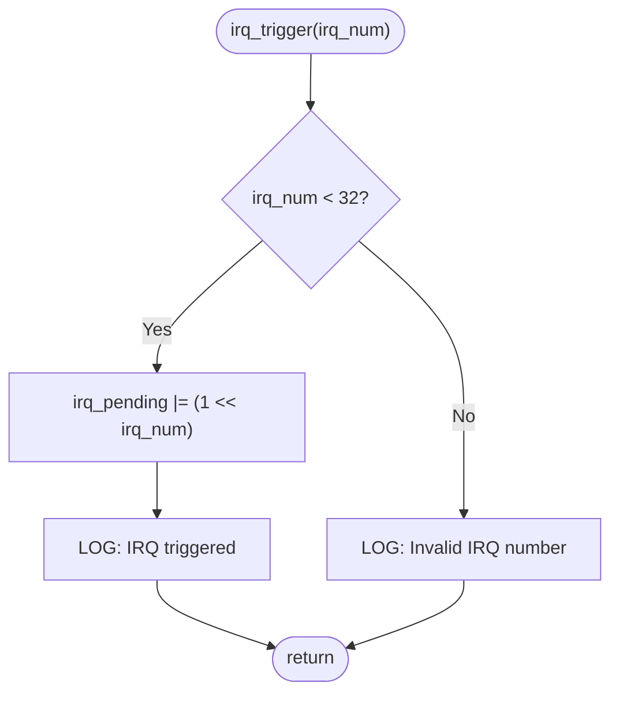
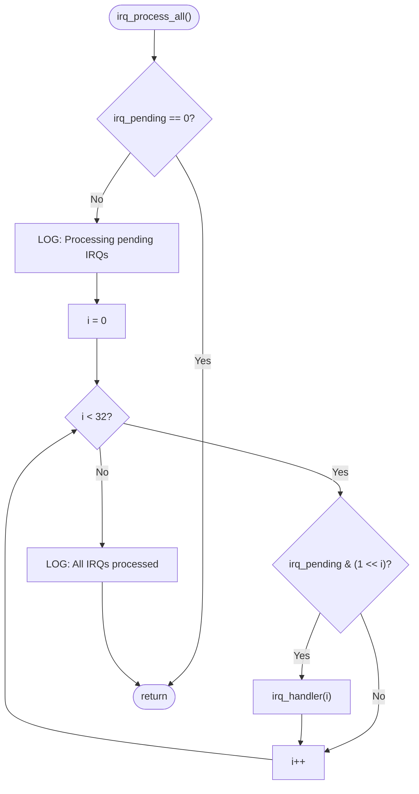
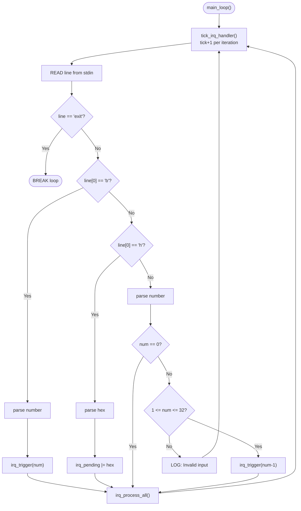
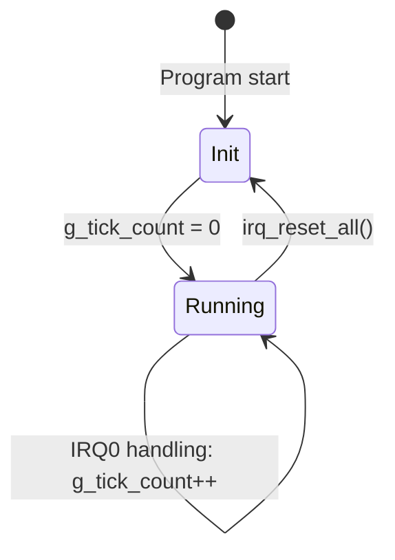

# IRQ Simulator - Software Design

## 1. Design Overview

This document describes the detailed design of the IRQ Simulator, including interface definitions, data structures, algorithms, and key design decisions.

## 2. Interface Design

### 2.1 Public API (main.h)

```c
#define IRQ_COUNT 32

void tick_irq_handler(void);          /* Tick interrupt handler */
void exception_irq_handler(void);     /* Exception interrupt handler */
void irq_trigger(unsigned int num);   /* Trigger a specific IRQ */
void irq_trigger_raw(uint32_t mask);  /* Trigger multiple IRQs via raw mask */
void irq_handler(unsigned int num);   /* Handle a specific IRQ */
void irq_process_all(void);           /* Process all pending IRQs */

/* Test Accessors */
uint32_t irq_get_pending(void);       /* Read pending register */
unsigned int irq_get_tick(void);      /* Read tick count */
void irq_reset_all(void);             /* Reset all state */
```

### 2.2 Internal State

```c
static uint32_t irq_pending = 0;        /* IRQ pending register */
static unsigned int g_tick_count = 0;   /* Global tick counter */
```

### 2.3 Logging Macro

```c
#define TICK_PRINTF(fmt, ...) \
    printf("[tick: %05u] " fmt, g_tick_count, ##__VA_ARGS__)
```

## 3. Algorithm Design

### 3.1 IRQ Trigger Algorithm



### 3.2 IRQ Process-All Algorithm (Priority-Based)



### 3.3 IRQ Handler Dispatch Algorithm

```mermaid
flowchart TD
    START(["irq_handler(irq_num)"])
    LOG["LOG: Handling IRQ<num>"]
    SWITCH{"irq_num?"}
    CASE0["tick_irq_handler()"]
    CASE1["LOG: UART0 RX"]
    CASE2["LOG: UART0 TX"]
    CASE3["LOG: GPIO Port A"]
    CASE4["LOG: GPIO Port B"]
    CASE5["LOG: SPI0"]
    CASE6["LOG: I2C0"]
    CASE7["LOG: ADC"]
    CASE8["LOG: DMA Ch0"]
    CASE9["LOG: DMA Ch1"]
    CASE10["LOG: Watchdog"]
    CASE11["LOG: RTC"]
    CASE12["LOG: USB"]
    CASE13["LOG: CAN0"]
    CASE14["LOG: PWM"]
    CASE15["LOG: Timer1"]
    CASE16["LOG: Timer2"]
    CASE17["LOG: UART1 RX"]
    CASE18["LOG: UART1 TX"]
    CASE19["LOG: SPI1"]
    CASE20["LOG: I2C1"]
    CASE21["LOG: External INT0"]
    CASE22["LOG: External INT1"]
    CASE23["LOG: External INT2"]
    CASE24["LOG: DMA Ch2"]
    CASE25["LOG: DMA Ch3"]
    CASE26["LOG: CRC"]
    CASE27["LOG: AES"]
    CASE28["LOG: QSPI"]
    CASE29["LOG: SDIO"]
    CASE30["LOG: Ethernet"]
    CASE31["exception_irq_handler()"]
    CLEAR["irq_pending &= ~(1 << irq_num)"]
    END_(["return"])

    START --> LOG
    LOG --> SWITCH
    SWITCH -->|"0"| CASE0
    SWITCH -->|"1"| CASE1
    SWITCH -->|"2"| CASE2
    SWITCH -->|"3"| CASE3
    SWITCH -->|"4"| CASE4
    SWITCH -->|"5"| CASE5
    SWITCH -->|"6"| CASE6
    SWITCH -->|"7"| CASE7
    SWITCH -->|"8"| CASE8
    SWITCH -->|"9"| CASE9
    SWITCH -->|"10"| CASE10
    SWITCH -->|"11"| CASE11
    SWITCH -->|"12"| CASE12
    SWITCH -->|"13"| CASE13
    SWITCH -->|"14"| CASE14
    SWITCH -->|"15"| CASE15
    SWITCH -->|"16"| CASE16
    SWITCH -->|"17"| CASE17
    SWITCH -->|"18"| CASE18
    SWITCH -->|"19"| CASE19
    SWITCH -->|"20"| CASE20
    SWITCH -->|"21"| CASE21
    SWITCH -->|"22"| CASE22
    SWITCH -->|"23"| CASE23
    SWITCH -->|"24"| CASE24
    SWITCH -->|"25"| CASE25
    SWITCH -->|"26"| CASE26
    SWITCH -->|"27"| CASE27
    SWITCH -->|"28"| CASE28
    SWITCH -->|"29"| CASE29
    SWITCH -->|"30"| CASE30
    SWITCH -->|"31"| CASE31
    CASE0 --> CLEAR
    CASE1 --> CLEAR
    CASE2 --> CLEAR
    CASE3 --> CLEAR
    CASE4 --> CLEAR
    CASE5 --> CLEAR
    CASE6 --> CLEAR
    CASE7 --> CLEAR
    CASE8 --> CLEAR
    CASE9 --> CLEAR
    CASE10 --> CLEAR
    CASE11 --> CLEAR
    CASE12 --> CLEAR
    CASE13 --> CLEAR
    CASE14 --> CLEAR
    CASE15 --> CLEAR
    CASE16 --> CLEAR
    CASE17 --> CLEAR
    CASE18 --> CLEAR
    CASE19 --> CLEAR
    CASE20 --> CLEAR
    CASE21 --> CLEAR
    CASE22 --> CLEAR
    CASE23 --> CLEAR
    CASE24 --> CLEAR
    CASE25 --> CLEAR
    CASE26 --> CLEAR
    CASE27 --> CLEAR
    CASE28 --> CLEAR
    CASE29 --> CLEAR
    CASE30 --> CLEAR
    CASE31 --> CLEAR
    CLEAR --> END_
```



### 3.4 Input Parsing Algorithm



## 4. Data Structure Design

### 4.1 IRQ Pending Register

```mermaid
block
    columns 32
    block:bit31:1 B31["31"]
    block:bit30:1 B30["30"]
    block:bit29:1 B29["29"]
    block:bit28:1 B28["28"]
    block:bit27:1 B27["27"]
    block:bit26:1 B26["26"]
    block:bit25:1 B25["25"]
    block:bit24:1 B24["24"]
    block:bit23:1 B23["23"]
    block:bit22:1 B22["22"]
    block:bit21:1 B21["21"]
    block:bit20:1 B20["20"]
    block:bit19:1 B19["19"]
    block:bit18:1 B18["18"]
    block:bit17:1 B17["17"]
    block:bit16:1 B16["16"]
    block:bit15:1 B15["15"]
    block:bit14:1 B14["14"]
    block:bit13:1 B13["13"]
    block:bit12:1 B12["12"]
    block:bit11:1 B11["11"]
    block:bit10:1 B10["10"]
    block:bit9:1 B9["9"]
    block:bit8:1 B8["8"]
    block:bit7:1 B7["7"]
    block:bit6:1 B6["6"]
    block:bit5:1 B5["5"]
    block:bit4:1 B4["4"]
    block:bit3:1 B3["3"]
    block:bit2:1 B2["2"]
    block:bit1:1 B1["1"]
    block:bit0:1 B0["0"]
```

```
Bit 0  = IRQ0  (Highest Priority)
Bit 31 = IRQ31 (Lowest Priority)
```

### 4.2 Tick Counter Lifecycle



## 5. Error Handling Design

| Scenario | Handling |
|------|---------|
| IRQ number out of range (>=32) | Output error message, do not modify pending register |
| Invalid b-mode parameter | Output "Invalid bit mode" |
| Invalid h-mode parameter | Output "Invalid hex mode" |
| Plain number outside 1-32 | Output "Invalid IRQ number" |
| Unparseable input | Output "Invalid input" |
| stdin EOF | Exit loop normally |

## 6. Design Decisions

### DD-01: Why use static file-scope variables instead of global variables?
- Limits variable visibility, preventing accidental modification by external modules
- Provides controlled read/reset interface via test accessor functions

### DD-02: Why use the TICK_PRINTF macro instead of a wrapper function?
- Macros expand at compile time with zero function call overhead
- Uses `##__VA_ARGS__` (GNU extension) to support zero-argument cases
- Unifies the format of all log output

### DD-03: Why clear the pending bit immediately after IRQ handling instead of batch clearing?
- Simulates real hardware behavior: ISR clears the interrupt flag after execution
- Prevents the same IRQ from being processed repeatedly

### DD-04: Why does h-mode use `|=` instead of `=`?
- Allows cumulative triggering: trigger some IRQs first, then append via h-mode
- More closely mirrors real hardware interrupt controller behavior

## 7. Detailed Design Traceability

| ID | Chapter | Trace to SA | Trace to SR | Description |
|----|---------|-------------|-------------|-------------|
| SD_001 | 2.1 | SA_003 | SR_001<br>SR_044 | Public API (`main.h`): 9 function declarations + `IRQ_COUNT` constant definition |
| SD_002 | 2.2 | SA_005<br>SA_006 | SR_001<br>SR_002<br>SR_003<br>SR_036<br>SR_037<br>SR_038 | Internal State: `irq_pending` (static uint32_t) and `g_tick_count` (static unsigned int) as file-scope variables |
| SD_003 | 2.3 | SA_023 | SR_039 | `TICK_PRINTF` macro: `printf` with `[tick: N]` prefix, uses `##__VA_ARGS__` for zero-arg support |
| SD_004 | 3.1 | SA_009 | SR_003<br>SR_004<br>SR_005<br>SR_042 | `irq_trigger()` algorithm: range check (`irq_num < 32`) → bit set (`1 << irq_num`) → log |
| SD_005 | 3.2 | SA_011 | SR_007<br>SR_008 | `irq_process_all()` algorithm: empty check → priority loop (IRQ0→IRQ31) → handler dispatch per pending bit |
| SD_006 | 3.3 | SA_012<br>SA_013<br>SA_014 | SR_009<br>SR_010<br>SR_035<br>SR_045 | `irq_handler()` dispatch: switch-case for 32 IRQ behaviors → clear pending bit after handling |
| SD_007 | 3.4 | SA_007<br>SA_008 | SR_004<br>SR_005<br>SR_006<br>SR_037<br>SR_040<br>SR_041<br>SR_042<br>SR_043 | Input parsing algorithm: tick increment → read stdin → parse (b/h/numeric/0/exit) → trigger → process |
| SD_008 | 4.1 | SA_005 | SR_001<br>SR_002<br>SR_003 | IRQ Pending Register layout: 32-bit, Bit 0=IRQ0 (highest priority) to Bit 31=IRQ31 (lowest priority) |
| SD_009 | 4.2 | SA_006 | SR_036<br>SR_037<br>SR_038 | Tick Counter Lifecycle: Init (g_tick_count=0) → Running (loop/IRQ0 increment) → Reset (irq_reset_all) |
| SD_010 | 5 | SA_025 | SR_042<br>SR_043 | Error handling design: 6 scenarios (range out, invalid b/h-mode, invalid number, unparseable, EOF) |
| SD_011 | 6 | SA_002<br>SA_003 | SR_044 | DD-01: static file-scope variables — limits visibility, controlled access via test accessor functions |
| SD_012 | 6 | SA_023 | SR_039 | DD-02: TICK_PRINTF macro vs wrapper function — zero call overhead, `##__VA_ARGS__`, unified log format |
| SD_013 | 6 | SA_024 | SR_009 | DD-03: Immediate pending bit clear — simulates real hardware ISR behavior, prevents re-processing |
| SD_014 | 6 | SA_010 | SR_003<br>SR_006 | DD-04: h-mode `|=` vs `=` — cumulative triggering, mirrors real interrupt controller behavior |

### Chapter Mapping

| Chapter | SD Range | Count | Content |
|---------|----------|-------|---------|
| 2 | SD_001 ~ SD_003 | 3 | Interface Design |
| 3 | SD_004 ~ SD_007 | 4 | Algorithm Design |
| 4 | SD_008 ~ SD_009 | 2 | Data Structure Design |
| 5 | SD_010 | 1 | Error Handling Design |
| 6 | SD_011 ~ SD_014 | 4 | Design Decisions |

> **Abbreviation Notes:**
>
> - **SD** = Software Detailed Design (unified numbering for all detailed design items)
> - **SA** = Software Architecture (traceability back to SWE.2 architecture items)
> - **SR** = Software Requirement (traceability back to SWE.1 requirement items)