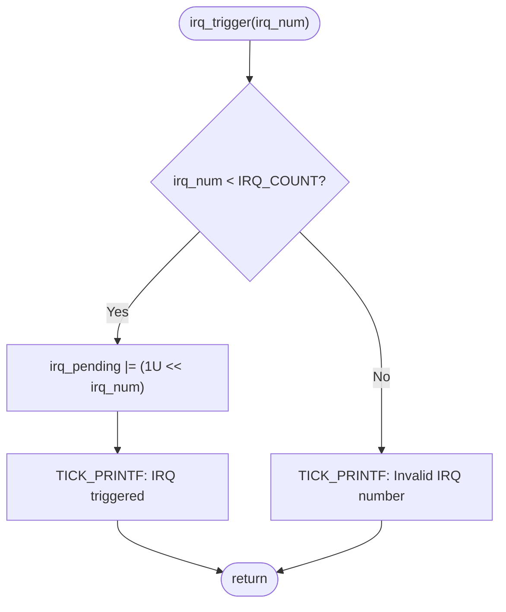
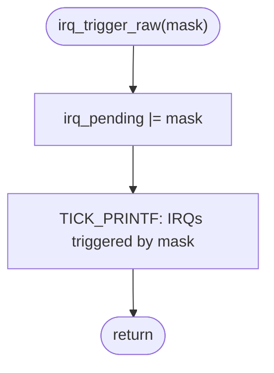
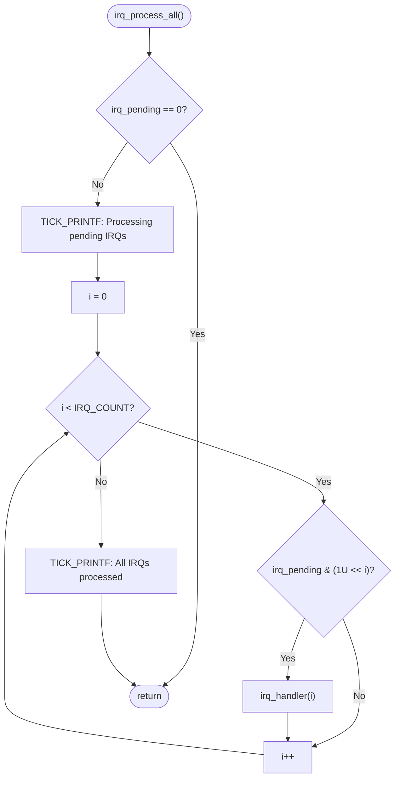
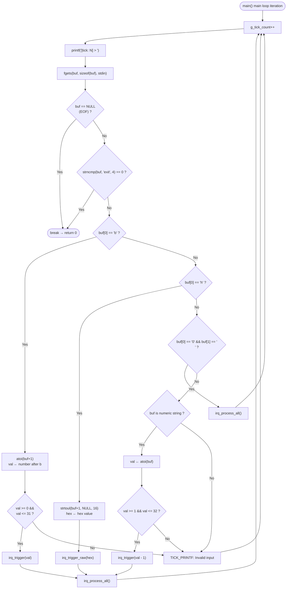
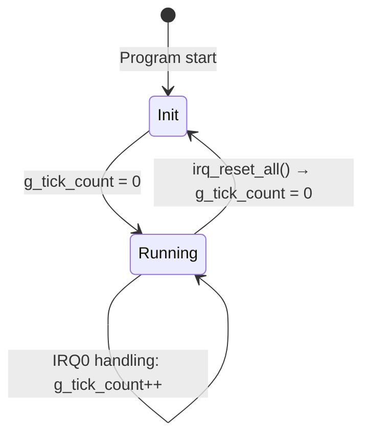
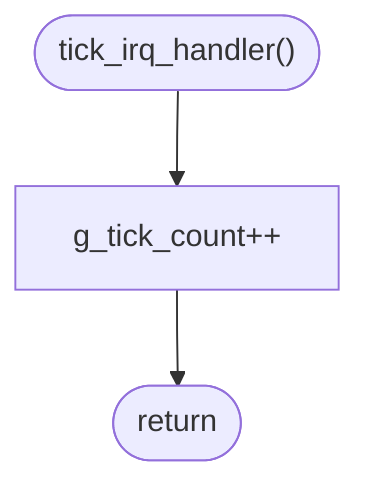
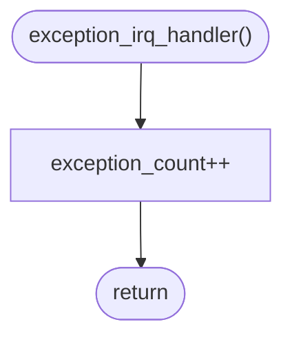

# IRQ Simulator - Software Detailed Design (Cline)

## 1. Design Overview

This document describes the detailed design of the IRQ Simulator, including interface definitions, data structures, algorithms, and key design decisions. This document traces back to the SA_C items in the Software Architecture document and the SR items in the Software Requirements Specification.

## 2. Interface Design

### 2.1 Public API (`inc/main.h`)

```c
#define IRQ_COUNT  32U

/* --- Global interrupt control (stubs) --- */
void __disable_irq(void);               /* Disable global interrupts (no-op) */
void __enable_irq(void);                /* Enable global interrupts (no-op) */

/* --- ISR handler functions --- */
void tick_irq_handler(void);            /* Tick interrupt handler: increments g_tick_count */
void exception_irq_handler(void);       /* Exception interrupt handler: increments exception_count */

/* --- IRQ triggering --- */
void irq_trigger(uint32_t irq_num);     /* Trigger a specific IRQ (with range check) */

/* --- IRQ processing --- */
void irq_process_all(void);             /* Process all pending IRQs in priority order */

/* --- Test accessor functions (visible when TEST_BUILD is defined) --- */
void        irq_trigger_raw(uint32_t mask);  /* Trigger multiple IRQs via raw mask */
void        irq_handler(uint32_t irq_num);  /* Handle a specific IRQ (switch-case) */
uint32_t    irq_get_pending(void);           /* Read pending register */
uint32_t    irq_get_tick(void);              /* Read tick count */
void        irq_reset_all(void);             /* Reset all state */
uint32_t    exception_get_count(void);       /* Read exception count */
```

- Production build (`trae_test`): `irq_trigger_raw()`, `irq_handler()`, `irq_get_pending()`, `irq_get_tick()`, `irq_reset_all()`, `exception_get_count()` have `static` internal linkage **(MISRA R8.7 compliant)**
- Test builds (`unit_test`, `integrated_test`): The above functions are externally linked via the `FW_STATIC` macro for isolated testing

### 2.2 Internal State

```c
/* --- File-scope internal state (static hides implementation details) --- */
static uint32_t irq_pending = 0U;       /* 32-bit pending register */
static uint32_t g_tick_count = 0U;      /* Global tick counter */
static uint32_t exception_count = 0U;   /* Exception trigger count */
```

### 2.3 Logging Macro

```c
#define TICK_PRINTF(fmt, ...) \
    printf("[tick: %05u] " fmt, g_tick_count, ##__VA_ARGS__)
```

- **Purpose**: All log output unified with `[tick: N]` prefix **(SR_039)**
- **Note**: `##__VA_ARGS__` is a GNU extension that supports zero-argument calls (e.g., `TICK_PRINTF("Hello")`)
- **Alternative**: Wrapper function — but macros expand at compile time with zero call overhead

### 2.4 FW_STATIC Mechanism

```c
#ifdef TEST_BUILD
#define FW_STATIC
#else
#define FW_STATIC static
#endif
```

- **Production build**: `FW_STATIC` expands to `static`, functions have internal linkage
- **Test build**: `FW_STATIC` expands to nothing, functions have external linkage, test code can call them directly

---

## 3. Algorithm Design

### 3.1 IRQ Trigger Algorithm — `irq_trigger(irq_num)`

```
Purpose: Set the pending bit for the specified IRQ number
Traces to: SA_C_008 | SR_003, SR_004, SR_005, SR_042
Parameter: irq_num — 0..31
Behavior: irq_pending |= (1U << irq_num)
Boundary: irq_num >= IRQ_COUNT (32) → ignore request, output error message
```



### 3.2 IRQ Trigger Raw Algorithm — `irq_trigger_raw(mask)`

```
Purpose: Directly set the pending register via a raw bitmask
Traces to: SA_C_009 | SR_003, SR_006
Parameter: mask — 32-bit mask value
Behavior: irq_pending |= mask
```



### 3.3 IRQ Process-All Algorithm — `irq_process_all()`

```
Purpose: Process all pending IRQs in priority order
Traces to: SA_C_011 | SR_007, SR_008
Algorithm:
  for i = 0 to (IRQ_COUNT - 1)
      if (irq_pending & (1U << i))
          irq_handler(i)
Priority: IRQ0 highest (i=0), IRQ31 lowest (i=31)
```



### 3.4 IRQ Handler Dispatch Algorithm — `irq_handler(irq_num)`

```
Purpose: Dispatch to the corresponding peripheral simulation behavior based on IRQ number
Traces to: SA_C_012, SA_C_013, SA_C_014, SA_C_015 | SR_009, SR_010~SR_035, SR_045
Clear: irq_pending &= ~(1U << irq_num)
```



```mermaid
flowchart TD
    START(["irq_handler(irq_num)"])
    LOG["TICK_PRINTF: Handling IRQ<num>"]
    SWITCH{"irq_num?"}
    
    CASE0["tick_irq_handler()"]
    CASE1["TICK_PRINTF: UART0 RX"]
    CASE2["TICK_PRINTF: UART0 TX"]
    CASE3["TICK_PRINTF: GPIO Port A"]
    CASE4["TICK_PRINTF: GPIO Port B"]
    CASE5["TICK_PRINTF: SPI0"]
    CASE6["TICK_PRINTF: I2C0"]
    CASE7["TICK_PRINTF: ADC"]
    CASE8["TICK_PRINTF: DMA Ch0"]
    CASE9["TICK_PRINTF: DMA Ch1"]
    CASE10["TICK_PRINTF: Watchdog"]
    CASE11["TICK_PRINTF: RTC"]
    CASE12["TICK_PRINTF: USB"]
    CASE13["TICK_PRINTF: CAN0"]
    CASE14["TICK_PRINTF: PWM"]
    CASE15["TICK_PRINTF: Timer1"]
    CASE16["TICK_PRINTF: Timer2"]
    CASE17["TICK_PRINTF: UART1 RX"]
    CASE18["TICK_PRINTF: UART1 TX"]
    CASE19["TICK_PRINTF: SPI1"]
    CASE20["TICK_PRINTF: I2C1"]
    CASE21["TICK_PRINTF: External INT0"]
    CASE22["TICK_PRINTF: External INT1"]
    CASE23["TICK_PRINTF: External INT2"]
    CASE24["TICK_PRINTF: DMA Ch2"]
    CASE25["TICK_PRINTF: DMA Ch3"]
    CASE26["TICK_PRINTF: CRC"]
    CASE27["TICK_PRINTF: AES"]
    CASE28["TICK_PRINTF: QSPI"]
    CASE29["TICK_PRINTF: SDIO"]
    CASE30["TICK_PRINTF: Ethernet"]
    CASE31["exception_irq_handler()"]
    
    CLEAR["irq_pending &= ~(1U << irq_num)"]
    END_(["return"])

    START --> LOG
    LOG --> SWITCH
    SWITCH -->|"0"| CASE0
    SWITCH -->|"1..30"| CASES["Per-IRQ branches"]
    SWITCH -->|"31"| CASE31
    
    CASE0 --> CLEAR
    CASES --> CLEAR
    CASE31 --> CLEAR
    CLEAR --> END_
```

#### IRQ Handler Behavior Lookup Table

| IRQ | Simulated Peripheral | Behavior | SA_C | SR |
|-----|---------------------|----------|------|----|
| IRQ0 | System Timer | `tick_irq_handler()` → `g_tick_count++` | SA_C_013 | SR_010, SR_036, SR_038 |
| IRQ1 | UART0 RX | `TICK_PRINTF("UART0 RX: data received")` | SA_C_015 | SR_011 |
| IRQ2 | UART0 TX | `TICK_PRINTF("UART0 TX: data transmitted")` | SA_C_015 | SR_012 |
| IRQ3 | GPIO Port A | `TICK_PRINTF("GPIO Port A: pin state changed")` | SA_C_015 | SR_013 |
| IRQ4 | GPIO Port B | `TICK_PRINTF("GPIO Port B: pin state changed")` | SA_C_015 | SR_014 |
| IRQ5 | SPI0 | `TICK_PRINTF("SPI0: transfer complete")` | SA_C_015 | SR_015 |
| IRQ6 | I2C0 | `TICK_PRINTF("I2C0: transaction complete")` | SA_C_015 | SR_016 |
| IRQ7 | ADC | `TICK_PRINTF("ADC: conversion complete")` | SA_C_015 | SR_017 |
| IRQ8~9 | DMA Ch0~1 | `TICK_PRINTF("DMA Ch<n>: transfer complete")` | SA_C_015 | SR_018 |
| IRQ10 | Watchdog | `TICK_PRINTF("Watchdog: timer expired")` | SA_C_015 | SR_019 |
| IRQ11 | RTC | `TICK_PRINTF("RTC: alarm triggered")` | SA_C_015 | SR_020 |
| IRQ12 | USB | `TICK_PRINTF("USB: device event")` | SA_C_015 | SR_021 |
| IRQ13 | CAN0 | `TICK_PRINTF("CAN0: message received")` | SA_C_015 | SR_022 |
| IRQ14 | PWM | `TICK_PRINTF("PWM: period elapsed")` | SA_C_015 | SR_023 |
| IRQ15~16 | Timer1~2 | `TICK_PRINTF("Timer<n>: compare match/overflow")` | SA_C_015 | SR_024 |
| IRQ17~18 | UART1 RX/TX | Data transfer simulation | SA_C_015 | SR_025 |
| IRQ19 | SPI1 | `TICK_PRINTF("SPI1: transfer complete")` | SA_C_015 | SR_026 |
| IRQ20 | I2C1 | `TICK_PRINTF("I2C1: transaction complete")` | SA_C_015 | SR_027 |
| IRQ21~23 | External INT0~2 | `TICK_PRINTF("External INT<n>: interrupt")` | SA_C_015 | SR_028 |
| IRQ24~25 | DMA Ch2~3 | `TICK_PRINTF("DMA Ch<n>: transfer complete")` | SA_C_015 | SR_029 |
| IRQ26 | CRC | `TICK_PRINTF("CRC: calculation complete")` | SA_C_015 | SR_030 |
| IRQ27 | AES | `TICK_PRINTF("AES: encryption complete")` | SA_C_015 | SR_031 |
| IRQ28 | QSPI | `TICK_PRINTF("QSPI: command complete")` | SA_C_015 | SR_032 |
| IRQ29 | SDIO | `TICK_PRINTF("SDIO: card event")` | SA_C_015 | SR_033 |
| IRQ30 | Ethernet | `TICK_PRINTF("Ethernet: packet received")` | SA_C_015 | SR_034 |
| IRQ31 | Exception | `exception_irq_handler()` → `exception_count++` | SA_C_014 | SR_035 |

### 3.5 Input Parsing Algorithm

```
Purpose: Parse user input and trigger the corresponding IRQ behaviors
Traces to: SA_C_006, SA_C_016, SA_C_017, SA_C_018, SA_C_019
      | SR_004, SR_005, SR_006, SR_037, SR_040, SR_041, SR_042, SR_043
```



---

## 4. Data Structure Design

### 4.1 IRQ Pending Register — `irq_pending`

```
Type: uint32_t
Scope: static (file-level)
Initial value: 0U
Description: 32-bit pending register, each bit maps to one IRQ channel
Traces to: SA_C_002 | SR_001, SR_002, SR_003
```



```mermaid
block-beta
    columns 32
    bit31["31"]:1
    bit30["30"]:1
    bit29["29"]:1
    bit28["28"]:1
    bit27["27"]:1
    bit26["26"]:1
    bit25["25"]:1
    bit24["24"]:1
    bit23["23"]:1
    bit22["22"]:1
    bit21["21"]:1
    bit20["20"]:1
    bit19["19"]:1
    bit18["18"]:1
    bit17["17"]:1
    bit16["16"]:1
    bit15["15"]:1
    bit14["14"]:1
    bit13["13"]:1
    bit12["12"]:1
    bit11["11"]:1
    bit10["10"]:1
    bit9["9"]:1
    bit8["8"]:1
    bit7["7"]:1
    bit6["6"]:1
    bit5["5"]:1
    bit4["4"]:1
    bit3["3"]:1
    bit2["2"]:1
    bit1["1"]:1
    bit0["0"]:1
```

```txt
Bit 0  = IRQ0  (System Timer)      — Highest priority
Bit 31 = IRQ31 (Exception)         — Lowest priority
```

### 4.2 Global Tick Counter — `g_tick_count`

```
Type: uint32_t
Scope: static (file-level)
Initial value: 0U
Increment triggers:
  - At the start of each main loop iteration: g_tick_count++
  - When IRQ0 (System Timer) is processed: tick_irq_handler() → g_tick_count++
Traces to: SA_C_003 | SR_036, SR_037, SR_038
```



### 4.3 Exception Count — `exception_count`

```
Type: uint32_t
Scope: static (file-level)
Initial value: 0U
Increment trigger: IRQ31 is processed: exception_irq_handler() → exception_count++
Traces to: SA_C_014 | SR_035
```

---

## 5. Error Handling Design

| Scenario | Handling | Traces to |
|----------|---------|-----------|
| IRQ number out of range (≥32) | Output `"[tick: N] Invalid IRQ number"`, do not modify pending register | SR_042, SR_043 |
| Invalid b-mode parameter (no digits or out of 0-31) | Output `"[tick: N] Invalid bit mode"` | SR_042, SR_043 |
| Invalid h-mode parameter (non-hex) | Output `"[tick: N] Invalid hex mode"` | SR_042, SR_043 |
| Plain number outside 1-32 | Output `"[tick: N] Invalid IRQ number (use 1-32)"` | SR_042, SR_043 |
| Unparseable input | Output `"[tick: N] Invalid input"` | SR_042, SR_043 |
| stdin EOF (Ctrl+Z/Win, Ctrl+D/Linux) | Exit loop normally, `return 0` | — |

---

## 6. Tick Handler Design

### 6.1 `tick_irq_handler()`

```
Purpose: Increment the global tick counter
Traces to: SA_C_013 | SR_010, SR_036, SR_038
Behavior: g_tick_count++
Callers:
  - IRQ0 processing path: irq_handler(0) → tick_irq_handler()
  - Main loop iteration: called at the start of each loop in main()
```



### 6.2 `exception_irq_handler()`

```
Purpose: Increment the exception trigger count
Traces to: SA_C_014 | SR_035
Behavior: exception_count++
Caller: irq_handler(31) → exception_irq_handler()
```



---

## 7. Design Decisions

### DD-01: Why use static file-scope variables instead of global variables?

| Item | Description |
|------|-------------|
| **Decision** | `irq_pending`, `g_tick_count`, `exception_count` declared as `static` file-scope variables |
| **Traces to** | SA_C_001, SA_C_004 | SR_044 |
| **Rationale** | Limits variable visibility, preventing accidental modification by external modules |
| **Alternative** | Global variables — any module could modify them directly, violating encapsulation |
| **Test strategy** | Remove `static` via the `FW_STATIC` macro in test builds; test code accesses state through controlled accessor functions like `irq_get_pending()` and `irq_get_tick()` |

### DD-02: Why use the `TICK_PRINTF` macro instead of a wrapper function?

| Item | Description |
|------|-------------|
| **Decision** | Use `#define TICK_PRINTF(fmt, ...)` macro |
| **Traces to** | SA_C_007 | SR_039 |
| **Rationale** | Macros expand at compile time with zero function call overhead; `##__VA_ARGS__` supports zero-argument cases |
| **Alternative** | `void tick_printf(const char *fmt, ...)` wrapper function — adds function call overhead |
| **Note** | `##__VA_ARGS__` is a GNU extension. For strict C11 compatibility, use `TICK_PRINTF(fmt, ...)` requiring at least one variadic argument |

### DD-03: Why clear the pending bit immediately after IRQ handling instead of batch clearing?

| Item | Description |
|------|-------------|
| **Decision** | `irq_pending &= ~(1U << irq_num)` executed immediately after each IRQ is handled |
| **Traces to** | SA_C_012 | SR_009 |
| **Rationale** | Simulates real hardware ISR behavior: the interrupt flag is cleared after the ISR executes; prevents the same IRQ from being processed repeatedly |
| **Alternative** | Batch clearing — clear all bits once after all IRQs are processed — may lose interrupts in scenarios where a high-priority IRQ re-triggers |

### DD-04: Why does h-mode use `|=` instead of `=`?

| Item | Description |
|------|-------------|
| **Decision** | `irq_trigger_raw()` uses `irq_pending |= mask` |
| **Traces to** | SA_C_009 | SR_003, SR_006 |
| **Rationale** | Allows cumulative triggering: trigger some IRQs first (via numeric or b-mode), then append more via h-mode; more closely mirrors the OR behavior of real interrupt controllers |
| **Alternative** | `=` assignment — would overwrite previously triggered IRQs, which is not what users expect |
| **Use case** | User enters `b5` (triggers IRQ5), then `h3` (appends IRQ0, IRQ1) — final pending includes IRQ0, IRQ1, IRQ5 |

### DD-05: Why use `uint32_t` instead of `unsigned int`?

| Item | Description |
|------|-------------|
| **Decision** | Internal state uniformly uses `uint32_t` (from `<stdint.h>`) |
| **Traces to** | SA_C_002, SA_C_003 | SR_046 |
| **Rationale** | MISRA C requires explicitly-sized integer types; `stdint.h` is part of the C99/C11 standard and is platform-independent |
| **Alternative** | `unsigned int` — width may vary across platforms (16-bit or 32-bit) |

---

## 8. Detailed Design Traceability

### 8.1 Design Item Traceability Matrix

| ID | Section | Traces to SA_C | Traces to SR | Description |
|----|---------|----------------|-------------|-------------|
| SD_C_001 | 2.1 | SA_C_004 | SR_001, SR_044 | Public API (`inc/main.h`): 6 external functions + 7 test helper functions + `IRQ_COUNT` constant |
| SD_C_002 | 2.2 | SA_C_002, SA_C_003 | SR_001, SR_002, SR_003, SR_036, SR_037, SR_038 | Internal state: `irq_pending` (static uint32_t), `g_tick_count` (static uint32_t), `exception_count` (static uint32_t) |
| SD_C_003 | 2.3 | SA_C_007 | SR_039 | `TICK_PRINTF` macro: unified log output with `[tick: N]` prefix |
| SD_C_004 | 2.4 | SA_C_001, SA_C_005 | SR_044 | `FW_STATIC` mechanism: production `static` (MISRA R8.7), test external linkage |
| SD_C_005 | 3.1 | SA_C_008 | SR_003, SR_004, SR_005, SR_042 | `irq_trigger()` algorithm: range check → bit set (`1U << irq_num`) → log |
| SD_C_006 | 3.2 | SA_C_009 | SR_003, SR_006 | `irq_trigger_raw()` algorithm: OR-set pending register directly |
| SD_C_007 | 3.3 | SA_C_011 | SR_007, SR_008 | `irq_process_all()` algorithm: empty check → priority loop (IRQ0→IRQ31) |
| SD_C_008 | 3.4 | SA_C_012, SA_C_013, SA_C_014, SA_C_015 | SR_009, SR_010~SR_035, SR_045 | `irq_handler()` dispatch: switch-case 32-way → clear pending bit |
| SD_C_009 | 3.5 | SA_C_006, SA_C_016, SA_C_017, SA_C_018, SA_C_019 | SR_004, SR_005, SR_006, SR_037, SR_040, SR_041, SR_042, SR_043 | Input parsing algorithm: tick increment → read stdin → mode parse → trigger → process |
| SD_C_010 | 4.1 | SA_C_002 | SR_001, SR_002, SR_003 | IRQ Pending Register layout: 32-bit, Bit 0=IRQ0 (highest priority) to Bit 31=IRQ31 (lowest priority) |
| SD_C_011 | 4.2 | SA_C_003 | SR_036, SR_037, SR_038 | Tick counter lifecycle: Init (0) → Running (loop/IRQ0 increment) → Reset |
| SD_C_012 | 4.3 | SA_C_014 | SR_035 | Exception count: incremented only when IRQ31 is processed |
| SD_C_013 | 5 | SA_C_019 | SR_042, SR_043 | Error handling: 6 scenarios (range out, invalid b/h-mode, invalid number, unparseable, EOF) |
| SD_C_014 | 6.1 | SA_C_013 | SR_010, SR_036, SR_038 | `tick_irq_handler()`: increments `g_tick_count` |
| SD_C_015 | 6.2 | SA_C_014 | SR_035 | `exception_irq_handler()`: increments `exception_count` |
| SD_C_016 | 7 | SA_C_001, SA_C_004 | SR_044 | DD-01: static file-scope variable encapsulation |
| SD_C_017 | 7 | SA_C_007 | SR_039 | DD-02: TICK_PRINTF macro selection |
| SD_C_018 | 7 | SA_C_012 | SR_009 | DD-03: Immediate pending bit clear |
| SD_C_019 | 7 | SA_C_009 | SR_003, SR_006 | DD-04: h-mode uses `|=` for cumulative triggering |
| SD_C_020 | 7 | SA_C_002, SA_C_003 | SR_046 | DD-05: Use `uint32_t` for cross-platform consistency |

### 8.2 Chapter Mapping

| Chapter | SD_C Range | Count | Content |
|---------|-----------|-------|---------|
| 2 | SD_C_001 ~ SD_C_004 | 4 | Interface Design |
| 3 | SD_C_005 ~ SD_C_009 | 5 | Algorithm Design |
| 4 | SD_C_010 ~ SD_C_012 | 3 | Data Structure Design |
| 5 | SD_C_013 | 1 | Error Handling Design |
| 6 | SD_C_014 ~ SD_C_015 | 2 | Tick Handler Design |
| 7 | SD_C_016 ~ SD_C_020 | 5 | Design Decisions |

### 8.3 Trace Coverage

| Architecture Item (SA_C) | SA_C Total | Traced | Coverage |
|-------------------------|-----------|--------|----------|
| SA_C_001 ~ SA_C_023 | 23 | 20 | 87%* |

| Requirement Category | SR Range | Total | Traced | Coverage |
|---------------------|----------|-------|--------|----------|
| FR-01 (IRQ Trigger) | SR_001~SR_003 | 3 | 3 | 100% |
| FR-02 (Input Modes) | SR_004~SR_006 | 3 | 3 | 100% |
| FR-03 (Priority) | SR_007~SR_009 | 3 | 3 | 100% |
| FR-04 (IRQ Behaviors) | SR_010~SR_035 | 26 | 26 | 100% |
| FR-05 (Tick Counter) | SR_036~SR_039 | 4 | 4 | 100% |
| FR-06 (Program Control) | SR_040~SR_041 | 2 | 2 | 100% |
| NFR-01 (Usability) | SR_042~SR_043 | 2 | 2 | 100% |
| NFR-02 (Maintainability) | SR_044~SR_045 | 2 | 2 | 100% |
| NFR-03 (Portability) | SR_046~SR_047 | 2 | 2 | 100% |
| **Total** | SR_001~SR_047 | **47** | **47** | **100%** |

> \* Architecture items not covered by this design document (SA_C_006, SA_C_010, SA_C_020~SA_C_023) are architecture-level concepts or covered in other design documents
>
> **Abbreviation Notes:**
>
> - **SD_C** = Software Detailed Design (Cline) (detailed design item identifier for this document)
> - **SA_C** = Software Architecture (Cline) (architecture item tracing back to SWE.2)
> - **SR** = Software Requirement (requirements tracing back to SWE.1)