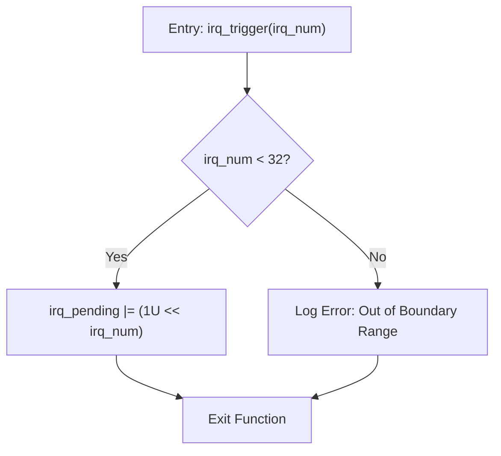
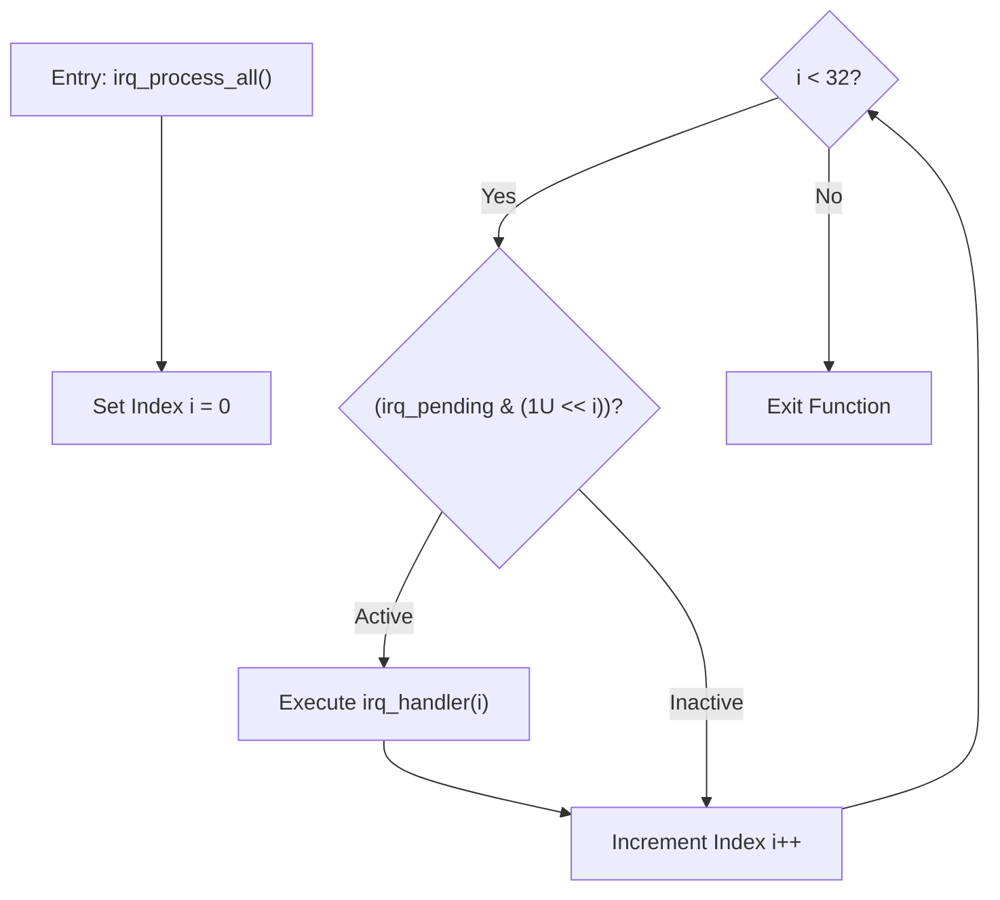

# IRQ Simulator - Software Detailed Design

## 1. Public API Interface Specifications (`inc/main.h`)
The external interface exposes control endpoints for simulating interrupt lines and verifying compliance metrics.

```c
#ifndef MAIN_H
#define MAIN_H

#include <stdint.h>

#define IRQ_COUNT 32U

/* Public Core Application API */
void tick_irq_handler(void);
void exception_irq_handler(void);
void irq_trigger(uint32_t irq_num);
void irq_process_all(void);

/* Test Harness Accessor API - Conditional External Linkage via FW_STATIC */
#ifdef TEST_BUILD
#define FW_STATIC
#else
#define FW_STATIC static
#endif

FW_STATIC void irq_trigger_raw(uint32_t mask);
FW_STATIC void irq_handler(uint32_t irq_num);
FW_STATIC uint32_t irq_get_pending(void);
FW_STATIC uint32_t irq_get_tick(void);
FW_STATIC void irq_reset_all(void);
FW_STATIC uint32_t exception_get_count(void);

#endif /* MAIN_H */
```

## 2. Internal Micro-State Variables
```c
static uint32_t irq_pending = 0U;       /* 32-bit atomic pending latch */
static uint32_t g_tick_count = 0U;      /* Monotonic execution loop counter */
static uint32_t exception_count = 0U;   /* Hardware validation ledger tracking IRQ31 */
```

## 3. High-Performance Execution Macros
```c
#define TICK_PRINTF(fmt, ...) \
    do { \
        (void)printf("[tick: %05u] " fmt, g_tick_count, ##__VA_ARGS__); \
    } while(0)
```

## 4. Operational Algorithm Logic Flows

### 4.1 Parameter Validation Flag Setting: `irq_trigger(irq_num)`
* **Precondition**: `irq_num` input token parsed.
* **Processing**: Evaluates boundary constraints. If `irq_num >= 32`, rejects updates and routes an analytical log warning via `TICK_PRINTF`. Otherwise, asserts the targeted register latch bit.
* **Postcondition**: `irq_pending |= (1U << irq_num)`.



### 4.2 Deterministic Scan Branch Dispatch: `irq_process_all()`
* **Algorithmic Sequence**: Iterates strictly from `i = 0` to `31`. Isolates target channels via bitwise `&`. If positive, triggers inner handler.
* **Priority Rule**: Guaranteed IRQ0 down to IRQ31 sequential loop scanning.



## 5. Comprehensive 32-Way Interrupt Handler Lookup Specifications
When `irq_handler(irq_num)` matches an active case, it clears its respective flag bit via `irq_pending &= ~(1U << irq_num)` and routes custom peripheral execution tracking strings via `TICK_PRINTF`.

| Channel | Core Peripheral | Assigned Routine / Structural Simulation Log Statement | Design Trace |
| :--- | :--- | :--- | :--- |
| **IRQ0** | System Timer | Invokes `tick_irq_handler()` -> increments `g_tick_count` | SR_010, SR_038 |
| **IRQ1** | UART0 RX | `TICK_PRINTF("UART0 RX: data received\n")` | SR_011 |
| **IRQ2** | UART0 TX | `TICK_PRINTF("UART0 TX: data transmitted\n")` | SR_012 |
| **IRQ3** | GPIO Port A | `TICK_PRINTF("GPIO Port A: pin state changed\n")` | SR_013 |
| **IRQ4** | GPIO Port B | `TICK_PRINTF("GPIO Port B: pin state changed\n")` | SR_014 |
| **IRQ5** | SPI0 Module | `TICK_PRINTF("SPI0: transfer complete\n")` | SR_015 |
| **IRQ6** | I2C0 Controller | `TICK_PRINTF("I2C0: transaction complete\n")` | SR_016 |
| **IRQ7** | ADC Unit | `TICK_PRINTF("ADC: conversion complete\n")` | SR_017 |
| **IRQ8** | DMA Channel 0 | `TICK_PRINTF("DMA Ch0: transfer complete\n")` | SR_018 |
| **IRQ9** | DMA Channel 1 | `TICK_PRINTF("DMA Ch1: transfer complete\n")` | SR_018 |
| **IRQ10**| Watchdog Timer | `TICK_PRINTF("Watchdog: timer expired\n")` | SR_019 |
| **IRQ11**| Real-Time Clock| `TICK_PRINTF("RTC: alarm triggered\n")` | SR_020 |
| **IRQ12**| USB Core Endpt | `TICK_PRINTF("USB: device event\n")` | SR_021 |
| **IRQ13**| CAN0 Controller| `TICK_PRINTF("CAN0: message received\n")` | SR_022 |
| **IRQ14**| PWM Modulator | `TICK_PRINTF("PWM: period elapsed\n")` | SR_023 |
| **IRQ15**| Base Timer 1 | `TICK_PRINTF("Timer1: compare match/overflow\n")` | SR_024 |
| **IRQ16**| Base Timer 2 | `TICK_PRINTF("Timer2: compare match/overflow\n")` | SR_024 |
| **IRQ17**| UART1 RX | `TICK_PRINTF("UART1 RX: characters buffered\n")` | SR_025 |
| **IRQ18**| UART1 TX | `TICK_PRINTF("UART1 TX: bus idle\n")` | SR_025 |
| **IRQ19**| SPI1 Module | `TICK_PRINTF("SPI1: transfer complete\n")` | SR_026 |
| **IRQ20**| I2C1 Controller | `TICK_PRINTF("I2C1: transaction complete\n")` | SR_027 |
| **IRQ21**| External Line 0| `TICK_PRINTF("External INT0: edge triggered interrupt\n")` | SR_028 |
| **IRQ22**| External Line 1| `TICK_PRINTF("External INT1: edge triggered interrupt\n")` | SR_028 |
| **IRQ23**| External Line 2| `TICK_PRINTF("External INT2: edge triggered interrupt\n")` | SR_028 |
| **IRQ24**| DMA Channel 2 | `TICK_PRINTF("DMA Ch2: block move complete\n")` | SR_029 |
| **IRQ25**| DMA Channel 3 | `TICK_PRINTF("DMA Ch3: block move complete\n")` | SR_029 |
| **IRQ26**| CRC Compute Accelerator| `TICK_PRINTF("CRC: calculation complete\n")` | SR_030 |
| **IRQ27**| AES Crypto Unit| `TICK_PRINTF("AES: encryption complete\n")` | SR_031 |
| **IRQ28**| QSPI Interface | `TICK_PRINTF("QSPI: command complete\n")` | SR_032 |
| **IRQ29**| SDIO Bus Engine| `TICK_PRINTF("SDIO: card event detected\n")` | SR_033 |
| **IRQ30**| MAC Layer Eth | `TICK_PRINTF("Ethernet: packet received\n")` | SR_034 |
| **IRQ31**| Hardware Exception| Invokes `exception_irq_handler()` -> increments `exception_count` | SR_035 |

---

## 6. Software Detailed Design Traceability Matrix
| Detailed Design ID | Reference Component | Target Architecture Trace (SA) | Target Requirement Trace (SR) |
| :--- | :--- | :--- | :--- |
| SD_001 | Public Header Structure | SA_002 | SR_001, SR_044 |
| SD_002 | Micro-State Configuration | SA_003, SA_004 | SR_002, SR_036 |
| SD_003 | Logger String Automation | SA_005 | SR_039 |
| SD_004 | Parameter Checking Route | SA_005 | SR_003, SR_004, SR_042 |
| SD_005 | Priority Dispatch Loop | SA_002, SA_005 | SR_007, SR_008 |
| SD_006 | Interrupt Table Target Entries| SA_003, SA_005 | SR_009, SR_010 through SR_035 |
