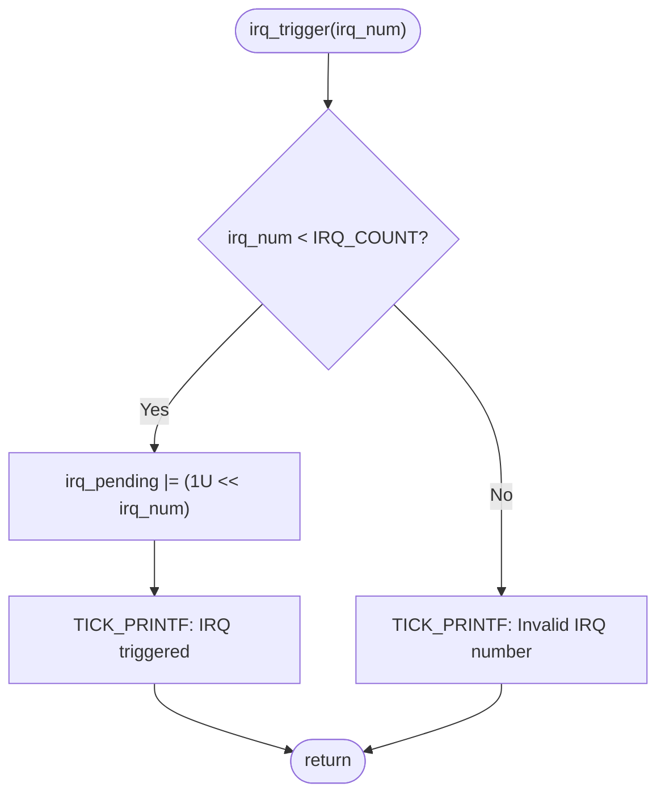
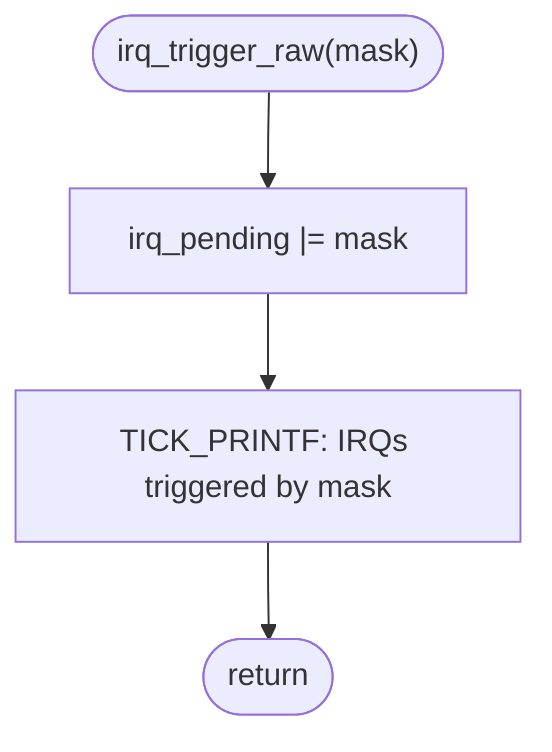
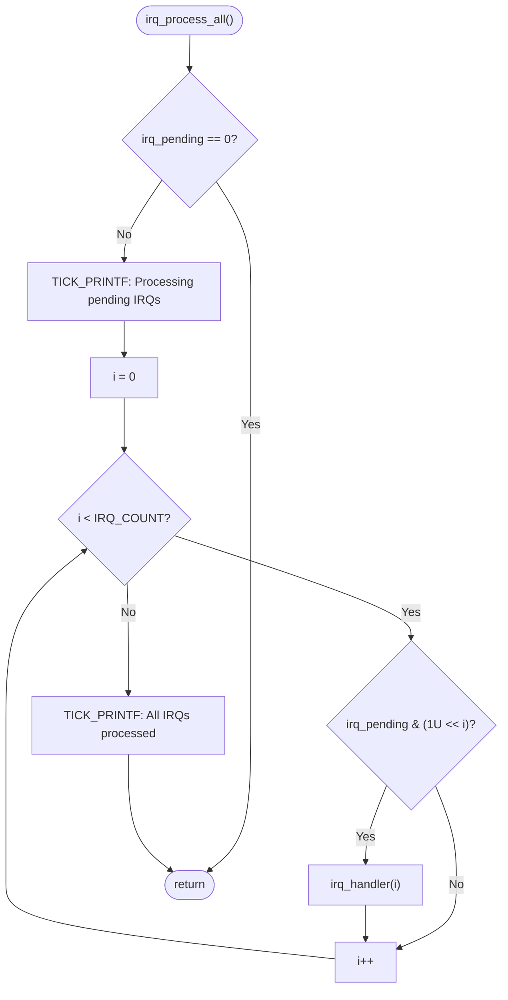
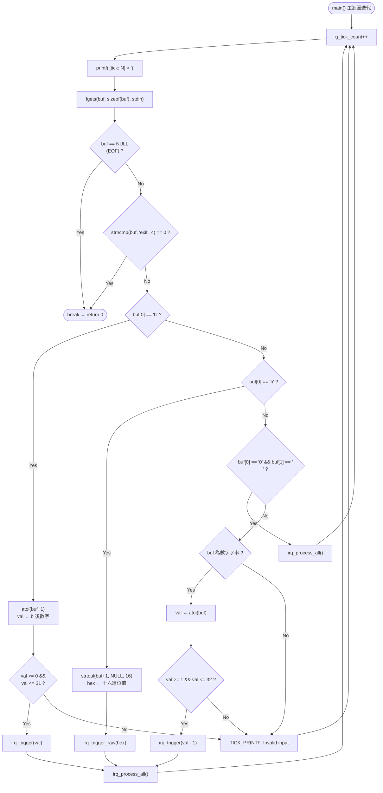
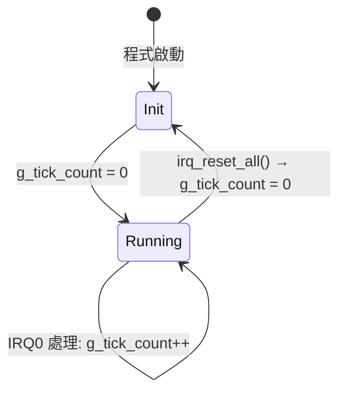
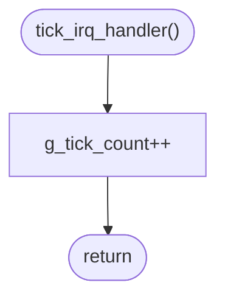
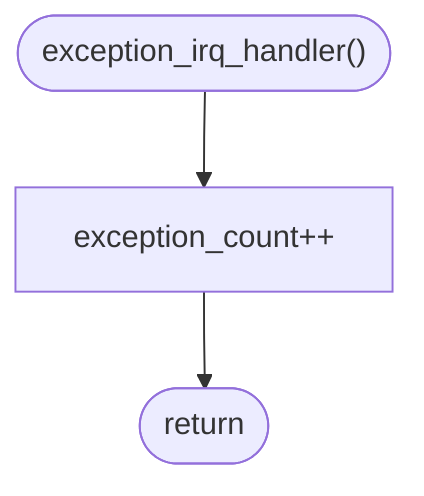

# IRQ Simulator - Software Detailed Design (Cline)

## 1. Design Overview

本文件描述 IRQ 模擬器的詳細設計，包含介面定義、資料結構、演算法與關鍵設計決策。本文件追溯至軟體架構文件中的 SA_C 項及軟體需求規格中的 SR 項。

## 2. Interface Design

### 2.1 Public API (`inc/main.h`)

```c
#define IRQ_COUNT  32U

/* --- 全域中斷控制（模擬樁） --- */
void __disable_irq(void);               /* 關閉全域中斷（無操作） */
void __enable_irq(void);                /* 開啟全域中斷（無操作） */

/* --- ISR 處理函式 --- */
void tick_irq_handler(void);            /* Tick 中斷處理：遞增 g_tick_count */
void exception_irq_handler(void);       /* 例外中斷處理：遞增 exception_count */

/* --- IRQ 觸發 --- */
void irq_trigger(uint32_t irq_num);     /* 觸發指定 IRQ（含範圍檢查） */

/* --- IRQ 處理 --- */
void irq_process_all(void);             /* 依優先權處理所有 pending IRQ */

/* --- 測試存取函式（TEST_BUILD 時可見） --- */
void        irq_trigger_raw(uint32_t mask);  /* 以 raw mask 觸發多個 IRQ */
void        irq_handler(uint32_t irq_num);  /* 處理指定 IRQ（switch-case） */
uint32_t    irq_get_pending(void);           /* 讀取 pending register */
uint32_t    irq_get_tick(void);              /* 讀取 tick 計數 */
void        irq_reset_all(void);             /* 重置所有狀態 */
uint32_t    exception_get_count(void);       /* 讀取 exception 計數 */
```

- 生產建構 (`trae_test`)：`irq_trigger_raw()`, `irq_handler()`, `irq_get_pending()`, `irq_get_tick()`, `irq_reset_all()`, `exception_get_count()` 具有 `static` 內部鏈結 **(MISRA R8.7 合規)**
- 測試建構 (`unit_test`, `integrated_test`)：上述函式透過 `FW_STATIC` 巨集的外部鏈結以進行隔離測試

### 2.2 Internal State

```c
/* --- 檔案層級內部狀態（static 隱藏實作細節） --- */
static uint32_t irq_pending = 0U;       /* 32-bit pending register */
static uint32_t g_tick_count = 0U;      /* 全域 tick 計數器 */
static uint32_t exception_count = 0U;   /* Exception 觸發計數 */
```

### 2.3 Logging Macro

```c
#define TICK_PRINTF(fmt, ...) \
    printf("[tick: %05u] " fmt, g_tick_count, ##__VA_ARGS__)
```

- **用途**：所有 log 輸出統一帶 `[tick: N]` 前綴 **(SR_039)**
- **說明**：`##__VA_ARGS__` 為 GNU 擴充，支援零參數呼叫（如 `TICK_PRINTF("Hello")`）
- **替代方案**：包裝函式 — 巨集在編譯期展開，零呼叫開銷

### 2.4 FW_STATIC 機制

```c
#ifdef TEST_BUILD
#define FW_STATIC
#else
#define FW_STATIC static
#endif
```

- **生產建構**：`FW_STATIC` 展開為 `static`，函式具有內部鏈結
- **測試建構**：`FW_STATIC` 展開為空，函式具有外部鏈結，測試程式碼可直接呼叫

---

## 3. Algorithm Design

### 3.1 IRQ Trigger Algorithm — `irq_trigger(irq_num)`

```
用途: 設定指定 IRQ 編號的 pending bit
追溯: SA_C_008 | SR_003, SR_004, SR_005, SR_042
參數: irq_num — 0..31
行為: irq_pending |= (1U << irq_num)
邊界: irq_num >= IRQ_COUNT (32) 時忽略請求，輸出錯誤訊息
```



### 3.2 IRQ Trigger Raw Algorithm — `irq_trigger_raw(mask)`

```
用途: 透過原始 bitmask 直接設定 pending register
追溯: SA_C_009 | SR_003, SR_006
參數: mask — 32-bit 遮罩值
行為: irq_pending |= mask
```



### 3.3 IRQ Process-All Algorithm — `irq_process_all()`

```
用途: 依優先權順序處理所有 pending IRQ
追溯: SA_C_011 | SR_007, SR_008
演算法:
  for i = 0 to (IRQ_COUNT - 1)
      if (irq_pending & (1U << i))
          irq_handler(i)
優先權: IRQ0 最高 (i=0), IRQ31 最低 (i=31)
```



### 3.4 IRQ Handler Dispatch Algorithm — `irq_handler(irq_num)`

```
用途: 依照 IRQ 編號分發至對應的外設模擬行為
追溯: SA_C_012, SA_C_013, SA_C_014, SA_C_015 | SR_009, SR_010~SR_035, SR_045
清除: irq_pending &= ~(1U << irq_num)
```



```mermaid
flowchart TD
    START(["irq_handler(irq_num)"])
    LOG["TICK_PRINTF: Handling IRQ<num>"]
    SWITCH{"irq_num?"}
    
    CASE0["tick_irq_handler()"]
    CASE1["TICK_PRINTF: UART0 RX"]
    CASE2["TICK_PRINTF: UART0 TX"]
    CASE3["TICK_PRINTF: GPIO Port A"]
    CASE4["TICK_PRINTF: GPIO Port B"]
    CASE5["TICK_PRINTF: SPI0"]
    CASE6["TICK_PRINTF: I2C0"]
    CASE7["TICK_PRINTF: ADC"]
    CASE8["TICK_PRINTF: DMA Ch0"]
    CASE9["TICK_PRINTF: DMA Ch1"]
    CASE10["TICK_PRINTF: Watchdog"]
    CASE11["TICK_PRINTF: RTC"]
    CASE12["TICK_PRINTF: USB"]
    CASE13["TICK_PRINTF: CAN0"]
    CASE14["TICK_PRINTF: PWM"]
    CASE15["TICK_PRINTF: Timer1"]
    CASE16["TICK_PRINTF: Timer2"]
    CASE17["TICK_PRINTF: UART1 RX"]
    CASE18["TICK_PRINTF: UART1 TX"]
    CASE19["TICK_PRINTF: SPI1"]
    CASE20["TICK_PRINTF: I2C1"]
    CASE21["TICK_PRINTF: External INT0"]
    CASE22["TICK_PRINTF: External INT1"]
    CASE23["TICK_PRINTF: External INT2"]
    CASE24["TICK_PRINTF: DMA Ch2"]
    CASE25["TICK_PRINTF: DMA Ch3"]
    CASE26["TICK_PRINTF: CRC"]
    CASE27["TICK_PRINTF: AES"]
    CASE28["TICK_PRINTF: QSPI"]
    CASE29["TICK_PRINTF: SDIO"]
    CASE30["TICK_PRINTF: Ethernet"]
    CASE31["exception_irq_handler()"]
    
    CLEAR["irq_pending &= ~(1U << irq_num)"]
    END_(["return"])

    START --> LOG
    LOG --> SWITCH
    SWITCH -->|"0"| CASE0
    SWITCH -->|"1..30"| CASES["各 IRQ 對應分支"]
    SWITCH -->|"31"| CASE31
    
    CASE0 --> CLEAR
    CASES --> CLEAR
    CASE31 --> CLEAR
    CLEAR --> END_
```

#### IRQ Handler 行為對照表

| IRQ | 模擬周邊 | 行為 | SA_C | SR |
|-----|---------|------|------|----|
| IRQ0 | System Timer | `tick_irq_handler()` → `g_tick_count++` | SA_C_013 | SR_010, SR_036, SR_038 |
| IRQ1 | UART0 RX | `TICK_PRINTF("UART0 RX: data received")` | SA_C_015 | SR_011 |
| IRQ2 | UART0 TX | `TICK_PRINTF("UART0 TX: data transmitted")` | SA_C_015 | SR_012 |
| IRQ3 | GPIO Port A | `TICK_PRINTF("GPIO Port A: pin state changed")` | SA_C_015 | SR_013 |
| IRQ4 | GPIO Port B | `TICK_PRINTF("GPIO Port B: pin state changed")` | SA_C_015 | SR_014 |
| IRQ5 | SPI0 | `TICK_PRINTF("SPI0: transfer complete")` | SA_C_015 | SR_015 |
| IRQ6 | I2C0 | `TICK_PRINTF("I2C0: transaction complete")` | SA_C_015 | SR_016 |
| IRQ7 | ADC | `TICK_PRINTF("ADC: conversion complete")` | SA_C_015 | SR_017 |
| IRQ8~9 | DMA Ch0~1 | `TICK_PRINTF("DMA Ch<n>: transfer complete")` | SA_C_015 | SR_018 |
| IRQ10 | Watchdog | `TICK_PRINTF("Watchdog: timer expired")` | SA_C_015 | SR_019 |
| IRQ11 | RTC | `TICK_PRINTF("RTC: alarm triggered")` | SA_C_015 | SR_020 |
| IRQ12 | USB | `TICK_PRINTF("USB: device event")` | SA_C_015 | SR_021 |
| IRQ13 | CAN0 | `TICK_PRINTF("CAN0: message received")` | SA_C_015 | SR_022 |
| IRQ14 | PWM | `TICK_PRINTF("PWM: period elapsed")` | SA_C_015 | SR_023 |
| IRQ15~16 | Timer1~2 | `TICK_PRINTF("Timer<n>: compare match/overflow")` | SA_C_015 | SR_024 |
| IRQ17~18 | UART1 RX/TX | 資料傳輸模擬 | SA_C_015 | SR_025 |
| IRQ19 | SPI1 | `TICK_PRINTF("SPI1: transfer complete")` | SA_C_015 | SR_026 |
| IRQ20 | I2C1 | `TICK_PRINTF("I2C1: transaction complete")` | SA_C_015 | SR_027 |
| IRQ21~23 | External INT0~2 | `TICK_PRINTF("External INT<n>: interrupt")` | SA_C_015 | SR_028 |
| IRQ24~25 | DMA Ch2~3 | `TICK_PRINTF("DMA Ch<n>: transfer complete")` | SA_C_015 | SR_029 |
| IRQ26 | CRC | `TICK_PRINTF("CRC: calculation complete")` | SA_C_015 | SR_030 |
| IRQ27 | AES | `TICK_PRINTF("AES: encryption complete")` | SA_C_015 | SR_031 |
| IRQ28 | QSPI | `TICK_PRINTF("QSPI: command complete")` | SA_C_015 | SR_032 |
| IRQ29 | SDIO | `TICK_PRINTF("SDIO: card event")` | SA_C_015 | SR_033 |
| IRQ30 | Ethernet | `TICK_PRINTF("Ethernet: packet received")` | SA_C_015 | SR_034 |
| IRQ31 | Exception | `exception_irq_handler()` → `exception_count++` | SA_C_014 | SR_035 |

### 3.5 Input Parsing Algorithm

```
用途: 解析使用者輸入並觸發對應 IRQ 行為
追溯: SA_C_006, SA_C_016, SA_C_017, SA_C_018, SA_C_019
      | SR_004, SR_005, SR_006, SR_037, SR_040, SR_041, SR_042, SR_043
```



---

## 4. Data Structure Design

### 4.1 IRQ Pending Register — `irq_pending`

```
類型: uint32_t
作用域: static（檔案層級）
初始值: 0U
描述: 32-bit pending register，每個 bit 對應一個 IRQ 通道
追溯: SA_C_002 | SR_001, SR_002, SR_003
```



```mermaid
block-beta
    columns 32
    bit31["31"]:1
    bit30["30"]:1
    bit29["29"]:1
    bit28["28"]:1
    bit27["27"]:1
    bit26["26"]:1
    bit25["25"]:1
    bit24["24"]:1
    bit23["23"]:1
    bit22["22"]:1
    bit21["21"]:1
    bit20["20"]:1
    bit19["19"]:1
    bit18["18"]:1
    bit17["17"]:1
    bit16["16"]:1
    bit15["15"]:1
    bit14["14"]:1
    bit13["13"]:1
    bit12["12"]:1
    bit11["11"]:1
    bit10["10"]:1
    bit9["9"]:1
    bit8["8"]:1
    bit7["7"]:1
    bit6["6"]:1
    bit5["5"]:1
    bit4["4"]:1
    bit3["3"]:1
    bit2["2"]:1
    bit1["1"]:1
    bit0["0"]:1
```

```txt
Bit 0  = IRQ0  (System Timer)      — 最高優先權
Bit 31 = IRQ31 (Exception)         — 最低優先權
```

### 4.2 Global Tick Counter — `g_tick_count`

```
類型: uint32_t
作用域: static（檔案層級）
初始值: 0U
增量時機:
  - 每次主迴圈迭代開始時: g_tick_count++
  - IRQ0 (System Timer) 處理時: tick_irq_handler() → g_tick_count++
追溯: SA_C_003 | SR_036, SR_037, SR_038
```



### 4.3 Exception Count — `exception_count`

```
類型: uint32_t
作用域: static（檔案層級）
初始值: 0U
增量時機: IRQ31 處理時: exception_irq_handler() → exception_count++
追溯: SA_C_014 | SR_035
```

---

## 5. Error Handling Design

| 情境 | 處理方式 | 追溯 |
|------|---------|------|
| IRQ 編號超出範圍 (≥32) | 輸出 `"[tick: N] Invalid IRQ number"`，不修改 pending register | SR_042, SR_043 |
| b-mode 參數無效（無數字或超出 0-31） | 輸出 `"[tick: N] Invalid bit mode"` | SR_042, SR_043 |
| h-mode 參數無效（非十六進位） | 輸出 `"[tick: N] Invalid hex mode"` | SR_042, SR_043 |
| 純數字超出 1-32 | 輸出 `"[tick: N] Invalid IRQ number (use 1-32)"` | SR_042, SR_043 |
| 無法解析的輸入 | 輸出 `"[tick: N] Invalid input"` | SR_042, SR_043 |
| stdin EOF (Ctrl+Z/Win, Ctrl+D/Linux) | 正常退出迴圈，`return 0` | — |

---

## 6. Tick Handler Design

### 6.1 `tick_irq_handler()`

```
用途: 遞增全域 tick 計數器
追溯: SA_C_013 | SR_010, SR_036, SR_038
行為: g_tick_count++
呼叫者:
  - IRQ0 處理路徑: irq_handler(0) → tick_irq_handler()
  - 主迴圈迭代: main() 中每次迴圈開始時呼叫
```



### 6.2 `exception_irq_handler()`

```
用途: 遞增 exception 觸發計數
追溯: SA_C_014 | SR_035
行為: exception_count++
呼叫者: irq_handler(31) → exception_irq_handler()
```



---

## 7. Design Decisions

### DD-01: 為何使用 static 檔案層級變數而非全域變數？

| 項目 | 說明 |
|------|------|
| **決策** | `irq_pending`, `g_tick_count`, `exception_count` 宣告為 `static` 檔案層級變數 |
| **追溯** | SA_C_001, SA_C_004 | SR_044 |
| **理由** | 限制變數可見範圍，避免外部模組意外修改 |
| **替代方案** | 全域變數 — 任何模組都可直接修改，違反封裝原則 |
| **測試策略** | 透過 `FW_STATIC` 巨集在測試建構中移除 `static`，測試程式碼可透過 `irq_get_pending()`、`irq_get_tick()` 等存取函式受控存取 |

### DD-02: 為何使用 `TICK_PRINTF` 巨集而非包裝函式？

| 項目 | 說明 |
|------|------|
| **決策** | 使用 `#define TICK_PRINTF(fmt, ...)` 巨集 |
| **追溯** | SA_C_007 | SR_039 |
| **理由** | 巨集在編譯期展開，零函式呼叫開銷；`##__VA_ARGS__` 支援零參數情況 |
| **替代方案** | `void tick_printf(const char *fmt, ...)` 包裝函式 — 增加函式呼叫開銷 |
| **注意** | `##__VA_ARGS__` 為 GNU 擴充，若需嚴格 C11 相容可用 `TICK_PRINTF(fmt, ...)` 要求至少一個可變參數 |

### DD-03: 為何 IRQ 處理後立即清除 pending bit 而非批次清除？

| 項目 | 說明 |
|------|------|
| **決策** | `irq_pending &= ~(1U << irq_num)` 在每個 IRQ 處理後立即執行 |
| **追溯** | SA_C_012 | SR_009 |
| **理由** | 模擬真實硬體 ISR 行為：中斷服務程式執行後清除中斷旗標；防止同一 IRQ 被重複處理 |
| **替代方案** | 批次清除 — 所有 IRQ 處理完畢後一次清除 — 可能在高優先權 IRQ 重新觸發的情境下遺失中斷 |

### DD-04: 為何 h-mode 使用 `|=` 而非 `=`？

| 項目 | 說明 |
|------|------|
| **決策** | `irq_trigger_raw()` 使用 `irq_pending |= mask` |
| **追溯** | SA_C_009 | SR_003, SR_006 |
| **理由** | 允許累積觸發：先觸發一些 IRQ（如數字或 b 模式），再用 h-mode 追加；更貼近真實中斷控制器的 OR 行為 |
| **替代方案** | `=` 賦值 — 會覆蓋之前觸發的 IRQ，不符合使用者預期 |
| **用例** | 使用者先輸入 `b5` (觸發 IRQ5)，再輸入 `h3` (追加 IRQ0, IRQ1) — 最終 pending 包含 IRQ0, IRQ1, IRQ5 |

### DD-05: 為何使用 `uint32_t` 而非 `unsigned int`？

| 項目 | 說明 |
|------|------|
| **決策** | 內部狀態統一使用 `uint32_t`（來自 `<stdint.h>`）|
| **追溯** | SA_C_002, SA_C_003 | SR_046 |
| **理由** | MISRA C 要求使用明確寬度的整數類型；`stdint.h` 為 C99/C11 標準，不依賴平台實作 |
| **替代方案** | `unsigned int` — 在不同平台上位元寬度可能不同（16-bit 或 32-bit） |

---

## 8. 詳細設計追溯表

### 8.1 設計項追溯表

| ID | 章節 | 追溯 SA_C | 追溯 SR | 描述 |
|----|------|-----------|---------|------|
| SD_C_001 | 2.1 | SA_C_004 | SR_001, SR_044 | Public API (`inc/main.h`)：6 個外部函式 + 7 個測試輔助函式 + `IRQ_COUNT` 常數 |
| SD_C_002 | 2.2 | SA_C_002, SA_C_003 | SR_001, SR_002, SR_003, SR_036, SR_037, SR_038 | 內部狀態：`irq_pending` (static uint32_t)、`g_tick_count` (static uint32_t)、`exception_count` (static uint32_t) |
| SD_C_003 | 2.3 | SA_C_007 | SR_039 | `TICK_PRINTF` 巨集：帶 `[tick: N]` 前綴的統一 log 輸出 |
| SD_C_004 | 2.4 | SA_C_001, SA_C_005 | SR_044 | `FW_STATIC` 機制：生產建構 `static` (MISRA R8.7)，測試建構外部鏈結 |
| SD_C_005 | 3.1 | SA_C_008 | SR_003, SR_004, SR_005, SR_042 | `irq_trigger()` 演算法：範圍檢查 → 位元設定 (`1U << irq_num`) → 日誌 |
| SD_C_006 | 3.2 | SA_C_009 | SR_003, SR_006 | `irq_trigger_raw()` 演算法：直接 OR 設定 pending register |
| SD_C_007 | 3.3 | SA_C_011 | SR_007, SR_008 | `irq_process_all()` 演算法：空檢查 → 優先權迴圈 (IRQ0→IRQ31) |
| SD_C_008 | 3.4 | SA_C_012, SA_C_013, SA_C_014, SA_C_015 | SR_009, SR_010~SR_035, SR_045 | `irq_handler()` 分發：switch-case 32 路 → 清除 pending bit |
| SD_C_009 | 3.5 | SA_C_006, SA_C_016, SA_C_017, SA_C_018, SA_C_019 | SR_004, SR_005, SR_006, SR_037, SR_040, SR_041, SR_042, SR_043 | 輸入解析演算法：tick 遞增 → 讀取 stdin → 模式解析 → 觸發 → 處理 |
| SD_C_010 | 4.1 | SA_C_002 | SR_001, SR_002, SR_003 | IRQ Pending Register 佈局：32-bit，Bit 0=IRQ0（最高優先權）至 Bit 31=IRQ31（最低優先權） |
| SD_C_011 | 4.2 | SA_C_003 | SR_036, SR_037, SR_038 | Tick 計數器生命週期：Init (0) → Running (迴圈/IRQ0 遞增) → Reset |
| SD_C_012 | 4.3 | SA_C_014 | SR_035 | Exception 計數：僅 IRQ31 處理時遞增 |
| SD_C_013 | 5 | SA_C_019 | SR_042, SR_043 | 錯誤處理：6 種情境（範圍越界、無效 b/h 模式、無效數字、無法解析、EOF） |
| SD_C_014 | 6.1 | SA_C_013 | SR_010, SR_036, SR_038 | `tick_irq_handler()`：遞增 `g_tick_count` |
| SD_C_015 | 6.2 | SA_C_014 | SR_035 | `exception_irq_handler()`：遞增 `exception_count` |
| SD_C_016 | 7 | SA_C_001, SA_C_004 | SR_044 | DD-01：static 檔案層級變數封裝 |
| SD_C_017 | 7 | SA_C_007 | SR_039 | DD-02：TICK_PRINTF 巨集選擇 |
| SD_C_018 | 7 | SA_C_012 | SR_009 | DD-03：立即清除 pending bit |
| SD_C_019 | 7 | SA_C_009 | SR_003, SR_006 | DD-04：h-mode 使用 `|=` 累積觸發 |
| SD_C_020 | 7 | SA_C_002, SA_C_003 | SR_046 | DD-05：使用 `uint32_t` 確保跨平台一致性 |

### 8.2 章節對照表

| 章節 | SD_C 範圍 | 數量 | 內容 |
|------|----------|------|------|
| 2 | SD_C_001 ~ SD_C_004 | 4 | 介面設計 |
| 3 | SD_C_005 ~ SD_C_009 | 5 | 演算法設計 |
| 4 | SD_C_010 ~ SD_C_012 | 3 | 資料結構設計 |
| 5 | SD_C_013 | 1 | 錯誤處理設計 |
| 6 | SD_C_014 ~ SD_C_015 | 2 | Tick Handler 設計 |
| 7 | SD_C_016 ~ SD_C_020 | 5 | 設計決策 |

### 8.3 追溯覆蓋率

| 架構項 (SA_C) | SA_C 總數 | 追溯數 | 覆蓋率 |
|--------------|----------|--------|--------|
| SA_C_001 ~ SA_C_023 | 23 | 20 | 87%* |

| 需求分類 | SR 範圍 | 總數 | 追溯數 | 覆蓋率 |
|----------|---------|------|--------|--------|
| FR-01 (IRQ 觸發機制) | SR_001~SR_003 | 3 | 3 | 100% |
| FR-02 (輸入模式) | SR_004~SR_006 | 3 | 3 | 100% |
| FR-03 (優先權處理) | SR_007~SR_009 | 3 | 3 | 100% |
| FR-04 (IRQ 行為) | SR_010~SR_035 | 26 | 26 | 100% |
| FR-05 (Tick 計數器) | SR_036~SR_039 | 4 | 4 | 100% |
| FR-06 (程式控制) | SR_040~SR_041 | 2 | 2 | 100% |
| NFR-01 (易用性) | SR_042~SR_043 | 2 | 2 | 100% |
| NFR-02 (可維護性) | SR_044~SR_045 | 2 | 2 | 100% |
| NFR-03 (可移植性) | SR_046~SR_047 | 2 | 2 | 100% |
| **總計** | SR_001~SR_047 | **47** | **47** | **100%** |

> \* 設計文件未覆蓋的架構項（SA_C_006, SA_C_010, SA_C_020~SA_C_023）屬於架構層級概念或已在其他設計文件中覆蓋
>
> **縮寫說明：**
>
> - **SD_C** = Software Detailed Design (Cline)（軟體詳細設計項，本文檔專屬編號）
> - **SA_C** = Software Architecture (Cline)（軟體架構項，追溯至 SWE.2 架構項）
> - **SR** = Software Requirement（軟體需求，追溯至 SWE.1 需求項）