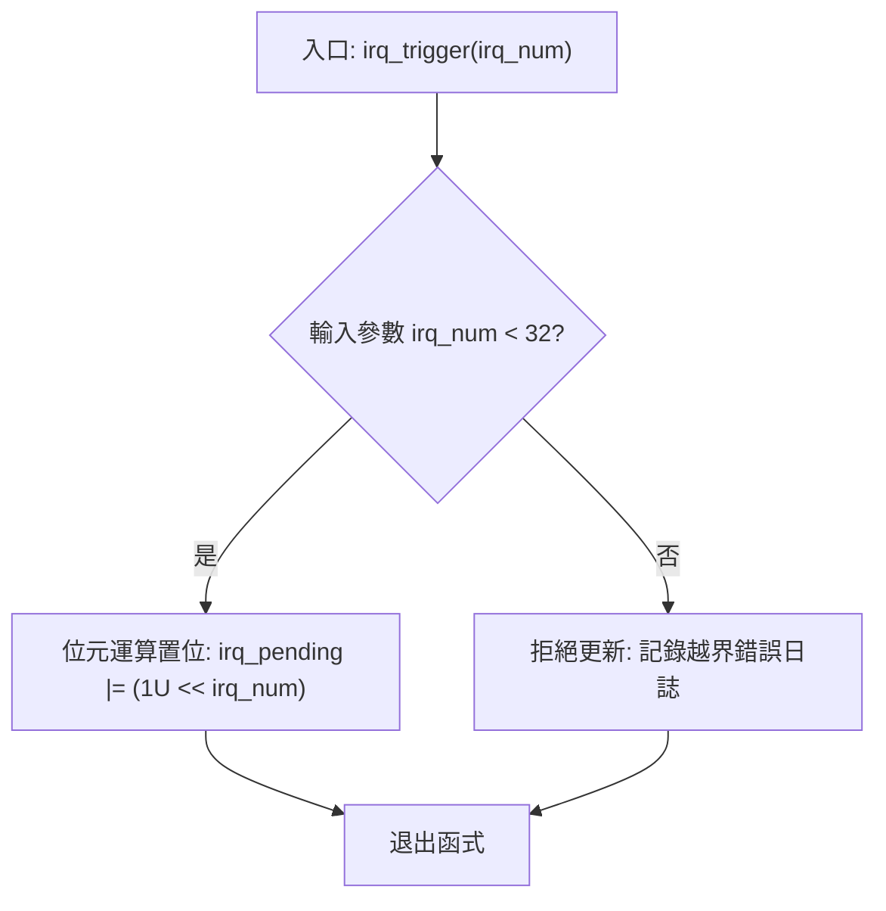
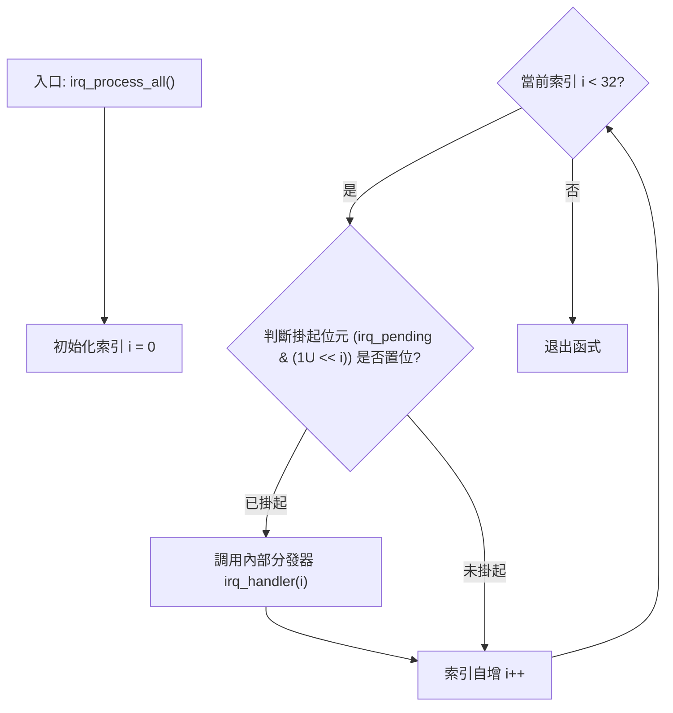

# IRQ Simulator - 軟體詳細設計說明書

## 1. 公開 API 介面規範說明 (`inc/main.h`)
外部控制介面導出了模擬中斷控制器線路所需的全部功能終點，以便進行全面白盒驗證。

```c
#ifndef MAIN_H
#define MAIN_H

#include <stdint.h>

#define IRQ_COUNT 32U

/* 公開核心應用層 API */
void tick_irq_handler(void);
void exception_irq_handler(void);
void irq_trigger(uint32_t irq_num);
void irq_process_all(void);

/* 測試樁專用存取 API - 透過 FW_STATIC 巨集控制內部/外部鏈結性 */
#ifdef TEST_BUILD
#define FW_STATIC
#else
#define FW_STATIC static
#endif

FW_STATIC void irq_trigger_raw(uint32_t mask);
FW_STATIC void irq_handler(uint32_t irq_num);
FW_STATIC uint32_t irq_get_pending(void);
FW_STATIC uint32_t irq_get_tick(void);
FW_STATIC void irq_reset_all(void);
FW_STATIC uint32_t exception_get_count(void);

#endif /* MAIN_H */
```

## 2. 內部微觀狀態變數定義
```c
static uint32_t irq_pending = 0U;       /* 32位元原子中斷 pending 暫存暫存器 */
static uint32_t g_tick_count = 0U;      /* 單調遞增的全局系統 tick 計數器 */
static uint32_t exception_count = 0U;   /* 專門用於捕獲和記錄 IRQ31 硬體異常觸發的帳本 */
```

## 3. 高性能執行日誌巨集實作
```c
#define TICK_PRINTF(fmt, ...) \
    do { \
        (void)printf("[tick: %05u] " fmt, g_tick_count, ##__VA_ARGS__); \
    } while(0)
```

## 4. 核心功能演算法微觀邏輯設計

### 4.1 參數校驗位設定演算法: `irq_trigger(irq_num)`
* **前置條件**: 已成功解析輸入的 `irq_num` 權杖。
* **處理邏輯**: 評估邊界約束。若 `irq_num >= 32`，則拒絕修改暫存器，並透過 `TICK_PRINTF` 路由錯誤警告日誌；否則，對目標通道進行位元遮罩置位。
* **後置條件**: `irq_pending |= (1U << irq_num)`。



### 4.2 確定性掃描分支排程演算法: `irq_process_all()`
* **執行序列**: 嚴格迴圈迭代索引 `i` 從 `0` 至 `31`。透過位元與 `&` 運算隔離掛起位。若位元激活，則排程內部分發處理器。
* **優先權規則**: 從 0 位元至 31 位元嚴格順序檢索，完美保障了低位號（高優先權）先被排程。



## 5. 32路中斷分發樹及外設模擬行為對照表
當 `irq_handler(irq_num)` 被呼叫並命中對應分支時，系統會立即透過 `irq_pending &= ~(1U << irq_num)` 清除當前掛起狀態，並輸出標準化外設運行日誌。

| 中斷通道 | 模擬硬體外設 | 關聯的底層例程 / 顯式控制台模擬日誌輸出語句 | 追溯需求項 |
| :--- | :--- | :--- | :--- |
| **IRQ0** | 系統定時器 | 呼叫 `tick_irq_handler()` -> 執行 `g_tick_count++` | SR_010, SR_038 |
| **IRQ1** | UART0 接收 | `TICK_PRINTF("UART0 RX: data received\n")` | SR_011 |
| **IRQ2** | UART0 發送 | `TICK_PRINTF("UART0 TX: data transmitted\n")` | SR_012 |
| **IRQ3** | GPIO 埠 A | `TICK_PRINTF("GPIO Port A: pin state changed\n")` | SR_013 |
| **IRQ4** | GPIO 埠 B | `TICK_PRINTF("GPIO Port B: pin state changed\n")` | SR_014 |
| **IRQ5** | SPI0 模組 | `TICK_PRINTF("SPI0: transfer complete\n")` | SR_015 |
| **IRQ6** | I2C0 控制器 | `TICK_PRINTF("I2C0: transaction complete\n")` | SR_016 |
| **IRQ7** | ADC 轉換單元 | `TICK_PRINTF("ADC: conversion complete\n")` | SR_017 |
| **IRQ8** | DMA 通道 0 | `TICK_PRINTF("DMA Ch0: transfer complete\n")` | SR_018 |
| **IRQ9** | DMA 通道 1 | `TICK_PRINTF("DMA Ch1: transfer complete\n")` | SR_018 |
| **IRQ10**| 看門狗定時器 | `TICK_PRINTF("Watchdog: timer expired\n")` | SR_019 |
| **IRQ11**| RTC 即時時鐘 | `TICK_PRINTF("RTC: alarm triggered\n")` | SR_020 |
| **IRQ12**| USB 終點控制器 | `TICK_PRINTF("USB: device event\n")` | SR_021 |
| **IRQ13**| CAN0 協定引擎 | `TICK_PRINTF("CAN0: message received\n")` | SR_022 |
| **IRQ14**| PWM 調變器 | `TICK_PRINTF("PWM: period elapsed\n")` | SR_023 |
| **IRQ15**| 基本定時器 1 | `TICK_PRINTF("Timer1: compare match/overflow\n")` | SR_024 |
| **IRQ16**| 基本定時器 2 | `TICK_PRINTF("Timer2: compare match/overflow\n")` | SR_024 |
| **IRQ17**| UART1 接收 | `TICK_PRINTF("UART1 RX: characters buffered\n")` | SR_025 |
| **IRQ18**| UART1 發送 | `TICK_PRINTF("UART1 TX: bus idle\n")` | SR_025 |
| **IRQ19**| SPI1 模組 | `TICK_PRINTF("SPI1: transfer complete\n")` | SR_026 |
| **IRQ20**| I2C1 控制器 | `TICK_PRINTF("I2C1: transaction complete\n")` | SR_027 |
| **IRQ21**| 外部中斷線 0 | `TICK_PRINTF("External INT0: edge triggered interrupt\n")` | SR_028 |
| **IRQ22**| 外部中斷線 1 | `TICK_PRINTF("External INT1: edge triggered interrupt\n")` | SR_028 |
| **IRQ23**| 外部中斷線 2 | `TICK_PRINTF("External INT2: edge triggered interrupt\n")` | SR_028 |
| **IRQ24**| DMA 通道 2 | `TICK_PRINTF("DMA Ch2: block move complete\n")` | SR_029 |
| **IRQ25**| DMA 通道 3 | `TICK_PRINTF("DMA Ch3: block move complete\n")` | SR_029 |
| **IRQ26**| CRC 計算加速器 | `TICK_PRINTF("CRC: calculation complete\n")` | SR_030 |
| **IRQ27**| AES 加密單元 | `TICK_PRINTF("AES: encryption complete\n")` | SR_031 |
| **IRQ28**| QSPI 快閃記憶體介面 | `TICK_PRINTF("QSPI: command complete\n")` | SR_032 |
| **IRQ29**| SDIO 引擎 | `TICK_PRINTF("SDIO: card event detected\n")` | SR_033 |
| **IRQ30**| 乙太網路 MAC 層 | `TICK_PRINTF("Ethernet: packet received\n")` | SR_034 |
| **IRQ31**| 硬體系統異常 | 呼叫 `exception_irq_handler()` -> 執行 `exception_count++` | SR_035 |

---

## 6. 軟體詳細設計需求雙向追溯矩陣
| 詳細設計設計項 ID | 對應軟體元件 | 追溯的軟硬體架構 ID (SA) | 追溯的底層軟體需求 ID (SR) |
| :--- | :--- | :--- | :--- |
| SD_001 | 公開介面定義 | SA_002 | SR_001, SR_044 |
| SD_002 | 核心微觀狀態變數 | SA_003, SA_004 | SR_002, SR_036 |
| SD_003 | 格式化日誌發生器巨集 | SA_005 | SR_039 |
| SD_004 | 輸入參數邊界校驗演算法 | SA_005 | SR_003, SR_004, SR_042 |
| SD_005 | 固定優先權輪詢排程分支 | SA_002, SA_005 | SR_007, SR_008 |
| SD_006 | 32路精確分發對應表樹 | SA_003, SA_005 | SR_009, SR_010 至 SR_035 |
