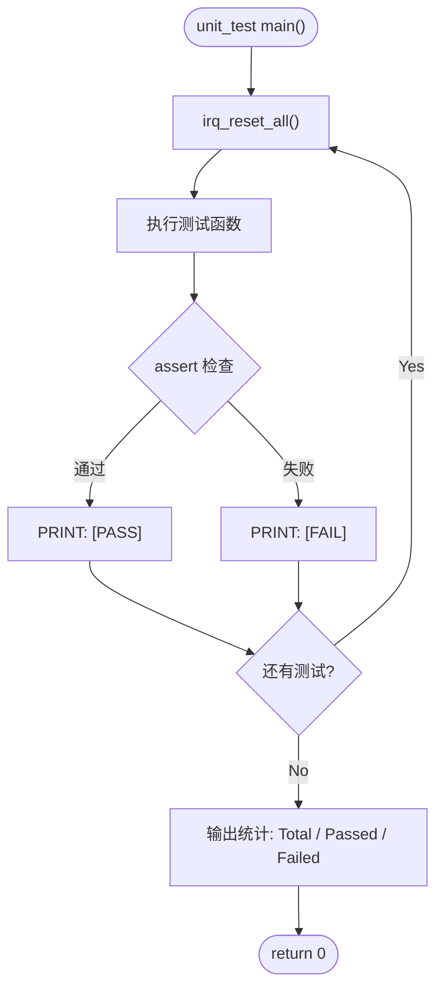

# IRQ Simulator - Unit Test Plan

## 1. Test Scope

单元测试针对 `main.c` 中的每个独立函数进行验证，确保各函数在隔离环境下行为正确。

## 2. Test Environment

- 编译器：GCC (MinGW)
- 语言标准：C11
- 测试框架：自定义 assert 宏（无外部依赖）
- 每个测试用例前调用 `irq_reset_all()` 重置状态

## 3. Test Cases

### UT-01: tick_irq_handler

| ID | 测试项 | 输入 | 预期结果 |
|----|---------|------|---------|
| UT-01-01 | tick 初始值 | 无 | `irq_get_tick() == 0` |
| UT-01-02 | 单次调用 | `tick_irq_handler()` | `irq_get_tick() == 1` |
| UT-01-03 | 多次调用 | 调用 5 次 | `irq_get_tick() == 5` |
| UT-01-04 | 重置后调用 | reset → 调用 3 次 | `irq_get_tick() == 3` |

### UT-02: exception_irq_handler

| ID | 测试项 | 输入 | 预期结果 |
|----|---------|------|---------|
| UT-02-01 | 函数可被调用不崩溃 | `exception_irq_handler()` | 正常返回 |
| UT-02-02 | 多次调用 | 调用 3 次 | 正常返回，无副作用 |

### UT-03: irq_trigger

| ID | 测试项 | 输入 | 预期结果 |
|----|---------|------|---------|
| UT-03-01 | 触发 IRQ0 | `irq_trigger(0)` | `irq_get_pending() == 0x00000001` |
| UT-03-02 | 触发 IRQ5 | `irq_trigger(5)` | `irq_get_pending() == 0x00000020` |
| UT-03-03 | 触发 IRQ31 | `irq_trigger(31)` | `irq_get_pending() == 0x80000000` |
| UT-03-04 | 累积触发 | trigger(0), trigger(1) | `irq_get_pending() == 0x00000003` |
| UT-03-05 | 重复触发 | trigger(0), trigger(0) | `irq_get_pending() == 0x00000001` |
| UT-03-06 | 无效 IRQ (32) | `irq_trigger(32)` | pending 不变 |
| UT-03-07 | 无效 IRQ (99) | `irq_trigger(99)` | pending 不变 |

### UT-04: irq_handler

| ID | 测试项 | 输入 | 预期结果 |
|----|---------|------|---------|
| UT-04-01 | 处理 IRQ0 | trigger(0) → handler(0) | pending bit 0 清除，tick+1 |
| UT-04-02 | 处理 IRQ5 | trigger(5) → handler(5) | pending bit 5 清除 |
| UT-04-03 | 处理 IRQ31 | trigger(31) → handler(31) | pending bit 31 清除 |
| UT-04-04 | 处理后 pending 归零 | trigger(0) → handler(0) | `irq_get_pending() == 0` |

### UT-05: irq_process_all

| ID | 测试项 | 输入 | 预期结果 |
|----|---------|------|---------|
| UT-05-01 | 无 pending 时 | `irq_process_all()` | 直接返回，无动作 |
| UT-05-02 | 单一 IRQ | trigger(3) → process_all | IRQ3 被处理，pending=0 |
| UT-05-03 | 多重 IRQ | trigger(0), trigger(5), trigger(10) | 依次处理 0→5→10，pending=0 |
| UT-05-04 | 全 IRQ | trigger all 0-31 | 全部处理完毕，pending=0 |

### UT-06: irq_reset_all

| ID | 测试项 | 输入 | 预期结果 |
|----|---------|------|---------|
| UT-06-01 | 重置 pending | trigger(5) → reset | `irq_get_pending() == 0` |
| UT-06-02 | 重置 tick | tick++ x3 → reset | `irq_get_tick() == 0` |
| UT-06-03 | 重置两者 | trigger + tick → reset | pending=0, tick=0 |

### UT-07: irq_get_pending / irq_get_tick

| ID | 测试项 | 输入 | 预期结果 |
|----|---------|------|---------|
| UT-07-01 | 初始 pending | reset → get_pending | 返回 0 |
| UT-07-02 | 初始 tick | reset → get_tick | 返回 0 |
| UT-07-03 | 触发后 pending | trigger(7) → get_pending | 返回 0x00000080 |

## 4. Expected Results

- 所有 UT-01 ~ UT-07 测试用例须全部通过
- 通过率：100%