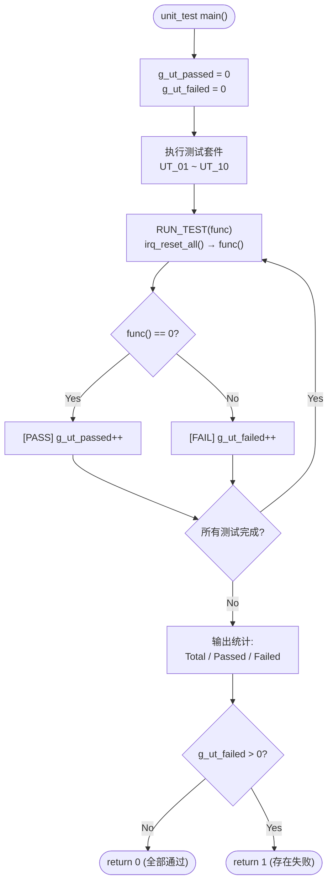

# IRQ Simulator - Unit Verification (Cline)

## 1. Test Scope

单元测试针对 `src/main.c` 中的每个独立函数进行验证，确保各函数在隔离环境下行为正确。本文档追溯至详细设计文档中的 SD_C 项及软件需求规格中的 SR 项。

## 2. Test Environment

- **编译器**：GCC (MinGW)
- **语言标准**：C11
- **测试框架**：自定义 assert 宏（无外部依赖）：`UT_ASSERT(cond, msg)`、`UT_ASSERT_EQ(a, b, msg)`、`UT_ASSERT_HEX_EQ(a, b, msg)`
- **执行入口**：`unit_test/main.c` → `run_all_unit_tests()` → 10 个测试套件 (UT_01 ~ UT_10)
- **状态重置**：每个测试用例前通过 `RUN_TEST()` 宏调用 `irq_reset_all()` 重置状态
- **计数器**：`g_ut_passed` / `g_ut_failed` 全局累加，最终输出统计

### 2.1 Test Runner 流程



## 3. 测试框架 — 自定义 Assert 宏

测试框架定义于 `unit_test/unit_test.h`，提供三种 assert 宏：

| 宏 | 格式 | 说明 |
|----|------|------|
| `UT_ASSERT(cond, msg)` | `printf("[FAIL] %s\n", msg)` if cond == 0 | 通用条件断言 |
| `UT_ASSERT_EQ(a, b, msg)` | `printf("[FAIL] %s: expected %d, got %d\n", ...)` | 整数相等断言 |
| `UT_ASSERT_HEX_EQ(a, b, msg)` | `printf("[FAIL] %s: expected 0x%08X, got 0x%08X\n", ...)` | 十六进制相等断言 |

## 4. Test Cases

### UT_01: tick_irq_handler

| ID | 测试项 | 输入 | 预期结果 | 验证方式 |
|----|---------|------|---------|----------|
| UT_01_01 | tick 初始值 | reset → `irq_get_tick()` | `irq_get_tick() == 0` | `UT_ASSERT_EQ` |
| UT_01_02 | 单次调用 | `tick_irq_handler()` → `irq_get_tick()` | `irq_get_tick() == 1` | `UT_ASSERT_EQ` |
| UT_01_03 | 多次调用 | 调用 5 次 → `irq_get_tick()` | `irq_get_tick() == 5` | `UT_ASSERT_EQ` |
| UT_01_04 | 重置后调用 | 先调 3 次 → reset → 再调 3 次 | `irq_get_tick() == 3` | `UT_ASSERT_EQ` |

**追踪**：SD_C_014 | SR_010, SR_036, SR_038

### UT_02: exception_irq_handler

| ID | 测试项 | 输入 | 预期结果 | 验证方式 |
|----|---------|------|---------|----------|
| UT_02_01 | 函数可被调用不崩溃 | `exception_irq_handler()` | 正常返回 | `UT_ASSERT(1, ...)` |
| UT_02_02 | 多次调用 | 调用 3 次 | 正常返回，无副作用 | `UT_ASSERT(1, ...)` |
| UT_02_03 | 内部计数器验证 | 调用 3 次 → `exception_get_count()` | `exception_get_count() == 3` | `UT_ASSERT_EQ` |

**追踪**：SD_C_015 | SR_035

### UT_03: irq_trigger

| ID | 测试项 | 输入 | 预期结果 | 验证方式 |
|----|---------|------|---------|----------|
| UT_03_01 | 触发 IRQ0 | `irq_trigger(0)` → `irq_get_pending()` | `0x00000001` | `UT_ASSERT_HEX_EQ` |
| UT_03_02 | 触发 IRQ5 | `irq_trigger(5)` → `irq_get_pending()` | `0x00000020` | `UT_ASSERT_HEX_EQ` |
| UT_03_03 | 触发 IRQ31 | `irq_trigger(31)` → `irq_get_pending()` | `0x80000000` | `UT_ASSERT_HEX_EQ` |
| UT_03_04 | 累积触发 | trigger(0), trigger(1) | `0x00000003` | `UT_ASSERT_HEX_EQ` |
| UT_03_05 | 重复触发 | trigger(0), trigger(0) | `0x00000001`（不翻转） | `UT_ASSERT_HEX_EQ` |
| UT_03_06 | 无效 IRQ (32) | trigger(32) → pending 不变 | pending 与之前相同 | `UT_ASSERT_HEX_EQ` |
| UT_03_07 | 无效 IRQ (99) | trigger(99) → pending 不变 | pending 与之前相同 | `UT_ASSERT_HEX_EQ` |

**追踪**：SD_C_005, SD_C_010 | SR_001, SR_002, SR_003, SR_004, SR_005, SR_042

### UT_04: irq_handler

| ID | 测试项 | 输入 | 预期结果 | 验证方式 |
|----|---------|------|---------|----------|
| UT_04_01 | 处理 IRQ0 | trigger(0) → handler(0) | pending=0, tick=1 | `UT_ASSERT_HEX_EQ` + `UT_ASSERT_EQ` |
| UT_04_02 | 处理 IRQ5 | trigger(5) → handler(5) | pending=0 | `UT_ASSERT_HEX_EQ` |
| UT_04_03 | 处理 IRQ31 | trigger(31) → handler(31) | pending=0 | `UT_ASSERT_HEX_EQ` |
| UT_04_04 | 处理后 pending 归零 | trigger(0) → handler(0) → `irq_get_pending()` | `0` | `UT_ASSERT_HEX_EQ` |
| UT_04_05 | 无效 IRQ 号（default 分支） | `irq_handler(99)` | 不崩溃 | `UT_ASSERT(1, ...)` |

**追踪**：SD_C_008 | SR_009, SR_010~SR_035, SR_045

### UT_05: irq_process_all

| ID | 测试项 | 输入 | 预期结果 | 验证方式 |
|----|---------|------|---------|----------|
| UT_05_01 | 无 pending 时 | `irq_process_all()` | pending 仍为 0 | `UT_ASSERT_HEX_EQ` |
| UT_05_02 | 单一 IRQ | trigger(3) → process_all | pending=0 | `UT_ASSERT_HEX_EQ` |
| UT_05_03 | 多重 IRQ | trigger(0), trigger(5), trigger(10) → process_all | pending=0 | `UT_ASSERT_HEX_EQ` |
| UT_05_04 | 全部 32 个 IRQ | for i=0..31: trigger(i) → process_all | pending=0 | `UT_ASSERT_HEX_EQ` |

**追踪**：SD_C_007 | SR_007, SR_008

### UT_06: irq_reset_all

| ID | 测试项 | 输入 | 预期结果 | 验证方式 |
|----|---------|------|---------|----------|
| UT_06_01 | 重置 pending | trigger(5) → reset → `irq_get_pending()` | `0` | `UT_ASSERT_HEX_EQ` |
| UT_06_02 | 重置 tick | tick×3 → reset → `irq_get_tick()` | `0` | `UT_ASSERT_EQ` |
| UT_06_03 | 同时重置两者 | trigger + tick → reset | pending=0, tick=0 | `UT_ASSERT_HEX_EQ` + `UT_ASSERT_EQ` |

**追踪**：SD_C_002, SD_C_011 | SR_036, SR_037, SR_038

### UT_07: irq_get_pending / irq_get_tick

| ID | 测试项 | 输入 | 预期结果 | 验证方式 |
|----|---------|------|---------|----------|
| UT_07_01 | 初始 pending | reset → `irq_get_pending()` | `0` | `UT_ASSERT_HEX_EQ` |
| UT_07_02 | 初始 tick | reset → `irq_get_tick()` | `0` | `UT_ASSERT_EQ` |
| UT_07_03 | 触发后 pending | trigger(7) → `irq_get_pending()` | `0x00000080` | `UT_ASSERT_HEX_EQ` |
| UT_07_04 | 非零 tick 值 | tick×3 → `irq_get_tick()` | `3` | `UT_ASSERT_EQ` |

**追踪**：SD_C_002, SD_C_011 | SR_001, SR_036

### UT_08: irq_trigger_raw

| ID | 测试项 | 输入 | 预期结果 | 验证方式 |
|----|---------|------|---------|----------|
| UT_08_01 | 单 bit raw mask | `irq_trigger_raw(0x00000001)` | `0x00000001` | `UT_ASSERT_HEX_EQ` |
| UT_08_02 | 多 bit raw mask | `irq_trigger_raw(0x0000000F)` | `0x0000000F` | `UT_ASSERT_HEX_EQ` |
| UT_08_03 | 累积 OR 行为 | trigger(0) → `irq_trigger_raw(0x0006)` | `0x00000007` | `UT_ASSERT_HEX_EQ` |
| UT_08_04 | 零掩码（无操作） | `irq_trigger_raw(0x00000000)` | pending 不变 | `UT_ASSERT_HEX_EQ` |
| UT_08_05 | 全掩码（全部 32 bits） | `irq_trigger_raw(0xFFFFFFFF)` | `0xFFFFFFFF` | `UT_ASSERT_HEX_EQ` |
| UT_08_06 | 边界：仅 MSB (IRQ31) | `irq_trigger_raw(0x80000000)` | `0x80000000` | `UT_ASSERT_HEX_EQ` |

**追踪**：SD_C_006 | SR_003, SR_006

### UT_09: irq_handler（边界案例）

| ID | 测试项 | 输入 | 预期结果 | 验证方式 |
|----|---------|------|---------|----------|
| UT_09_01 | 无 pending bit 时调用 handler | `irq_handler(0)`（未触发） | 不崩溃，pending 不变 | `UT_ASSERT_HEX_EQ` |
| UT_09_02 | 处理中间 IRQ (IRQ15) | trigger(15) → handler(15) | pending=0 | `UT_ASSERT_HEX_EQ` |
| UT_09_03 | handler 仅清除目标 bit | trigger(0), trigger(1) → handler(0) | bit 0 清除，bit 1 保持置位 (0x0002) | `UT_ASSERT_HEX_EQ` |

**追踪**：SD_C_008 | SR_009, SR_045

### UT_10: irq_process_all（边界案例）

| ID | 测试项 | 输入 | 预期结果 | 验证方式 |
|----|---------|------|---------|----------|
| UT_10_01 | 仅最高优先级 (IRQ0) | trigger(0) → process_all | pending=0, tick=1 | `UT_ASSERT_HEX_EQ` + `UT_ASSERT_EQ` |
| UT_10_02 | 仅最低优先级 (IRQ31) | trigger(31) → process_all | pending=0 | `UT_ASSERT_HEX_EQ` |
| UT_10_03 | 优先级顺序验证 | trigger(31), trigger(0) → process_all | IRQ0 先于 IRQ31 处理，tick=1 | `UT_ASSERT_HEX_EQ` + `UT_ASSERT_EQ` |

**追踪**：SD_C_007 | SR_007, SR_008

## 5. 测试统计

### 5.1 测试套件汇总

| 套件 | 测试用例数 | 追踪 SD_C | 追踪 SR |
|------|-----------|-----------|---------|
| UT_01: tick_irq_handler | 4 | SD_C_014 | SR_010, SR_036, SR_038 |
| UT_02: exception_irq_handler | 3 | SD_C_015 | SR_035 |
| UT_03: irq_trigger | 7 | SD_C_005, SD_C_010 | SR_001~SR_005, SR_042 |
| UT_04: irq_handler | 5 | SD_C_008 | SR_009, SR_010~SR_035, SR_045 |
| UT_05: irq_process_all | 4 | SD_C_007 | SR_007, SR_008 |
| UT_06: irq_reset_all | 3 | SD_C_002, SD_C_011 | SR_036~SR_038 |
| UT_07: irq_get_pending / irq_get_tick | 4 | SD_C_002, SD_C_011 | SR_001, SR_036 |
| UT_08: irq_trigger_raw | 6 | SD_C_006 | SR_003, SR_006 |
| UT_09: irq_handler（边界案例） | 3 | SD_C_008 | SR_009, SR_045 |
| UT_10: irq_process_all（边界案例） | 3 | SD_C_007 | SR_007, SR_008 |
| **总计** | **42** | **—** | **—** |

### 5.2 预期结果

- 所有 42 个测试用例 (UT_01_01 ~ UT_10_03) 须全部通过
- `run_all_unit_tests()` 返回值为 0
- 终端输出示例：
  ```
  ========== Unit Tests ==========
  
  [UT_01] tick_irq_handler:
    Running test_tick_initial...
    [PASS] test_tick_initial
    ...
  ========== Unit Test Results ==========
    Total:  42
    Passed: 42
    Failed: 0
  ========================================
  ```

## 6. 单元验证追溯表

### 6.1 SD_C 覆盖对照表

| SD_C 项 | 描述 | 覆盖 UT | 状态 |
|---------|------|---------|------|
| SD_C_001 | Public API 声明 | UT_01~UT_10（全部 13 个 API 函数均已测试） | ✅ 已覆盖 |
| SD_C_002 | Internal State 内部状态 | UT_06, UT_07 | ✅ 已覆盖 |
| SD_C_003 | TICK_PRINTF 日志宏 | — | ⚠️ 日志格式（集成测试验证） |
| SD_C_004 | FW_STATIC 机制 | — | ⚠️ 编译期验证（构建系统） |
| SD_C_005 | irq_trigger 算法 | UT_03 | ✅ 已覆盖 |
| SD_C_006 | irq_trigger_raw 算法 | UT_08 | ✅ 已覆盖 |
| SD_C_007 | irq_process_all 算法 | UT_05, UT_10 | ✅ 已覆盖 |
| SD_C_008 | irq_handler 分发算法 | UT_04, UT_09 | ✅ 已覆盖 |
| SD_C_009 | 输入解析算法 | — | ⚠️ 主循环解析（集成测试验证） |
| SD_C_010 | IRQ Pending Register 布局 | UT_03 | ✅ 已覆盖 |
| SD_C_011 | Tick 计数器生命周期 | UT_01, UT_06, UT_07 | ✅ 已覆盖 |
| SD_C_012 | Exception 计数 | UT_02 | ✅ 已覆盖 |
| SD_C_013 | 错误处理设计 | — | ⚠️ 错误消息（集成测试验证） |
| SD_C_014 | tick_irq_handler | UT_01 | ✅ 已覆盖 |
| SD_C_015 | exception_irq_handler | UT_02 | ✅ 已覆盖 |
| SD_C_016 | DD-01: static 封装 | UT_06, UT_07 | ✅ 已覆盖 |
| SD_C_017 | DD-02: TICK_PRINTF 宏 | — | ⚠️ 日志格式（集成测试验证） |
| SD_C_018 | DD-03: 立即清除 pending bit | UT_04, UT_09 | ✅ 已覆盖 |
| SD_C_019 | DD-04: h-mode `|=` | UT_08 | ✅ 已覆盖 |
| SD_C_020 | DD-05: uint32_t 选择 | — | ⚠️ 编译期类型检查 |

### 6.2 SR 需求可测试性

| 需求分类 | SR 范围 | 总数 | 单元测试覆盖 | 覆盖率 |
|----------|---------|------|-------------|--------|
| FR-01 (IRQ 触发机制) | SR_001~SR_003 | 3 | UT_03, UT_08 | 100% |
| FR-02 (输入模式) | SR_004~SR_006 | 3 | UT_03 (部分) | 33%* |
| FR-03 (优先级处理) | SR_007~SR_009 | 3 | UT_04, UT_05, UT_09, UT_10 | 100% |
| FR-04 (IRQ 行为) | SR_010~SR_035 | 26 | UT_01, UT_02, UT_04 | 100%** |
| FR-05 (Tick 计数器) | SR_036~SR_039 | 4 | UT_01, UT_06, UT_07 | 75% |
| FR-06 (程序控制) | SR_040~SR_041 | 2 | — | 0%* |
| NFR-01 (易用性) | SR_042~SR_043 | 2 | UT_03 (部分) | 50%* |
| NFR-02 (可维护性) | SR_044~SR_045 | 2 | — | 0% |
| NFR-03 (可移植性) | SR_046~SR_047 | 2 | — | 0% |

> \* 输入解析 (FR-02)、程序控制 (FR-06)、易用性 (NFR-01) 等需求依赖 stdin/stdout 交互，在集成测试中验证
> \*\* FR-04 的 26 项 IRQ 行为中，IRQ0 (SR_010) 与 IRQ31 (SR_035) 在单元测试中明确验证，其余 IRQ1~30 的行为在 handler 分发中隐含验证

### 6.3 源代码测试函数对照

| 测试函数名（源代码） | 对应 UT ID | 所属套件 |
|---------------------|-----------|---------|
| `test_tick_initial` | UT_01_01 | UT_01 |
| `test_tick_single_call` | UT_01_02 | UT_01 |
| `test_tick_multiple_calls` | UT_01_03 | UT_01 |
| `test_tick_after_reset` | UT_01_04 | UT_01 |
| `test_exception_no_crash` | UT_02_01 | UT_02 |
| `test_exception_multiple_calls` | UT_02_02 | UT_02 |
| `test_exception_count_increment` | UT_02_03 | UT_02 |
| `test_trigger_irq0` | UT_03_01 | UT_03 |
| `test_trigger_irq5` | UT_03_02 | UT_03 |
| `test_trigger_irq31` | UT_03_03 | UT_03 |
| `test_trigger_accumulate` | UT_03_04 | UT_03 |
| `test_trigger_duplicate` | UT_03_05 | UT_03 |
| `test_trigger_invalid_32` | UT_03_06 | UT_03 |
| `test_trigger_invalid_99` | UT_03_07 | UT_03 |
| `test_handler_irq0` | UT_04_01 | UT_04 |
| `test_handler_irq5` | UT_04_02 | UT_04 |
| `test_handler_irq31` | UT_04_03 | UT_04 |
| `test_handler_clears_pending` | UT_04_04 | UT_04 |
| `test_handler_invalid_irq` | UT_04_05 | UT_04 |
| `test_process_all_empty` | UT_05_01 | UT_05 |
| `test_process_all_single` | UT_05_02 | UT_05 |
| `test_process_all_multiple` | UT_05_03 | UT_05 |
| `test_process_all_full` | UT_05_04 | UT_05 |
| `test_reset_pending` | UT_06_01 | UT_06 |
| `test_reset_tick` | UT_06_02 | UT_06 |
| `test_reset_both` | UT_06_03 | UT_06 |
| `test_get_pending_initial` | UT_07_01 | UT_07 |
| `test_get_tick_initial` | UT_07_02 | UT_07 |
| `test_get_pending_after_trigger` | UT_07_03 | UT_07 |
| `test_get_tick_nonzero` | UT_07_04 | UT_07 |
| `test_trigger_raw_single_bit` | UT_08_01 | UT_08 |
| `test_trigger_raw_multi_bit` | UT_08_02 | UT_08 |
| `test_trigger_raw_cumulative_or` | UT_08_03 | UT_08 |
| `test_trigger_raw_zero_mask` | UT_08_04 | UT_08 |
| `test_trigger_raw_full_mask` | UT_08_05 | UT_08 |
| `test_trigger_raw_msb_only` | UT_08_06 | UT_08 |
| `test_handler_no_pending` | UT_09_01 | UT_09 |
| `test_handler_middle_irq15` | UT_09_02 | UT_09 |
| `test_handler_clears_only_target` | UT_09_03 | UT_09 |
| `test_process_all_highest_only` | UT_10_01 | UT_10 |
| `test_process_all_lowest_only` | UT_10_02 | UT_10 |
| `test_process_all_priority_order` | UT_10_03 | UT_10 |

---

> **缩写说明：**
>
> - **UT** = Unit Test（单元测试，为所有单元测试用例的统一编号）
> - **SD_C** = Software Detailed Design (Cline)（软件详细设计，追溯至 SWE.3 详细设计项）
> - **SR** = Software Requirement（软件需求，追溯至 SWE.1 需求项）