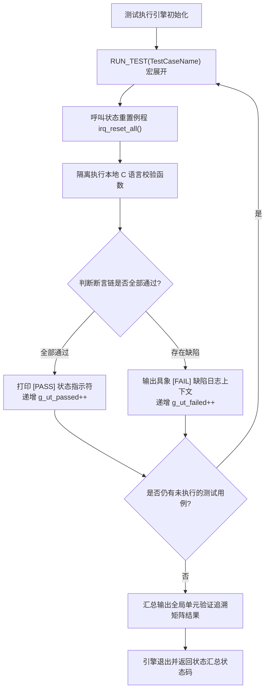

# IRQ Simulator - 软件单元测试计划书

## 1. 单元验证范围说明
本报告规定了针对 `src/main.c` 内部所有文件作用域私有函数的白盒单元验证规程，通过自定义断言包装评估其算法逻辑流与边界处理的正确性。

## 2. 单元测试执行引擎设计

## 3. 单元验证断言套件配置说明
为实现测试管线零外部依赖且具备确定性行为，框架显式部署了以下位运算及数值等价评估宏。

| 验证断言宏名称 | 底层技术表达式模板 | 预期的逻辑评估行为 |
| :--- | :--- | :--- |
| `UT_ASSERT(cond, msg)` | `if (!(cond)) { (void)printf("[FAIL] %s\n", msg); return 1; }` | 验证基础二值表达式的真伪。 |
| `UT_ASSERT_EQ(a, b, msg)` | `if ((a) != (b)) { (void)printf("[FAIL] %s: Expected %u, Got %u\n", msg, a, b); return 1; }` | 校验状态及计数器等整型参数的数值等价性。 |
| `UT_ASSERT_HEX_EQ(a, b, msg)` | `if ((a) != (b)) { (void)printf("[FAIL] %s: Expected 0x%08X, Got 0x%08X\n", msg, a, b); return 1; }` | 针对寄存器位字段或掩码进行精确的十六进制对齐校验。 |

## 4. 软件单元验证目标用例树

### UT_01: 单调 Tick 计数器行为验证
* **验证目的**: 确保系统时间基准计数器的状态流转及迭代逻辑完全符合预期。
* **边界条件**: 考核多次迭代时的累加溢出边界。

| 测试项 ID | 单元执行输入激励参数 | 预期的确定性状态输出 | 选用的断言宏 | 追溯的详细设计 |
| :--- | :--- | :--- | :--- | :--- |
| UT_01_01 | 在重置状态后立即回读系统 tick 计数值。 | `irq_get_tick() == 0U` | `UT_ASSERT_EQ` | SD_002 |
| UT_01_02 | 显式孤立调用单次 `tick_irq_handler()`。 | `irq_get_tick() == 1U` | `UT_ASSERT_EQ` | SD_006 |
| UT_01_03 | 循环触发连续迭代调度（执行 5 次）。 | `irq_get_tick() == 5U` | `UT_ASSERT_EQ` | SD_006 |

### UT_02: 异常状态账本评估
* **验证目的**: 验证硬件异常计数器在独立隔离调度下数据不发生交叉污染。

| 测试项 ID | 单元执行输入激励参数 | 预期的确定性状态输出 | 选用的断言宏 | 追溯的详细设计 |
| :--- | :--- | :--- | :--- | :--- |
| UT_02_01 | 初始化后立即回读系统异常状态计数。 | `exception_get_count() == 0U`| `UT_ASSERT_EQ` | SD_002 |
| UT_02_02 | 通过 `exception_irq_handler()` 触发单次异常。 | `exception_get_count() == 1U`| `UT_ASSERT_EQ` | SD_006 |

### UT_03: irq_trigger 寄存器位锁存边界验证
* **验证目的**: 确保位字段锁存器在合法范围内精确置位，且对非法越界请求执行严格硬降级（拒绝更新）。

| 测试项 ID | 单元执行输入激励参数 | 预期的确定性状态输出 | 选用的断言宏 | 追溯的详细设计 |
| :--- | :--- | :--- | :--- | :--- |
| UT_03_01 | 提交下限通道边界参数 `irq_trigger(0)`。 | `irq_get_pending() == 0x00000001U` | `UT_ASSERT_HEX_EQ` | SD_004 |
| UT_03_02 | 提交中段合法参数 `irq_trigger(5)`。 | `irq_get_pending() == 0x00000020U` | `UT_ASSERT_HEX_EQ` | SD_004 |
| UT_03_03 | 提交合法硬件上限通道參數 `irq_trigger(31)`。 | `irq_get_pending() == 0x80000000U` | `UT_ASSERT_HEX_EQ` | SD_004 |
| UT_03_04 | 对同一合法通道投递重复触发请求 `irq_trigger(0)`。 | `irq_get_pending() == 0x00000001U`（不翻转） | `UT_ASSERT_HEX_EQ` | SD_004 |
| UT_03_05 | 投递越界非法通道参数触发 `irq_trigger(32)`。 | `irq_get_pending() == 0x00000000U`（被拒）| `UT_ASSERT_HEX_EQ` | SD_004 |

### UT_04: 中断自动清除与分发结合验证
* **验证目的**: 考核分发例程执行完毕后挂起寄存器相应位是否能及时被清除。

| 测试项 ID | 单元执行输入激励参数 | 预期的确定性状态输出 | 选用的断言宏 | 追溯的详细设计 |
| :--- | :--- | :--- | :--- | :--- |
| UT_04_01 | 同时挂起多路位标志 `irq_trigger(0); irq_trigger(31);`，执行 `irq_process_all()`。 | `irq_get_pending() == 0U`，挂起位完全排空，隐含验证了分发器。 | `UT_ASSERT_HEX_EQ` | SD_005, SD_006 |

---

## 5. 单元验证用例至 C 语言测试源码函式符号映射表
| 审计追溯 ID | 单元验证 C 语言测试源码函式符号名稱 (1:1 映射) | 追溯的详细设计设计项 ID |
| :--- | :--- | :--- |
| **UT_01_01** | `test_tick_initial_state_evaluation` | SD_002 |
| **UT_01_02** | `test_tick_single_increment_route` | SD_006 |
| **UT_01_03** | `test_tick_multiple_loop_accumulation` | SD_006 |
| **UT_02_01** | `test_exception_initial_state` | SD_002 |
| **UT_02_02** | `test_exception_handler_increment` | SD_006 |
| **UT_03_01** | `test_trigger_boundary_channel_zero` | SD_004, SD_008 |
| **UT_03_02** | `test_trigger_mid_range_channel_five` | SD_004, SD_008 |
| **UT_03_03** | `test_trigger_maximum_boundary_channel_thirty_one` | SD_004, SD_008 |
| **UT_03_04** | `test_trigger_duplicate_latch_protection` | SD_004 |
| **UT_03_05** | `test_trigger_out_of_bounds_rejection` | SD_004, SD_010 |
| **UT_04_01** | `test_process_priority_clear_sequence` | SD_005, SD_006 |
