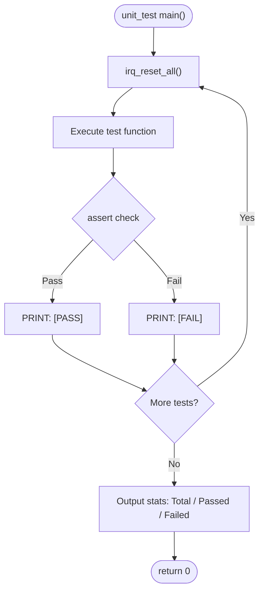

# IRQ Simulator - Unit Test Plan

## 1. Test Scope

Unit tests verify each independent function in `main.c`, ensuring correct behavior in an isolated environment.

## 2. Test Environment

- Compiler: GCC (MinGW)
- Language Standard: C11
- Test Framework: Custom assert macros (no external dependencies)
- `irq_reset_all()` is called before each test case to reset state

## 3. Test Cases

### UT_01: tick_irq_handler

| ID | Test Item | Input | Expected Result |
|----|---------|------|---------|
| UT_01_01 | Initial tick value | None | `irq_get_tick() == 0` |
| UT_01_02 | Single call | `tick_irq_handler()` | `irq_get_tick() == 1` |
| UT_01_03 | Multiple calls | Call 5 times | `irq_get_tick() == 5` |
| UT_01_04 | Call after reset | reset → call 3 times | `irq_get_tick() == 3` |

### UT_02: exception_irq_handler

| ID | Test Item | Input | Expected Result |
|----|---------|------|---------|
| UT_02_01 | Function callable without crash | `exception_irq_handler()` | Returns normally |
| UT_02_02 | Multiple calls | Call 3 times | Returns normally, no side effects |

### UT_03: irq_trigger

| ID | Test Item | Input | Expected Result |
|----|---------|------|---------|
| UT_03_01 | Trigger IRQ0 | `irq_trigger(0)` | `irq_get_pending() == 0x00000001` |
| UT_03_02 | Trigger IRQ5 | `irq_trigger(5)` | `irq_get_pending() == 0x00000020` |
| UT_03_03 | Trigger IRQ31 | `irq_trigger(31)` | `irq_get_pending() == 0x80000000` |
| UT_03_04 | Cumulative trigger | trigger(0), trigger(1) | `irq_get_pending() == 0x00000003` |
| UT_03_05 | Duplicate trigger | trigger(0), trigger(0) | `irq_get_pending() == 0x00000001` |
| UT_03_06 | Invalid IRQ (32) | `irq_trigger(32)` | pending unchanged |
| UT_03_07 | Invalid IRQ (99) | `irq_trigger(99)` | pending unchanged |

### UT_04: irq_handler

| ID | Test Item | Input | Expected Result |
|----|---------|------|---------|
| UT_04_01 | Handle IRQ0 | trigger(0) → handler(0) | pending bit 0 cleared, tick+1 |
| UT_04_02 | Handle IRQ5 | trigger(5) → handler(5) | pending bit 5 cleared |
| UT_04_03 | Handle IRQ31 | trigger(31) → handler(31) | pending bit 31 cleared |
| UT_04_04 | Pending cleared after handling | trigger(0) → handler(0) | `irq_get_pending() == 0` |

### UT_05: irq_process_all

| ID | Test Item | Input | Expected Result |
|----|---------|------|---------|
| UT_05_01 | No pending IRQs | `irq_process_all()` | Returns immediately, no action |
| UT_05_02 | Single IRQ | trigger(3) → process_all | IRQ3 handled, pending=0 |
| UT_05_03 | Multiple IRQs | trigger(0), trigger(5), trigger(10) | Processed in order 0→5→10, pending=0 |
| UT_05_04 | All IRQs | trigger all 0-31 | All processed, pending=0 |

### UT_06: irq_reset_all

| ID | Test Item | Input | Expected Result |
|----|---------|------|---------|
| UT_06_01 | Reset pending | trigger(5) → reset | `irq_get_pending() == 0` |
| UT_06_02 | Reset tick | tick++ x3 → reset | `irq_get_tick() == 0` |
| UT_06_03 | Reset both | trigger + tick → reset | pending=0, tick=0 |

### UT_07: irq_get_pending / irq_get_tick

| ID | Test Item | Input | Expected Result |
|----|---------|------|---------|
| UT_07_01 | Initial pending | reset → get_pending | Returns 0 |
| UT_07_02 | Initial tick | reset → get_tick | Returns 0 |
| UT_07_03 | Pending after trigger | trigger(7) → get_pending | Returns 0x00000080 |

### UT_08: irq_trigger_raw

| ID | Test Item | Input | Expected Result |
|----|---------|------|---------|
| UT_08_01 | Single bit via raw mask | `irq_trigger_raw(0x00000001)` | `irq_get_pending() == 0x00000001` |
| UT_08_02 | Multiple bits via raw mask | `irq_trigger_raw(0x0000000F)` | `irq_get_pending() == 0x0000000F` |
| UT_08_03 | Cumulative OR behavior | trigger(0), trigger_raw(0x0006) | `irq_get_pending() == 0x00000007` |
| UT_08_04 | Zero mask (no-op) | `irq_trigger_raw(0x00000000)` | pending unchanged |
| UT_08_05 | Full mask (all 32 bits) | `irq_trigger_raw(0xFFFFFFFF)` | `irq_get_pending() == 0xFFFFFFFF` |
| UT_08_06 | Boundary: MSB only (IRQ31) | `irq_trigger_raw(0x80000000)` | `irq_get_pending() == 0x80000000` |

### UT_09: irq_handler (Boundary Cases)

| ID | Test Item | Input | Expected Result |
|----|---------|------|---------|
| UT_09_01 | Handler without pending bit | `irq_handler(0)` (no trigger) | No crash, pending unchanged |
| UT_09_02 | Handler for middle IRQ (IRQ15) | trigger(15) → handler(15) | pending bit 15 cleared |
| UT_09_03 | Handler clears only target bit | trigger(0), trigger(1) → handler(0) | bit 0 cleared, bit 1 remains set |

### UT_10: irq_process_all (Boundary Cases)

| ID | Test Item | Input | Expected Result |
|----|---------|------|---------|
| UT_10_01 | Highest priority only (IRQ0) | trigger(0) → process_all | IRQ0 handled, tick incremented |
| UT_10_02 | Lowest priority only (IRQ31) | trigger(31) → process_all | IRQ31 handled, pending=0 |
| UT_10_03 | Priority order verification | trigger(31), trigger(0) → process_all | IRQ0 processed before IRQ31 |

## 4. Expected Results

- All UT_01 ~ UT_10 test cases must pass
- Pass rate: 100%

## 5. Unit Test Traceability

| ID | Chapter | Trace to SD | Description |
|----|---------|-------------|-------------|
| UT_01 | 3 (UT_01) | SD_009 | `tick_irq_handler`: initial value, single call, multiple calls, post-reset behavior |
| UT_02 | 3 (UT_02) | SD_006 | `exception_irq_handler`: callable without crash, multiple calls with no side effects |
| UT_03 | 3 (UT_03) | SD_004 SD_008 SD_010 | `irq_trigger`: boundary (IRQ0/IRQ5/IRQ31), cumulative, duplicate, invalid range (32, 99) |
| UT_04 | 3 (UT_04) | SD_006 SD_013 | `irq_handler`: dispatch (IRQ0/IRQ5/IRQ31), pending bit cleared after handling |
| UT_05 | 3 (UT_05) | SD_005 | `irq_process_all`: empty pending, single IRQ, multiple IRQs, all 32 IRQs |
| UT_06 | 3 (UT_06) | SD_002 SD_009 SD_011 | `irq_reset_all`: reset pending, reset tick, reset both simultaneously |
| UT_07 | 3 (UT_07) | SD_002 SD_011 | `irq_get_pending` / `irq_get_tick`: initial values, post-trigger readback |
| UT_08 | 3 (UT_08) | SD_014 SD_010 | `irq_trigger_raw`: single/multiple/zero/full mask, cumulative OR, MSB boundary |
| UT_09 | 3 (UT_09) | SD_006 SD_013 | `irq_handler` boundary: no-pending call, middle IRQ (IRQ15), only target bit cleared |
| UT_10 | 3 (UT_10) | SD_005 | `irq_process_all` boundary: highest/lowest priority only, priority order verification |

### SD Coverage Mapping

| SD Item | Covered by UT | Status |
|---------|---------------|--------|
| SD_001 | UT_01 ~ UT_10 (all 9 API functions tested) | ✅ Covered |
| SD_002 | UT_06, UT_07 | ✅ Covered |
| SD_003 | — | ⚠️ Log output (verified in integration test) |
| SD_004 | UT_03 | ✅ Covered |
| SD_005 | UT_05, UT_10 | ✅ Covered |
| SD_006 | UT_02, UT_04, UT_09 | ✅ Covered |
| SD_007 | — | ⚠️ Main loop parsing (verified in integration test) |
| SD_008 | UT_03 | ✅ Covered |
| SD_009 | UT_01, UT_06 | ✅ Covered |
| SD_010 | UT_03, UT_08 | ✅ Covered |
| SD_011 | UT_06, UT_07 | ✅ Covered |
| SD_012 | — | ⚠️ Log output (verified in integration test) |
| SD_013 | UT_04, UT_09 | ✅ Covered |
| SD_014 | UT_08 | ✅ Covered |

> **Abbreviation Notes:**
>
> - **UT** = Unit Test (unified numbering for all unit test cases)
> - **SD** = Software Detailed Design (traceability back to SWE.3 detailed design items)