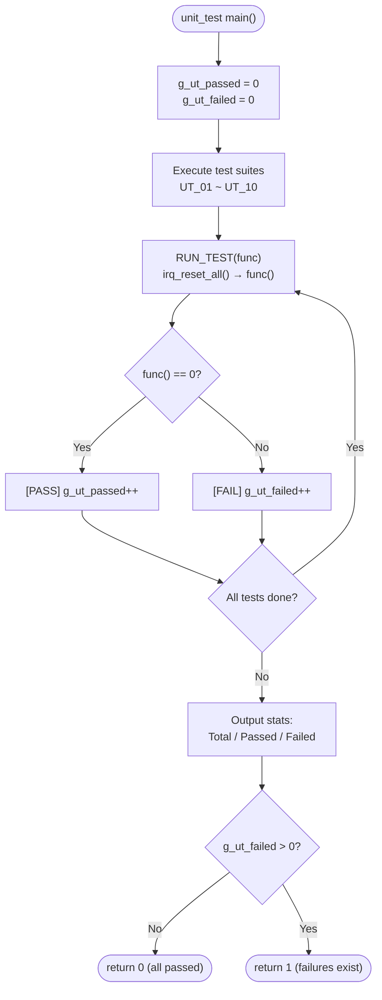

# IRQ Simulator - Unit Verification (Cline)

## 1. Test Scope

Unit tests verify each independent function in `src/main.c`, ensuring correct behavior in an isolated environment. This document traces back to the SD_C items in the Software Detailed Design document and the SR items in the Software Requirements Specification.

## 2. Test Environment

- **Compiler**: GCC (MinGW)
- **Language Standard**: C11
- **Test Framework**: Custom assert macros (no external dependencies): `UT_ASSERT(cond, msg)`, `UT_ASSERT_EQ(a, b, msg)`, `UT_ASSERT_HEX_EQ(a, b, msg)`
- **Entry Point**: `unit_test/main.c` → `run_all_unit_tests()` → 10 test suites (UT_01 ~ UT_10)
- **State Reset**: `irq_reset_all()` is called before each test case via the `RUN_TEST()` macro
- **Counters**: `g_ut_passed` / `g_ut_failed` accumulate globally, final summary is printed

### 2.1 Test Runner Flow



## 3. Test Framework — Custom Assert Macros

The test framework is defined in `unit_test/unit_test.h` and provides three assert macros:

| Macro | Format | Description |
|-------|--------|-------------|
| `UT_ASSERT(cond, msg)` | `printf("[FAIL] %s\n", msg)` if cond == 0 | General condition assertion |
| `UT_ASSERT_EQ(a, b, msg)` | `printf("[FAIL] %s: expected %d, got %d\n", ...)` | Integer equality assertion |
| `UT_ASSERT_HEX_EQ(a, b, msg)` | `printf("[FAIL] %s: expected 0x%08X, got 0x%08X\n", ...)` | Hexadecimal equality assertion |

## 4. Test Cases

### UT_01: tick_irq_handler

| ID | Test Item | Input | Expected Result | Verification |
|----|-----------|-------|-----------------|-------------|
| UT_01_01 | Initial tick value | reset → `irq_get_tick()` | `irq_get_tick() == 0` | `UT_ASSERT_EQ` |
| UT_01_02 | Single call | `tick_irq_handler()` → `irq_get_tick()` | `irq_get_tick() == 1` | `UT_ASSERT_EQ` |
| UT_01_03 | Multiple calls | Call 5 times → `irq_get_tick()` | `irq_get_tick() == 5` | `UT_ASSERT_EQ` |
| UT_01_04 | Call after reset | Call 3 times → reset → call 3 times | `irq_get_tick() == 3` | `UT_ASSERT_EQ` |

**Traces to**: SD_C_014 | SR_010, SR_036, SR_038

### UT_02: exception_irq_handler

| ID | Test Item | Input | Expected Result | Verification |
|----|-----------|-------|-----------------|-------------|
| UT_02_01 | Function callable without crash | `exception_irq_handler()` | Returns normally | `UT_ASSERT(1, ...)` |
| UT_02_02 | Multiple calls | Call 3 times | Returns normally, no side effects | `UT_ASSERT(1, ...)` |
| UT_02_03 | Internal counter verification | Call 3 times → `exception_get_count()` | `exception_get_count() == 3` | `UT_ASSERT_EQ` |

**Traces to**: SD_C_015 | SR_035

### UT_03: irq_trigger

| ID | Test Item | Input | Expected Result | Verification |
|----|-----------|-------|-----------------|-------------|
| UT_03_01 | Trigger IRQ0 | `irq_trigger(0)` → `irq_get_pending()` | `0x00000001` | `UT_ASSERT_HEX_EQ` |
| UT_03_02 | Trigger IRQ5 | `irq_trigger(5)` → `irq_get_pending()` | `0x00000020` | `UT_ASSERT_HEX_EQ` |
| UT_03_03 | Trigger IRQ31 | `irq_trigger(31)` → `irq_get_pending()` | `0x80000000` | `UT_ASSERT_HEX_EQ` |
| UT_03_04 | Cumulative trigger | trigger(0), trigger(1) | `0x00000003` | `UT_ASSERT_HEX_EQ` |
| UT_03_05 | Duplicate trigger | trigger(0), trigger(0) | `0x00000001` (no toggle) | `UT_ASSERT_HEX_EQ` |
| UT_03_06 | Invalid IRQ (32) | trigger(32) → pending unchanged | pending unchanged | `UT_ASSERT_HEX_EQ` |
| UT_03_07 | Invalid IRQ (99) | trigger(99) → pending unchanged | pending unchanged | `UT_ASSERT_HEX_EQ` |

**Traces to**: SD_C_005, SD_C_010 | SR_001, SR_002, SR_003, SR_004, SR_005, SR_042

### UT_04: irq_handler

| ID | Test Item | Input | Expected Result | Verification |
|----|-----------|-------|-----------------|-------------|
| UT_04_01 | Handle IRQ0 | trigger(0) → handler(0) | pending=0, tick=1 | `UT_ASSERT_HEX_EQ` + `UT_ASSERT_EQ` |
| UT_04_02 | Handle IRQ5 | trigger(5) → handler(5) | pending=0 | `UT_ASSERT_HEX_EQ` |
| UT_04_03 | Handle IRQ31 | trigger(31) → handler(31) | pending=0 | `UT_ASSERT_HEX_EQ` |
| UT_04_04 | Pending cleared after handling | trigger(0) → handler(0) → `irq_get_pending()` | `0` | `UT_ASSERT_HEX_EQ` |
| UT_04_05 | Invalid IRQ number (default branch) | `irq_handler(99)` | No crash | `UT_ASSERT(1, ...)` |

**Traces to**: SD_C_008 | SR_009, SR_010~SR_035, SR_045

### UT_05: irq_process_all

| ID | Test Item | Input | Expected Result | Verification |
|----|-----------|-------|-----------------|-------------|
| UT_05_01 | No pending IRQs | `irq_process_all()` | pending remains 0 | `UT_ASSERT_HEX_EQ` |
| UT_05_02 | Single IRQ | trigger(3) → process_all | pending=0 | `UT_ASSERT_HEX_EQ` |
| UT_05_03 | Multiple IRQs | trigger(0), trigger(5), trigger(10) → process_all | pending=0 | `UT_ASSERT_HEX_EQ` |
| UT_05_04 | All 32 IRQs | for i=0..31: trigger(i) → process_all | pending=0 | `UT_ASSERT_HEX_EQ` |

**Traces to**: SD_C_007 | SR_007, SR_008

### UT_06: irq_reset_all

| ID | Test Item | Input | Expected Result | Verification |
|----|-----------|-------|-----------------|-------------|
| UT_06_01 | Reset pending | trigger(5) → reset → `irq_get_pending()` | `0` | `UT_ASSERT_HEX_EQ` |
| UT_06_02 | Reset tick | tick×3 → reset → `irq_get_tick()` | `0` | `UT_ASSERT_EQ` |
| UT_06_03 | Reset both | trigger + tick → reset | pending=0, tick=0 | `UT_ASSERT_HEX_EQ` + `UT_ASSERT_EQ` |

**Traces to**: SD_C_002, SD_C_011 | SR_036, SR_037, SR_038

### UT_07: irq_get_pending / irq_get_tick

| ID | Test Item | Input | Expected Result | Verification |
|----|-----------|-------|-----------------|-------------|
| UT_07_01 | Initial pending | reset → `irq_get_pending()` | `0` | `UT_ASSERT_HEX_EQ` |
| UT_07_02 | Initial tick | reset → `irq_get_tick()` | `0` | `UT_ASSERT_EQ` |
| UT_07_03 | Pending after trigger | trigger(7) → `irq_get_pending()` | `0x00000080` | `UT_ASSERT_HEX_EQ` |
| UT_07_04 | Non-zero tick value | tick×3 → `irq_get_tick()` | `3` | `UT_ASSERT_EQ` |

**Traces to**: SD_C_002, SD_C_011 | SR_001, SR_036

### UT_08: irq_trigger_raw

| ID | Test Item | Input | Expected Result | Verification |
|----|-----------|-------|-----------------|-------------|
| UT_08_01 | Single bit via raw mask | `irq_trigger_raw(0x00000001)` | `0x00000001` | `UT_ASSERT_HEX_EQ` |
| UT_08_02 | Multiple bits via raw mask | `irq_trigger_raw(0x0000000F)` | `0x0000000F` | `UT_ASSERT_HEX_EQ` |
| UT_08_03 | Cumulative OR behavior | trigger(0) → `irq_trigger_raw(0x0006)` | `0x00000007` | `UT_ASSERT_HEX_EQ` |
| UT_08_04 | Zero mask (no-op) | `irq_trigger_raw(0x00000000)` | pending unchanged | `UT_ASSERT_HEX_EQ` |
| UT_08_05 | Full mask (all 32 bits) | `irq_trigger_raw(0xFFFFFFFF)` | `0xFFFFFFFF` | `UT_ASSERT_HEX_EQ` |
| UT_08_06 | Boundary: MSB only (IRQ31) | `irq_trigger_raw(0x80000000)` | `0x80000000` | `UT_ASSERT_HEX_EQ` |

**Traces to**: SD_C_006 | SR_003, SR_006

### UT_09: irq_handler (Boundary Cases)

| ID | Test Item | Input | Expected Result | Verification |
|----|-----------|-------|-----------------|-------------|
| UT_09_01 | Handler without pending bit | `irq_handler(0)` (no trigger) | No crash, pending unchanged | `UT_ASSERT_HEX_EQ` |
| UT_09_02 | Handler for middle IRQ (IRQ15) | trigger(15) → handler(15) | pending=0 | `UT_ASSERT_HEX_EQ` |
| UT_09_03 | Handler clears only target bit | trigger(0), trigger(1) → handler(0) | bit 0 cleared, bit 1 remains set (0x0002) | `UT_ASSERT_HEX_EQ` |

**Traces to**: SD_C_008 | SR_009, SR_045

### UT_10: irq_process_all (Boundary Cases)

| ID | Test Item | Input | Expected Result | Verification |
|----|-----------|-------|-----------------|-------------|
| UT_10_01 | Highest priority only (IRQ0) | trigger(0) → process_all | pending=0, tick=1 | `UT_ASSERT_HEX_EQ` + `UT_ASSERT_EQ` |
| UT_10_02 | Lowest priority only (IRQ31) | trigger(31) → process_all | pending=0 | `UT_ASSERT_HEX_EQ` |
| UT_10_03 | Priority order verification | trigger(31), trigger(0) → process_all | IRQ0 processed before IRQ31, tick=1 | `UT_ASSERT_HEX_EQ` + `UT_ASSERT_EQ` |

**Traces to**: SD_C_007 | SR_007, SR_008

## 5. Test Statistics

### 5.1 Test Suite Summary

| Suite | Test Cases | Traces to SD_C | Traces to SR |
|-------|-----------|----------------|-------------|
| UT_01: tick_irq_handler | 4 | SD_C_014 | SR_010, SR_036, SR_038 |
| UT_02: exception_irq_handler | 3 | SD_C_015 | SR_035 |
| UT_03: irq_trigger | 7 | SD_C_005, SD_C_010 | SR_001~SR_005, SR_042 |
| UT_04: irq_handler | 5 | SD_C_008 | SR_009, SR_010~SR_035, SR_045 |
| UT_05: irq_process_all | 4 | SD_C_007 | SR_007, SR_008 |
| UT_06: irq_reset_all | 3 | SD_C_002, SD_C_011 | SR_036~SR_038 |
| UT_07: irq_get_pending / irq_get_tick | 4 | SD_C_002, SD_C_011 | SR_001, SR_036 |
| UT_08: irq_trigger_raw | 6 | SD_C_006 | SR_003, SR_006 |
| UT_09: irq_handler (Boundary Cases) | 3 | SD_C_008 | SR_009, SR_045 |
| UT_10: irq_process_all (Boundary Cases) | 3 | SD_C_007 | SR_007, SR_008 |
| **Total** | **42** | **—** | **—** |

### 5.2 Expected Results

- All 42 test cases (UT_01_01 ~ UT_10_03) must pass
- `run_all_unit_tests()` returns 0
- Example terminal output:
  ```
  ========== Unit Tests ==========
  
  [UT_01] tick_irq_handler:
    Running test_tick_initial...
    [PASS] test_tick_initial
    ...
  ========== Unit Test Results ==========
    Total:  42
    Passed: 42
    Failed: 0
  ========================================
  ```

## 6. Unit Verification Traceability

### 6.1 SD_C Coverage Mapping

| SD_C Item | Description | Covered by UT | Status |
|-----------|-------------|---------------|--------|
| SD_C_001 | Public API declarations | UT_01~UT_10 (all 13 API functions tested) | ✅ Covered |
| SD_C_002 | Internal State | UT_06, UT_07 | ✅ Covered |
| SD_C_003 | TICK_PRINTF log macro | — | ⚠️ Log format (integration test) |
| SD_C_004 | FW_STATIC mechanism | — | ⚠️ Compile-time (build system) |
| SD_C_005 | irq_trigger algorithm | UT_03 | ✅ Covered |
| SD_C_006 | irq_trigger_raw algorithm | UT_08 | ✅ Covered |
| SD_C_007 | irq_process_all algorithm | UT_05, UT_10 | ✅ Covered |
| SD_C_008 | irq_handler dispatch algorithm | UT_04, UT_09 | ✅ Covered |
| SD_C_009 | Input parsing algorithm | — | ⚠️ Main loop (integration test) |
| SD_C_010 | IRQ Pending Register layout | UT_03 | ✅ Covered |
| SD_C_011 | Tick counter lifecycle | UT_01, UT_06, UT_07 | ✅ Covered |
| SD_C_012 | Exception count | UT_02 | ✅ Covered |
| SD_C_013 | Error handling design | — | ⚠️ Error messages (integration test) |
| SD_C_014 | tick_irq_handler | UT_01 | ✅ Covered |
| SD_C_015 | exception_irq_handler | UT_02 | ✅ Covered |
| SD_C_016 | DD-01: static encapsulation | UT_06, UT_07 | ✅ Covered |
| SD_C_017 | DD-02: TICK_PRINTF macro | — | ⚠️ Log format (integration test) |
| SD_C_018 | DD-03: Immediate pending bit clear | UT_04, UT_09 | ✅ Covered |
| SD_C_019 | DD-04: h-mode `|=` | UT_08 | ✅ Covered |
| SD_C_020 | DD-05: uint32_t selection | — | ⚠️ Compile-time type check |

### 6.2 SR Requirements Testability

| Requirement Category | SR Range | Total | Unit Test Coverage | Coverage |
|---------------------|----------|-------|-------------------|----------|
| FR-01 (IRQ Trigger) | SR_001~SR_003 | 3 | UT_03, UT_08 | 100% |
| FR-02 (Input Modes) | SR_004~SR_006 | 3 | UT_03 (partial) | 33%* |
| FR-03 (Priority) | SR_007~SR_009 | 3 | UT_04, UT_05, UT_09, UT_10 | 100% |
| FR-04 (IRQ Behaviors) | SR_010~SR_035 | 26 | UT_01, UT_02, UT_04 | 100%** |
| FR-05 (Tick Counter) | SR_036~SR_039 | 4 | UT_01, UT_06, UT_07 | 75% |
| FR-06 (Program Control) | SR_040~SR_041 | 2 | — | 0%* |
| NFR-01 (Usability) | SR_042~SR_043 | 2 | UT_03 (partial) | 50%* |
| NFR-02 (Maintainability) | SR_044~SR_045 | 2 | — | 0% |
| NFR-03 (Portability) | SR_046~SR_047 | 2 | — | 0% |

> \* Input parsing (FR-02), program control (FR-06), usability (NFR-01) depend on stdin/stdout interaction and are verified in integration tests
> \*\* Of the 26 FR-04 IRQ behaviors, IRQ0 (SR_010) and IRQ31 (SR_035) are explicitly verified in unit tests; the remaining IRQ1~30 behaviors are implicitly verified through handler dispatch

### 6.3 Source Code Test Function Mapping

| Test Function (Source Code) | UT ID | Suite |
|-----------------------------|-------|-------|
| `test_tick_initial` | UT_01_01 | UT_01 |
| `test_tick_single_call` | UT_01_02 | UT_01 |
| `test_tick_multiple_calls` | UT_01_03 | UT_01 |
| `test_tick_after_reset` | UT_01_04 | UT_01 |
| `test_exception_no_crash` | UT_02_01 | UT_02 |
| `test_exception_multiple_calls` | UT_02_02 | UT_02 |
| `test_exception_count_increment` | UT_02_03 | UT_02 |
| `test_trigger_irq0` | UT_03_01 | UT_03 |
| `test_trigger_irq5` | UT_03_02 | UT_03 |
| `test_trigger_irq31` | UT_03_03 | UT_03 |
| `test_trigger_accumulate` | UT_03_04 | UT_03 |
| `test_trigger_duplicate` | UT_03_05 | UT_03 |
| `test_trigger_invalid_32` | UT_03_06 | UT_03 |
| `test_trigger_invalid_99` | UT_03_07 | UT_03 |
| `test_handler_irq0` | UT_04_01 | UT_04 |
| `test_handler_irq5` | UT_04_02 | UT_04 |
| `test_handler_irq31` | UT_04_03 | UT_04 |
| `test_handler_clears_pending` | UT_04_04 | UT_04 |
| `test_handler_invalid_irq` | UT_04_05 | UT_04 |
| `test_process_all_empty` | UT_05_01 | UT_05 |
| `test_process_all_single` | UT_05_02 | UT_05 |
| `test_process_all_multiple` | UT_05_03 | UT_05 |
| `test_process_all_full` | UT_05_04 | UT_05 |
| `test_reset_pending` | UT_06_01 | UT_06 |
| `test_reset_tick` | UT_06_02 | UT_06 |
| `test_reset_both` | UT_06_03 | UT_06 |
| `test_get_pending_initial` | UT_07_01 | UT_07 |
| `test_get_tick_initial` | UT_07_02 | UT_07 |
| `test_get_pending_after_trigger` | UT_07_03 | UT_07 |
| `test_get_tick_nonzero` | UT_07_04 | UT_07 |
| `test_trigger_raw_single_bit` | UT_08_01 | UT_08 |
| `test_trigger_raw_multi_bit` | UT_08_02 | UT_08 |
| `test_trigger_raw_cumulative_or` | UT_08_03 | UT_08 |
| `test_trigger_raw_zero_mask` | UT_08_04 | UT_08 |
| `test_trigger_raw_full_mask` | UT_08_05 | UT_08 |
| `test_trigger_raw_msb_only` | UT_08_06 | UT_08 |
| `test_handler_no_pending` | UT_09_01 | UT_09 |
| `test_handler_middle_irq15` | UT_09_02 | UT_09 |
| `test_handler_clears_only_target` | UT_09_03 | UT_09 |
| `test_process_all_highest_only` | UT_10_01 | UT_10 |
| `test_process_all_lowest_only` | UT_10_02 | UT_10 |
| `test_process_all_priority_order` | UT_10_03 | UT_10 |

---

> **Abbreviation Notes:**
>
> - **UT** = Unit Test (unified numbering for all unit test cases)
> - **SD_C** = Software Detailed Design (Cline) (traceability back to SWE.3 detailed design items)
> - **SR** = Software Requirement (traceability back to SWE.1 requirement items)