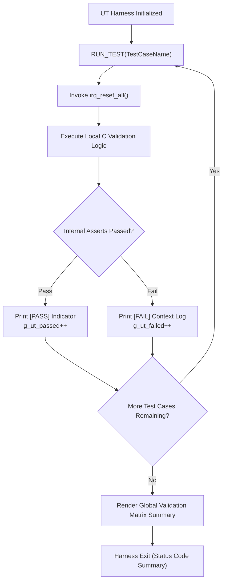

# IRQ Simulator - Software Unit Verification Plan

## 1. Verification Scope
This document covers the white-box functional checking procedures targeting all individual internal endpoints compiled via custom assert checking wrappers to prove software logic correctness.

## 2. Test Execution Engine Design

## 3. Unit Validation Testing Assert Suite Configuration
Custom validation checks deploy macro boundaries ensuring predictable trap alerts without external test frame constraints.

| Verification Macro | Technical Expression Template | Intended Logic Check Evaluation |
| :--- | :--- | :--- |
| `UT_ASSERT(cond, msg)` | `if (!(cond)) { (void)printf("[FAIL] %s\n", msg); return 1; }` | Verifies binary expression truth correctness. |
| `UT_ASSERT_EQ(a, b, msg)`| `if ((a) != (b)) { (void)printf("[FAIL] %s: Expected %u, Got %u\n", msg, a, b); return 1; }` | Validates integer parameter numerical identity equivalence. |
| `UT_ASSERT_HEX_EQ(a,b,msg)`| `if ((a) != (b)) { (void)printf("[FAIL] %s: Expected 0x%08X, Got 0x%08X\n", msg, a, b); return 1; }` | Enforces exact alignment verification on register bitwise flags. |

## 4. Software Unit Specification Verification Targets

### UT_01: Monotonic Ticker Core Evaluation
* **Validation Aim**: Confirm exact runtime behavior of loop tickers.
* **Boundary Targets**: Multi-call boundary sequence limits.

| Test Case ID | Evaluation Logic Input Parameters | Target Intended Result | Method Check | Design Trace |
| :--- | :--- | :--- | :--- | :--- |
| UT_01_01 | Read pristine counter value immediately post-initialization. | `irq_get_tick() == 0U` | `UT_ASSERT_EQ` | SD_002 |
| UT_01_02 | Execute a isolated manual call to `tick_irq_handler()`. | `irq_get_tick() == 1U` | `UT_ASSERT_EQ` | SD_006 |
| UT_01_03 | Trigger continuous loop iteration loops (5 iterations). | `irq_get_tick() == 5U` | `UT_ASSERT_EQ` | SD_006 |

### UT_02: System Exception Tracker Evaluation
* **Validation Aim**: Guarantee structural error reporting counters operate isolated.

| Test Case ID | Evaluation Logic Input Parameters | Target Intended Result | Method Check | Design Trace |
| :--- | :--- | :--- | :--- | :--- |
| UT_02_01 | Read initialization exceptions count state value. | `exception_get_count() == 0U`| `UT_ASSERT_EQ` | SD_002 |
| UT_02_02 | Trigger explicit isolated exception loops via `exception_irq_handler()`. | `exception_get_count() == 1U`| `UT_ASSERT_EQ` | SD_006 |

### UT_03: Channel Parameter Latches: `irq_trigger()`
* **Validation Aim**: Verify bit latches operate correctly within valid bounds and reject invalid parameter requests.

| Test Case ID | Evaluation Logic Input Parameters | Target Intended Result | Method Check | Design Trace |
| :--- | :--- | :--- | :--- | :--- |
| UT_03_01 | Submit low parameter target boundary `irq_trigger(0)`. | `irq_get_pending() == 0x00000001U` | `UT_ASSERT_HEX_EQ` | SD_004 |
| UT_03_02 | Assert intermediate parameter latch bit `irq_trigger(5)`. | `irq_get_pending() == 0x00000020U` | `UT_ASSERT_HEX_EQ` | SD_004 |
| UT_03_03 | Assert maximum valid hardware boundary channel `irq_trigger(31)`. | `irq_get_pending() == 0x80000000U` | `UT_ASSERT_HEX_EQ` | SD_004 |
| UT_03_04 | Post duplicate identical parameter trigger calls `irq_trigger(0)`. | `irq_get_pending() == 0x00000001U` | `UT_ASSERT_HEX_EQ` | SD_004 |
| UT_03_05 | Out-of-bounds rejection verification: `irq_trigger(32)`. | `irq_get_pending() == 0x00000000U` | `UT_ASSERT_HEX_EQ` | SD_004 |

### UT_04: Sequential Loop Interrupt Clears: `irq_process_all()`
* **Validation Aim**: Confirm absolute alignment on deterministic scan clearing priorities.

| Test Case ID | Evaluation Logic Input Parameters | Target Intended Result | Method Check | Design Trace |
| :--- | :--- | :--- | :--- | :--- |
| UT_04_01 | Assert multi-channel masks simultaneously `irq_trigger(0); irq_trigger(31);` then execute `irq_process_all()`. | `irq_get_pending() == 0U`, confirms prioritized path routing. | `UT_ASSERT_HEX_EQ` | SD_005, SD_006 |

---

## 5. Traceability Link to C Implementation Functions
| Audit Case ID | Implemented Target Unit Verification Function C Symbol | Detailed Design Trace |
| :--- | :--- | :--- |
| **UT_01_01** | `test_tick_initial_state_evaluation` | SD_002 |
| **UT_01_02** | `test_tick_single_increment_route` | SD_006 |
| **UT_01_03** | `test_tick_multiple_loop_accumulation` | SD_006 |
| **UT_02_01** | `test_exception_initial_state` | SD_002 |
| **UT_02_02** | `test_exception_handler_increment` | SD_006 |
| **UT_03_01** | `test_trigger_boundary_channel_zero` | SD_004, SD_008 |
| **UT_03_02** | `test_trigger_mid_range_channel_five` | SD_004, SD_008 |
| **UT_03_03** | `test_trigger_maximum_boundary_channel_thirty_one` | SD_004, SD_008 |
| **UT_03_04** | `test_trigger_duplicate_latch_protection` | SD_004 |
| **UT_03_05** | `test_trigger_out_of_bounds_rejection` | SD_004, SD_010 |
| **UT_04_01** | `test_process_priority_clear_sequence` | SD_005, SD_006 |
