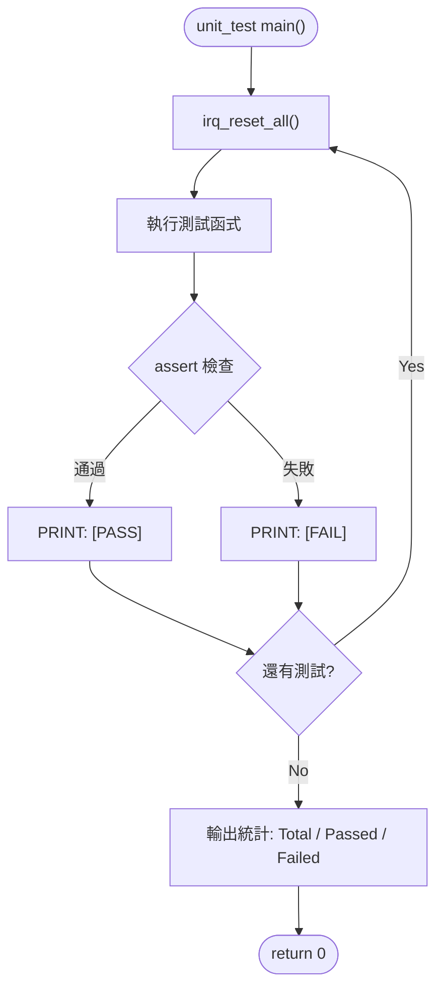

# IRQ Simulator - Unit Test Plan

## 1. Test Scope

單元測試針對 `main.c` 中的每個獨立函式進行驗證，確保各函式在隔離環境下行為正確。

## 2. Test Environment

- 編譯器：GCC (MinGW)
- 語言標準：C11
- 測試框架：自訂 assert 巨集（無外部依賴）
- 每個測試案例前呼叫 `irq_reset_all()` 重置狀態

## 3. Test Cases

### UT-01: tick_irq_handler

| ID | 測試項目 | 輸入 | 預期結果 |
|----|---------|------|---------|
| UT-01-01 | tick 初始值 | 無 | `irq_get_tick() == 0` |
| UT-01-02 | 單次呼叫 | `tick_irq_handler()` | `irq_get_tick() == 1` |
| UT-01-03 | 多次呼叫 | 呼叫 5 次 | `irq_get_tick() == 5` |
| UT-01-04 | 重置後呼叫 | reset → 呼叫 3 次 | `irq_get_tick() == 3` |

### UT-02: exception_irq_handler

| ID | 測試項目 | 輸入 | 預期結果 |
|----|---------|------|---------|
| UT-02-01 | 函式可被呼叫不崩潰 | `exception_irq_handler()` | 正常返回 |
| UT-02-02 | 多次呼叫 | 呼叫 3 次 | 正常返回，無副作用 |

### UT-03: irq_trigger

| ID | 測試項目 | 輸入 | 預期結果 |
|----|---------|------|---------|
| UT-03-01 | 觸發 IRQ0 | `irq_trigger(0)` | `irq_get_pending() == 0x00000001` |
| UT-03-02 | 觸發 IRQ5 | `irq_trigger(5)` | `irq_get_pending() == 0x00000020` |
| UT-03-03 | 觸發 IRQ31 | `irq_trigger(31)` | `irq_get_pending() == 0x80000000` |
| UT-03-04 | 累積觸發 | trigger(0), trigger(1) | `irq_get_pending() == 0x00000003` |
| UT-03-05 | 重複觸發 | trigger(0), trigger(0) | `irq_get_pending() == 0x00000001` |
| UT-03-06 | 無效 IRQ (32) | `irq_trigger(32)` | pending 不變 |
| UT-03-07 | 無效 IRQ (99) | `irq_trigger(99)` | pending 不變 |

### UT-04: irq_handler

| ID | 測試項目 | 輸入 | 預期結果 |
|----|---------|------|---------|
| UT-04-01 | 處理 IRQ0 | trigger(0) → handler(0) | pending bit 0 清除，tick+1 |
| UT-04-02 | 處理 IRQ5 | trigger(5) → handler(5) | pending bit 5 清除 |
| UT-04-03 | 處理 IRQ31 | trigger(31) → handler(31) | pending bit 31 清除 |
| UT-04-04 | 處理後 pending 歸零 | trigger(0) → handler(0) | `irq_get_pending() == 0` |

### UT-05: irq_process_all

| ID | 測試項目 | 輸入 | 預期結果 |
|----|---------|------|---------|
| UT-05-01 | 無 pending 時 | `irq_process_all()` | 直接返回，無動作 |
| UT-05-02 | 單一 IRQ | trigger(3) → process_all | IRQ3 被處理，pending=0 |
| UT-05-03 | 多重 IRQ | trigger(0), trigger(5), trigger(10) | 依序處理 0→5→10，pending=0 |
| UT-05-04 | 全 IRQ | trigger all 0-31 | 全部處理完畢，pending=0 |

### UT-06: irq_reset_all

| ID | 測試項目 | 輸入 | 預期結果 |
|----|---------|------|---------|
| UT-06-01 | 重置 pending | trigger(5) → reset | `irq_get_pending() == 0` |
| UT-06-02 | 重置 tick | tick++ x3 → reset | `irq_get_tick() == 0` |
| UT-06-03 | 重置兩者 | trigger + tick → reset | pending=0, tick=0 |

### UT-07: irq_get_pending / irq_get_tick

| ID | 測試項目 | 輸入 | 預期結果 |
|----|---------|------|---------|
| UT-07-01 | 初始 pending | reset → get_pending | 回傳 0 |
| UT-07-02 | 初始 tick | reset → get_tick | 回傳 0 |
| UT-07-03 | 觸發後 pending | trigger(7) → get_pending | 回傳 0x00000080 |

## 4. Expected Results

- 所有 UT-01 ~ UT-07 測試案例須全部通過
- 通過率：100%