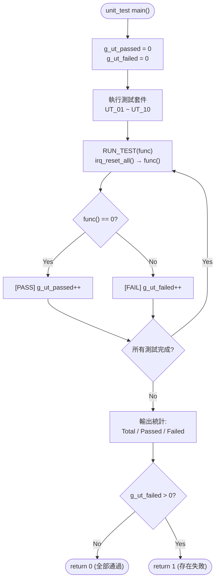

# IRQ Simulator - Unit Verification (Cline)

## 1. Test Scope

單元測試針對 `src/main.c` 中的每個獨立函式進行驗證，確保各函式在隔離環境下行為正確。本文件追溯至詳細設計文件中的 SD_C 項及軟體需求規格中的 SR 項。

## 2. Test Environment

- **編譯器**：GCC (MinGW)
- **語言標準**：C11
- **測試框架**：自訂 assert 巨集（無外部依賴）：`UT_ASSERT(cond, msg)`、`UT_ASSERT_EQ(a, b, msg)`、`UT_ASSERT_HEX_EQ(a, b, msg)`
- **執行入口**：`unit_test/main.c` → `run_all_unit_tests()` → 10 個測試套件 (UT_01 ~ UT_10)
- **狀態重置**：每個測試案例前透過 `RUN_TEST()` 巨集呼叫 `irq_reset_all()` 重置狀態
- **計數器**：`g_ut_passed` / `g_ut_failed` 全域累加，最終輸出統計

### 2.1 Test Runner 流程



## 3. 測試框架 — 自訂 Assert 巨集

測試框架定義於 `unit_test/unit_test.h`，提供三種 assert 巨集：

| 巨集 | 格式 | 說明 |
|----|------|------|
| `UT_ASSERT(cond, msg)` | `printf("[FAIL] %s\n", msg)` if cond == 0 | 通用條件斷言 |
| `UT_ASSERT_EQ(a, b, msg)` | `printf("[FAIL] %s: expected %d, got %d\n", ...)` | 整數相等斷言 |
| `UT_ASSERT_HEX_EQ(a, b, msg)` | `printf("[FAIL] %s: expected 0x%08X, got 0x%08X\n", ...)` | 十六進位相等斷言 |

## 4. Test Cases

### UT_01: tick_irq_handler

| ID | 測試項目 | 輸入 | 預期結果 | 驗證方式 |
|----|---------|------|---------|----------|
| UT_01_01 | tick 初始值 | reset → `irq_get_tick()` | `irq_get_tick() == 0` | `UT_ASSERT_EQ` |
| UT_01_02 | 單次呼叫 | `tick_irq_handler()` → `irq_get_tick()` | `irq_get_tick() == 1` | `UT_ASSERT_EQ` |
| UT_01_03 | 多次呼叫 | 呼叫 5 次 → `irq_get_tick()` | `irq_get_tick() == 5` | `UT_ASSERT_EQ` |
| UT_01_04 | 重置後呼叫 | 先調 3 次 → reset → 再調 3 次 | `irq_get_tick() == 3` | `UT_ASSERT_EQ` |

**追蹤**：SD_C_014 | SR_010, SR_036, SR_038

### UT_02: exception_irq_handler

| ID | 測試項目 | 輸入 | 預期結果 | 驗證方式 |
|----|---------|------|---------|----------|
| UT_02_01 | 函式可被呼叫不崩潰 | `exception_irq_handler()` | 正常返回 | `UT_ASSERT(1, ...)` |
| UT_02_02 | 多次呼叫 | 呼叫 3 次 | 正常返回，無副作用 | `UT_ASSERT(1, ...)` |
| UT_02_03 | 內部計數器驗證 | 呼叫 3 次 → `exception_get_count()` | `exception_get_count() == 3` | `UT_ASSERT_EQ` |

**追蹤**：SD_C_015 | SR_035

### UT_03: irq_trigger

| ID | 測試項目 | 輸入 | 預期結果 | 驗證方式 |
|----|---------|------|---------|----------|
| UT_03_01 | 觸發 IRQ0 | `irq_trigger(0)` → `irq_get_pending()` | `0x00000001` | `UT_ASSERT_HEX_EQ` |
| UT_03_02 | 觸發 IRQ5 | `irq_trigger(5)` → `irq_get_pending()` | `0x00000020` | `UT_ASSERT_HEX_EQ` |
| UT_03_03 | 觸發 IRQ31 | `irq_trigger(31)` → `irq_get_pending()` | `0x80000000` | `UT_ASSERT_HEX_EQ` |
| UT_03_04 | 累積觸發 | trigger(0), trigger(1) | `0x00000003` | `UT_ASSERT_HEX_EQ` |
| UT_03_05 | 重複觸發 | trigger(0), trigger(0) | `0x00000001`（不翻轉） | `UT_ASSERT_HEX_EQ` |
| UT_03_06 | 無效 IRQ (32) | trigger(32) → pending 不變 | pending 與之前相同 | `UT_ASSERT_HEX_EQ` |
| UT_03_07 | 無效 IRQ (99) | trigger(99) → pending 不變 | pending 與之前相同 | `UT_ASSERT_HEX_EQ` |

**追蹤**：SD_C_005, SD_C_010 | SR_001, SR_002, SR_003, SR_004, SR_005, SR_042

### UT_04: irq_handler

| ID | 測試項目 | 輸入 | 預期結果 | 驗證方式 |
|----|---------|------|---------|----------|
| UT_04_01 | 處理 IRQ0 | trigger(0) → handler(0) | pending=0, tick=1 | `UT_ASSERT_HEX_EQ` + `UT_ASSERT_EQ` |
| UT_04_02 | 處理 IRQ5 | trigger(5) → handler(5) | pending=0 | `UT_ASSERT_HEX_EQ` |
| UT_04_03 | 處理 IRQ31 | trigger(31) → handler(31) | pending=0 | `UT_ASSERT_HEX_EQ` |
| UT_04_04 | 處理後 pending 歸零 | trigger(0) → handler(0) → `irq_get_pending()` | `0` | `UT_ASSERT_HEX_EQ` |
| UT_04_05 | 無效 IRQ 號（default 分支） | `irq_handler(99)` | 不崩潰 | `UT_ASSERT(1, ...)` |

**追蹤**：SD_C_008 | SR_009, SR_010~SR_035, SR_045

### UT_05: irq_process_all

| ID | 測試項目 | 輸入 | 預期結果 | 驗證方式 |
|----|---------|------|---------|----------|
| UT_05_01 | 無 pending 時 | `irq_process_all()` | pending 仍為 0 | `UT_ASSERT_HEX_EQ` |
| UT_05_02 | 單一 IRQ | trigger(3) → process_all | pending=0 | `UT_ASSERT_HEX_EQ` |
| UT_05_03 | 多重 IRQ | trigger(0), trigger(5), trigger(10) → process_all | pending=0 | `UT_ASSERT_HEX_EQ` |
| UT_05_04 | 全部 32 個 IRQ | for i=0..31: trigger(i) → process_all | pending=0 | `UT_ASSERT_HEX_EQ` |

**追蹤**：SD_C_007 | SR_007, SR_008

### UT_06: irq_reset_all

| ID | 測試項目 | 輸入 | 預期結果 | 驗證方式 |
|----|---------|------|---------|----------|
| UT_06_01 | 重置 pending | trigger(5) → reset → `irq_get_pending()` | `0` | `UT_ASSERT_HEX_EQ` |
| UT_06_02 | 重置 tick | tick×3 → reset → `irq_get_tick()` | `0` | `UT_ASSERT_EQ` |
| UT_06_03 | 同時重置兩者 | trigger + tick → reset | pending=0, tick=0 | `UT_ASSERT_HEX_EQ` + `UT_ASSERT_EQ` |

**追蹤**：SD_C_002, SD_C_011 | SR_036, SR_037, SR_038

### UT_07: irq_get_pending / irq_get_tick

| ID | 測試項目 | 輸入 | 預期結果 | 驗證方式 |
|----|---------|------|---------|----------|
| UT_07_01 | 初始 pending | reset → `irq_get_pending()` | `0` | `UT_ASSERT_HEX_EQ` |
| UT_07_02 | 初始 tick | reset → `irq_get_tick()` | `0` | `UT_ASSERT_EQ` |
| UT_07_03 | 觸發後 pending | trigger(7) → `irq_get_pending()` | `0x00000080` | `UT_ASSERT_HEX_EQ` |
| UT_07_04 | 非零 tick 值 | tick×3 → `irq_get_tick()` | `3` | `UT_ASSERT_EQ` |

**追蹤**：SD_C_002, SD_C_011 | SR_001, SR_036

### UT_08: irq_trigger_raw

| ID | 測試項目 | 輸入 | 預期結果 | 驗證方式 |
|----|---------|------|---------|----------|
| UT_08_01 | 單 bit raw mask | `irq_trigger_raw(0x00000001)` | `0x00000001` | `UT_ASSERT_HEX_EQ` |
| UT_08_02 | 多 bit raw mask | `irq_trigger_raw(0x0000000F)` | `0x0000000F` | `UT_ASSERT_HEX_EQ` |
| UT_08_03 | 累積 OR 行為 | trigger(0) → `irq_trigger_raw(0x0006)` | `0x00000007` | `UT_ASSERT_HEX_EQ` |
| UT_08_04 | 零遮罩（無操作） | `irq_trigger_raw(0x00000000)` | pending 不變 | `UT_ASSERT_HEX_EQ` |
| UT_08_05 | 全遮罩（全部 32 bits） | `irq_trigger_raw(0xFFFFFFFF)` | `0xFFFFFFFF` | `UT_ASSERT_HEX_EQ` |
| UT_08_06 | 邊界：僅 MSB (IRQ31) | `irq_trigger_raw(0x80000000)` | `0x80000000` | `UT_ASSERT_HEX_EQ` |

**追蹤**：SD_C_006 | SR_003, SR_006

### UT_09: irq_handler（邊界案例）

| ID | 測試項目 | 輸入 | 預期結果 | 驗證方式 |
|----|---------|------|---------|----------|
| UT_09_01 | 無 pending bit 時呼叫 handler | `irq_handler(0)`（未觸發） | 不崩潰，pending 不變 | `UT_ASSERT_HEX_EQ` |
| UT_09_02 | 處理中間 IRQ (IRQ15) | trigger(15) → handler(15) | pending=0 | `UT_ASSERT_HEX_EQ` |
| UT_09_03 | handler 僅清除目標 bit | trigger(0), trigger(1) → handler(0) | bit 0 清除，bit 1 保持置位 (0x0002) | `UT_ASSERT_HEX_EQ` |

**追蹤**：SD_C_008 | SR_009, SR_045

### UT_10: irq_process_all（邊界案例）

| ID | 測試項目 | 輸入 | 預期結果 | 驗證方式 |
|----|---------|------|---------|----------|
| UT_10_01 | 僅最高優先權 (IRQ0) | trigger(0) → process_all | pending=0, tick=1 | `UT_ASSERT_HEX_EQ` + `UT_ASSERT_EQ` |
| UT_10_02 | 僅最低優先權 (IRQ31) | trigger(31) → process_all | pending=0 | `UT_ASSERT_HEX_EQ` |
| UT_10_03 | 優先權順序驗證 | trigger(31), trigger(0) → process_all | IRQ0 先於 IRQ31 處理，tick=1 | `UT_ASSERT_HEX_EQ` + `UT_ASSERT_EQ` |

**追蹤**：SD_C_007 | SR_007, SR_008

## 5. 測試統計

### 5.1 測試套件彙總

| 套件 | 測試案例數 | 追蹤 SD_C | 追蹤 SR |
|------|-----------|-----------|---------|
| UT_01: tick_irq_handler | 4 | SD_C_014 | SR_010, SR_036, SR_038 |
| UT_02: exception_irq_handler | 3 | SD_C_015 | SR_035 |
| UT_03: irq_trigger | 7 | SD_C_005, SD_C_010 | SR_001~SR_005, SR_042 |
| UT_04: irq_handler | 5 | SD_C_008 | SR_009, SR_010~SR_035, SR_045 |
| UT_05: irq_process_all | 4 | SD_C_007 | SR_007, SR_008 |
| UT_06: irq_reset_all | 3 | SD_C_002, SD_C_011 | SR_036~SR_038 |
| UT_07: irq_get_pending / irq_get_tick | 4 | SD_C_002, SD_C_011 | SR_001, SR_036 |
| UT_08: irq_trigger_raw | 6 | SD_C_006 | SR_003, SR_006 |
| UT_09: irq_handler（邊界案例） | 3 | SD_C_008 | SR_009, SR_045 |
| UT_10: irq_process_all（邊界案例） | 3 | SD_C_007 | SR_007, SR_008 |
| **總計** | **42** | **—** | **—** |

### 5.2 預期結果

- 所有 42 個測試案例 (UT_01_01 ~ UT_10_03) 須全部通過
- `run_all_unit_tests()` 返回值為 0
- 終端輸出範例：
  ```
  ========== Unit Tests ==========
  
  [UT_01] tick_irq_handler:
    Running test_tick_initial...
    [PASS] test_tick_initial
    ...
  ========== Unit Test Results ==========
    Total:  42
    Passed: 42
    Failed: 0
  ========================================
  ```

## 6. 單元驗證追溯表

### 6.1 SD_C 覆蓋對照表

| SD_C 項 | 描述 | 覆蓋 UT | 狀態 |
|---------|------|---------|------|
| SD_C_001 | Public API 宣告 | UT_01~UT_10（全部 13 個 API 函式均已測試） | ✅ 已覆蓋 |
| SD_C_002 | Internal State 內部狀態 | UT_06, UT_07 | ✅ 已覆蓋 |
| SD_C_003 | TICK_PRINTF 日誌巨集 | — | ⚠️ 日誌格式（整合測試驗證） |
| SD_C_004 | FW_STATIC 機制 | — | ⚠️ 編譯期驗證（建構系統） |
| SD_C_005 | irq_trigger 演算法 | UT_03 | ✅ 已覆蓋 |
| SD_C_006 | irq_trigger_raw 演算法 | UT_08 | ✅ 已覆蓋 |
| SD_C_007 | irq_process_all 演算法 | UT_05, UT_10 | ✅ 已覆蓋 |
| SD_C_008 | irq_handler 分發演算法 | UT_04, UT_09 | ✅ 已覆蓋 |
| SD_C_009 | 輸入解析演算法 | — | ⚠️ 主迴圈解析（整合測試驗證） |
| SD_C_010 | IRQ Pending Register 佈局 | UT_03 | ✅ 已覆蓋 |
| SD_C_011 | Tick 計數器生命週期 | UT_01, UT_06, UT_07 | ✅ 已覆蓋 |
| SD_C_012 | Exception 計數 | UT_02 | ✅ 已覆蓋 |
| SD_C_013 | 錯誤處理設計 | — | ⚠️ 錯誤訊息（整合測試驗證） |
| SD_C_014 | tick_irq_handler | UT_01 | ✅ 已覆蓋 |
| SD_C_015 | exception_irq_handler | UT_02 | ✅ 已覆蓋 |
| SD_C_016 | DD-01: static 封裝 | UT_06, UT_07 | ✅ 已覆蓋 |
| SD_C_017 | DD-02: TICK_PRINTF 巨集 | — | ⚠️ 日誌格式（整合測試驗證） |
| SD_C_018 | DD-03: 立即清除 pending bit | UT_04, UT_09 | ✅ 已覆蓋 |
| SD_C_019 | DD-04: h-mode `|=` | UT_08 | ✅ 已覆蓋 |
| SD_C_020 | DD-05: uint32_t 選擇 | — | ⚠️ 編譯期型別檢查 |

### 6.2 SR 需求可測試性

| 需求分類 | SR 範圍 | 總數 | 單元測試覆蓋 | 覆蓋率 |
|----------|---------|------|-------------|--------|
| FR-01 (IRQ 觸發機制) | SR_001~SR_003 | 3 | UT_03, UT_08 | 100% |
| FR-02 (輸入模式) | SR_004~SR_006 | 3 | UT_03 (部分) | 33%* |
| FR-03 (優先權處理) | SR_007~SR_009 | 3 | UT_04, UT_05, UT_09, UT_10 | 100% |
| FR-04 (IRQ 行為) | SR_010~SR_035 | 26 | UT_01, UT_02, UT_04 | 100%** |
| FR-05 (Tick 計數器) | SR_036~SR_039 | 4 | UT_01, UT_06, UT_07 | 75% |
| FR-06 (程式控制) | SR_040~SR_041 | 2 | — | 0%* |
| NFR-01 (易用性) | SR_042~SR_043 | 2 | UT_03 (部分) | 50%* |
| NFR-02 (可維護性) | SR_044~SR_045 | 2 | — | 0% |
| NFR-03 (可移植性) | SR_046~SR_047 | 2 | — | 0% |

> \* 輸入解析 (FR-02)、程式控制 (FR-06)、易用性 (NFR-01) 等需求依賴 stdin/stdout 互動，在整合測試中驗證
> \*\* FR-04 的 26 項 IRQ 行為中，IRQ0 (SR_010) 與 IRQ31 (SR_035) 在單元測試中明確驗證，其餘 IRQ1~30 的行為在 handler 分發中隱含驗證

### 6.3 原始碼測試函式對照

| 測試函式名（原始碼） | 對應 UT ID | 所屬套件 |
|---------------------|-----------|---------|
| `test_tick_initial` | UT_01_01 | UT_01 |
| `test_tick_single_call` | UT_01_02 | UT_01 |
| `test_tick_multiple_calls` | UT_01_03 | UT_01 |
| `test_tick_after_reset` | UT_01_04 | UT_01 |
| `test_exception_no_crash` | UT_02_01 | UT_02 |
| `test_exception_multiple_calls` | UT_02_02 | UT_02 |
| `test_exception_count_increment` | UT_02_03 | UT_02 |
| `test_trigger_irq0` | UT_03_01 | UT_03 |
| `test_trigger_irq5` | UT_03_02 | UT_03 |
| `test_trigger_irq31` | UT_03_03 | UT_03 |
| `test_trigger_accumulate` | UT_03_04 | UT_03 |
| `test_trigger_duplicate` | UT_03_05 | UT_03 |
| `test_trigger_invalid_32` | UT_03_06 | UT_03 |
| `test_trigger_invalid_99` | UT_03_07 | UT_03 |
| `test_handler_irq0` | UT_04_01 | UT_04 |
| `test_handler_irq5` | UT_04_02 | UT_04 |
| `test_handler_irq31` | UT_04_03 | UT_04 |
| `test_handler_clears_pending` | UT_04_04 | UT_04 |
| `test_handler_invalid_irq` | UT_04_05 | UT_04 |
| `test_process_all_empty` | UT_05_01 | UT_05 |
| `test_process_all_single` | UT_05_02 | UT_05 |
| `test_process_all_multiple` | UT_05_03 | UT_05 |
| `test_process_all_full` | UT_05_04 | UT_05 |
| `test_reset_pending` | UT_06_01 | UT_06 |
| `test_reset_tick` | UT_06_02 | UT_06 |
| `test_reset_both` | UT_06_03 | UT_06 |
| `test_get_pending_initial` | UT_07_01 | UT_07 |
| `test_get_tick_initial` | UT_07_02 | UT_07 |
| `test_get_pending_after_trigger` | UT_07_03 | UT_07 |
| `test_get_tick_nonzero` | UT_07_04 | UT_07 |
| `test_trigger_raw_single_bit` | UT_08_01 | UT_08 |
| `test_trigger_raw_multi_bit` | UT_08_02 | UT_08 |
| `test_trigger_raw_cumulative_or` | UT_08_03 | UT_08 |
| `test_trigger_raw_zero_mask` | UT_08_04 | UT_08 |
| `test_trigger_raw_full_mask` | UT_08_05 | UT_08 |
| `test_trigger_raw_msb_only` | UT_08_06 | UT_08 |
| `test_handler_no_pending` | UT_09_01 | UT_09 |
| `test_handler_middle_irq15` | UT_09_02 | UT_09 |
| `test_handler_clears_only_target` | UT_09_03 | UT_09 |
| `test_process_all_highest_only` | UT_10_01 | UT_10 |
| `test_process_all_lowest_only` | UT_10_02 | UT_10 |
| `test_process_all_priority_order` | UT_10_03 | UT_10 |

---

> **縮寫說明：**
>
> - **UT** = Unit Test（單元測試，為所有單元測試案例的統一編號）
> - **SD_C** = Software Detailed Design (Cline)（軟體詳細設計，追溯至 SWE.3 詳細設計項）
> - **SR** = Software Requirement（軟體需求，追溯至 SWE.1 需求項）