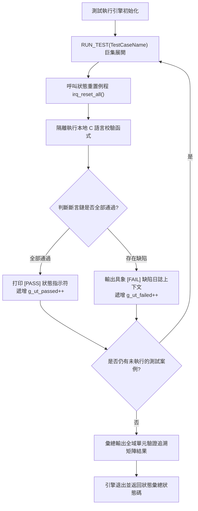

# IRQ Simulator - 軟體單元測試計畫書

## 1. 單元驗證範圍說明
本報告規定了針對 `src/main.c` 內部所有檔案作用域私有函式的白盒單元驗證規程，透過自定義斷言包裝評估其演算法邏輯流與邊界處理的正確性。

## 2. 單元測試執行引擎設計

## 3. 單元驗證斷言套件配置說明
為實作測試管線零外部依賴且具備確定性行為，框架顯式部署了以下位元運算及數值等價評估巨集。

| 驗證斷言宏名稱 | 底層技術表達式模板 | 預期的邏輯評估行為 |
| :--- | :--- | :--- |
| `UT_ASSERT(cond, msg)` | `if (!(cond)) { (void)printf("[FAIL] %s\n", msg); return 1; }` | 驗證基礎二值表達式的真偽。 |
| `UT_ASSERT_EQ(a, b, msg)` | `if ((a) != (b)) { (void)printf("[FAIL] %s: Expected %u, Got %u\n", msg, a, b); return 1; }` | 校驗狀態及計數器等整型參數的數值等價性。 |
| `UT_ASSERT_HEX_EQ(a, b, msg)` | `if ((a) != (b)) { (void)printf("[FAIL] %s: Expected 0x%08X, Got 0x%08X\n", msg, a, b); return 1; }` | 針對暫存器位元欄位或遮罩進行精確的十六進位對齊校驗。 |

## 4. 軟體單元驗證目標用例樹

### UT_01: 單調 Tick 計數器行為驗證
* **驗證目的**: 確保系統時間基準計數器的狀態流轉及疊代邏輯完全符合預期。
* **邊界條件**: 考核多次疊代時的累加溢位邊界。

| 測試項 ID | 單元執行輸入激勵參數 | 預期的確定性狀態輸出 | 選用的斷言宏 | 追溯的詳細設計 |
| :--- | :--- | :--- | :--- | :--- |
| UT_01_01 | 在重置狀態後立即回讀系統 tick 計數值。 | `irq_get_tick() == 0U` | `UT_ASSERT_EQ` | SD_002 |
| UT_01_02 | 顯式孤立調用單次 `tick_irq_handler()`。 | `irq_get_tick() == 1U` | `UT_ASSERT_EQ` | SD_006 |
| UT_01_03 | 迴圈觸發連續疊代排程（執行 5 次）。 | `irq_get_tick() == 5U` | `UT_ASSERT_EQ` | SD_006 |

### UT_02: 異常狀態帳本評估
* **驗證目的**: 驗證硬體異常計數器在獨立隔離排程下數據不發生交叉污染。

| 測試項 ID | 單元執行輸入激勵參數 | 預期的確定性狀態輸出 | 選用的斷言宏 | 追溯的詳細設計 |
| :--- | :--- | :--- | :--- | :--- |
| UT_02_01 | 初始化後立即回讀系統異常狀態計數。 | `exception_get_count() == 0U`| `UT_ASSERT_EQ` | SD_002 |
| UT_02_02 | 透過 `exception_irq_handler()` 觸發單次異常。 | `exception_get_count() == 1U`| `UT_ASSERT_EQ` | SD_006 |

### UT_03: irq_trigger 暫存器位元鎖存邊界驗證
* **驗證目的**: 確保位元欄位鎖存器在合法範圍內精確置位，且對非法越界請求執行嚴格硬降級（拒絕更新）。

| 測試項 ID | 單元執行輸入激勵參數 | 預期的確定性狀態輸出 | 選用的斷言宏 | 追溯的詳細設計 |
| :--- | :--- | :--- | :--- | :--- |
| UT_03_01 | 提交下限通道邊界參數 `irq_trigger(0)`。 | `irq_get_pending() == 0x00000001U` | `UT_ASSERT_HEX_EQ` | SD_004 |
| UT_03_02 | 提交中段合法參數 `irq_trigger(5)`。 | `irq_get_pending() == 0x00000020U` | `UT_ASSERT_HEX_EQ` | SD_004 |
| UT_03_03 | 提交合法硬體上限通道參數觸發 `irq_trigger(31)`。 | `irq_get_pending() == 0x80000000U` | `UT_ASSERT_HEX_EQ` | SD_004 |
| UT_03_04 | 對同一合法通道投遞重複觸發請求 `irq_trigger(0)`。 | `irq_get_pending() == 0x00000001U`（不翻轉） | `UT_ASSERT_HEX_EQ` | SD_004 |
| UT_03_05 | 投遞越界非法通道參數觸發 `irq_trigger(32)`。 | `irq_get_pending() == 0x00000000U`（被拒）| `UT_ASSERT_HEX_EQ` | SD_004 |

### UT_04: 中斷自動清除與分發結合驗證
* **驗證目的**: 考核分發例程執行完畢後掛起暫存器相應位元是否能及時被清除。

| 測試項 ID | 單元執行輸入激勵參數 | 預期的確定性狀態輸出 | 選用的斷言宏 | 追溯的詳細設計 |
| :--- | :--- | :--- | :--- | :--- |
| UT_04_01 | 同時掛起多路位元旗標 `irq_trigger(0); irq_trigger(31);`，執行 `irq_process_all()`。 | `irq_get_pending() == 0U`，掛起位元完全排空，隱含驗證了分發器。 | `UT_ASSERT_HEX_EQ` | SD_005, SD_006 |

---

## 5. 單元驗證用例至 C 語言測試源碼函式符號對應表
| 審計追溯 ID | 單元驗證 C 語言測試源碼函式符號名稱 (1:1 對應) | 追溯的詳細設計設計項 ID |
| :--- | :--- | :--- |
| **UT_01_01** | `test_tick_initial_state_evaluation` | SD_002 |
| **UT_01_02** | `test_tick_single_increment_route` | SD_006 |
| **UT_01_03** | `test_tick_multiple_loop_accumulation` | SD_006 |
| **UT_02_01** | `test_exception_initial_state` | SD_002 |
| **UT_02_02** | `test_exception_handler_increment` | SD_006 |
| **UT_03_01** | `test_trigger_boundary_channel_zero` | SD_004, SD_008 |
| **UT_03_02** | `test_trigger_mid_range_channel_five` | SD_004, SD_008 |
| **UT_03_03** | `test_trigger_maximum_boundary_channel_thirty_one` | SD_004, SD_008 |
| **UT_03_04** | `test_trigger_duplicate_latch_protection` | SD_004 |
| **UT_03_05** | `test_trigger_out_of_bounds_rejection` | SD_004, SD_010 |
| **UT_04_01** | `test_process_priority_clear_sequence` | SD_005, SD_006 |
