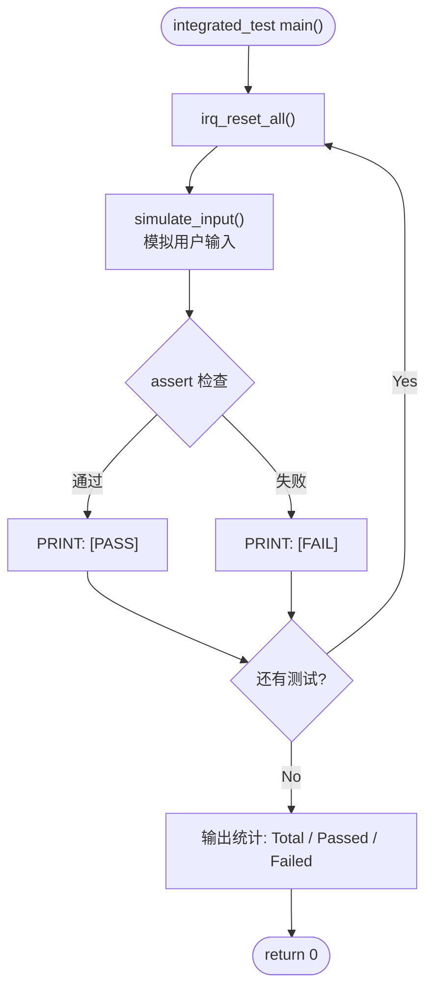

# IRQ Simulator - Integration Test Plan

## 1. Test Scope

集成测试验证多个模块之间的交互行为，包含输入解析、IRQ 触发与处理的端到端流程、tick 计数的跨模块一致性。

## 2. Test Environment

- 编译器：GCC (MinGW)
- 语言标准：C11
- 测试框架：自定义 assert 宏
- 每个测试用例前调用 `irq_reset_all()` 重置状态

## 3. Test Cases

### IT-01: 数字模式输入解析

| ID | 测试项 | 模拟输入 | 预期结果 |
|----|---------|---------|---------|
| IT-01-01 | 输入 1 触发 IRQ0 | `"1"` | pending=0x01, IRQ0 被处理, pending=0 |
| IT-01-02 | 输入 32 触发 IRQ31 | `"32"` | pending=0x80000000, IRQ31 被处理 |
| IT-01-03 | 输入 0 手动处理 | trigger(3) → `"0"` | IRQ3 被处理 |
| IT-01-04 | 无效数字 33 | `"33"` | pending 不变，输出错误消息 |
| IT-01-05 | 无效数字 -5 | `"-5"` | pending 不变，输出错误消息 |

### IT-02: b-mode 输入解析

| ID | 测试项 | 模拟输入 | 预期结果 |
|----|---------|---------|---------|
| IT-02-01 | b0 触发 IRQ0 | `"b0"` | pending=0x01, IRQ0 被处理 |
| IT-02-02 | b5 触发 IRQ5 | `"b5"` | pending=0x20, IRQ5 被处理 |
| IT-02-03 | b31 触发 IRQ31 | `"b31"` | pending=0x80000000, IRQ31 被处理 |
| IT-02-04 | B10 (大写) | `"B10"` | pending=0x400, IRQ10 被处理 |
| IT-02-05 | 无效 b32 | `"b32"` | pending 不变，输出错误 |
| IT-02-06 | 无效 b-1 | `"b-1"` | pending 不变，输出错误 |

### IT-03: h-mode 输入解析

| ID | 测试项 | 模拟输入 | 预期结果 |
|----|---------|---------|---------|
| IT-03-01 | h1 触发 IRQ0 | `"h1"` | pending=0x01, IRQ0 被处理 |
| IT-03-02 | h3 触发 IRQ0,1 | `"h3"` | IRQ0, IRQ1 依次被处理 |
| IT-03-03 | hFF 触发 IRQ0~7 | `"hFF"` | IRQ0~7 全部依次处理 |
| IT-03-04 | h80000000 触发 IRQ31 | `"h80000000"` | IRQ31 被处理 |
| IT-03-05 | H0A (大写+hex) | `"H0A"` | pending=0x0A, IRQ1,3 被处理 |
| IT-03-06 | 无效 hGG | `"hGG"` | pending 不变，输出错误 |

### IT-04: 累积触发与优先权

| ID | 测试项 | 步骤 | 预期结果 |
|----|---------|------|---------|
| IT-04-01 | 先触发再 h-mode 追加 | trigger(0) → `"h6"` | IRQ0,1,2 依次处理 |
| IT-04-02 | 多次 b-mode 累积 | `"b10"` → `"b5"` → `"0"` | IRQ5,10 依次处理 |
| IT-04-03 | 优先权顺序验证 | `"h80000001"` | IRQ0 先于 IRQ31 处理 |

### IT-05: Tick 计数一致性

| ID | 测试项 | 步骤 | 预期结果 |
|----|---------|------|---------|
| IT-05-01 | 初始 tick 为 0 | reset → get_tick | tick == 0 |
| IT-05-02 | 触发 IRQ0 后 tick+1 | trigger(0) → process | tick 增加 (IRQ0 handler +1) |
| IT-05-03 | 非 IRQ0 不影响 tick | trigger(5) → process | tick 不因 IRQ5 而增加 |
| IT-05-04 | 多次 IRQ0 tick 累计 | trigger(0)→process, trigger(0)→process, trigger(0)→process | tick 正确累加 3 |

### IT-06: exit 与边界条件

| ID | 测试项 | 模拟输入 | 预期结果 |
|----|---------|---------|---------|
| IT-06-01 | exit 正常退出 | `"exit"` | 返回 0，输出 goodbye |
| IT-06-02 | 空行输入 | `""` | 输出错误提示，不崩溃 |
| IT-06-03 | 乱码输入 | `"xyz"` | 输出错误提示，不崩溃 |

### IT-07: 端到端完整流程

| ID | 测试项 | 步骤 | 预期结果 |
|----|---------|------|---------|
| IT-07-01 | 完整操作序列 | `"1"` → `"b5"` → `"h3"` → `"exit"` | 所有 IRQ 正确处理，正常退出 |

## 4. Expected Results

- 所有 IT-01 ~ IT-07 测试用例须全部通过
- 通过率：100%