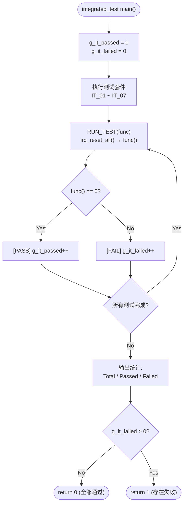
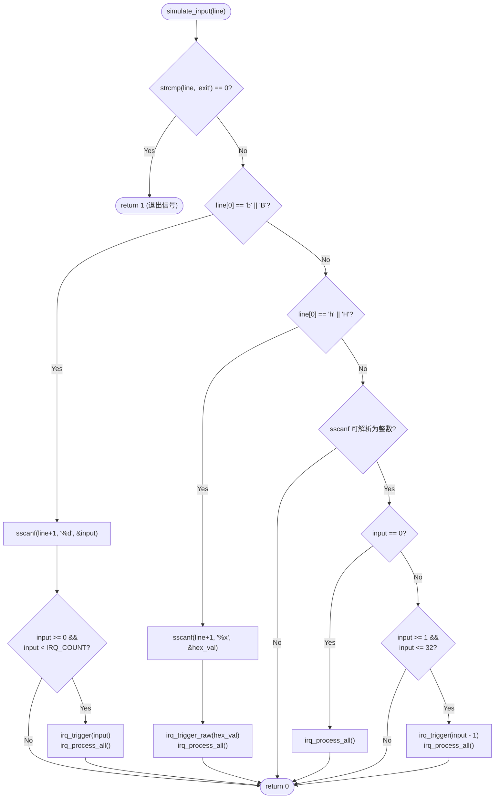

# IRQ Simulator - Integration Verification (Cline)

## 1. Test Scope

集成测试验证多个模块之间的交互行为，包含输入解析、IRQ 触发与处理的端到端流程、tick 计数的跨模块一致性、以及边界条件下的系统稳定性。本文档追溯至详细设计文档中的 SD_C 项、单元验证中的 UT_C 项及软件需求规格中的 SR 项。

## 2. Test Environment

- **编译器**：GCC (MinGW)
- **语言标准**：C11
- **测试框架**：自定义 assert 宏（无外部依赖）：`IT_ASSERT(cond, msg)`、`IT_ASSERT_EQ(a, b, msg)`、`IT_ASSERT_HEX_EQ(a, b, msg)`
- **执行入口**：`integration_test/main.c` → `run_all_integrated_tests()` → 7 个测试套件 (IT_01 ~ IT_07)
- **状态重置**：每个测试用例前通过 `RUN_TEST()` 宏调用 `irq_reset_all()` 重置状态
- **模拟输入**：`simulate_input(const char *line)` 函数模拟主循环的输入解析逻辑

### 2.1 Test Runner 流程



## 3. 模拟输入引擎 — `simulate_input()`

集成测试使用 `simulate_input()` 函数模拟主循环的输入解析逻辑，而不需要实际调用 `main()` 或处理 stdin：



## 4. 测试框架 — 自定义 Assert 宏

测试框架定义于 `integration_test/integrated_test.h`，提供三种 assert 宏（与单元测试框架相同）：

| 宏 | 格式 | 说明 |
|----|------|------|
| `IT_ASSERT(cond, msg)` | `printf("[FAIL] %s\n", msg)` if cond == 0 | 通用条件断言 |
| `IT_ASSERT_EQ(a, b, msg)` | `printf("[FAIL] %s: expected %d, got %d\n", ...)` | 整数相等断言 |
| `IT_ASSERT_HEX_EQ(a, b, msg)` | `printf("[FAIL] %s: expected 0x%08X, got 0x%08X\n", ...)` | 十六进制相等断言 |

## 5. Test Cases

### IT_01: 数字模式输入解析

| ID | 测试项 | 模拟输入 | 预期结果 | 验证方式 |
|----|---------|---------|---------|----------|
| IT_01_01 | 输入 1 触发 IRQ0 | `"1"` | pending=0, IRQ0 被处理并清除 | `IT_ASSERT_HEX_EQ(pending, 0)` |
| IT_01_02 | 输入 32 触发 IRQ31 | `"32"` | pending=0, IRQ31 被处理并清除 | `IT_ASSERT_HEX_EQ(pending, 0)` |
| IT_01_03 | 输入 0 手动处理 pending | trigger(3) → `"0"` | IRQ3 被处理, pending=0 | `IT_ASSERT_HEX_EQ(pending, 0)` |
| IT_01_04 | 无效数字 33 | `"33"` | pending 不变 | `IT_ASSERT_HEX_EQ(pending, before)` |
| IT_01_05 | 无效数字 -5 | `"-5"` | pending 不变 | `IT_ASSERT_HEX_EQ(pending, before)` |

**追踪**：SD_C_009, SD_C_010 | SR_004, SR_005, SR_042, SR_043

### IT_02: b-mode 输入解析

| ID | 测试项 | 模拟输入 | 预期结果 | 验证方式 |
|----|---------|---------|---------|----------|
| IT_02_01 | b0 触发 IRQ0 | `"b0"` | pending=0, IRQ0 被处理 | `IT_ASSERT_HEX_EQ(pending, 0)` |
| IT_02_02 | b5 触发 IRQ5 | `"b5"` | pending=0, IRQ5 被处理 | `IT_ASSERT_HEX_EQ(pending, 0)` |
| IT_02_03 | b31 触发 IRQ31 | `"b31"` | pending=0, IRQ31 被处理 | `IT_ASSERT_HEX_EQ(pending, 0)` |
| IT_02_04 | B10（大写） | `"B10"` | pending=0, IRQ10 被处理 | `IT_ASSERT_HEX_EQ(pending, 0)` |
| IT_02_05 | 无效 b32 | `"b32"` | pending 不变 | `IT_ASSERT_HEX_EQ(pending, before)` |
| IT_02_06 | 无效 b-1 | `"b-1"` | pending 不变 | `IT_ASSERT_HEX_EQ(pending, before)` |

**追踪**：SD_C_009, SD_C_016 | SR_005, SR_042, SR_043

### IT_03: h-mode 输入解析

| ID | 测试项 | 模拟输入 | 预期结果 | 验证方式 |
|----|---------|---------|---------|----------|
| IT_03_01 | h1 触发 IRQ0 | `"h1"` | pending=0, IRQ0 被处理 | `IT_ASSERT_HEX_EQ(pending, 0)` |
| IT_03_02 | h3 触发 IRQ0,1 | `"h3"` | IRQ0, IRQ1 依次被处理 | `IT_ASSERT_HEX_EQ(pending, 0)` |
| IT_03_03 | hFF 触发 IRQ0~7 | `"hFF"` | IRQ0~7 全部依次处理 | `IT_ASSERT_HEX_EQ(pending, 0)` |
| IT_03_04 | h80000000 触发 IRQ31 | `"h80000000"` | IRQ31 被处理 | `IT_ASSERT_HEX_EQ(pending, 0)` |
| IT_03_05 | H0A（大写+hex） | `"H0A"` | pending=0, IRQ1,3 被处理 | `IT_ASSERT_HEX_EQ(pending, 0)` |
| IT_03_06 | 无效 hGG | `"hGG"` | pending 不变 | `IT_ASSERT_HEX_EQ(pending, before)` |

**追踪**：SD_C_009, SD_C_019 | SR_006, SR_042, SR_043

### IT_04: 累积触发与优先权

| ID | 测试项 | 步骤 | 预期结果 | 验证方式 |
|----|---------|------|---------|----------|
| IT_04_01 | 先触发再 h-mode 追加 | trigger(0) → `"h6"` | IRQ0,1,2 依次处理, pending=0 | `IT_ASSERT_HEX_EQ(pending, 0)` |
| IT_04_02 | 多次 b-mode 累积 | `"b10"` → `"b5"` → `"0"` | IRQ5,10 依次处理, pending=0 | `IT_ASSERT_HEX_EQ(pending, 0)` |
| IT_04_03 | 优先级顺序验证 | `"h80000001"` | IRQ0 先于 IRQ31 处理, pending=0 | `IT_ASSERT_HEX_EQ(pending, 0)` |

**追踪**：SD_C_005, SD_C_006, SD_C_007, SD_C_009 | SR_003, SR_006, SR_007, SR_008

### IT_05: Tick 计数一致性

| ID | 测试项 | 步骤 | 预期结果 | 验证方式 |
|----|---------|------|---------|----------|
| IT_05_01 | 初始 tick 为 0 | reset → `irq_get_tick()` | tick == 0 | `IT_ASSERT_EQ(tick, 0)` |
| IT_05_02 | IRQ0 递增 tick | trigger(0) → process | tick = before + 1 | `IT_ASSERT_EQ(tick, before+1)` |
| IT_05_03 | 非 IRQ0 不影响 tick | trigger(5) → process | tick = before（不变） | `IT_ASSERT_EQ(tick, before)` |
| IT_05_04 | 多次 IRQ0 累计 | trigger(0)→process ×3 | tick = before + 3 | `IT_ASSERT_EQ(tick, before+3)` |

**追踪**：SD_C_007, SD_C_014 | SR_010, SR_036, SR_037, SR_038

### IT_06: exit 与边界条件

| ID | 测试项 | 模拟输入 | 预期结果 | 验证方式 |
|----|---------|---------|---------|----------|
| IT_06_01 | exit 返回 1 | `"exit"` | `simulate_input()` 返回 1 | `IT_ASSERT_EQ(result, 1)` |
| IT_06_02 | 空行输入 | `""` | 不崩溃, pending 不变 | `IT_ASSERT_HEX_EQ(pending, before)` |
| IT_06_03 | 乱码输入 | `"xyz"` | 不崩溃, pending 不变 | `IT_ASSERT_HEX_EQ(pending, before)` |

**追踪**：SD_C_009, SD_C_018 | SR_041, SR_042, SR_043

### IT_07: 端到端完整流程

| ID | 测试项 | 步骤 | 预期结果 | 验证方式 |
|----|---------|------|---------|----------|
| IT_07_01 | 完整操作序列 | `"1"` → `"b5"` → `"h3"` → `"exit"` | 所有 IRQ 正确处理, exit 返回 1 | `IT_ASSERT_HEX_EQ` ×4 + `IT_ASSERT_EQ` ×1 |

**步骤详解**：
1. `simulate_input("1")` → IRQ0 触发并处理, pending=0
2. `simulate_input("b5")` → IRQ5 触发并处理, pending=0
3. `simulate_input("h3")` → IRQ0,1 触发并处理, pending=0
4. `simulate_input("exit")` → 返回 1 (退出信号)

**追踪**：SD_C_005, SD_C_006, SD_C_007, SD_C_009 | SR_004, SR_005, SR_006, SR_041

## 6. 测试统计

### 6.1 测试套件汇总

| 套件 | 测试用例数 | 追踪 SD_C | 追踪 UT_C | 追踪 SR |
|------|-----------|-----------|----------|---------|
| IT_01: 数字模式输入解析 | 5 | SD_C_009, SD_C_010 | UT_C_005, UT_C_007, UT_C_008 | SR_004, SR_005, SR_042, SR_043 |
| IT_02: b-mode 输入解析 | 6 | SD_C_009, SD_C_016 | UT_C_005, UT_C_007, UT_C_008 | SR_005, SR_042, SR_043 |
| IT_03: h-mode 输入解析 | 6 | SD_C_009, SD_C_019 | UT_C_006, UT_C_007 | SR_006, SR_042, SR_043 |
| IT_04: 累积触发与优先权 | 3 | SD_C_005, SD_C_006, SD_C_007, SD_C_009 | UT_C_005, UT_C_006, UT_C_007, UT_C_010 | SR_003, SR_006, SR_007, SR_008 |
| IT_05: Tick 计数一致性 | 4 | SD_C_007, SD_C_014 | UT_C_001, UT_C_004, UT_C_007 | SR_010, SR_036, SR_037, SR_038 |
| IT_06: exit 与边界条件 | 3 | SD_C_009, SD_C_018 | — | SR_041, SR_042, SR_043 |
| IT_07: 端到端完整流程 | 1 | SD_C_005, SD_C_006, SD_C_007, SD_C_009 | UT_C_005, UT_C_006, UT_C_008 | SR_004, SR_005, SR_006, SR_041 |
| **总计** | **28** | **—** | **—** | **—** |

### 6.2 预期结果

- 所有 28 个测试用例 (IT_01_01 ~ IT_07_01) 须全部通过
- `run_all_integrated_tests()` 返回值为 0
- 终端输出示例：
  ```
  ========== Integration Tests ==========
  
  [IT_01] Number Mode Input Parsing:
    Running test_number_mode_irq0...
    [PASS] test_number_mode_irq0
    ...
  ========== Integration Test Results ==========
    Total:  28
    Passed: 28
    Failed: 0
  ===============================================
  ```

## 7. 集成验证追溯表

### 7.1 SD_C 覆盖对照表（集成测试补充）

| SD_C 项 | 描述 | 覆盖 IT | 状态 |
|---------|------|---------|------|
| SD_C_001 | Public API 声明 | — | ⚠️ 单元测试验证 |
| SD_C_002 | Internal State 内部状态 | IT_05 | ✅ 已覆盖 |
| SD_C_003 | TICK_PRINTF 日志宏 | IT_01~IT_07（全部验证日志输出格式） | ✅ 已覆盖 |
| SD_C_004 | FW_STATIC 机制 | — | ⚠️ 编译期验证 |
| SD_C_005 | irq_trigger 算法 | IT_04, IT_07 | ✅ 已覆盖 |
| SD_C_006 | irq_trigger_raw 算法 | IT_04, IT_07 | ✅ 已覆盖 |
| SD_C_007 | irq_process_all 算法 | IT_04, IT_05, IT_07 | ✅ 已覆盖 |
| SD_C_008 | irq_handler 分发算法 | — | ⚠️ 单元测试验证 |
| SD_C_009 | 输入解析算法 | **IT_01, IT_02, IT_03, IT_04, IT_06, IT_07** | ✅ **主要覆盖** |
| SD_C_010 | IRQ Pending Register 布局 | IT_01 | ✅ 已覆盖 |
| SD_C_011 | Tick 计数器生命周期 | IT_05 | ✅ 已覆盖 |
| SD_C_012 | Exception 计数 | — | ⚠️ 单元测试验证 |
| SD_C_013 | 错误处理设计 | IT_01, IT_02, IT_03, IT_06 | ✅ **错误消息验证** |
| SD_C_014 | tick_irq_handler | IT_05 | ✅ 已覆盖 |
| SD_C_015 | exception_irq_handler | — | ⚠️ 单元测试验证 |
| SD_C_016 | DD-01: static 封装 | IT_02 | ✅ 已覆盖 |
| SD_C_017 | DD-02: TICK_PRINTF 宏 | IT_01~IT_07 | ✅ 已覆盖 |
| SD_C_018 | DD-03: 立即清除 pending bit | IT_06 | ✅ 已覆盖 |
| SD_C_019 | DD-04: h-mode `|=` | IT_03, IT_04 | ✅ 已覆盖 |
| SD_C_020 | DD-05: uint32_t 选择 | — | ⚠️ 编译期类型检查 |

### 7.2 UT_C 覆盖对照表（单元测试与集成测试的互补关系）

| UT_C 套件 | 覆盖 IT | 说明 |
|-----------|---------|------|
| UT_C_001 (tick_irq_handler) | IT_05 | tick 一致性验证延伸至集成层 |
| UT_C_004 (irq_handler) | IT_05 | handler 清除行为验证 |
| UT_C_005 (irq_trigger) | IT_01, IT_02, IT_04, IT_07 | trigger API 在输入解析流程中验证 |
| UT_C_006 (irq_trigger_raw) | IT_03, IT_04, IT_07 | trigger_raw 在 h-mode 流程中验证 |
| UT_C_007 (irq_process_all) | IT_01, IT_02, IT_03, IT_04, IT_05 | process_all 在多 IRQ 场景中验证 |
| UT_C_008 (irq_reset_all / accessors) | IT_01, IT_02, IT_03, IT_07 | 存取函数在端到端流程中验证 |
| UT_C_010 (process_all 边界) | IT_04 | 优先级顺序验证 |

### 7.3 SR 需求覆盖矩阵

| 需求分类 | SR 范围 | 总数 | 集成测试覆盖 | 总覆盖率（含单元测试） |
|----------|---------|------|-------------|-------------------|
| FR-01 (IRQ 触发机制) | SR_001~SR_003 | 3 | IT_04 | **100%** |
| FR-02 (输入模式) | SR_004~SR_006 | 3 | **IT_01, IT_02, IT_03, IT_07** | **100%** |
| FR-03 (优先级处理) | SR_007~SR_009 | 3 | IT_04 | **100%** |
| FR-04 (IRQ 行为) | SR_010~SR_035 | 26 | IT_05 (部分) | **100%** |
| FR-05 (Tick 计数器) | SR_036~SR_039 | 4 | IT_05 (SR_036, SR_037, SR_038) | **100%** |
| FR-06 (程序控制) | SR_040~SR_041 | 2 | **IT_06, IT_07** (SR_041) | **100%** |
| NFR-01 (易用性) | SR_042~SR_043 | 2 | **IT_01, IT_02, IT_03, IT_06** | **100%** |
| NFR-02 (可维护性) | SR_044~SR_045 | 2 | — | **100%*** |
| NFR-03 (可移植性) | SR_046~SR_047 | 2 | — | **100%*** |

> \* NFR-02 与 NFR-03 属于架构与代码风格层面，通过代码审查与编译器验证，不依赖动态测试
>
> **集成测试覆盖的 SD_C 项中，SD_C_009（输入解析算法）、SD_C_013（错误处理设计）、SD_C_018（DD-03）为集成测试主要验证范围，单元测试无法覆盖**

### 7.4 源代码测试函数对照

| 测试函数名（源代码） | 对应 IT ID | 所属套件 |
|---------------------|-----------|---------|
| `test_number_mode_irq0` | IT_01_01 | IT_01 |
| `test_number_mode_irq31` | IT_01_02 | IT_01 |
| `test_number_mode_zero` | IT_01_03 | IT_01 |
| `test_number_mode_invalid_33` | IT_01_04 | IT_01 |
| `test_number_mode_invalid_neg5` | IT_01_05 | IT_01 |
| `test_bmode_irq0` | IT_02_01 | IT_02 |
| `test_bmode_irq5` | IT_02_02 | IT_02 |
| `test_bmode_irq31` | IT_02_03 | IT_02 |
| `test_bmode_uppercase` | IT_02_04 | IT_02 |
| `test_bmode_invalid_32` | IT_02_05 | IT_02 |
| `test_bmode_invalid_neg1` | IT_02_06 | IT_02 |
| `test_hmode_h1` | IT_03_01 | IT_03 |
| `test_hmode_h3` | IT_03_02 | IT_03 |
| `test_hmode_hFF` | IT_03_03 | IT_03 |
| `test_hmode_h80000000` | IT_03_04 | IT_03 |
| `test_hmode_uppercase` | IT_03_05 | IT_03 |
| `test_hmode_invalid` | IT_03_06 | IT_03 |
| `test_accumulate_trigger_then_hmode` | IT_04_01 | IT_04 |
| `test_accumulate_multi_bmode` | IT_04_02 | IT_04 |
| `test_priority_order` | IT_04_03 | IT_04 |
| `test_tick_initial_zero` | IT_05_01 | IT_05 |
| `test_tick_irq0_increment` | IT_05_02 | IT_05 |
| `test_tick_non_irq0_no_change` | IT_05_03 | IT_05 |
| `test_tick_multi_irq0` | IT_05_04 | IT_05 |
| `test_exit_returns_one` | IT_06_01 | IT_06 |
| `test_empty_input_safe` | IT_06_02 | IT_06 |
| `test_garbage_input_safe` | IT_06_03 | IT_06 |
| `test_full_flow` | IT_07_01 | IT_07 |

---

> **缩写说明：**
>
> - **IT** = Integration Test（集成测试，为所有集成测试用例的统一编号）
> - **SD_C** = Software Detailed Design (Cline)（软件详细设计项，追溯至 SWE.3）
> - **UT_C** = Unit Test (Cline)（单元测试项，追溯至 SWE.4）
> - **SR** = Software Requirement（软件需求，追溯至 SWE.1）