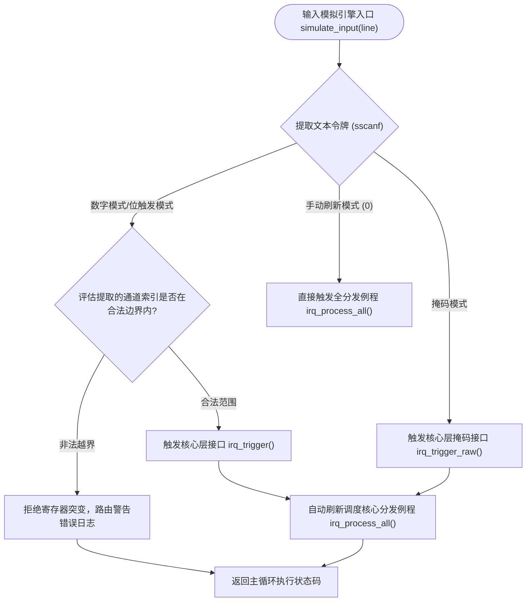

# IRQ Simulator - 软件集成测试报告

## 1. 集成验证范围说明
本报告详细规定了针对本中断模拟器全局关键软件组件间接口互操作性的验证方案。验证边界涵盖控制台输入缓冲区数据摄取管线、文本令牌提取算法、寄存器阵列底层突变钩子与行为日志发生器模块之间的端到端交互。

## 2. 软件组件集成架构与模拟引擎设计

## 3. 单元验证与集成验证互补性逻辑（设计分层互補矩陣）
集成测试着重考核多模块、多组件进行级联交互时的接口边界，此类运行时耦合在隔离的低层单元测试中被完全模拟桩代换。

| 目标集成的体系结构组件层级连接 | 隔离单元验证规程所承诺的考核边界 (SWE.4) | 集成阶段接口级覆盖验证策略 (SWE.5) |
| :--- | :--- | :--- |
| **控制台缓冲区摄取 -> 核心寄存器位字段改写** | 验证在人工投递显式无符号整型参数时，单寄存器位移运算逻辑的正确性。 | 考核真实运行时指针切片、格式化解析说明符、大小写令牌容错约束（如 `'b'` 与 `'B'`）对核心寄存器的改写。 |
| **多通道挂起状态 -> 统一控制台日志宏发生器** | 证明在单一 pending 位置位时，分发器内部的分支 switch-case 能准确路由至外设分支。 | 考核在多通道掩码级并发更新下，系统日志发生器是否按确定性优先级顺序输出历史，且消息严格对齐系统 tick 单调前缀。 |

## 4. 软件集成验证目标用例规格

### IT_01: 数字模式输入解析与分发级联接口验证
* **集成策略**: 向摄取管线投递合法/非法边界纯数字令牌，确认解析机制与底层改写钩子的同步性。

| 集成测试项 ID | 注入的文本模拟缓冲区输入激励 | 预期的组件串联运行状态及全局寄存器收敛行为 | 接口断言校验方法 | 追溯的详细设计设计项 |
| :--- | :--- | :--- | :--- | :--- |
| IT_01_01 | `"1\n"` | 解析出 0 通道，挂起寄存器，触发分发，正确输出系統定時器日志后 pending 位清零。 | `IT_ASSERT_HEX_EQ(pending, 0)` | SD_004, SD_006 |
| IT_01_02 | `"32\n"` | 解析出 31 通道，挂起寄存器，触发分发，正确输出并自增系统异常状态账本。 | `IT_ASSERT_HEX_EQ(pending, 0)` | SD_004, SD_006 |
| IT_01_03 | `"33\n"` | 非法边界纯数字测试。拒绝硬件寄存器改写，系统安全维持原 pending 掩码状态。 | `IT_ASSERT_HEX_EQ(pending, before)`| SD_004, SD_010 |

### IT_02: 位触发 (b-mode) 模式文本解析接口验证
* **集成策略**: 验证输入字串解析器针对特定前缀及大小写变异令牌的容错解包能力。

| 集成测试项 ID | 注入的文本模拟缓冲区输入激励 | 预期的组件串联运行状态及全局寄存器收敛行为 | 接口断言校验方法 | 追溯的详细设计设计项 |
| :--- | :--- | :--- | :--- | :--- |
| IT_02_01 | `"b5\n"` | 成功捕获小写位触发前缀，精准改写寄存器 5 位，自动刷新分发管道。 | `IT_ASSERT_HEX_EQ(pending, 0)` | SD_004, SD_006 |
| IT_02_02 | `"B10\n"` | 成功实现大写容错。精准捕获 `B` 后 10 号通道，成功触发看门狗外设模拟例程。 | `IT_ASSERT_HEX_EQ(pending, 0)` | SD_004, SD_006 |
| IT_02_03 | `"b32\n"` | 边界失效测试。提取的通道号超出硬件上限（0-31），系统拒绝执行位更新。 | `IT_ASSERT_HEX_EQ(pending, before)`| SD_004, SD_010 |

### IT_03: 十六进制掩码直接注入接口集成验证
* **集成策略**: 考核直接掩码改写机制对并发多通道挂起事件的解析与离散处理表现。

| 集成测试项 ID | 注入的文本模拟缓冲区输入激励 | 预期的组件串联运行状态及全局寄存器收敛行为 | 接口断言校验方法 | 追溯的详细设计设计项 |
| :--- | :--- | :--- | :--- | :--- |
| IT_03_01 | `"h3\n"` | 精准解包 16 进制串至 `0x00000003U`。Bit 0 与 Bit 1 同时挂起，系统顺序分发后寄存器排空。 | `IT_ASSERT_HEX_EQ(pending, 0)` | SD_005, SD_006 |
| IT_03_02 | `"hGG\n"` | 非法 16 进制字符过录。解析器拒绝非 hex 数据输入，模拟器全局寄存器状态安全受控。 | `IT_ASSERT_HEX_EQ(pending, before)`| SD_004, SD_010 |

### IT_04: 跨模块确定性时序与优先级级联验证
* **集成策略**: 通过直接注入并发掩码，验证底层的顺序优先级调度算法不因命令输入或字串排序而发生时序颠倒。

| 集成测试项 ID | 注入的文本模拟缓冲区输入激励 / 激勵序列 | 预期的组件串联运行状态及全局寄存器收敛行为 | 接口断言校验方法 | 追溯的详细设计设计项 |
| :--- | :--- | :--- | :--- | :--- |
| IT_04_01 | `"h80000001\n"` | 同时挂起最高与最低优先位。验证系统核心控制台日志中，IRQ0 例程输出严格先于 IRQ31 发生。 | `IT_ASSERT_EQ(tick, before + 1)` | SD_005, SD_006 |

---

## 5. 软件集成验证用例至实现源码函式符號對照表
| 审计用例追溯 ID | 整合驗證 C 語言測試原始碼真實函式名稱符號 (1:1 映射) | 追溯的软硬件架构设计 ID |
| :--- | :--- | :--- |
| **IT_01_01** | `test_number_mode_minimum_boundary_routing` | SD_004, SD_006 |
| **IT_01_02** | `test_number_mode_maximum_boundary_routing` | SD_004, SD_006 |
| **IT_01_03** | `test_number_mode_out_of_bounds_rejection` | SD_004, SD_010 |
| **IT_02_01** | `test_bit_mode_lowercase_routing_latch` | SD_004, SD_006 |
| **IT_02_02** | `test_bit_mode_uppercase_tolerance_routing` | SD_004, SD_006 |
| **IT_02_03** | `test_bit_mode_out_of_bounds_rejection` | SD_004, SD_010 |
| **IT_03_01** | `test_hex_mode_multi_channel_latch_clear` | SD_005, SD_006 |
| **IT_03_02** | `test_hex_mode_invalid_format_rejection` | SD_004, SD_010 |
| **IT_04_01** | `test_integration_priority_order_execution` | SD_005, SD_006 |
