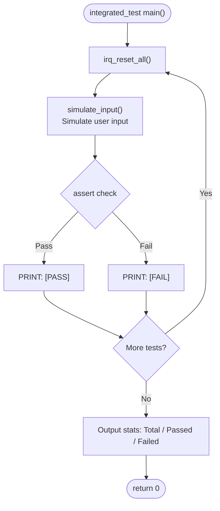

# IRQ Simulator - Integration Test Plan

## 1. Test Scope

Integration tests verify the interaction between multiple modules, including input parsing, end-to-end IRQ trigger and handling flow, and cross-module tick count consistency.

## 2. Test Environment

- Compiler: GCC (MinGW)
- Language Standard: C11
- Test Framework: Custom assert macros
- `irq_reset_all()` is called before each test case to reset state

## 3. Test Cases

### IT-01: Numeric Mode Input Parsing

| ID | Test Item | Simulated Input | Expected Result |
|----|---------|---------|---------|
| IT-01-01 | Input 1 triggers IRQ0 | `"1"` | pending=0x01, IRQ0 handled, pending=0 |
| IT-01-02 | Input 32 triggers IRQ31 | `"32"` | pending=0x80000000, IRQ31 handled |
| IT-01-03 | Input 0 manual processing | trigger(3) → `"0"` | IRQ3 handled |
| IT-01-04 | Invalid number 33 | `"33"` | pending unchanged, error message output |
| IT-01-05 | Invalid number -5 | `"-5"` | pending unchanged, error message output |

### IT-02: b-mode Input Parsing

| ID | Test Item | Simulated Input | Expected Result |
|----|---------|---------|---------|
| IT-02-01 | b0 triggers IRQ0 | `"b0"` | pending=0x01, IRQ0 handled |
| IT-02-02 | b5 triggers IRQ5 | `"b5"` | pending=0x20, IRQ5 handled |
| IT-02-03 | b31 triggers IRQ31 | `"b31"` | pending=0x80000000, IRQ31 handled |
| IT-02-04 | B10 (uppercase) | `"B10"` | pending=0x400, IRQ10 handled |
| IT-02-05 | Invalid b32 | `"b32"` | pending unchanged, error output |
| IT-02-06 | Invalid b-1 | `"b-1"` | pending unchanged, error output |

### IT-03: h-mode Input Parsing

| ID | Test Item | Simulated Input | Expected Result |
|----|---------|---------|---------|
| IT-03-01 | h1 triggers IRQ0 | `"h1"` | pending=0x01, IRQ0 handled |
| IT-03-02 | h3 triggers IRQ0,1 | `"h3"` | IRQ0, IRQ1 handled in order |
| IT-03-03 | hFF triggers IRQ0~7 | `"hFF"` | IRQ0~7 all handled in order |
| IT-03-04 | h80000000 triggers IRQ31 | `"h80000000"` | IRQ31 handled |
| IT-03-05 | H0A (uppercase+hex) | `"H0A"` | pending=0x0A, IRQ1,3 handled |
| IT-03-06 | Invalid hGG | `"hGG"` | pending unchanged, error output |

### IT-04: Accumulated Trigger & Priority

| ID | Test Item | Steps | Expected Result |
|----|---------|------|---------|
| IT-04-01 | Trigger then h-mode append | trigger(0) → `"h6"` | IRQ0,1,2 handled in order |
| IT-04-02 | Multiple b-mode accumulation | `"b10"` → `"b5"` → `"0"` | IRQ5,10 handled in order |
| IT-04-03 | Priority order verification | `"h80000001"` | IRQ0 handled before IRQ31 |

### IT-05: Tick Count Consistency

| ID | Test Item | Steps | Expected Result |
|----|---------|------|---------|
| IT-05-01 | Initial tick is 0 | reset → get_tick | tick == 0 |
| IT-05-02 | IRQ0 increments tick by 1 | trigger(0) → process | tick incremented (IRQ0 handler +1) |
| IT-05-03 | Non-IRQ0 does not affect tick | trigger(5) → process | tick unchanged by IRQ5 |
| IT-05-04 | Multiple IRQ0 tick accumulation | trigger(0)→process, trigger(0)→process, trigger(0)→process | tick correctly accumulates to +3 |

### IT-06: Exit & Boundary Conditions

| ID | Test Item | Simulated Input | Expected Result |
|----|---------|---------|---------|
| IT-06-01 | exit normal termination | `"exit"` | Returns 0, outputs goodbye |
| IT-06-02 | Empty line input | `""` | Error prompt output, no crash |
| IT-06-03 | Garbage input | `"xyz"` | Error prompt output, no crash |

### IT-07: End-to-End Full Flow

| ID | Test Item | Steps | Expected Result |
|----|---------|------|---------|
| IT-07-01 | Complete operation sequence | `"1"` → `"b5"` → `"h3"` → `"exit"` | All IRQs correctly handled, normal exit |

## 4. Expected Results

- All IT-01 ~ IT-07 test cases must pass
- Pass rate: 100%