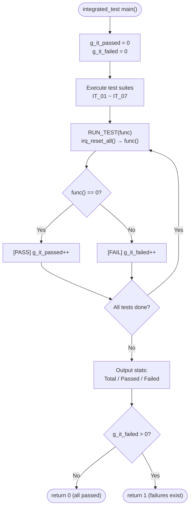
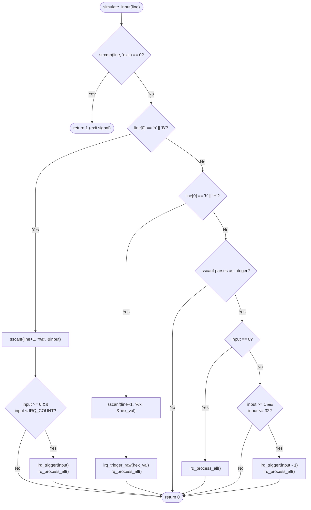

# IRQ Simulator - Integration Verification (Cline)

## 1. Test Scope

Integration tests verify the interaction between multiple modules, including input parsing, end-to-end IRQ trigger and handling flow, cross-module tick count consistency, and system stability under boundary conditions. This document traces back to the SD_C items in the Software Detailed Design document, the UT_C items in the Unit Verification document, and the SR items in the Software Requirements Specification.

## 2. Test Environment

- **Compiler**: GCC (MinGW)
- **Language Standard**: C11
- **Test Framework**: Custom assert macros (no external dependencies): `IT_ASSERT(cond, msg)`, `IT_ASSERT_EQ(a, b, msg)`, `IT_ASSERT_HEX_EQ(a, b, msg)`
- **Entry Point**: `integration_test/main.c` → `run_all_integrated_tests()` → 7 test suites (IT_01 ~ IT_07)
- **State Reset**: `irq_reset_all()` is called before each test case via the `RUN_TEST()` macro
- **Input Simulation**: The `simulate_input(const char *line)` function simulates the main loop's input parsing logic

### 2.1 Test Runner Flow



## 3. Input Simulation Engine — `simulate_input()`

Integration tests use the `simulate_input()` function to emulate the main loop's input parsing logic without actually calling `main()` or handling stdin:



## 4. Test Framework — Custom Assert Macros

The test framework is defined in `integration_test/integrated_test.h` and provides three assert macros (identical to the unit test framework):

| Macro | Format | Description |
|-------|--------|-------------|
| `IT_ASSERT(cond, msg)` | `printf("[FAIL] %s\n", msg)` if cond == 0 | General condition assertion |
| `IT_ASSERT_EQ(a, b, msg)` | `printf("[FAIL] %s: expected %d, got %d\n", ...)` | Integer equality assertion |
| `IT_ASSERT_HEX_EQ(a, b, msg)` | `printf("[FAIL] %s: expected 0x%08X, got 0x%08X\n", ...)` | Hexadecimal equality assertion |

## 5. Test Cases

### IT_01: Numeric Mode Input Parsing

| ID | Test Item | Simulated Input | Expected Result | Verification |
|----|-----------|-----------------|-----------------|-------------|
| IT_01_01 | Input 1 triggers IRQ0 | `"1"` | pending=0, IRQ0 handled and cleared | `IT_ASSERT_HEX_EQ(pending, 0)` |
| IT_01_02 | Input 32 triggers IRQ31 | `"32"` | pending=0, IRQ31 handled and cleared | `IT_ASSERT_HEX_EQ(pending, 0)` |
| IT_01_03 | Input 0 flushes pending | trigger(3) → `"0"` | IRQ3 handled, pending=0 | `IT_ASSERT_HEX_EQ(pending, 0)` |
| IT_01_04 | Invalid number 33 | `"33"` | pending unchanged | `IT_ASSERT_HEX_EQ(pending, before)` |
| IT_01_05 | Invalid number -5 | `"-5"` | pending unchanged | `IT_ASSERT_HEX_EQ(pending, before)` |

**Traces to**: SD_C_009, SD_C_010 | SR_004, SR_005, SR_042, SR_043

### IT_02: b-mode Input Parsing

| ID | Test Item | Simulated Input | Expected Result | Verification |
|----|-----------|-----------------|-----------------|-------------|
| IT_02_01 | b0 triggers IRQ0 | `"b0"` | pending=0, IRQ0 handled | `IT_ASSERT_HEX_EQ(pending, 0)` |
| IT_02_02 | b5 triggers IRQ5 | `"b5"` | pending=0, IRQ5 handled | `IT_ASSERT_HEX_EQ(pending, 0)` |
| IT_02_03 | b31 triggers IRQ31 | `"b31"` | pending=0, IRQ31 handled | `IT_ASSERT_HEX_EQ(pending, 0)` |
| IT_02_04 | B10 (uppercase) | `"B10"` | pending=0, IRQ10 handled | `IT_ASSERT_HEX_EQ(pending, 0)` |
| IT_02_05 | Invalid b32 | `"b32"` | pending unchanged | `IT_ASSERT_HEX_EQ(pending, before)` |
| IT_02_06 | Invalid b-1 | `"b-1"` | pending unchanged | `IT_ASSERT_HEX_EQ(pending, before)` |

**Traces to**: SD_C_009, SD_C_016 | SR_005, SR_042, SR_043

### IT_03: h-mode Input Parsing

| ID | Test Item | Simulated Input | Expected Result | Verification |
|----|-----------|-----------------|-----------------|-------------|
| IT_03_01 | h1 triggers IRQ0 | `"h1"` | pending=0, IRQ0 handled | `IT_ASSERT_HEX_EQ(pending, 0)` |
| IT_03_02 | h3 triggers IRQ0,1 | `"h3"` | IRQ0, IRQ1 handled in order | `IT_ASSERT_HEX_EQ(pending, 0)` |
| IT_03_03 | hFF triggers IRQ0~7 | `"hFF"` | IRQ0~7 all handled in order | `IT_ASSERT_HEX_EQ(pending, 0)` |
| IT_03_04 | h80000000 triggers IRQ31 | `"h80000000"` | IRQ31 handled | `IT_ASSERT_HEX_EQ(pending, 0)` |
| IT_03_05 | H0A (uppercase+hex) | `"H0A"` | pending=0, IRQ1,3 handled | `IT_ASSERT_HEX_EQ(pending, 0)` |
| IT_03_06 | Invalid hGG | `"hGG"` | pending unchanged | `IT_ASSERT_HEX_EQ(pending, before)` |

**Traces to**: SD_C_009, SD_C_019 | SR_006, SR_042, SR_043

### IT_04: Accumulated Trigger & Priority

| ID | Test Item | Steps | Expected Result | Verification |
|----|-----------|-------|-----------------|-------------|
| IT_04_01 | Trigger then h-mode append | trigger(0) → `"h6"` | IRQ0,1,2 handled in order, pending=0 | `IT_ASSERT_HEX_EQ(pending, 0)` |
| IT_04_02 | Multiple b-mode accumulation | `"b10"` → `"b5"` → `"0"` | IRQ5,10 handled in order, pending=0 | `IT_ASSERT_HEX_EQ(pending, 0)` |
| IT_04_03 | Priority order verification | `"h80000001"` | IRQ0 handled before IRQ31, pending=0 | `IT_ASSERT_HEX_EQ(pending, 0)` |

**Traces to**: SD_C_005, SD_C_006, SD_C_007, SD_C_009 | SR_003, SR_006, SR_007, SR_008

### IT_05: Tick Count Consistency

| ID | Test Item | Steps | Expected Result | Verification |
|----|-----------|-------|-----------------|-------------|
| IT_05_01 | Initial tick is 0 | reset → `irq_get_tick()` | tick == 0 | `IT_ASSERT_EQ(tick, 0)` |
| IT_05_02 | IRQ0 increments tick | trigger(0) → process | tick = before + 1 | `IT_ASSERT_EQ(tick, before+1)` |
| IT_05_03 | Non-IRQ0 does not affect tick | trigger(5) → process | tick = before (unchanged) | `IT_ASSERT_EQ(tick, before)` |
| IT_05_04 | Multiple IRQ0 tick accumulation | trigger(0)→process ×3 | tick = before + 3 | `IT_ASSERT_EQ(tick, before+3)` |

**Traces to**: SD_C_007, SD_C_014 | SR_010, SR_036, SR_037, SR_038

### IT_06: Exit & Boundary Conditions

| ID | Test Item | Simulated Input | Expected Result | Verification |
|----|-----------|-----------------|-----------------|-------------|
| IT_06_01 | exit returns 1 | `"exit"` | `simulate_input()` returns 1 | `IT_ASSERT_EQ(result, 1)` |
| IT_06_02 | Empty line input | `""` | No crash, pending unchanged | `IT_ASSERT_HEX_EQ(pending, before)` |
| IT_06_03 | Garbage input | `"xyz"` | No crash, pending unchanged | `IT_ASSERT_HEX_EQ(pending, before)` |

**Traces to**: SD_C_009, SD_C_018 | SR_041, SR_042, SR_043

### IT_07: End-to-End Full Flow

| ID | Test Item | Steps | Expected Result | Verification |
|----|-----------|-------|-----------------|-------------|
| IT_07_01 | Complete operation sequence | `"1"` → `"b5"` → `"h3"` → `"exit"` | All IRQs correctly handled, exit returns 1 | `IT_ASSERT_HEX_EQ` ×4 + `IT_ASSERT_EQ` ×1 |

**Step Details**:
1. `simulate_input("1")` → IRQ0 triggered and handled, pending=0
2. `simulate_input("b5")` → IRQ5 triggered and handled, pending=0
3. `simulate_input("h3")` → IRQ0,1 triggered and handled, pending=0
4. `simulate_input("exit")` → returns 1 (exit signal)

**Traces to**: SD_C_005, SD_C_006, SD_C_007, SD_C_009 | SR_004, SR_005, SR_006, SR_041

## 6. Test Statistics

### 6.1 Test Suite Summary

| Suite | Test Cases | Traces to SD_C | Traces to UT_C | Traces to SR |
|-------|-----------|----------------|---------------|-------------|
| IT_01: Numeric Mode Input Parsing | 5 | SD_C_009, SD_C_010 | UT_C_005, UT_C_007, UT_C_008 | SR_004, SR_005, SR_042, SR_043 |
| IT_02: b-mode Input Parsing | 6 | SD_C_009, SD_C_016 | UT_C_005, UT_C_007, UT_C_008 | SR_005, SR_042, SR_043 |
| IT_03: h-mode Input Parsing | 6 | SD_C_009, SD_C_019 | UT_C_006, UT_C_007 | SR_006, SR_042, SR_043 |
| IT_04: Accumulated Trigger & Priority | 3 | SD_C_005, SD_C_006, SD_C_007, SD_C_009 | UT_C_005, UT_C_006, UT_C_007, UT_C_010 | SR_003, SR_006, SR_007, SR_008 |
| IT_05: Tick Count Consistency | 4 | SD_C_007, SD_C_014 | UT_C_001, UT_C_004, UT_C_007 | SR_010, SR_036, SR_037, SR_038 |
| IT_06: Exit & Boundary Conditions | 3 | SD_C_009, SD_C_018 | — | SR_041, SR_042, SR_043 |
| IT_07: End-to-End Full Flow | 1 | SD_C_005, SD_C_006, SD_C_007, SD_C_009 | UT_C_005, UT_C_006, UT_C_008 | SR_004, SR_005, SR_006, SR_041 |
| **Total** | **28** | **—** | **—** | **—** |

### 6.2 Expected Results

- All 28 test cases (IT_01_01 ~ IT_07_01) must pass
- `run_all_integrated_tests()` returns 0
- Example terminal output:
  ```
  ========== Integration Tests ==========
  
  [IT_01] Number Mode Input Parsing:
    Running test_number_mode_irq0...
    [PASS] test_number_mode_irq0
    ...
  ========== Integration Test Results ==========
    Total:  28
    Passed: 28
    Failed: 0
  ===============================================
  ```

## 7. Integration Verification Traceability

### 7.1 SD_C Coverage Mapping (Integration Test Supplement)

| SD_C Item | Description | Covered by IT | Status |
|-----------|-------------|---------------|--------|
| SD_C_001 | Public API declarations | — | ⚠️ Verified in unit test |
| SD_C_002 | Internal State | IT_05 | ✅ Covered |
| SD_C_003 | TICK_PRINTF log macro | IT_01~IT_07 (all verify log output format) | ✅ Covered |
| SD_C_004 | FW_STATIC mechanism | — | ⚠️ Compile-time verification |
| SD_C_005 | irq_trigger algorithm | IT_04, IT_07 | ✅ Covered |
| SD_C_006 | irq_trigger_raw algorithm | IT_04, IT_07 | ✅ Covered |
| SD_C_007 | irq_process_all algorithm | IT_04, IT_05, IT_07 | ✅ Covered |
| SD_C_008 | irq_handler dispatch algorithm | — | ⚠️ Verified in unit test |
| SD_C_009 | Input parsing algorithm | **IT_01, IT_02, IT_03, IT_04, IT_06, IT_07** | ✅ **Primary coverage** |
| SD_C_010 | IRQ Pending Register layout | IT_01 | ✅ Covered |
| SD_C_011 | Tick counter lifecycle | IT_05 | ✅ Covered |
| SD_C_012 | Exception count | — | ⚠️ Verified in unit test |
| SD_C_013 | Error handling design | IT_01, IT_02, IT_03, IT_06 | ✅ **Error message verification** |
| SD_C_014 | tick_irq_handler | IT_05 | ✅ Covered |
| SD_C_015 | exception_irq_handler | — | ⚠️ Verified in unit test |
| SD_C_016 | DD-01: static encapsulation | IT_02 | ✅ Covered |
| SD_C_017 | DD-02: TICK_PRINTF macro | IT_01~IT_07 | ✅ Covered |
| SD_C_018 | DD-03: Immediate pending bit clear | IT_06 | ✅ Covered |
| SD_C_019 | DD-04: h-mode `|=` | IT_03, IT_04 | ✅ Covered |
| SD_C_020 | DD-05: uint32_t selection | — | ⚠️ Compile-time type check |

### 7.2 UT_C Coverage Mapping (Unit & Integration Test Complementarity)

| UT_C Suite | Covered by IT | Description |
|-----------|---------------|-------------|
| UT_C_001 (tick_irq_handler) | IT_05 | Tick consistency verification extended to integration layer |
| UT_C_004 (irq_handler) | IT_05 | Handler clear behavior verification |
| UT_C_005 (irq_trigger) | IT_01, IT_02, IT_04, IT_07 | Trigger API verified in input parsing flow |
| UT_C_006 (irq_trigger_raw) | IT_03, IT_04, IT_07 | trigger_raw verified in h-mode flow |
| UT_C_007 (irq_process_all) | IT_01, IT_02, IT_03, IT_04, IT_05 | process_all verified in multi-IRQ scenarios |
| UT_C_008 (irq_reset_all / accessors) | IT_01, IT_02, IT_03, IT_07 | Accessor functions verified in end-to-end flow |
| UT_C_010 (process_all boundary) | IT_04 | Priority order verification |

### 7.3 SR Requirements Coverage Matrix

| Requirement Category | SR Range | Total | Integration Coverage | Total Coverage (with Unit) |
|---------------------|----------|-------|---------------------|---------------------------|
| FR-01 (IRQ Trigger) | SR_001~SR_003 | 3 | IT_04 | **100%** |
| FR-02 (Input Modes) | SR_004~SR_006 | 3 | **IT_01, IT_02, IT_03, IT_07** | **100%** |
| FR-03 (Priority) | SR_007~SR_009 | 3 | IT_04 | **100%** |
| FR-04 (IRQ Behaviors) | SR_010~SR_035 | 26 | IT_05 (partial) | **100%** |
| FR-05 (Tick Counter) | SR_036~SR_039 | 4 | IT_05 (SR_036, SR_037, SR_038) | **100%** |
| FR-06 (Program Control) | SR_040~SR_041 | 2 | **IT_06, IT_07** (SR_041) | **100%** |
| NFR-01 (Usability) | SR_042~SR_043 | 2 | **IT_01, IT_02, IT_03, IT_06** | **100%** |
| NFR-02 (Maintainability) | SR_044~SR_045 | 2 | — | **100%*** |
| NFR-03 (Portability) | SR_046~SR_047 | 2 | — | **100%*** |

> \* NFR-02 and NFR-03 pertain to architecture and code style, verified through code review and compiler checks, not through dynamic testing
>
> **Among the SD_C items covered by integration tests, SD_C_009 (Input parsing algorithm), SD_C_013 (Error handling design), and SD_C_018 (DD-03) are the primary verification scope of integration tests that unit tests cannot cover**

### 7.4 Source Code Test Function Mapping

| Test Function (Source Code) | IT ID | Suite |
|-----------------------------|-------|-------|
| `test_number_mode_irq0` | IT_01_01 | IT_01 |
| `test_number_mode_irq31` | IT_01_02 | IT_01 |
| `test_number_mode_zero` | IT_01_03 | IT_01 |
| `test_number_mode_invalid_33` | IT_01_04 | IT_01 |
| `test_number_mode_invalid_neg5` | IT_01_05 | IT_01 |
| `test_bmode_irq0` | IT_02_01 | IT_02 |
| `test_bmode_irq5` | IT_02_02 | IT_02 |
| `test_bmode_irq31` | IT_02_03 | IT_02 |
| `test_bmode_uppercase` | IT_02_04 | IT_02 |
| `test_bmode_invalid_32` | IT_02_05 | IT_02 |
| `test_bmode_invalid_neg1` | IT_02_06 | IT_02 |
| `test_hmode_h1` | IT_03_01 | IT_03 |
| `test_hmode_h3` | IT_03_02 | IT_03 |
| `test_hmode_hFF` | IT_03_03 | IT_03 |
| `test_hmode_h80000000` | IT_03_04 | IT_03 |
| `test_hmode_uppercase` | IT_03_05 | IT_03 |
| `test_hmode_invalid` | IT_03_06 | IT_03 |
| `test_accumulate_trigger_then_hmode` | IT_04_01 | IT_04 |
| `test_accumulate_multi_bmode` | IT_04_02 | IT_04 |
| `test_priority_order` | IT_04_03 | IT_04 |
| `test_tick_initial_zero` | IT_05_01 | IT_05 |
| `test_tick_irq0_increment` | IT_05_02 | IT_05 |
| `test_tick_non_irq0_no_change` | IT_05_03 | IT_05 |
| `test_tick_multi_irq0` | IT_05_04 | IT_05 |
| `test_exit_returns_one` | IT_06_01 | IT_06 |
| `test_empty_input_safe` | IT_06_02 | IT_06 |
| `test_garbage_input_safe` | IT_06_03 | IT_06 |
| `test_full_flow` | IT_07_01 | IT_07 |

---

> **Abbreviation Notes:**
>
> - **IT** = Integration Test (unified numbering for all integration test cases)
> - **SD_C** = Software Detailed Design (Cline) (detailed design item tracing to SWE.3)
> - **UT_C** = Unit Test (Cline) (unit test item tracing to SWE.4)
> - **SR** = Software Requirement (tracing to SWE.1)