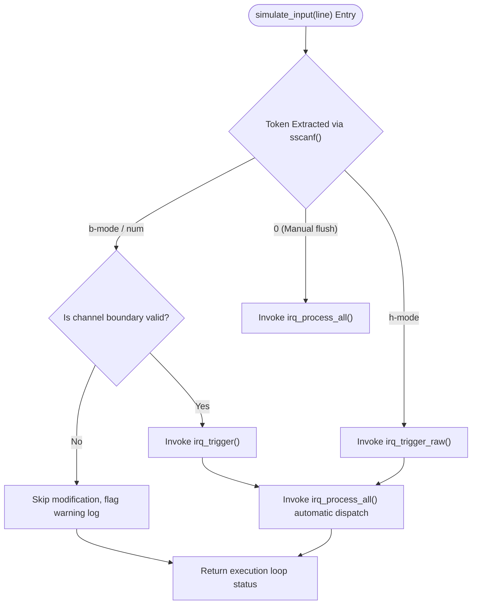

# IRQ Simulator - Software Integration Verification Report

## 1. Verification Scope
This document specifies the integration testing scope targeting the structural interaction interfaces between the console input string ingestion pipeline, technical parsing mechanics, register array mutation hooks, and behavioral logging blocks.

## 2. Component Integration Architecture & Simulation Engine

## 3. Unit vs. Integration Verification Rationale (Complementarity Matrix)
Integration validation evaluates structural interface definitions that are completely isolated during low-level unit verification sessions.

| Target Architectural Module Layer Connection | Isolated Unit Check Capabilities (SWE.4) | Integration Scope Validation Strategy (SWE.5) |
| :--- | :--- | :--- |
| **Console Buffer Ingestion -> Flag Setting**| Verifies isolated register bit shifting logic manually passed via raw types. | Validates runtime pointer slicing, parsing format specifiers, and capital token constraints (`'b'` vs `'B'`). |
| **Prioritized Processing -> Logger Subsystem**| Proves single register masks can clear flags on matched switch index cases. | Ensures multi-channel cumulative updates print precise sequential records prefixed with real-time monotonic tickers. |

## 4. Integration Verification Specification Tests

### IT_01: Numeric Mode Parsing Interface End-to-End
* **Verification Strategy**: Inject valid/invalid numeral tokens to confirm parsing and dispatch boundary synchronization.

| Test Case ID | Injected Simulation Buffer Input | Targeted Evaluated Result Status Matrix | System Assert Check | Detailed Design Trace |
| :--- | :--- | :--- | :--- | :--- |
| IT_01_01 | `"1\n"` | Invokes `irq_trigger(0)`, logs IRQ0 peripheral message, clears pending atomically. | `IT_ASSERT_HEX_EQ(pending, 0)` | SD_004, SD_006 |
| IT_01_02 | `"32\n"` | Invokes `irq_trigger(31)`, flags and executes exception count tracking hooks. | `IT_ASSERT_HEX_EQ(pending, 0)` | SD_004, SD_006 |
| IT_01_03 | `"33\n"` | Boundary error check. Rejects register modification; asserts context error alert log. | `IT_ASSERT_HEX_EQ(pending, before)`| SD_004, SD_010 |

### IT_02: Bit Field Mode Parameter Ingestion Interface
* **Verification Strategy**: Validate string parser logic variations for explicit channel manipulation.

| Test Case ID | Injected Simulation Buffer Input | Targeted Evaluated Result Status Matrix | System Assert Check | Detailed Design Trace |
| :--- | :--- | :--- | :--- | :--- |
| IT_02_01 | `"b5\n"` | Captures prefix token `b`. Asserts bit 5 flag, routes dispatch, resets register. | `IT_ASSERT_HEX_EQ(pending, 0)` | SD_004, SD_006 |
| IT_02_02 | `"B10\n"` | Evaluates uppercase tolerance criteria. Asserts bit 10, executes Watchdog routine. | `IT_ASSERT_HEX_EQ(pending, 0)` | SD_004, SD_006 |
| IT_02_03 | `"b32\n"` | Bounds fault trap. Character suffix out of range; skip modification. | `IT_ASSERT_HEX_EQ(pending, before)`| SD_004, SD_010 |

### IT_03: Hexadecimal Direct Mask Injection Interface
* **Verification Strategy**: Confirm direct register injection mechanics supporting multi-channel triggers.

| Test Case ID | Injected Simulation Buffer Input | Targeted Evaluated Result Status Matrix | System Assert Check | Detailed Design Trace |
| :--- | :--- | :--- | :--- | :--- |
| IT_03_01 | `"h3\n"` | Parses hex array to `0x00000003U`. Asserts Bit 0 and Bit 1 simultaneously. Sequential routing execution completes. | `IT_ASSERT_HEX_EQ(pending, 0)` | SD_005, SD_006 |
| IT_03_02 | `"hGG\n"` | Invalid character handling verification. String unparseable; system state safely preserved. | `IT_ASSERT_HEX_EQ(pending, before)`| SD_004, SD_010 |

### IT_04: High-Priority Sequential Integrity Testing
* **Verification Strategy**: Inject multi-bit inputs to prove higher priority channels execute first regardless of activation sequence.

| Test Case ID | Injected Simulation Buffer Input / Sequence | Targeted Evaluated Result Status Matrix | System Assert Check | Detailed Design Trace |
| :--- | :--- | :--- | :--- | :--- |
| IT_04_01 | `"h80000001\n"` | Bit 0 and Bit 31 set. Verification checks that IRQ0 logs console message *before* IRQ31 completes execution loop. | `IT_ASSERT_EQ(tick, before + 1)` | SD_005, SD_006 |

---

## 5. Integration Verification Target to Implementation Symbol Mapping
| Audit Test Case ID | Implemented Code Integration Test C Function Symbol | Design Architecture Trace |
| :--- | :--- | :--- |
| **IT_01_01** | `test_number_mode_minimum_boundary_routing` | SD_004, SD_006 |
| **IT_01_02** | `test_number_mode_maximum_boundary_routing` | SD_004, SD_006 |
| **IT_01_03** | `test_number_mode_out_of_bounds_rejection` | SD_004, SD_010 |
| **IT_02_01** | `test_bit_mode_lowercase_routing_latch` | SD_004, SD_006 |
| **IT_02_02** | `test_bit_mode_uppercase_tolerance_routing` | SD_004, SD_006 |
| **IT_02_03** | `test_bit_mode_out_of_bounds_rejection` | SD_004, SD_010 |
| **IT_03_01** | `test_hex_mode_multi_channel_latch_clear` | SD_005, SD_006 |
| **IT_03_02** | `test_hex_mode_invalid_format_rejection` | SD_004, SD_010 |
| **IT_04_01** | `test_integration_priority_order_execution` | SD_005, SD_006 |
