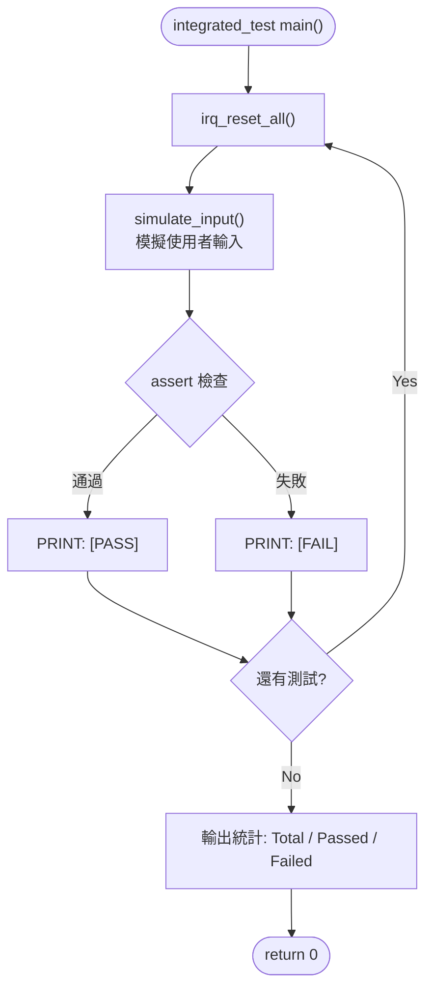

# IRQ Simulator - Integration Test Plan

## 1. Test Scope

整合測試驗證多個模組之間的互動行為，包含輸入解析、IRQ 觸發與處理的端到端流程、tick 計數的跨模組一致性。

## 2. Test Environment

- 編譯器：GCC (MinGW)
- 語言標準：C11
- 測試框架：自訂 assert 巨集
- 每個測試案例前呼叫 `irq_reset_all()` 重置狀態

## 3. Test Cases

### IT-01: 數字模式輸入解析

| ID | 測試項目 | 模擬輸入 | 預期結果 |
|----|---------|---------|---------|
| IT-01-01 | 輸入 1 觸發 IRQ0 | `"1"` | pending=0x01, IRQ0 被處理, pending=0 |
| IT-01-02 | 輸入 32 觸發 IRQ31 | `"32"` | pending=0x80000000, IRQ31 被處理 |
| IT-01-03 | 輸入 0 手動處理 | trigger(3) → `"0"` | IRQ3 被處理 |
| IT-01-04 | 無效數字 33 | `"33"` | pending 不變，輸出錯誤訊息 |
| IT-01-05 | 無效數字 -5 | `"-5"` | pending 不變，輸出錯誤訊息 |

### IT-02: b-mode 輸入解析

| ID | 測試項目 | 模擬輸入 | 預期結果 |
|----|---------|---------|---------|
| IT-02-01 | b0 觸發 IRQ0 | `"b0"` | pending=0x01, IRQ0 被處理 |
| IT-02-02 | b5 觸發 IRQ5 | `"b5"` | pending=0x20, IRQ5 被處理 |
| IT-02-03 | b31 觸發 IRQ31 | `"b31"` | pending=0x80000000, IRQ31 被處理 |
| IT-02-04 | B10 (大寫) | `"B10"` | pending=0x400, IRQ10 被處理 |
| IT-02-05 | 無效 b32 | `"b32"` | pending 不變，輸出錯誤 |
| IT-02-06 | 無效 b-1 | `"b-1"` | pending 不變，輸出錯誤 |

### IT-03: h-mode 輸入解析

| ID | 測試項目 | 模擬輸入 | 預期結果 |
|----|---------|---------|---------|
| IT-03-01 | h1 觸發 IRQ0 | `"h1"` | pending=0x01, IRQ0 被處理 |
| IT-03-02 | h3 觸發 IRQ0,1 | `"h3"` | IRQ0, IRQ1 依序被處理 |
| IT-03-03 | hFF 觸發 IRQ0~7 | `"hFF"` | IRQ0~7 全部依序處理 |
| IT-03-04 | h80000000 觸發 IRQ31 | `"h80000000"` | IRQ31 被處理 |
| IT-03-05 | H0A (大寫+hex) | `"H0A"` | pending=0x0A, IRQ1,3 被處理 |
| IT-03-06 | 無效 hGG | `"hGG"` | pending 不變，輸出錯誤 |

### IT-04: 累積觸發與優先權

| ID | 測試項目 | 步驟 | 預期結果 |
|----|---------|------|---------|
| IT-04-01 | 先觸發再 h-mode 追加 | trigger(0) → `"h6"` | IRQ0,1,2 依序處理 |
| IT-04-02 | 多次 b-mode 累積 | `"b10"` → `"b5"` → `"0"` | IRQ5,10 依序處理 |
| IT-04-03 | 優先權順序驗證 | `"h80000001"` | IRQ0 先於 IRQ31 處理 |

### IT-05: Tick 計數一致性

| ID | 測試項目 | 步驟 | 預期結果 |
|----|---------|------|---------|
| IT-05-01 | 初始 tick 為 0 | reset → get_tick | tick == 0 |
| IT-05-02 | 觸發 IRQ0 後 tick+1 | trigger(0) → process | tick 增加 (IRQ0 handler +1) |
| IT-05-03 | 非 IRQ0 不影響 tick | trigger(5) → process | tick 不因 IRQ5 而增加 |
| IT-05-04 | 多次 IRQ0 tick 累計 | trigger(0)→process, trigger(0)→process, trigger(0)→process | tick 正確累加 3 |

### IT-06: exit 與邊界條件

| ID | 測試項目 | 模擬輸入 | 預期結果 |
|----|---------|---------|---------|
| IT-06-01 | exit 正常退出 | `"exit"` | 回傳 0，輸出 goodbye |
| IT-06-02 | 空行輸入 | `""` | 輸出錯誤提示，不崩潰 |
| IT-06-03 | 亂碼輸入 | `"xyz"` | 輸出錯誤提示，不崩潰 |

### IT-07: 端到端完整流程

| ID | 測試項目 | 步驟 | 預期結果 |
|----|---------|------|---------|
| IT-07-01 | 完整操作序列 | `"1"` → `"b5"` → `"h3"` → `"exit"` | 所有 IRQ 正確處理，正常退出 |

## 4. Expected Results

- 所有 IT-01 ~ IT-07 測試案例須全部通過
- 通過率：100%