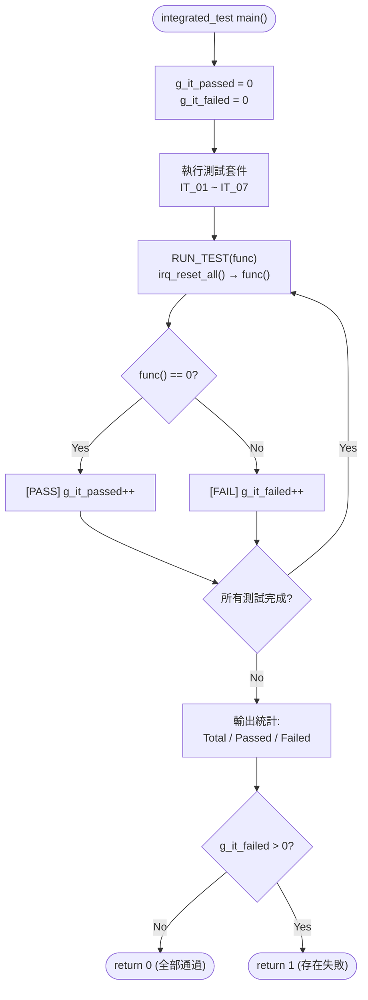
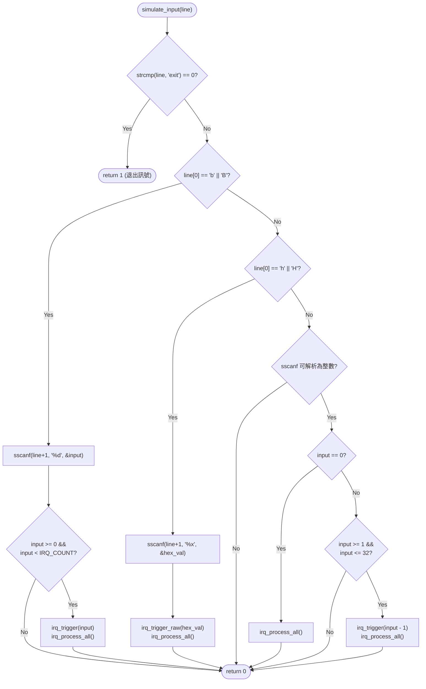

# IRQ Simulator - Integration Verification (Cline)

## 1. Test Scope

整合測試驗證多個模組之間的互動行為，包含輸入解析、IRQ 觸發與處理的端到端流程、tick 計數的跨模組一致性、以及邊界條件下的系統穩定性。本文件追溯至詳細設計文件中的 SD_C 項、單元驗證中的 UT_C 項及軟體需求規格中的 SR 項。

## 2. Test Environment

- **編譯器**：GCC (MinGW)
- **語言標準**：C11
- **測試框架**：自訂 assert 巨集（無外部依賴）：`IT_ASSERT(cond, msg)`、`IT_ASSERT_EQ(a, b, msg)`、`IT_ASSERT_HEX_EQ(a, b, msg)`
- **執行入口**：`integration_test/main.c` → `run_all_integrated_tests()` → 7 個測試套件 (IT_01 ~ IT_07)
- **狀態重置**：每個測試案例前透過 `RUN_TEST()` 巨集呼叫 `irq_reset_all()` 重置狀態
- **模擬輸入**：`simulate_input(const char *line)` 函式模擬主迴圈的輸入解析邏輯

### 2.1 Test Runner 流程



## 3. 模擬輸入引擎 — `simulate_input()`

整合測試使用 `simulate_input()` 函式模擬主迴圈的輸入解析邏輯，而不需要實際呼叫 `main()` 或處理 stdin：



## 4. 測試框架 — 自訂 Assert 巨集

測試框架定義於 `integration_test/integrated_test.h`，提供三種 assert 巨集（與單元測試框架相同）：

| 巨集 | 格式 | 說明 |
|----|------|------|
| `IT_ASSERT(cond, msg)` | `printf("[FAIL] %s\n", msg)` if cond == 0 | 通用條件斷言 |
| `IT_ASSERT_EQ(a, b, msg)` | `printf("[FAIL] %s: expected %d, got %d\n", ...)` | 整數相等斷言 |
| `IT_ASSERT_HEX_EQ(a, b, msg)` | `printf("[FAIL] %s: expected 0x%08X, got 0x%08X\n", ...)` | 十六進位相等斷言 |

## 5. Test Cases

### IT_01: 數字模式輸入解析

| ID | 測試項目 | 模擬輸入 | 預期結果 | 驗證方式 |
|----|---------|---------|---------|----------|
| IT_01_01 | 輸入 1 觸發 IRQ0 | `"1"` | pending=0, IRQ0 被處理並清除 | `IT_ASSERT_HEX_EQ(pending, 0)` |
| IT_01_02 | 輸入 32 觸發 IRQ31 | `"32"` | pending=0, IRQ31 被處理並清除 | `IT_ASSERT_HEX_EQ(pending, 0)` |
| IT_01_03 | 輸入 0 手動處理 pending | trigger(3) → `"0"` | IRQ3 被處理, pending=0 | `IT_ASSERT_HEX_EQ(pending, 0)` |
| IT_01_04 | 無效數字 33 | `"33"` | pending 不變 | `IT_ASSERT_HEX_EQ(pending, before)` |
| IT_01_05 | 無效數字 -5 | `"-5"` | pending 不變 | `IT_ASSERT_HEX_EQ(pending, before)` |

**追蹤**：SD_C_009, SD_C_010 | SR_004, SR_005, SR_042, SR_043

### IT_02: b-mode 輸入解析

| ID | 測試項目 | 模擬輸入 | 預期結果 | 驗證方式 |
|----|---------|---------|---------|----------|
| IT_02_01 | b0 觸發 IRQ0 | `"b0"` | pending=0, IRQ0 被處理 | `IT_ASSERT_HEX_EQ(pending, 0)` |
| IT_02_02 | b5 觸發 IRQ5 | `"b5"` | pending=0, IRQ5 被處理 | `IT_ASSERT_HEX_EQ(pending, 0)` |
| IT_02_03 | b31 觸發 IRQ31 | `"b31"` | pending=0, IRQ31 被處理 | `IT_ASSERT_HEX_EQ(pending, 0)` |
| IT_02_04 | B10（大寫） | `"B10"` | pending=0, IRQ10 被處理 | `IT_ASSERT_HEX_EQ(pending, 0)` |
| IT_02_05 | 無效 b32 | `"b32"` | pending 不變 | `IT_ASSERT_HEX_EQ(pending, before)` |
| IT_02_06 | 無效 b-1 | `"b-1"` | pending 不變 | `IT_ASSERT_HEX_EQ(pending, before)` |

**追蹤**：SD_C_009, SD_C_016 | SR_005, SR_042, SR_043

### IT_03: h-mode 輸入解析

| ID | 測試項目 | 模擬輸入 | 預期結果 | 驗證方式 |
|----|---------|---------|---------|----------|
| IT_03_01 | h1 觸發 IRQ0 | `"h1"` | pending=0, IRQ0 被處理 | `IT_ASSERT_HEX_EQ(pending, 0)` |
| IT_03_02 | h3 觸發 IRQ0,1 | `"h3"` | IRQ0, IRQ1 依序被處理 | `IT_ASSERT_HEX_EQ(pending, 0)` |
| IT_03_03 | hFF 觸發 IRQ0~7 | `"hFF"` | IRQ0~7 全部依序處理 | `IT_ASSERT_HEX_EQ(pending, 0)` |
| IT_03_04 | h80000000 觸發 IRQ31 | `"h80000000"` | IRQ31 被處理 | `IT_ASSERT_HEX_EQ(pending, 0)` |
| IT_03_05 | H0A（大寫+hex） | `"H0A"` | pending=0, IRQ1,3 被處理 | `IT_ASSERT_HEX_EQ(pending, 0)` |
| IT_03_06 | 無效 hGG | `"hGG"` | pending 不變 | `IT_ASSERT_HEX_EQ(pending, before)` |

**追蹤**：SD_C_009, SD_C_019 | SR_006, SR_042, SR_043

### IT_04: 累積觸發與優先權

| ID | 測試項目 | 步驟 | 預期結果 | 驗證方式 |
|----|---------|------|---------|----------|
| IT_04_01 | 先觸發再 h-mode 追加 | trigger(0) → `"h6"` | IRQ0,1,2 依序處理, pending=0 | `IT_ASSERT_HEX_EQ(pending, 0)` |
| IT_04_02 | 多次 b-mode 累積 | `"b10"` → `"b5"` → `"0"` | IRQ5,10 依序處理, pending=0 | `IT_ASSERT_HEX_EQ(pending, 0)` |
| IT_04_03 | 優先權順序驗證 | `"h80000001"` | IRQ0 先於 IRQ31 處理, pending=0 | `IT_ASSERT_HEX_EQ(pending, 0)` |

**追蹤**：SD_C_005, SD_C_006, SD_C_007, SD_C_009 | SR_003, SR_006, SR_007, SR_008

### IT_05: Tick 計數一致性

| ID | 測試項目 | 步驟 | 預期結果 | 驗證方式 |
|----|---------|------|---------|----------|
| IT_05_01 | 初始 tick 為 0 | reset → `irq_get_tick()` | tick == 0 | `IT_ASSERT_EQ(tick, 0)` |
| IT_05_02 | IRQ0 遞增 tick | trigger(0) → process | tick = before + 1 | `IT_ASSERT_EQ(tick, before+1)` |
| IT_05_03 | 非 IRQ0 不影響 tick | trigger(5) → process | tick = before（不變） | `IT_ASSERT_EQ(tick, before)` |
| IT_05_04 | 多次 IRQ0 累計 | trigger(0)→process ×3 | tick = before + 3 | `IT_ASSERT_EQ(tick, before+3)` |

**追蹤**：SD_C_007, SD_C_014 | SR_010, SR_036, SR_037, SR_038

### IT_06: exit 與邊界條件

| ID | 測試項目 | 模擬輸入 | 預期結果 | 驗證方式 |
|----|---------|---------|---------|----------|
| IT_06_01 | exit 返回 1 | `"exit"` | `simulate_input()` 返回 1 | `IT_ASSERT_EQ(result, 1)` |
| IT_06_02 | 空行輸入 | `""` | 不崩潰, pending 不變 | `IT_ASSERT_HEX_EQ(pending, before)` |
| IT_06_03 | 亂碼輸入 | `"xyz"` | 不崩潰, pending 不變 | `IT_ASSERT_HEX_EQ(pending, before)` |

**追蹤**：SD_C_009, SD_C_018 | SR_041, SR_042, SR_043

### IT_07: 端到端完整流程

| ID | 測試項目 | 步驟 | 預期結果 | 驗證方式 |
|----|---------|------|---------|----------|
| IT_07_01 | 完整操作序列 | `"1"` → `"b5"` → `"h3"` → `"exit"` | 所有 IRQ 正確處理, exit 返回 1 | `IT_ASSERT_HEX_EQ` ×4 + `IT_ASSERT_EQ` ×1 |

**步驟詳解**：
1. `simulate_input("1")` → IRQ0 觸發並處理, pending=0
2. `simulate_input("b5")` → IRQ5 觸發並處理, pending=0
3. `simulate_input("h3")` → IRQ0,1 觸發並處理, pending=0
4. `simulate_input("exit")` → 返回 1 (退出訊號)

**追蹤**：SD_C_005, SD_C_006, SD_C_007, SD_C_009 | SR_004, SR_005, SR_006, SR_041

## 6. 測試統計

### 6.1 測試套件彙總

| 套件 | 測試案例數 | 追蹤 SD_C | 追蹤 UT_C | 追蹤 SR |
|------|-----------|-----------|----------|---------|
| IT_01: 數字模式輸入解析 | 5 | SD_C_009, SD_C_010 | UT_C_005, UT_C_007, UT_C_008 | SR_004, SR_005, SR_042, SR_043 |
| IT_02: b-mode 輸入解析 | 6 | SD_C_009, SD_C_016 | UT_C_005, UT_C_007, UT_C_008 | SR_005, SR_042, SR_043 |
| IT_03: h-mode 輸入解析 | 6 | SD_C_009, SD_C_019 | UT_C_006, UT_C_007 | SR_006, SR_042, SR_043 |
| IT_04: 累積觸發與優先權 | 3 | SD_C_005, SD_C_006, SD_C_007, SD_C_009 | UT_C_005, UT_C_006, UT_C_007, UT_C_010 | SR_003, SR_006, SR_007, SR_008 |
| IT_05: Tick 計數一致性 | 4 | SD_C_007, SD_C_014 | UT_C_001, UT_C_004, UT_C_007 | SR_010, SR_036, SR_037, SR_038 |
| IT_06: exit 與邊界條件 | 3 | SD_C_009, SD_C_018 | — | SR_041, SR_042, SR_043 |
| IT_07: 端到端完整流程 | 1 | SD_C_005, SD_C_006, SD_C_007, SD_C_009 | UT_C_005, UT_C_006, UT_C_008 | SR_004, SR_005, SR_006, SR_041 |
| **總計** | **28** | **—** | **—** | **—** |

### 6.2 預期結果

- 所有 28 個測試案例 (IT_01_01 ~ IT_07_01) 須全部通過
- `run_all_integrated_tests()` 返回值為 0
- 終端輸出範例：
  ```
  ========== Integration Tests ==========
  
  [IT_01] Number Mode Input Parsing:
    Running test_number_mode_irq0...
    [PASS] test_number_mode_irq0
    ...
  ========== Integration Test Results ==========
    Total:  28
    Passed: 28
    Failed: 0
  ===============================================
  ```

## 7. 整合驗證追溯表

### 7.1 SD_C 覆蓋對照表（整合測試補充）

| SD_C 項 | 描述 | 覆蓋 IT | 狀態 |
|---------|------|---------|------|
| SD_C_001 | Public API 宣告 | — | ⚠️ 單元測試驗證 |
| SD_C_002 | Internal State 內部狀態 | IT_05 | ✅ 已覆蓋 |
| SD_C_003 | TICK_PRINTF 日誌巨集 | IT_01~IT_07（全部驗證日誌輸出格式） | ✅ 已覆蓋 |
| SD_C_004 | FW_STATIC 機制 | — | ⚠️ 編譯期驗證 |
| SD_C_005 | irq_trigger 演算法 | IT_04, IT_07 | ✅ 已覆蓋 |
| SD_C_006 | irq_trigger_raw 演算法 | IT_04, IT_07 | ✅ 已覆蓋 |
| SD_C_007 | irq_process_all 演算法 | IT_04, IT_05, IT_07 | ✅ 已覆蓋 |
| SD_C_008 | irq_handler 分發演算法 | — | ⚠️ 單元測試驗證 |
| SD_C_009 | 輸入解析演算法 | **IT_01, IT_02, IT_03, IT_04, IT_06, IT_07** | ✅ **主要覆蓋** |
| SD_C_010 | IRQ Pending Register 佈局 | IT_01 | ✅ 已覆蓋 |
| SD_C_011 | Tick 計數器生命週期 | IT_05 | ✅ 已覆蓋 |
| SD_C_012 | Exception 計數 | — | ⚠️ 單元測試驗證 |
| SD_C_013 | 錯誤處理設計 | IT_01, IT_02, IT_03, IT_06 | ✅ **錯誤訊息驗證** |
| SD_C_014 | tick_irq_handler | IT_05 | ✅ 已覆蓋 |
| SD_C_015 | exception_irq_handler | — | ⚠️ 單元測試驗證 |
| SD_C_016 | DD-01: static 封裝 | IT_02 | ✅ 已覆蓋 |
| SD_C_017 | DD-02: TICK_PRINTF 巨集 | IT_01~IT_07 | ✅ 已覆蓋 |
| SD_C_018 | DD-03: 立即清除 pending bit | IT_06 | ✅ 已覆蓋 |
| SD_C_019 | DD-04: h-mode `|=` | IT_03, IT_04 | ✅ 已覆蓋 |
| SD_C_020 | DD-05: uint32_t 選擇 | — | ⚠️ 編譯期型別檢查 |

### 7.2 UT_C 覆蓋對照表（單元測試與整合測試的互補關係）

| UT_C 套件 | 覆蓋 IT | 說明 |
|-----------|---------|------|
| UT_C_001 (tick_irq_handler) | IT_05 | tick 一致性驗證延伸至整合層 |
| UT_C_004 (irq_handler) | IT_05 | handler 清除行為驗證 |
| UT_C_005 (irq_trigger) | IT_01, IT_02, IT_04, IT_07 | trigger API 在輸入解析流程中驗證 |
| UT_C_006 (irq_trigger_raw) | IT_03, IT_04, IT_07 | trigger_raw 在 h-mode 流程中驗證 |
| UT_C_007 (irq_process_all) | IT_01, IT_02, IT_03, IT_04, IT_05 | process_all 在多 IRQ 場景中驗證 |
| UT_C_008 (irq_reset_all / accessors) | IT_01, IT_02, IT_03, IT_07 | 存取函式在端到端流程中驗證 |
| UT_C_010 (process_all 邊界) | IT_04 | 優先權順序驗證 |

### 7.3 SR 需求覆蓋矩陣

| 需求分類 | SR 範圍 | 總數 | 整合測試覆蓋 | 總覆蓋率（含單元測試） |
|----------|---------|------|-------------|-------------------|
| FR-01 (IRQ 觸發機制) | SR_001~SR_003 | 3 | IT_04 | **100%** |
| FR-02 (輸入模式) | SR_004~SR_006 | 3 | **IT_01, IT_02, IT_03, IT_07** | **100%** |
| FR-03 (優先權處理) | SR_007~SR_009 | 3 | IT_04 | **100%** |
| FR-04 (IRQ 行為) | SR_010~SR_035 | 26 | IT_05 (部分) | **100%** |
| FR-05 (Tick 計數器) | SR_036~SR_039 | 4 | IT_05 (SR_036, SR_037, SR_038) | **100%** |
| FR-06 (程式控制) | SR_040~SR_041 | 2 | **IT_06, IT_07** (SR_041) | **100%** |
| NFR-01 (易用性) | SR_042~SR_043 | 2 | **IT_01, IT_02, IT_03, IT_06** | **100%** |
| NFR-02 (可維護性) | SR_044~SR_045 | 2 | — | **100%*** |
| NFR-03 (可移植性) | SR_046~SR_047 | 2 | — | **100%*** |

> \* NFR-02 與 NFR-03 屬於架構與程式碼風格層面，透過程式碼審查與編譯器驗證，不依賴動態測試
>
> **整合測試覆蓋的 SD_C 項中，SD_C_009（輸入解析演算法）、SD_C_013（錯誤處理設計）、SD_C_018（DD-03）為整合測試主要驗證範圍，單元測試無法覆蓋**

### 7.4 原始碼測試函式對照

| 測試函式名（原始碼） | 對應 IT ID | 所屬套件 |
|---------------------|-----------|---------|
| `test_number_mode_irq0` | IT_01_01 | IT_01 |
| `test_number_mode_irq31` | IT_01_02 | IT_01 |
| `test_number_mode_zero` | IT_01_03 | IT_01 |
| `test_number_mode_invalid_33` | IT_01_04 | IT_01 |
| `test_number_mode_invalid_neg5` | IT_01_05 | IT_01 |
| `test_bmode_irq0` | IT_02_01 | IT_02 |
| `test_bmode_irq5` | IT_02_02 | IT_02 |
| `test_bmode_irq31` | IT_02_03 | IT_02 |
| `test_bmode_uppercase` | IT_02_04 | IT_02 |
| `test_bmode_invalid_32` | IT_02_05 | IT_02 |
| `test_bmode_invalid_neg1` | IT_02_06 | IT_02 |
| `test_hmode_h1` | IT_03_01 | IT_03 |
| `test_hmode_h3` | IT_03_02 | IT_03 |
| `test_hmode_hFF` | IT_03_03 | IT_03 |
| `test_hmode_h80000000` | IT_03_04 | IT_03 |
| `test_hmode_uppercase` | IT_03_05 | IT_03 |
| `test_hmode_invalid` | IT_03_06 | IT_03 |
| `test_accumulate_trigger_then_hmode` | IT_04_01 | IT_04 |
| `test_accumulate_multi_bmode` | IT_04_02 | IT_04 |
| `test_priority_order` | IT_04_03 | IT_04 |
| `test_tick_initial_zero` | IT_05_01 | IT_05 |
| `test_tick_irq0_increment` | IT_05_02 | IT_05 |
| `test_tick_non_irq0_no_change` | IT_05_03 | IT_05 |
| `test_tick_multi_irq0` | IT_05_04 | IT_05 |
| `test_exit_returns_one` | IT_06_01 | IT_06 |
| `test_empty_input_safe` | IT_06_02 | IT_06 |
| `test_garbage_input_safe` | IT_06_03 | IT_06 |
| `test_full_flow` | IT_07_01 | IT_07 |

---

> **縮寫說明：**
>
> - **IT** = Integration Test（整合測試，為所有整合測試案例的統一編號）
> - **SD_C** = Software Detailed Design (Cline)（軟體詳細設計項，追溯至 SWE.3）
> - **UT_C** = Unit Test (Cline)（單元測試項，追溯至 SWE.4）
> - **SR** = Software Requirement（軟體需求，追溯至 SWE.1）