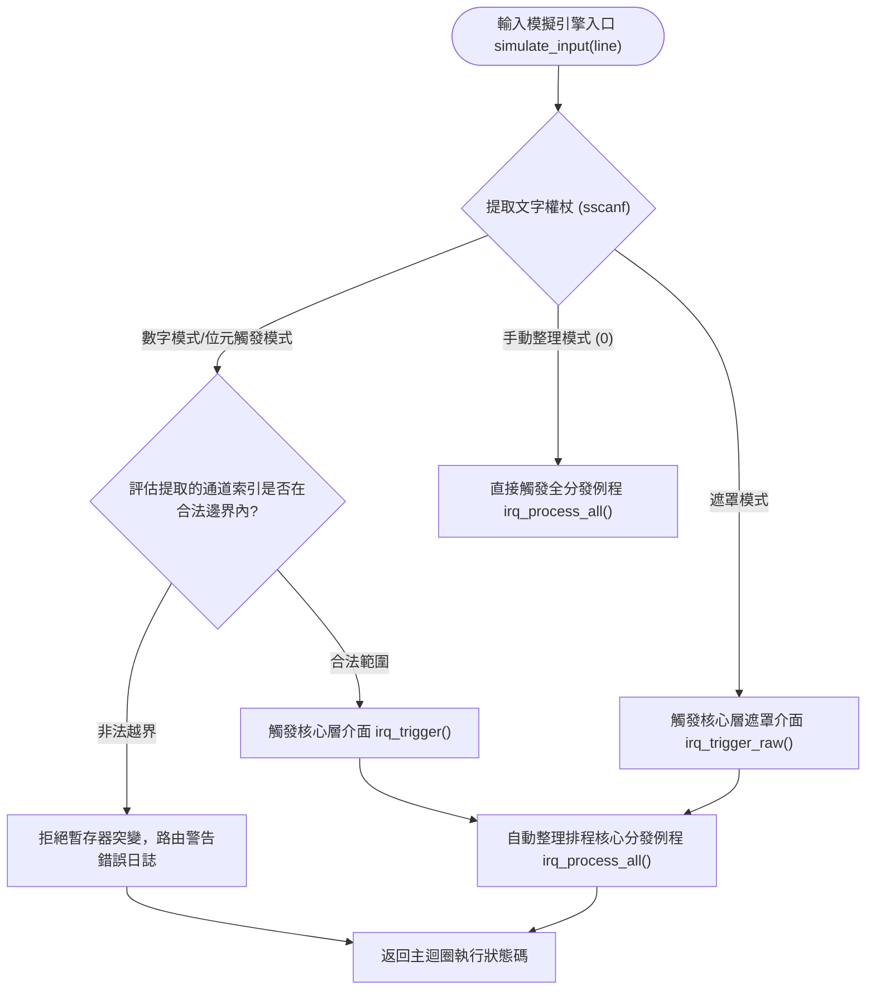

# IRQ Simulator - 軟體整合測試報告

## 1. 整合驗證範圍說明
本報告詳細規定了針對本中斷模擬器全域關鍵軟體元件間介面互操作性的驗證方案。驗證邊界涵蓋控制台輸入緩衝區資料攝取管線、文字權杖提取演算法、暫存器陣列底層突變鉤子與行為日誌發生器模組之間的端到端互動。

## 2. 軟體元件整合架構與模擬引擎設計

## 3. 單元驗證與整合驗證互補性邏輯（設計分層互補矩陣）
整合測試著重考核多模組、多元件進行級聯互動時的介面邊界，此類執行期耦合在隔離的低層單元測試中被完全模擬樁代換。

| 目標整合的體系結構元件層級連接 | 隔離單元驗證規程所承諾的考核邊界 (SWE.4) | 整合階段介面級覆蓋驗證策略 (SWE.5) |
| :--- | :--- | :--- |
| **控制台緩衝區攝取 -> 核心暫存器位元欄位改寫** | 驗證在人工投遞顯式無符號整型參數時，單暫存器位移運算邏輯的正確性。 | 考核真實執行期指標切片、格式化解析說明符、大小寫權杖容錯約束（如 `'b'` 與 `'B'`）對核心暫存器的改寫。 |
| **多通道掛起狀態 -> 統一控制台日誌巨集發生器** | 證明在單一 pending 位置位時，分發器內部的分支 switch-case 能準確路由至外設分支。 | 考核在多通道遮罩級並發更新下，系統日誌發生器是否按確定性優先權順序輸出歷史，且訊息嚴格對齊系統 tick 單調前綴。 |

## 4. 軟體整合驗證目標用例規格

### IT_01: 數字模式輸入解析與分發級聯介面驗證
* **整合策略**: 向攝取管線投遞合法/非法邊界純數字權杖，確認解析機制與底層改寫鉤子的同步性。

| 整合測試項 ID | 注入的文字模擬緩衝區輸入激勵 | 預期的元件串聯運行狀態及全域暫存器收斂行為 | 介面斷言校驗方法 | 追溯的詳細設計設計項 |
| :--- | :--- | :--- | :--- | :--- |
| IT_01_01 | `"1\n"` | 解析出 0 通道，掛起暫存器，觸發分發，正確輸出系統定時器日誌後 pending 位清零。 | `IT_ASSERT_HEX_EQ(pending, 0)` | SD_004, SD_006 |
| IT_01_02 | `"32\n"` | 解析出 31 通道，掛起暫存器，觸發分發，正確輸出並自增系統異常狀態帳本。 | `IT_ASSERT_HEX_EQ(pending, 0)` | SD_004, SD_006 |
| IT_01_03 | `"33\n"` | 非法邊界純數字測試。拒絕硬體暫存器改寫，系統安全維持原 pending 遮罩狀態。 | `IT_ASSERT_HEX_EQ(pending, before)`| SD_004, SD_010 |

### IT_02: 位元觸發 (b-mode) 模式文字解析介面驗證
* **整合策略**: 驗證輸入字串解析器針對特定前綴及大小寫變異權杖的容錯解包能力。

| 整合測試項 ID | 注入的文字模擬緩衝區輸入激勵 | 預期的元件串聯運行狀態及全域暫存器收斂行為 | 介面斷言校驗方法 | 追溯的詳細設計設計項 |
| :--- | :--- | :--- | :--- | :--- |
| IT_02_01 | `"b5\n"` | 成功捕獲小寫位元觸發前綴，精準改寫暫存器 5 位，自動整理分發管道。 | `IT_ASSERT_HEX_EQ(pending, 0)` | SD_004, SD_006 |
| IT_02_02 | `"B10\n"` | 成功實作大寫容錯。精準捕獲 `B` 後 10 號通道，成功觸發看門狗外設模擬例程。 | `IT_ASSERT_HEX_EQ(pending, 0)` | SD_004, SD_006 |
| IT_02_03 | `"b32\n"` | 邊界失效測試。提取的通道號超出硬體上限（0-31），系統拒絕執行位更新。 | `IT_ASSERT_HEX_EQ(pending, before)`| SD_004, SD_010 |

### IT_03: 十六進位遮罩直接注入介面整合驗證
* **整合策略**: 考核直接遮罩改寫機制對並發多通道掛起事件的解析與離散處理表現。

| 整合測試項 ID | 注入的文字模擬緩衝區輸入激勵 | 預期的元件串聯運行狀態及全域暫存器收斂行為 | 介面斷言校驗方法 | 追溯的詳細設計設計項 |
| :--- | :--- | :--- | :--- | :--- |
| IT_03_01 | `"h3\n"` | 精準解包 16 進位串至 `0x00000003U`。Bit 0 與 Bit 1 同時掛起，系統順序分發後暫存器排空。 | `IT_ASSERT_HEX_EQ(pending, 0)` | SD_005, SD_006 |
| IT_03_02 | `"hGG\n"` | 非法 16 進位字元過錄。解析器拒絕非 hex 資料輸入，模擬器全域暫存器狀態安全受控。 | `IT_ASSERT_HEX_EQ(pending, before)`| SD_004, SD_010 |

### IT_04: 跨模組確定性時序與優先權級聯驗證
* **整合策略**: 透過直接注入並發遮罩，驗證底層的順序優先權排程演算法不因命令輸入或字串排序而發生時序顛倒。

| 整合測試項 ID | 注入的文字模擬緩衝區輸入激勵 / 激勵序列 | 預期的元件串聯運行狀態及全域暫存器收斂行為 | 介面斷言校驗方法 | 追溯的詳細設計設計項 |
| :--- | :--- | :--- | :--- | :--- |
| IT_04_01 | `"h80000001\n"` | 同時掛起最高與最低優先位。驗證系統核心控制台日誌中，IRQ0 例程輸出嚴格先於 IRQ31 發生。 | `IT_ASSERT_EQ(tick, before + 1)` | SD_005, SD_006 |

---

## 5. 軟體整合驗證用例至實作原始碼真實函式名稱符號對應表
| 審計用例追溯 ID | 整合驗證 C 語言測試原始碼真實函式名稱符號 (1:1 對應) | 追溯的軟硬體架構設計 ID |
| :--- | :--- | :--- |
| **IT_01_01** | `test_number_mode_minimum_boundary_routing` | SD_004, SD_006 |
| **IT_01_02** | `test_number_mode_maximum_boundary_routing` | SD_004, SD_006 |
| **IT_01_03** | `test_number_mode_out_of_bounds_rejection` | SD_004, SD_010 |
| **IT_02_01** | `test_bit_mode_lowercase_routing_latch` | SD_004, SD_006 |
| **IT_02_02** | `test_bit_mode_uppercase_tolerance_routing` | SD_004, SD_006 |
| **IT_02_03** | `test_bit_mode_out_of_bounds_rejection` | SD_004, SD_010 |
| **IT_03_01** | `test_hex_mode_multi_channel_latch_clear` | SD_005, SD_006 |
| **IT_03_02** | `test_hex_mode_invalid_format_rejection` | SD_004, SD_010 |
| **IT_04_01** | `test_integration_priority_order_execution` | SD_005, SD_006 |
