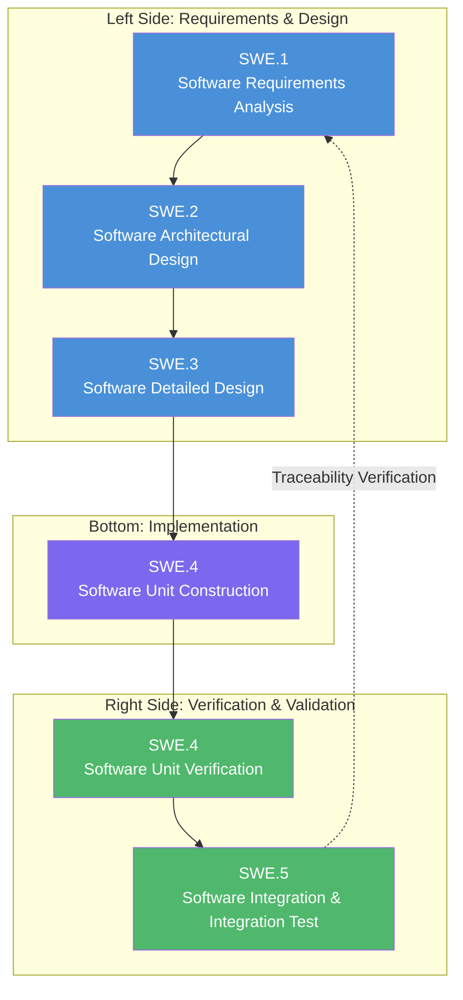
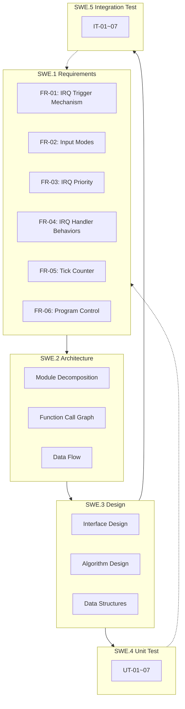

# IRQ Simulator - ASPICE Software Development Process

## ASPICE V-Model Overview

This project follows the **ASPICE (Automotive SPICE)** software development process, organized using the **V-Model** structure to manage deliverables across the software development lifecycle.



### V-Model Description

| Side | Direction | Description |
|------|------|------|
| **Left (Descending)** | Requirements → Design | Progressive refinement from high-level requirements to detailed design, with specification documents at each stage |
| **Bottom** | Implementation | Code development based on design documents |
| **Right (Ascending)** | Testing → Verification | Progressive integration from unit testing to system testing, each stage verifying the corresponding left-side specification |
| **Traceability** | Horizontal Mapping | Right-side test cases must trace back to the corresponding left-side requirement level |

---

## Document Mapping

| ASPICE Phase | Folder | Document | Language Versions |
|-------------|--------|------|----------|
| **SWE.1** Software Requirements Analysis | 01_software_requirements | IRQ Simulator Requirement Specification | [EN](01_software_requirements/requirement_en.md) \| [CN](01_software_requirements/requirement_cn.md) \| [TW](01_software_requirements/requirement_tw.md) |
| **SWE.2** Software Architectural Design | 02_software_architecture | IRQ Simulator Software Architecture | [EN](02_software_architecture/software_architecture_en.md) \| [CN](02_software_architecture/software_architecture_cn.md) \| [TW](02_software_architecture/software_architecture_tw.md) |
| **SWE.3** Software Detailed Design | 03_software_detailed_design | IRQ Simulator Software Design | [EN](03_software_detailed_design/software_design_en.md) \| [CN](03_software_detailed_design/software_design_cn.md) \| [TW](03_software_detailed_design/software_design_tw.md) |
| **SWE.4** Software Unit Verification | 04_software_unit_verification | IRQ Simulator Unit Test Plan | [EN](04_software_unit_verification/unit_test_en.md) \| [CN](04_software_unit_verification/unit_test_cn.md) \| [TW](04_software_unit_verification/unit_test_tw.md) |
| **SWE.5** Software Integration Test | 05_software_integration_test | IRQ Simulator Integration Test Plan | [EN](05_software_integration_test/integrated_test_en.md) \| [CN](05_software_integration_test/integrated_test_cn.md) \| [TW](05_software_integration_test/integrated_test_tw.md) |

---

## Traceability Matrix



---

## Directory Structure

```
docs/
├── index_tw.md                          ← Traditional Chinese Homepage
├── index_cn.md                          ← Simplified Chinese Homepage
├── index_en.md                          ← This file (English Homepage)
├── 01_software_requirements/            ← SWE.1 Software Requirements Analysis
│   ├── requirement_en.md
│   ├── requirement_cn.md
│   └── requirement_tw.md
├── 02_software_architecture/            ← SWE.2 Software Architectural Design
│   ├── software_architecture_en.md
│   ├── software_architecture_cn.md
│   └── software_architecture_tw.md
├── 03_software_detailed_design/         ← SWE.3 Software Detailed Design
│   ├── software_design_en.md
│   ├── software_design_cn.md
│   └── software_design_tw.md
├── 04_software_unit_verification/       ← SWE.4 Software Unit Verification
│   ├── unit_test_en.md
│   ├── unit_test_cn.md
│   └── unit_test_tw.md
└── 05_software_integration_test/        ← SWE.5 Software Integration Test
    ├── integrated_test_en.md
    ├── integrated_test_cn.md
    └── integrated_test_tw.md
```