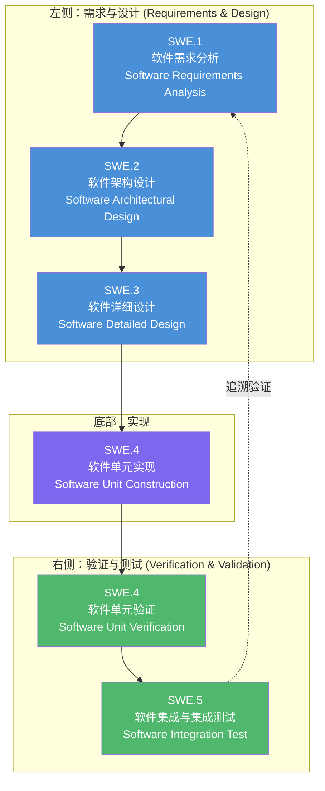
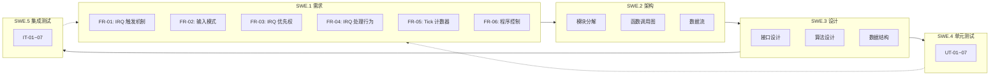

# IRQ Simulator - ASPICE Software Development Process

## ASPICE V-Model Overview

本项目遵循 **ASPICE (Automotive SPICE)** 软件开发流程，采用 **V 形图 (V-Model)** 结构来组织软件开发生命周期中的各阶段产出文件。



### V 形图说明

| 阶段 | 方向 | 说明 |
|------|------|------|
| **左侧 (下降)** | 需求 → 设计 | 从高层次需求逐步细化到详细设计，每个阶段产出对应规格文件 |
| **底部** | 实现 | 根据设计文件进行代码开发 |
| **右侧 (上升)** | 测试 → 验证 | 从单元测试逐步集成到系统测试，每个阶段验证对应的左侧规格 |
| **追溯性** | 水平对应 | 右侧测试用例须追溯至左侧对应层级的需求规格 |

---

## 文件对照表

| ASPICE 阶段 | 文件夹 | 文件 | 语言版本 |
|-------------|--------|------|----------|
| **SWE.1** 软件需求分析 | 01_software_requirements | IRQ Simulator 需求规格 | [EN](01_software_requirements/requirement_en.md) \| [CN](01_software_requirements/requirement_cn.md) \| [TW](01_software_requirements/requirement_tw.md) |
| **SWE.2** 软件架构设计 | 02_software_architecture | IRQ Simulator 软件架构 | [EN](02_software_architecture/software_architecture_en.md) \| [CN](02_software_architecture/software_architecture_cn.md) \| [TW](02_software_architecture/software_architecture_tw.md) |
| **SWE.3** 软件详细设计 | 03_software_detailed_design | IRQ Simulator 软件设计 | [EN](03_software_detailed_design/software_design_en.md) \| [CN](03_software_detailed_design/software_design_cn.md) \| [TW](03_software_detailed_design/software_design_tw.md) |
| **SWE.4** 软件单元验证 | 04_software_unit_verification | IRQ Simulator 单元测试计划 | [EN](04_software_unit_verification/unit_test_en.md) \| [CN](04_software_unit_verification/unit_test_cn.md) \| [TW](04_software_unit_verification/unit_test_tw.md) |
| **SWE.5** 软件集成测试 | 05_software_integration_test | IRQ Simulator 集成测试计划 | [EN](05_software_integration_test/integrated_test_en.md) \| [CN](05_software_integration_test/integrated_test_cn.md) \| [TW](05_software_integration_test/integrated_test_tw.md) |

---

## 追溯性矩阵 (Traceability Matrix)



---

## 目录结构

```
docs/
├── index_tw.md                          ← 繁体中文首页
├── index_cn.md                          ← 本文件 (简体中文首页)
├── index_en.md                          ← 英文首页
├── 01_software_requirements/            ← SWE.1 软件需求分析
│   ├── requirement_en.md
│   ├── requirement_cn.md
│   └── requirement_tw.md
├── 02_software_architecture/            ← SWE.2 软件架构设计
│   ├── software_architecture_en.md
│   ├── software_architecture_cn.md
│   └── software_architecture_tw.md
├── 03_software_detailed_design/         ← SWE.3 软件详细设计
│   ├── software_design_en.md
│   ├── software_design_cn.md
│   └── software_design_tw.md
├── 04_software_unit_verification/       ← SWE.4 软件单元验证
│   ├── unit_test_en.md
│   ├── unit_test_cn.md
│   └── unit_test_tw.md
└── 05_software_integration_test/        ← SWE.5 软件集成测试
    ├── integrated_test_en.md
    ├── integrated_test_cn.md
    └── integrated_test_tw.md
```