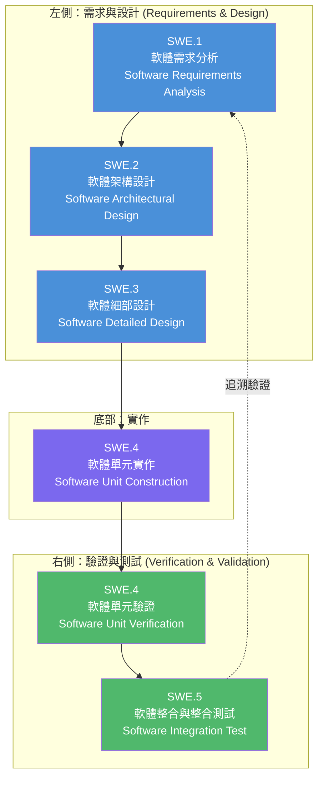
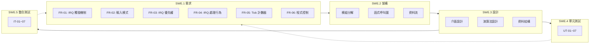

# IRQ Simulator - ASPICE Software Development Process

## ASPICE V-Model Overview

本專案遵循 **ASPICE (Automotive SPICE)** 軟體開發流程，採用 **V 形圖 (V-Model)** 結構來組織軟體開發生命週期中的各階段產出文件。



### V 形圖說明

| 階段 | 方向 | 說明 |
|------|------|------|
| **左側 (下降)** | 需求 → 設計 | 從高層次需求逐步細化到詳細設計，每個階段產出對應規格文件 |
| **底部** | 實作 | 根據設計文件進行程式碼開發 |
| **右側 (上升)** | 測試 → 驗證 | 從單元測試逐步整合到系統測試，每個階段驗證對應的左側規格 |
| **追溯性** | 水平對應 | 右側測試案例須追溯至左側對應層級的需求規格 |

---

## 文件對照表

| ASPICE 階段 | 資料夾 | 文件 | 語言版本 |
|-------------|--------|------|----------|
| **SWE.1** 軟體需求分析 | [01_software_requirements](01_software_requirements/) | IRQ Simulator 需求規格 | [EN](01_software_requirements/requirement_en.md) \| [CN](01_software_requirements/requirement_cn.md) \| [TW](01_software_requirements/requirement_tw.md) |
| **SWE.2** 軟體架構設計 | [02_software_architecture](02_software_architecture/) | IRQ Simulator 軟體架構 | [EN](02_software_architecture/software_architecture_en.md) \| [CN](02_software_architecture/software_architecture_cn.md) \| [TW](02_software_architecture/software_architecture_tw.md) |
| **SWE.3** 軟體細部設計 | [03_software_detailed_design](03_software_detailed_design/) | IRQ Simulator 軟體設計 | [EN](03_software_detailed_design/software_design_en.md) \| [CN](03_software_detailed_design/software_design_cn.md) \| [TW](03_software_detailed_design/software_design_tw.md) |
| **SWE.4** 軟體單元驗證 | [04_software_unit_verification](04_software_unit_verification/) | IRQ Simulator 單元測試計畫 | [EN](04_software_unit_verification/unit_test_en.md) \| [CN](04_software_unit_verification/unit_test_cn.md) \| [TW](04_software_unit_verification/unit_test_tw.md) |
| **SWE.5** 軟體整合測試 | [05_software_integration_test](05_software_integration_test/) | IRQ Simulator 整合測試計畫 | [EN](05_software_integration_test/integrated_test_en.md) \| [CN](05_software_integration_test/integrated_test_cn.md) \| [TW](05_software_integration_test/integrated_test_tw.md) |

---

## 追溯性矩陣 (Traceability Matrix)



---

## 目錄結構

```
docs/
├── index_tw.md                          ← 本檔案 (繁體中文首頁)
├── index_cn.md                          ← 簡體中文首頁
├── index_en.md                          ← 英文首頁
├── 01_software_requirements/            ← SWE.1 軟體需求分析
│   ├── requirement_en.md
│   ├── requirement_cn.md
│   └── requirement_tw.md
├── 02_software_architecture/            ← SWE.2 軟體架構設計
│   ├── software_architecture_en.md
│   ├── software_architecture_cn.md
│   └── software_architecture_tw.md
├── 03_software_detailed_design/         ← SWE.3 軟體細部設計
│   ├── software_design_en.md
│   ├── software_design_cn.md
│   └── software_design_tw.md
├── 04_software_unit_verification/       ← SWE.4 軟體單元驗證
│   ├── unit_test_en.md
│   ├── unit_test_cn.md
│   └── unit_test_tw.md
└── 05_software_integration_test/        ← SWE.5 軟體整合測試
    ├── integrated_test_en.md
    ├── integrated_test_cn.md
    └── integrated_test_tw.md
```